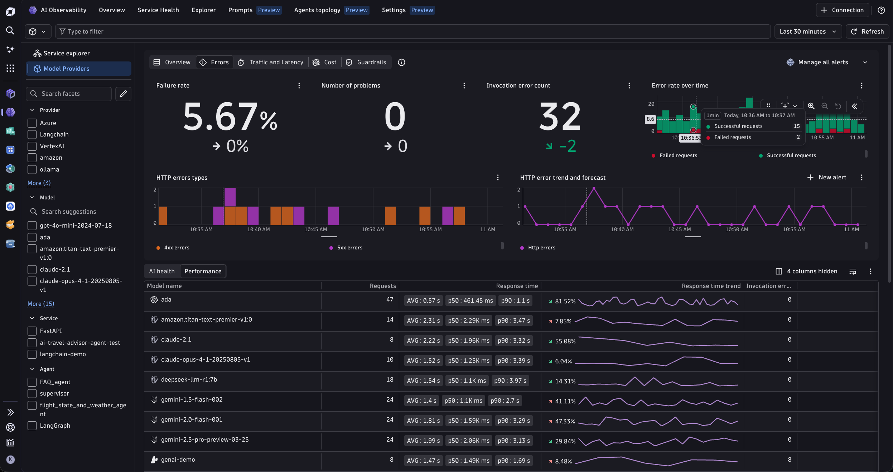
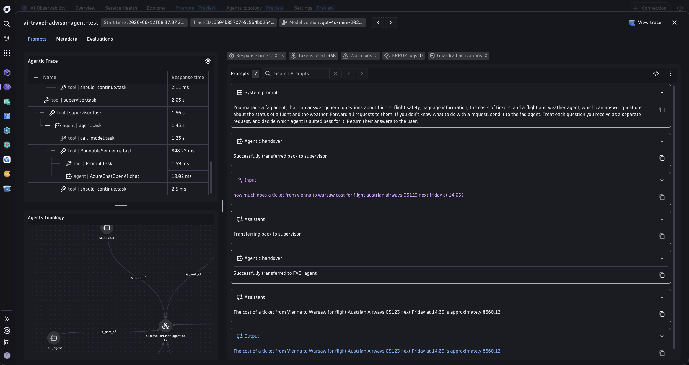
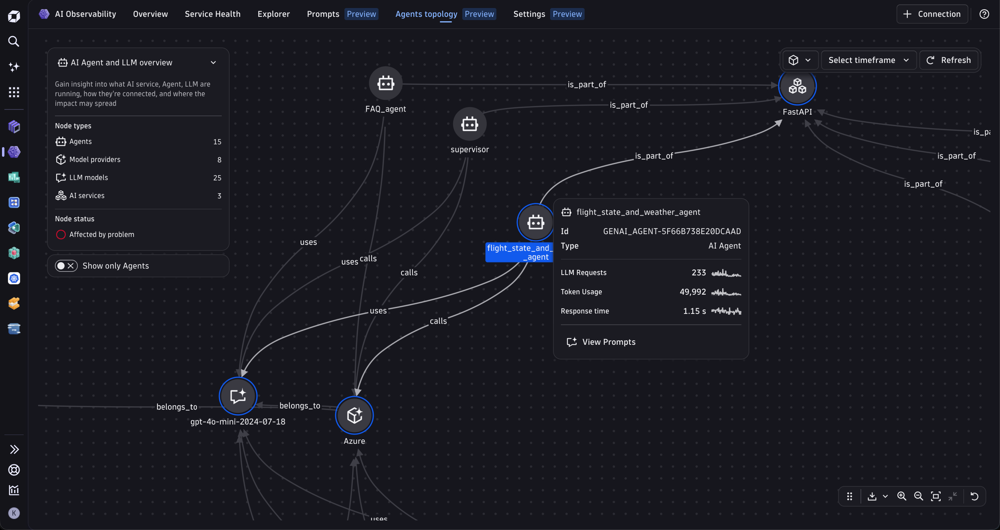
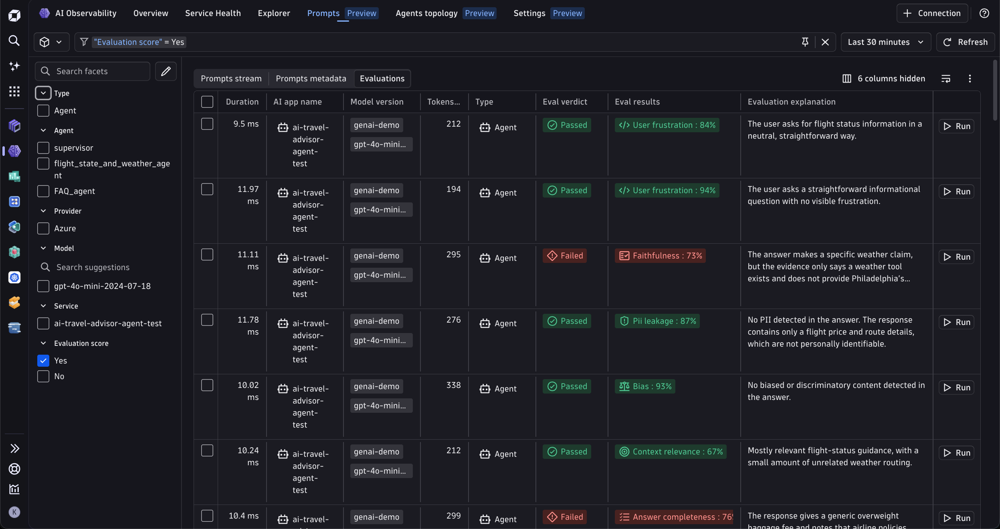

# Dynatrace Agentic AI Instrumentation Examples

This project demonstrates how to instrument AI agents with Dynatrace to gain observability into Agentic AI workloads, including performance, cost, and runtime behavior.

By integrating Dynatrace with AI agents, developers can monitor agent execution, understand tool interactions, trace prompt and response flows, and analyze dependencies across distributed AI-driven systems.

Telemetry can be shipped directly via OneAgent or the OpenTelemetry (OTel) SDK, or routed through an **OTel Collector** — including the [Dynatrace Distribution of the OpenTelemetry Collector](https://docs.dynatrace.com/docs/extend-dynatrace/opentelemetry/collector) and [Bindplane OP](https://github.com/observiq/bindplane-otel-collector).

## Key Features

### Runtime Observability for AI Agents

Monitor AI agent interactions, tool usage, service dependencies, performance metrics, token consumption, and cost drivers—providing end-to-end visibility into how AI agent workflows behave at runtime.



### Agent Execution Tracing and Debugging

Trace agent execution from the initial request through prompt flows, tool calls, and service interactions to the final response—enabling faster debugging and root cause analysis across complex agent workflows.



### AI-Powered Workflow Insights

Use Dynatrace Intelligence to identify bottlenecks, optimize resource utilization, and understand how complex agent workflows behave across distributed services.



### LLM Evaluations

Evaluate AI agent responses at scale with built-in evaluation criteria—assess faithfulness, PII leakage, bias, context relevance, and user frustration across all prompts in your tenant.



### Fast Agent Instrumentation

Add Dynatrace instrumentation to AI agents in minutes using simple integration patterns and practical examples—bringing runtime observability directly into agent development workflows.

## Who This Repository Is For

This repository is designed for:

- Developers building AI-powered applications
- Platform and DevOps engineers operating AI systems
- AI practitioners working with agent frameworks

If you're building AI agents, copilots, chatbots, or autonomous systems, these examples will help you add observability to your agent workflows and gain deeper insight into how your AI systems operate in production.

## Coding Agent Observability

AI coding agents like Claude Code and OpenAI Codex CLI run autonomously in developer environments — writing, editing, and committing code on your behalf. Dynatrace gives engineering teams full visibility into how these agents operate across the organization, with zero code changes required. By capturing built-in OpenTelemetry signals, you can monitor token consumption, costs, session activity, and tool behavior in real time.

- **Cost & token tracking** — understand spend per model, per user, and per team
- **Engineering metrics** — lines of code added/removed, git commits, and pull requests created by AI
- **Tool observability** — trace every tool call, acceptance/rejection decision, and API error
- **Session-level attribution** — slice all data by `user.id`, `session.id`, or `organization.id`

See the **[AI Coding Agents](./ai-coding-agents/)** section for setup guides covering Claude Code, OpenAI Codex CLI, OpenClaw, and the GitHub Copilot SDK.

## Demos

### SDK + Instrumentation Demos

Monitor specific AI provider SDKs with Dynatrace.

| Provider | OneAgent | OpenInference | OpenTelemetry |
|----------|----------|---------------|---------------|
| [AWS Bedrock](./aws-bedrock/) | [✓](./aws-bedrock/oneagent/) | [✓](./aws-bedrock/openinference/) | [✓](./aws-bedrock/opentelemetry/)  |
| [Anthropic](./anthropic/oneagent/) | [✓](./anthropic/oneagent/) | — | — |
| [Cohere](./cohere/oneagent/) | [✓\*](./cohere/oneagent/) | — | — |
| [Groq](./groq/oneagent/) | [✓\*](./groq/oneagent/) | — | — |
| [Mistral](./mistral/oneagent/) | [✓\*](./mistral/oneagent/) | — | — |
| [Ollama](./ollama/oneagent/) | [✓\*](./ollama/oneagent/) | — | — |
| [OpenAI](./openai/) | [✓](./openai/oneagent/) | [✓](./openai/openinference/)  | [✓](./openai/opentelemetry/) |

\* Experimental sensor — prompt input and output capture not yet supported.  
 Includes an [OTel Collector](https://opentelemetry.io/docs/collector/) configuration — compatible with the [Dynatrace Distribution of the OpenTelemetry Collector](https://docs.dynatrace.com/docs/extend-dynatrace/opentelemetry/collector) and [Bindplane OP](https://github.com/observiq/bindplane-otel-collector).

### Agent Framework Demos

Monitor AI agent frameworks with Dynatrace.

| Framework | OneAgent | OpenInference | OpenTelemetry |
|-----------|----------|---------------|---------------|
| [AWS Bedrock Agents](./aws-bedrock-agents/) | [✓](./aws-bedrock-agents/oneagent/) | — | — |
| [AWS Strands Agents](./aws-strands/) | [✓](./aws-strands/oneagent/) | [✓](./aws-strands/openinference/) | [✓](./aws-strands/opentelemetry/)  |
| [CrewAI](./crewai/opentelemetry/) | — | — | [✓](./crewai/opentelemetry/) |
| [Google ADK](./google-adk/opentelemetry/) | — | — | [✓](./google-adk/opentelemetry/) |
| [Haystack](./haystack/oneagent/) | [✓](./haystack/oneagent/) | — | — |
| [Langfuse](./langfuse/) | — | — | [✓](./langfuse/opentelemetry/)  Python / [✓ Node](./langfuse/opentelemetry-node/) |
| [LangGraph](./langgraph/) | [✓](./langgraph/oneagent/) | — | [✓ OpenAI](./langgraph/opentelemetry/openai/) / [✓ Bedrock](./langgraph/opentelemetry/bedrock/)  |
| [LiteLLM](./litellm/opentelemetry/) | — | — | [✓](./litellm/opentelemetry/)  |
| [MCP (Model Context Protocol)](mcp/opentelemetry/) | — | — | [✓](mcp/opentelemetry/) |
| [Microsoft Agent Framework](./microsoft-agent-framework/opentelemetry/) | — | — | [✓](./microsoft-agent-framework/opentelemetry/) |
| [OpenAI Agents SDK](./openai-agents/opentelemetry/) | — | — | [✓](./openai-agents/opentelemetry/) |
| [Pydantic AI](./pydantic-ai/opentelemetry/) | — | — | [✓](./pydantic-ai/opentelemetry/)  |
| [Real User Monitoring](./rum/opentelemetry/) | — | — | [✓](./rum/opentelemetry/) |

 Includes an [OTel Collector](https://opentelemetry.io/docs/collector/) configuration — compatible with the [Dynatrace Distribution of the OpenTelemetry Collector](https://docs.dynatrace.com/docs/extend-dynatrace/opentelemetry/collector) and [Bindplane OP](https://github.com/observiq/bindplane-otel-collector).

### AI Coding Agent Demos

Observe AI coding agents with zero code changes using built-in OpenTelemetry signals.

| Agent | Path |
|-------|------|
| [Claude Code](./ai-coding-agents/claude-code/) | ai-coding-agents/claude-code |
| [GitHub Copilot SDK](./ai-coding-agents/github-copilot-sdk/) | ai-coding-agents/github-copilot-sdk |
| [OpenAI Codex](./ai-coding-agents/openai-codex/) | ai-coding-agents/openai-codex |
| [OpenClaw](./ai-coding-agents/openclaw/) | ai-coding-agents/openclaw |
| [OpenClaw Observability Plugin](./ai-coding-agents/openclaw-observability-plugin/) | ai-coding-agents/openclaw-observability-plugin |
| [OpenCode](./ai-coding-agents/opencode/) | ai-coding-agents/opencode |

## Getting Started

Each demo follows the same interface:

```bash
cd <sdk>/<instrumentation>
make install   # install dependencies
make run       # start app on port 8000
make request   # send a test request (in a second terminal)
```

All demos expose `make help` for the full list of targets.

If you're using a framework that isn't listed here, don't worry! [You can explore the Dynatrace Hub for the full list of supported technologies.](https://www.dynatrace.com/hub/?filter=ai-ml-observability&internal_source=doc&internal_medium=link&internal_campaign=cross)
