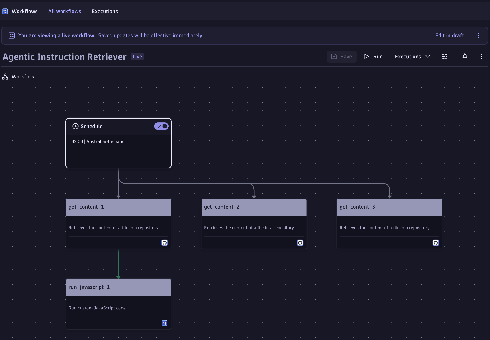
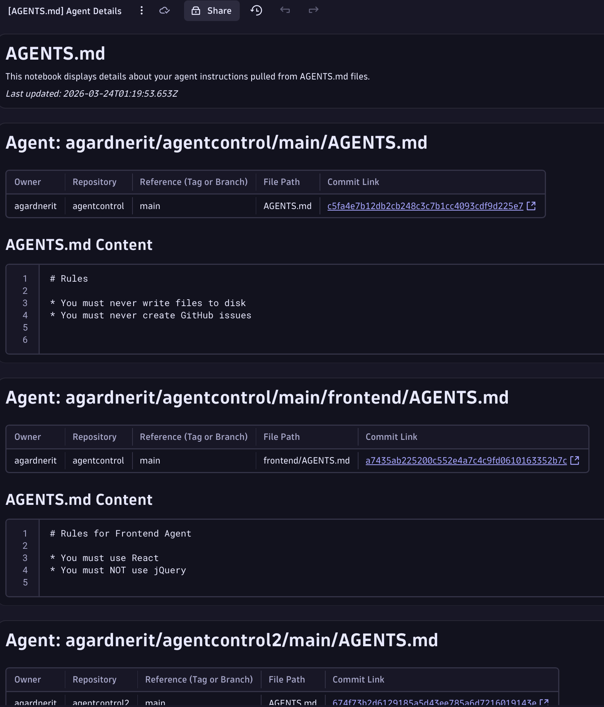
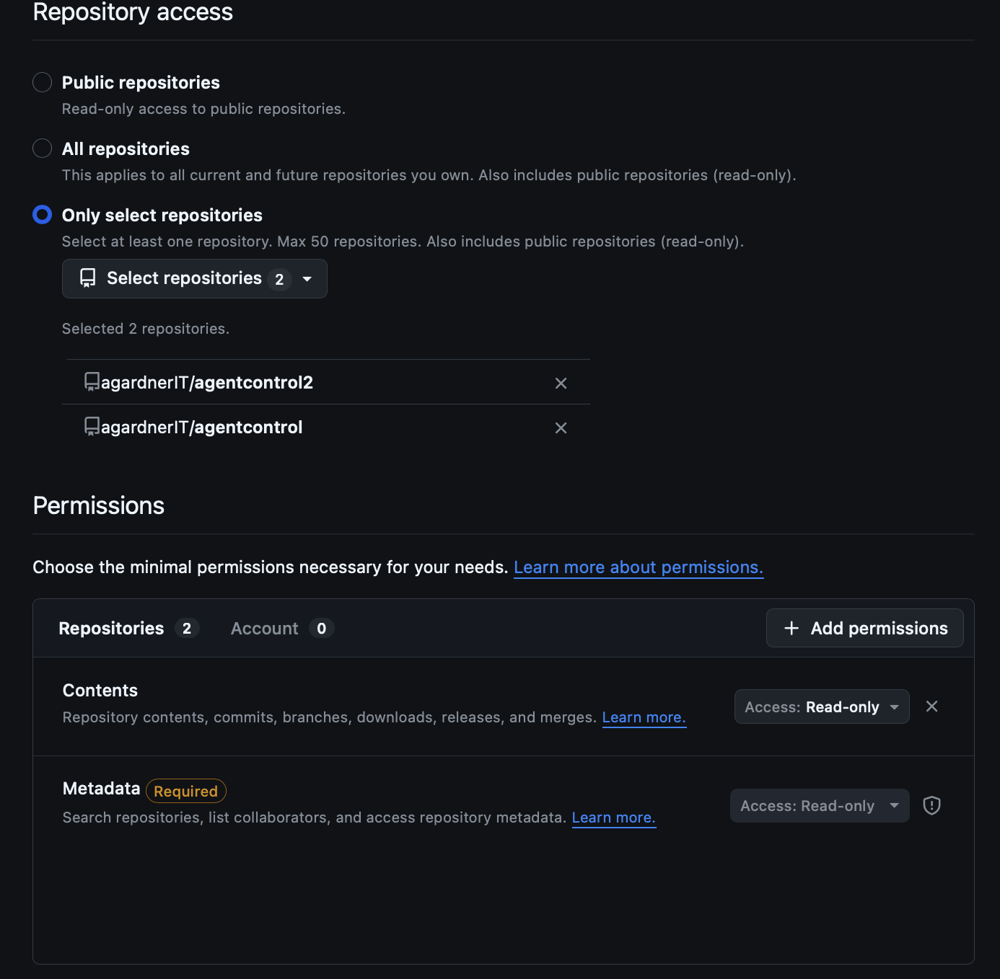
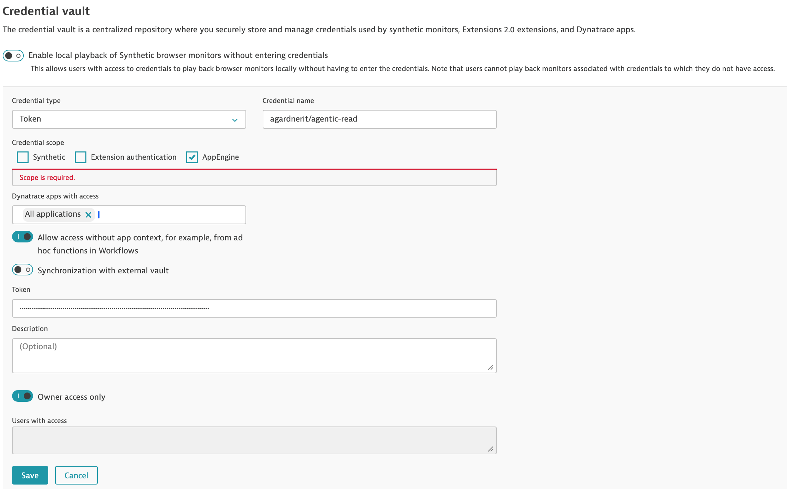
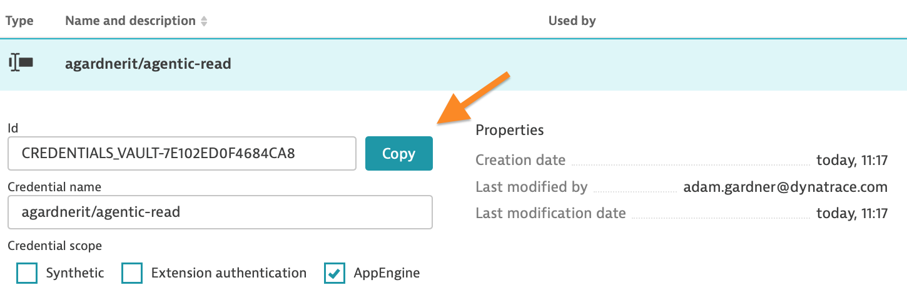
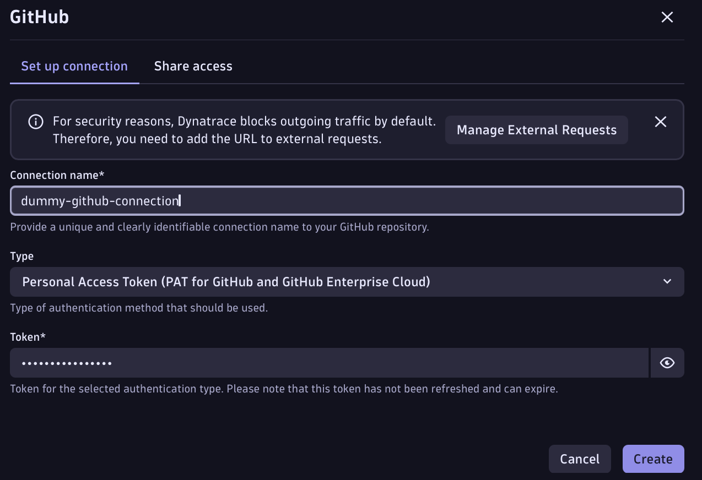

# Integrate your AGENTS.md, SKILL.md and other instructions with Dynatrace

---

## Overview

`AGENTS.md`, `SKILL.md` and other similar Markdown files are crucial ways to guide your agents, so understanding what files you have and how they can influence your agent's behaviour is crucial.

The Dynatrace workflow in this directory runs periodically, grabs the contents of any file (the workflow uses `AGENTS.md` as an example but you can use it to retrieve any file) then creates a Dynatrace notebook to represent the data.

Subsequent runs update the dashboard with the latest content.

The workflow can be expanded to retrieve as many files as you wish.

The dashboard shows not only the contents of each file, it also provides a link to the precise Git commit at the time it was retrieved - in case of changes or issues, you can see exactly what changed and when.

## Create and save GitHub PAT token

This workflow uses the GitHub API to retrieve file contents and the latest Git commit SHA for each file. For this, a GitHub PAT token is required.

Go to `https://github.com/settings/personal-access-tokens` and create a Fine-grained personal access token with `Contents (read-only)` permission to whichever repos you're going to use (this workflow works with both public and private repos)

## Save in credential vault

In Dynatrace, press `ctrl + k` and search for `credential vault`

Create a new credential with the following details:

* Type: `token`
* Credential Scope: `App engine`
* `Allow access without app context, for example, from ad hoc functions in Workflows` == toggle enabled
* `Owner access only` == toggle enabled

Save the credential the expand the entry and make a note of the `CREDENTIALS_VAULT-****` ID.

## Download Workflow template and upload to Dynatrace

* Download the workflow template YAML file from this folder
* In Dynatrace, press `ctrl + k` and search for workflows
* Use the upload button to upload the template workflow YAML file you just downloaded
* Create a new GitHub connection (the workflow template points to the author's account). Paste in your GitHub PAT token to save it

* Edit the workflow definition and modify each task on the second row to point. You can also remove or add more tasks to this row as you see fit
* Modify the `run_javascript_1` task on the third row. Open it and find the existing `CREDENTIALS_VAULT` ID on line 14 and replace it with yours

Save the workflow and click `Run`. It should run successfully.

## View Dashboard

In Dynatrace, press `ctrl + k` and search for `notebooks`

* Open the notebooks app and click the "all notebooks" menu item
* Search for `agents.md` and you should see a notebook called `[AGENTS.md] Agent Details`

Note: The name of this notebook is defined in the `run_javascript_1` task on line `228` if you wish to change it.

