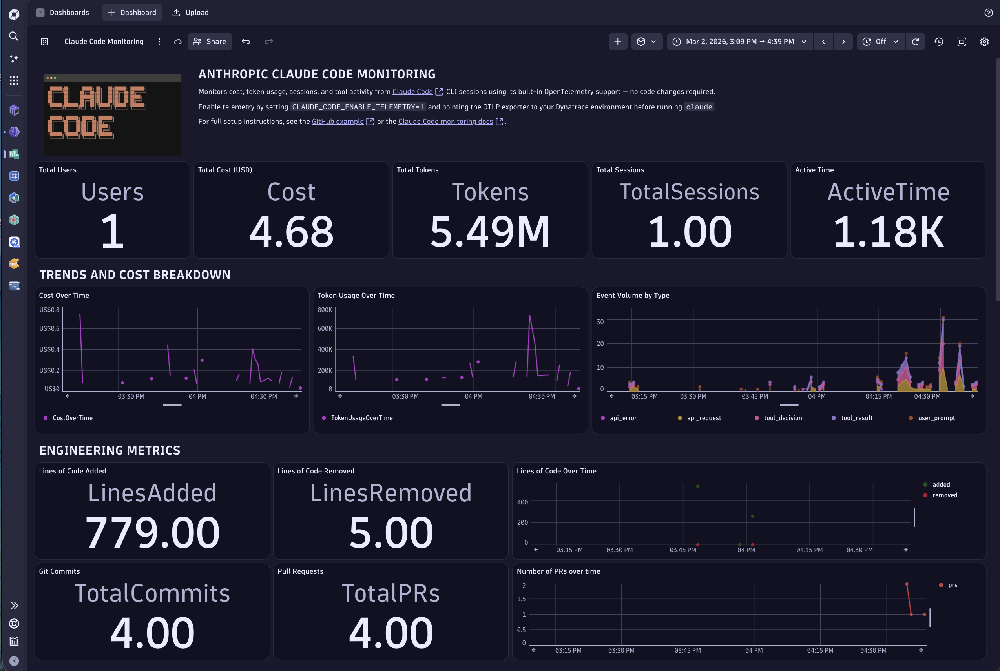

# AI Coding Agent Observability

This section covers how to instrument **AI coding agents** — CLI tools and gateways that autonomously write, edit, and commit code on behalf of developers — with Dynatrace for full observability into cost, token usage, session activity, and tool behavior.

Unlike traditional application instrumentation, coding agents run interactively in developer environments. Dynatrace captures their built-in OpenTelemetry signals with zero code changes required, giving engineering teams visibility into how AI is actually being used across their organization.

## Supported Coding Agents

- [Anthropic Claude Code](./claude-code/) — native OTEL support via environment variables, no code changes required
- [Google Gemini CLI](./gemini-cli/) — native OTEL support via `~/.gemini/settings.json`, no code changes required (collector-assisted for recent versions)
- [OpenAI Codex CLI](./openai-codex/) — OTLP export via `~/.codex/config.toml`
- [OpenCode](./opencode/) — native OTEL support via environment variables, traces export directly to Dynatrace
- [OpenClaw](./openclaw/) — built-in `diagnostics-otel` plugin for full trace, metric, and log export
- [GitHub Copilot SDK](./github-copilot-sdk/) — manual OTel span instrumentation via Copilot SDK session events

---

## What You Get

A single Dynatrace dashboard surfaces everything you need to understand AI coding agent usage across your team:

| Signal | Examples |
|---|---|
| **Cost & Tokens** | Total spend, token consumption per model, cost over time |
| **Session Activity** | Active sessions, user count, active time |
| **Engineering Metrics** | Lines of code added/removed, git commits, pull requests created |
| **Tool Events** | Tool calls accepted/rejected, API errors, prompt events |

All signals are enriched with common attributes (`session.id`, `user.id`, `user.email`, `organization.id`, `app.version`) so you can slice data by user, team, or project.

---

## Get Started

Pick the coding agent you use and follow its setup guide:

| Agent | Integration method | Effort |
|---|---|---|
| [Claude Code](./claude-code/) | Environment variables or `settings.json` | ~5 min |
| [Gemini CLI](./gemini-cli/) | `~/.gemini/settings.json` or env vars (+ Collector) | ~5 min |
| [OpenAI Codex CLI](./openai-codex/) | `~/.codex/config.toml` | ~5 min |
| [OpenCode](./opencode/) | Environment variables | ~5 min |
| [OpenClaw](./openclaw/) | `openclaw config` CLI + env vars | ~5 min |
| [GitHub Copilot SDK](./github-copilot-sdk/) | Manual OTel spans in Node.js | ~15 min |

> [!TIP]
> For Dynatrace setup instructions, API token scopes, and advanced configuration, see the [AI Observability Get Started Docs](https://docs.dynatrace.com/docs/shortlink/ai-ml-get-started).
