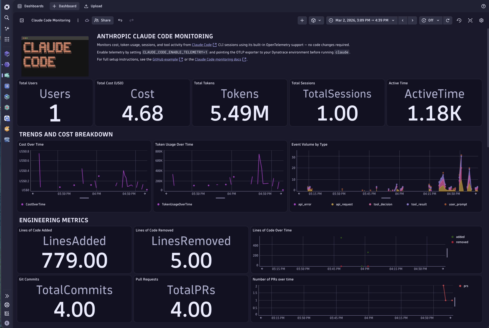

# Claude Code

This example shows how to export Claude Code telemetry to Dynatrace using Claude Code's built-in [OpenTelemetry](https://opentelemetry.io/) support.

The integration provides:

- Claude Code metrics and log events
- Distributed traces for interactions, model requests, and tool executions
- GenAI semantic-convention enrichment for Dynatrace AI Observability
- Direct Dynatrace ingest through OpenPipeline, or enrichment through an OpenTelemetry Collector

No application-code changes are required.



## Prerequisites

- [Claude Code](https://docs.anthropic.com/en/docs/claude-code)
- Node.js and npm
- A Dynatrace environment
- A Dynatrace API token with the scopes required for the signals you export:
    - `openTelemetryTrace.ingest`
    - `metrics.ingest`
    - `logs.ingest`

## Install Claude Code

Install the version pinned by this example:

```bash
make install
```

To override the pinned version:

```bash
make install CLAUDE_CODE_VERSION=<version>
```

## Configure telemetry

Claude Code exports telemetry through OTLP. Configure the variables below before starting Claude Code.

### Required configuration

```bash
# Enable Claude Code telemetry.
export CLAUDE_CODE_ENABLE_TELEMETRY=1

# Enable enhanced tracing. This is required for interaction, model-request,
# and tool spans used by Dynatrace AI Observability.
export CLAUDE_CODE_ENHANCED_TELEMETRY_BETA=1

# Export traces, metrics, and log events through OTLP.
export OTEL_TRACES_EXPORTER=otlp
export OTEL_METRICS_EXPORTER=otlp
export OTEL_LOGS_EXPORTER=otlp

# Use OTLP over HTTP/protobuf.
export OTEL_EXPORTER_OTLP_PROTOCOL=http/protobuf

# Send telemetry directly to the Dynatrace OTLP endpoint.
# Do not append /v1/traces, /v1/metrics, or /v1/logs.
export OTEL_EXPORTER_OTLP_ENDPOINT="https://<environment-id>.live.dynatrace.com/api/v2/otlp"
export OTEL_EXPORTER_OTLP_HEADERS="Authorization=Api-Token <token>"

# Dynatrace requires delta temporality for OTLP metrics.
export OTEL_EXPORTER_OTLP_METRICS_TEMPORALITY_PREFERENCE=delta
```

Start Claude Code after configuring the environment:

```bash
claude
```

### Custom Anthropic endpoints and proxies

When `ANTHROPIC_BASE_URL` points to a custom proxy, gateway, or local Anthropic-compatible endpoint, enable W3C trace-context propagation explicitly:

```bash
export CLAUDE_CODE_PROPAGATE_TRACEPARENT=1
```

This setting is not required when Claude Code connects directly to the Anthropic API.

### Prompt and assistant-response capture

> [!CAUTION]
> Prompt, assistant-response, and tool-content capture can expose source code, credentials, personal data, or other sensitive information. Leave these settings disabled unless content capture has been explicitly approved.

To include user prompt text:

```bash
export OTEL_LOG_USER_PROMPTS=1
```

To include assistant response text:

```bash
export OTEL_LOG_ASSISTANT_RESPONSES=1
```

Claude Code emits assistant text in the `response` attribute of the `claude_code.assistant_response` log event. It does not attach that text to the `claude_code.llm_request` span. Therefore, `gen_ai.output.messages` can remain absent even when assistant-response logging is enabled.

To include tool names and details:

```bash
export OTEL_LOG_TOOL_DETAILS=1
```

To include tool input and output content:

```bash
export OTEL_LOG_TOOL_CONTENT=1
```

## Persistent configuration with Claude Code settings

For a persistent local or centrally managed configuration, add the telemetry variables to the Claude Code settings file:

```json
{
  "env": {
    "CLAUDE_CODE_ENABLE_TELEMETRY": "1",
    "CLAUDE_CODE_ENHANCED_TELEMETRY_BETA": "1",
    "OTEL_TRACES_EXPORTER": "otlp",
    "OTEL_METRICS_EXPORTER": "otlp",
    "OTEL_LOGS_EXPORTER": "otlp",
    "OTEL_EXPORTER_OTLP_PROTOCOL": "http/protobuf",
    "OTEL_EXPORTER_OTLP_ENDPOINT": "https://<environment-id>.live.dynatrace.com/api/v2/otlp",
    "OTEL_EXPORTER_OTLP_HEADERS": "Authorization=Api-Token <token>",
    "OTEL_EXPORTER_OTLP_METRICS_TEMPORALITY_PREFERENCE": "delta"
  }
}
```

When using a custom `ANTHROPIC_BASE_URL`, add:

```json
"CLAUDE_CODE_PROPAGATE_TRACEPARENT": "1"
```

Only when message-content capture has been approved, add:

```json
"OTEL_LOG_USER_PROMPTS": "1",
"OTEL_LOG_ASSISTANT_RESPONSES": "1"
```

## Run the repository example

Copy the environment template and configure Dynatrace credentials:

```bash
cp .env.example .env
```

Use these variables in `.env`:

```dotenv
# Dynatrace environment base URL. Do not append /api/v2/otlp.
DT_ENDPOINT=https://<environment-id>.live.dynatrace.com

# Dynatrace API token with the required OpenTelemetry ingest scopes.
DT_API_TOKEN=dt0c01.XXXXXXXX.XXXXXXXXXXXXXXXX
```

The Makefile appends `/api/v2/otlp` when sending telemetry directly to Dynatrace.

The model provider must also be configured with either:

```bash
export ANTHROPIC_API_KEY=<key>
```

or:

```bash
export CLAUDE_CODE_OAUTH_TOKEN=<token>
```

### Direct Dynatrace ingest

Run one deterministic headless Claude Code interaction and send telemetry directly to Dynatrace:

```bash
make run
```

For the full AI Observability experience, configure the provided OpenPipeline enrichment before using direct ingest.

### Collector enrichment

Run one deterministic headless Claude Code interaction through the provided OpenTelemetry Collector:

```bash
make run-collector
```

The Collector applies the GenAI semantic-convention mappings before forwarding telemetry to Dynatrace.

Inspect Collector logs:

```bash
make logs
```

Stop and remove the Collector container:

```bash
make stop
```

## Exported data

### Traces

With enhanced tracing enabled, Claude Code emits spans such as:

```text
claude_code.interaction
├── claude_code.llm_request
└── claude_code.tool
```

A healthy model request has:

- The same `trace.id` as its interaction span
- A `span.parent_id` equal to the interaction's `span.id`
- `llm_request.context = "interaction"`

### Metrics

| Metric | Description |
|---|---|
| `claude_code.session.count` | Sessions started |
| `claude_code.token.usage` | Tokens consumed by model and token type |
| `claude_code.cost.usage` | Estimated cost by model |
| `claude_code.lines_of_code.count` | Lines added or removed |
| `claude_code.commit.count` | Git commits created by Claude Code |
| `claude_code.pull_request.count` | Pull requests created by Claude Code |
| `claude_code.code_edit_tool.decision` | Accept or reject decisions for code-edit tools |
| `claude_code.active_time.total` | User-input and CLI-processing time |

### Log events

| Event | Description |
|---|---|
| `claude_code.user_prompt` | Submitted prompt. Content is redacted unless `OTEL_LOG_USER_PROMPTS=1`. |
| `claude_code.assistant_response` | Assistant text returned after an API request. The `response` attribute is redacted unless `OTEL_LOG_ASSISTANT_RESPONSES=1`. |
| `claude_code.api_request` | Request model, token counts, cost, and latency |
| `claude_code.api_error` | API failure details |
| `claude_code.tool_result` | Tool execution result, duration, and decision |
| `claude_code.tool_decision` | Tool accept or reject decision |

The assistant-response event is a log record, not a span attribute. The Collector and OpenPipeline mappings do not synthesize `gen_ai.output.messages` from this event.

## Dynatrace AI Observability enrichment

The Dynatrace AI Observability app is span-driven and expects OpenTelemetry GenAI semantic-convention attributes.

Claude Code emits native tracing spans, but additional mappings are needed for the complete Dynatrace experience. This repository provides two equivalent enrichment paths.

### OpenPipeline enrichment

Use [`openpipeline/`](./openpipeline/) when Claude Code sends OTLP telemetry directly to Dynatrace.

OpenPipeline enriches the spans at ingest. See [`openpipeline/README.md`](./openpipeline/README.md) for configuration and safe routing instructions.

### Collector enrichment

Use [`collector/`](./collector/) when Claude Code sends telemetry through the provided OpenTelemetry Collector.

The Collector applies the same mappings in transit using OTTL. See [`collector/README.md`](./collector/README.md).

Use one enrichment path. Applying both is redundant.

### Mappings

| Claude Code span | GenAI operation | Added attributes |
|---|---|---|
| `claude_code.interaction` | `invoke_agent` | Provider, agent identity, conversation ID, and `gen_ai.input.messages` when prompt capture is enabled |
| `claude_code.llm_request` | `chat` | Provider, request/response model, response ID, token usage, and conversation ID |
| `claude_code.tool` | `execute_tool` | Provider, tool name, and conversation ID |

The enrichment does not create or modify trace IDs, span IDs, or parent-child relationships. Claude Code must emit the hierarchy correctly.

## Verify spans in Dynatrace

List the recent Claude Code trace hierarchy:

```dql
fetch spans, from: now()-1h
| filter service.name == "claude-code"
| filter in(
    span.name,
    array(
      "claude_code.interaction",
      "claude_code.llm_request",
      "claude_code.tool"
    )
  )
| fields
    start_time,
    trace.id,
    span.id,
    span.parent_id,
    span.name,
    llm_request.context,
    gen_ai.operation.name,
    gen_ai.provider.name,
    gen_ai.agent.name,
    gen_ai.agent.id,
    gen_ai.request.model,
    gen_ai.response.model,
    gen_ai.response.id,
    gen_ai.usage.input_tokens,
    gen_ai.usage.output_tokens,
    gen_ai.conversation.id
| sort start_time desc
```

To inspect a specific trace, convert the hexadecimal literal to a UID:

```dql
fetch spans, from: now()-30m
| filter trace.id == toUid("<32-character-trace-id>")
| fields
    start_time,
    trace.id,
    span.id,
    span.parent_id,
    span.name,
    llm_request.context,
    gen_ai.operation.name
| sort start_time asc
```

Expected hierarchy:

```text
claude_code.interaction [invoke_agent]
└── claude_code.llm_request [chat]
```

## Verify assistant responses in Dynatrace

Assistant response text is exported as a log event when response capture is enabled:

```dql
fetch logs, from: now()-30m
| filter service.name == "claude-code"
| filter event.name == "claude_code.assistant_response"
| fields
    timestamp,
    event.name,
    response,
    response_length,
    model,
    request_id,
    session.id
| sort timestamp desc
```

For the mock-backed E2E run, the expected response is:

```text
claude-code-e2e-ok
```

## Environment variables

| Variable | Typical value | Description |
|---|---|---|
| `CLAUDE_CODE_ENABLE_TELEMETRY` | `1` | Enables Claude Code telemetry. |
| `CLAUDE_CODE_ENHANCED_TELEMETRY_BETA` | `1` | Enables Claude Code tracing spans. Required for AI Observability traces. |
| `CLAUDE_CODE_PROPAGATE_TRACEPARENT` | `1` | Enables trace-context propagation for a custom `ANTHROPIC_BASE_URL`. |
| `OTEL_TRACES_EXPORTER` | `otlp` | Enables OTLP trace export. |
| `OTEL_METRICS_EXPORTER` | `otlp` | Enables OTLP metric export. |
| `OTEL_LOGS_EXPORTER` | `otlp` | Enables OTLP log-event export. |
| `OTEL_EXPORTER_OTLP_PROTOCOL` | `http/protobuf` | Selects OTLP HTTP/protobuf transport. |
| `OTEL_EXPORTER_OTLP_ENDPOINT` | Dynatrace or Collector URL | Sets the OTLP destination. Do not append signal-specific suffixes. |
| `OTEL_EXPORTER_OTLP_HEADERS` | `Authorization=Api-Token ...` | Authenticates direct Dynatrace ingest. Leave empty for the local Collector. |
| `OTEL_EXPORTER_OTLP_METRICS_TEMPORALITY_PREFERENCE` | `delta` | Selects delta temporality for Dynatrace metric ingest. |
| `OTEL_METRIC_EXPORT_INTERVAL` | `60000` | Metric export interval in milliseconds. E2E uses `1000`. |
| `OTEL_LOGS_EXPORT_INTERVAL` | `5000` | Log export interval in milliseconds. E2E uses `1000`. |
| `OTEL_LOG_USER_PROMPTS` | `1` | Includes user prompt text. Sensitive-content capture; disabled by default. |
| `OTEL_LOG_ASSISTANT_RESPONSES` | `1` | Includes assistant response text in log events. Sensitive-content capture; disabled by default. |
| `OTEL_LOG_TOOL_DETAILS` | `1` | Includes tool and MCP server names. Disabled by default. |
| `OTEL_LOG_TOOL_CONTENT` | `1` | Includes tool input/output content. Sensitive-content capture; disabled by default. |
| `OTEL_RESOURCE_ATTRIBUTES` | `team.id=platform` | Adds custom resource attributes. |
| `OTEL_METRICS_INCLUDE_SESSION_ID` | `true` | Includes `session.id` in metrics and affects cardinality. |
| `OTEL_METRICS_INCLUDE_ACCOUNT_UUID` | `true` | Includes `user.account_uuid` in metrics. |

## Troubleshooting

### Claude Code spans are missing

Confirm that these variables reach the Claude Code process:

```bash
CLAUDE_CODE_ENABLE_TELEMETRY=1
CLAUDE_CODE_ENHANCED_TELEMETRY_BETA=1
OTEL_TRACES_EXPORTER=otlp
```

Also verify the OTLP endpoint, authorization header, and token scopes.

### The interaction exists but has no model-request child

Query all spans for the interaction's trace and verify that:

```text
llm_request.trace.id == interaction.trace.id
llm_request.span.parent_id == interaction.span.id
llm_request.llm_request.context == "interaction"
```

A Collector or OpenPipeline attribute transform cannot repair a broken span hierarchy.

### Assistant response is empty

Set:

```bash
OTEL_LOG_ASSISTANT_RESPONSES=1
```

Then query `claude_code.assistant_response` log events. The text is not stored on the `claude_code.llm_request` span.

### Prompt content is empty

Set:

```bash
OTEL_LOG_USER_PROMPTS=1
```

Only enable this after content capture has been approved.
