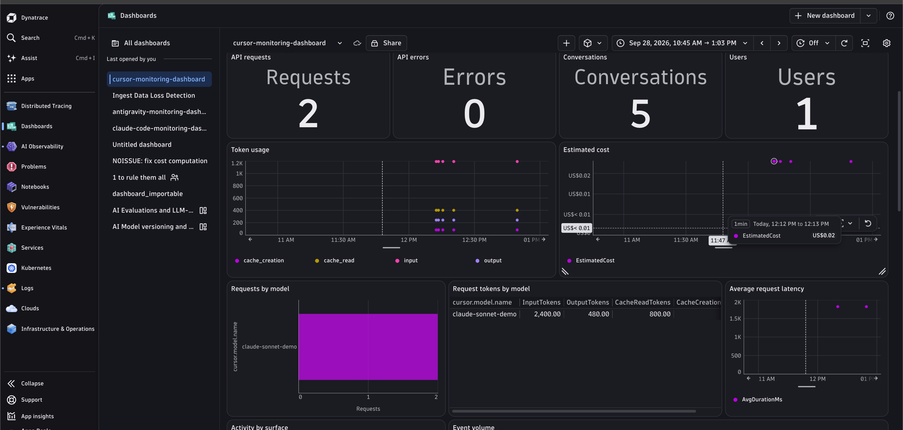

# Cursor Enterprise OpenTelemetry export to Dynatrace

This example sends Cursor's native Enterprise OpenTelemetry export to Dynatrace and analyzes the available GenAI-adjacent telemetry with a premade dashboard.


> **Verified 2026-09-25:** Cursor's server-side exporter sends **metrics and logs only** over OTLP/HTTP protobuf. It does **not send traces**, trace/span IDs, or native `gen_ai.*` semantic-convention spans. This example is deliberately log/metric-driven and does not populate the span-based Dynatrace AI Observability topology or trace views.

## Included

- `cursor-monitoring-dashboard.json`: dashboard for requests, tokens, cost, errors, latency, conversations, tools, skills, hooks, users, surfaces, and optional content.
- `test_connection.py`: synthetic Cursor-shaped OTLP log/metric emitter for connectivity and dashboard previews. It does not instrument Cursor.
- `test_dashboard.py`: dashboard contract checks.
- `.env.example`, `requirements.txt`, and `Makefile`: local test setup.

## Native export surface

Cursor administrators configure export in **Team Settings > OpenTelemetry Export**. It is server-side; there is no Cursor SDK, local editor extension, or instrumentation package to update.

Metrics (delta temporality):

- `cursor.token.usage`, by `cursor.token.type`
- `cursor.tool.calls`, including built-in and MCP tools
- `cursor.cost.usage`, a best-effort estimate rather than an invoice

Logs include `cursor.api.request`, `cursor.api.error`, `cursor.api.correction`, skills, hooks, plugins, Cloud Agent lifecycle events, Grok Bot actions, and opt-in `cursor.conversation.*` messages.

Logs are delivered at least once, so deduplicate on `cursor.event.id` for exact views. Metrics are delivered at most once and contain no request/conversation IDs. Use logs for session-level joins.

## Privacy

Conversation content is off by default. Enable it only after explicit privacy and security approval. It currently covers Cloud Agents and Grok Bot, not IDE/CLI/desktop conversations. The dashboard's message tile stays empty when content export is disabled.

## Prerequisites

- Cursor Enterprise and team telemetry administration permission
- Dynatrace environment
- Dynatrace API token with log and metric ingest permissions
- Publicly reachable HTTPS OTLP/HTTP protobuf endpoint

Never commit a real token.

## Configure Cursor

In **Team Settings > OpenTelemetry Export**:

1. Create a destination.
2. Use this base URL (no signal suffix):

   ```text
   https://<environment-id>.live.dynatrace.com/api/v2/otlp
   ```

3. Add `Authorization: Api-Token <token>`.
4. Test the connection and enable the required telemetry families.
5. Enable Action Recording before `grok_bot_agent_actions`, if required.
6. Enable `conversation_content` only after approval and after enabling both Cursor content controls.

Cursor appends `/v1/metrics` and `/v1/logs`. OTLP/gRPC and OTLP/JSON are not supported for the native export.

## Import and test

Import `cursor-monitoring-dashboard.json` in Dynatrace Dashboards or apply it with your normal `dtctl` workflow.

To send representative synthetic data before live Cursor events arrive:

```bash
cp .env.example .env
# Edit .env; never commit it.
```

```bash
python3 -m venv .venv
source .venv/bin/activate
pip install -r requirements.txt
python3 test_connection.py
```

Run local dashboard checks with `make test`.

Verify logs:

```dql
fetch logs, from: now()-2h
| filter `service.name` == "cursor"
| filter startsWith(`event.name`, "cursor.")
| fields timestamp, `event.name`, cursor.conversation.id, cursor.api.request.model
| sort timestamp desc
```

Verify metrics:

```dql
timeseries tokens = sum(`cursor.token.usage`), by: {cursor.token.type}, from: now()-2h
```

## GenAI-style insights available from logs

| Question | Cursor source |
|---|---|
| Models used | `cursor.api.request.model` |
| Input/output/cache tokens | Request token attributes and `cursor.token.usage` |
| Busiest sessions | Group request logs by `cursor.conversation.id` |
| Users and surfaces | `cursor.user.id`, `cursor.surface` |
| Failures | `cursor.api.error` |
| Request latency | `cursor.api.request.duration_ms` |
| Skills/hooks/plugins | Dedicated event families |
| Approved prompt/response content | Opt-in `cursor.conversation.*` logs |

The example does not manufacture span IDs, span relationships, or `gen_ai.*` spans from logs.

## Limitations and reassessment

- No native trace export or historical backfill
- No native `gen_ai.*` spans
- Metrics cannot be joined to individual conversations
- Cost is an estimate, not billing truth
- Message content has limited surface coverage and requires explicit opt-in

Reassess when Cursor adds trace export, trace context on logs, native GenAI spans, or IDE/CLI content export.

## Version review

No Cursor SDK or OTel editor extension applies to this managed export, so none is pinned. The synthetic Python helper follows the minimum OTel dependency baseline used by the existing Kiro example; these packages are test tooling, not Cursor instrumentation.

## References

- [Cursor OpenTelemetry Export](https://cursor.com/docs/enterprise/opentelemetry-export)
- [Cursor Wire Reference](https://cursor.com/docs/enterprise/opentelemetry-export/wire)
- [Claude Code example](https://github.com/dynatrace-oss/dynatrace-ai-agent-instrumentation-examples/tree/main/ai-coding-agents/claude-code)
- [Kiro example](https://github.com/dynatrace-oss/dynatrace-ai-agent-instrumentation-examples/tree/main/ai-coding-agents/kiro)
