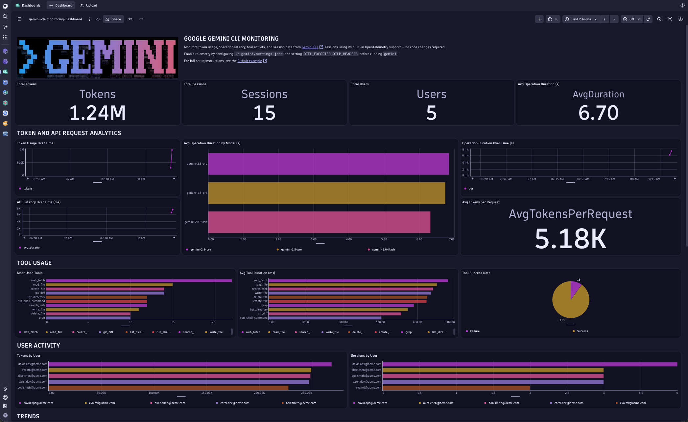

## Gemini CLI

This example shows how to enable built-in [OpenTelemetry](https://opentelemetry.io/) telemetry in [Gemini CLI](https://github.com/google-gemini/gemini-cli) and route the data to Dynatrace for full AI Observability — including token usage, operation latency, and session activity.

Unlike SDK-based frameworks, Gemini CLI ships with native OTEL support. No code changes are required: you only need to set a few environment variables before running `gemini`.



> [!NOTE]
> **Gemini CLI ≥ 0.34.0-preview.0 currently requires routing via an OpenTelemetry Collector.**
>
> Recent versions export over gRPC or JSON-encoded HTTP. Both are fully supported today by routing through an OpenTelemetry Collector (see the [workaround below](#via-opentelemetry-collector-workaround)). Direct OTLP HTTP ingestion will be available once Gemini CLI restores binary Protobuf export ([#23093](https://github.com/google-gemini/gemini-cli/issues/23093)).

## Dynatrace Instrumentation

> [!TIP]
> For detailed setup instructions, configuration options, and advanced use cases, please refer to the [Get Started Docs](https://docs.dynatrace.com/docs/shortlink/ai-ml-get-started).

Gemini CLI has [built-in OpenTelemetry support](https://google-gemini.github.io/gemini-cli/docs/cli/telemetry.html) based on the [OpenTelemetry GenAI Semantic Conventions](https://opentelemetry.io/docs/specs/semconv/gen-ai/). Enabling it requires setting a few environment variables and optionally configuring `~/.gemini/settings.json`.

### Option 1: Source the activation script (recommended)

Copy the example env file, fill in your credentials, then source the script:

```bash
cp .env.example .env
# edit .env with your DT_API_TOKEN and DT_OTEL_ENDPOINT
source activate.sh
```

The script exports all required environment variables into your current shell.

> [!NOTE]
> The script must be **sourced** (not executed) so that the exported variables are available in your current shell session.

### Option 2: Managed settings file

Copy `settings.json.example` to `~/.gemini/settings.json` and update the endpoint to your environment:

```bash
cp settings.json.example ~/.gemini/settings.json
```

Then set the authentication header and temporality preference in your shell profile (`~/.zshrc`, `~/.bashrc`):

```bash
export OTEL_EXPORTER_OTLP_HEADERS="Authorization=Api-Token <YOUR_DT_TOKEN>"
export OTEL_EXPORTER_OTLP_METRICS_TEMPORALITY_PREFERENCE=delta
```

> [!NOTE]
> `settings.json` has no `headers` field, so `OTEL_EXPORTER_OTLP_HEADERS` must still be set as an env var for authentication to work — even when using this file.

Once configured, run Gemini CLI normally:

```bash
gemini
```

Every session will now export the following data to Dynatrace:

### Metrics

Gemini CLI follows the [OpenTelemetry GenAI Semantic Conventions](https://opentelemetry.io/docs/specs/semconv/gen-ai/):

| Metric | Type | Unit | Description |
|---|---|---|---|
| `gen_ai.client.token.usage` | Histogram | `token` | Input and output tokens per operation |
| `gen_ai.client.operation.duration` | Histogram | `s` | End-to-end operation latency |

### Common Attributes

| Attribute | Description |
|---|---|
| `session.id` | Unique session identifier |
| `installation.id` | Unique installation identifier |
| `user.email` | Authenticated user email |
| `active_approval_mode` | Tool approval mode (`auto`, `manual`) |
| `gen_ai.system` | Always `google_gemini` |
| `gen_ai.request.model` | Model used (e.g., `gemini-2.5-pro`) |
| `gen_ai.operation.name` | Operation type (e.g., `chat`) |
| `gen_ai.token.type` | Token type (`input`, `output`) |

### Log Events

Tool executions, session lifecycle, and API requests are emitted as OTEL log records, queryable in Dynatrace Log & Event Viewer by `service.name = gemini-cli`.

## Via OpenTelemetry Collector (Workaround)

Dynatrace [does not accept gRPC or JSON-encoded OTLP](https://docs.dynatrace.com/docs/ingest-from/opentelemetry/otlp-api#api-limitations) — it requires HTTP with binary Protobuf. An OpenTelemetry Collector running locally acts as a protocol bridge: it accepts whatever Gemini CLI sends (gRPC on port `4317`, or HTTP/JSON on port `4318`) and re-exports to Dynatrace as `otlp_http` with binary Protobuf.

```
Gemini CLI  ──gRPC:4317 or HTTP:4318──▶  OTel Collector  ──HTTP/protobuf──▶  Dynatrace
```

This approach works regardless of which Gemini CLI version you are running and bypasses the JSON encoding regression entirely.

### 1. Run the Collector

Use the included [`collector.yaml`](./collector.yaml) with any of the following Collector distributions:

- [Dynatrace Collector](https://docs.dynatrace.com/docs/ingest-from/opentelemetry/collector) (recommended)
- [OpenTelemetry Collector Contrib](https://github.com/open-telemetry/opentelemetry-collector-contrib)
- Standard OpenTelemetry Collector Core

```bash
# with the otelcol binary
DT_OTEL_ENDPOINT=https://<YOUR_ENV_ID>.live.dynatrace.com/api/v2/otlp \
DT_API_TOKEN=<YOUR_DT_TOKEN> \
otelcol --config collector.yaml

# or with Docker
docker run --rm -p 4317:4317 -p 4318:4318 \
  -e DT_OTEL_ENDPOINT="https://<YOUR_ENV_ID>.live.dynatrace.com/api/v2/otlp" \
  -e DT_API_TOKEN="<YOUR_DT_TOKEN>" \
  -v $(pwd)/collector.yaml:/etc/otelcol/config.yaml \
  otel/opentelemetry-collector-contrib
```

> [!NOTE]
> Vanilla OTLP exports to an ActiveGate require manual enrichment of Dynatrace host information. See [enrichment files](https://docs.dynatrace.com/docs/ingest-from/extend-dynatrace/extend-data) for details.

### 2. Point Gemini CLI at the Collector

Send Gemini CLI telemetry to the local Collector using gRPC (most reliable — not affected by the JSON encoding regression):

```bash
export GEMINI_TELEMETRY_ENABLED=true
export GEMINI_TELEMETRY_TARGET=local
export GEMINI_TELEMETRY_OTLP_PROTOCOL=grpc
export GEMINI_TELEMETRY_OTLP_ENDPOINT=http://localhost:4317
export OTEL_EXPORTER_OTLP_METRICS_TEMPORALITY_PREFERENCE=delta
```

Or add it to `~/.gemini/settings.json`:

```json
{
  "telemetry": {
    "enabled": true,
    "target": "otlp",
    "otlpEndpoint": "http://localhost:4317",
    "otlpProtocol": "grpc"
  }
}
```

> [!NOTE]
> When routing through a Collector you do **not** need `OTEL_EXPORTER_OTLP_HEADERS` in your shell — authentication is handled by the Collector's outbound exporter to Dynatrace. The `DT_API_TOKEN` is only needed by the Collector process itself.

## How to use

### Prerequisites

- [Gemini CLI](https://github.com/google-gemini/gemini-cli) installed (`npm install -g @google/gemini-cli`)
- A Dynatrace environment with an API token that has the **`openTelemetryTrace.ingest`** scope

### Configure Dynatrace credentials

Copy the example env file and fill in your values:

```bash
cp .env.example .env
# edit .env with your DT_API_TOKEN and DT_OTEL_ENDPOINT
```

The `.env` file uses two variables:

| Variable | Description |
|---|---|
| `DT_API_TOKEN` | Dynatrace API token with `openTelemetryTrace.ingest` scope |
| `DT_OTEL_ENDPOINT` | Base OTLP endpoint — **do not** include `/v1/metrics` or other signal suffixes |

Endpoint format by environment type:

| Environment | Endpoint format |
|---|---|
| SaaS production | `https://<env-id>.live.dynatrace.com/api/v2/otlp` |

### Make it permanent (optional)

Add the following to `~/.zshrc` (or `~/.bashrc`) so every terminal automatically has telemetry enabled:

```bash
if [ -f "$HOME/path/to/gemini-cli/.env" ]; then
  set -a; source "$HOME/path/to/gemini-cli/.env"; set +a
fi
export GEMINI_TELEMETRY_ENABLED=true
export GEMINI_TELEMETRY_TARGET=local
export GEMINI_TELEMETRY_OTLP_PROTOCOL=http
export GEMINI_TELEMETRY_OTLP_ENDPOINT="${DT_OTEL_ENDPOINT}"
export OTEL_EXPORTER_OTLP_HEADERS="Authorization=Api-Token ${DT_API_TOKEN}"
export OTEL_EXPORTER_OTLP_METRICS_TEMPORALITY_PREFERENCE=delta
```

Then reload:

```bash
source ~/.zshrc
```

### Test the connection

Before running a full session you can verify end-to-end connectivity by running the test script. It sends a representative set of metrics and log events to Dynatrace and reports the result:

```bash
python3 -m venv .venv
source .venv/bin/activate
pip install -r requirements.txt
python3 test_connection.py
```

A successful run looks like:

```
Sending test telemetry to: https://<env-id>.live.dynatrace.com/api/v2/otlp
────────────────────────────────────────────────────────────
Pre-flight check: POST https://<env-id>.live.dynatrace.com/api/v2/otlp/v1/metrics
  ✓  Endpoint reachable, token accepted (HTTP 400)

Recording test metrics …
Recording test log events …

Flushing … (waiting 7 s for the metric export interval)
✓  Metrics exported successfully
✓  Log events exported successfully

────────────────────────────────────────────────────────────
Done! Open your Dynatrace tenant and look for:
  Metrics : Metrics browser → search 'gen_ai'
  Logs    : Log & Event Viewer → filter by service.name = gemini-cli
```

### Verify in Dynatrace

After running Gemini CLI (or the test script), open your Dynatrace tenant and import the attached dashboard, or run these DQL queries:

```dql
fetch logs, from:now()-1h
| filter service.name == "gemini-cli"
| limit 50
```

```dql
timeseries tokens = sum(`gen_ai.client.token.usage`), by: {`gen_ai.request.model`}
| filter gen_ai.system == "google_gemini"
```

```dql
timeseries duration = avg(`gen_ai.client.operation.duration`), by: {`gen_ai.request.model`}
| filter gen_ai.system == "google_gemini"
```

- **Metrics browser** – search for `gen_ai` to see all emitted metrics
- **Log & Event Viewer** – filter by `service.name = gemini-cli` to see session events
- **AI & LLM Observability** – review the pre-built AI observability dashboards

### Optional configuration

| Setting | Location | Description |
|---|---|---|
| `logPrompts` | `settings.json` | Set to `true` to include prompt content in log events |
| `useCollector` | `settings.json` | Route via a local OTEL Collector sidecar |
| `OTEL_RESOURCE_ATTRIBUTES` | env var | Add custom attributes, e.g. `department=engineering,team.id=platform` |
| `GEMINI_TELEMETRY_OTLP_ENDPOINT` | env var | Override the `otlpEndpoint` from settings.json |
| `GEMINI_TELEMETRY_OTLP_PROTOCOL` | env var | Override the protocol (`http` or `grpc`) |
| `GEMINI_TELEMETRY_ENABLED` | env var | Override the `enabled` flag from settings.json |
| `GEMINI_TELEMETRY_LOG_PROMPTS` | env var | Override the `logPrompts` flag from settings.json |

### Administrator / centralized configuration

For organization-wide deployment, distribute `~/.gemini/settings.json` via MDM or a managed shell profile:

```json
{
  "telemetry": {
    "enabled": true,
    "target": "otlp",
    "otlpEndpoint": "https://<YOUR_ENV_ID>.live.dynatrace.com/api/v2/otlp",
    "otlpProtocol": "http"
  }
}
```

And set auth and routing via centrally managed environment variables:

```bash
export GEMINI_TELEMETRY_ENABLED=true
export GEMINI_TELEMETRY_TARGET=local
export GEMINI_TELEMETRY_OTLP_PROTOCOL=http
export GEMINI_TELEMETRY_OTLP_ENDPOINT="https://<YOUR_ENV_ID>.live.dynatrace.com/api/v2/otlp"
export OTEL_EXPORTER_OTLP_HEADERS="Authorization=Api-Token <YOUR_DT_TOKEN>"
export OTEL_EXPORTER_OTLP_METRICS_TEMPORALITY_PREFERENCE=delta
```
