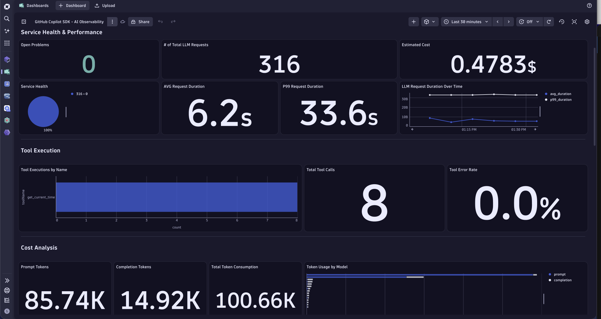

# GitHub Copilot SDK — Dynatrace AI Observability

This example shows how to instrument a [GitHub Copilot SDK](https://www.npmjs.com/package/@github/copilot-sdk) (`@github/copilot-sdk`) agent with [OpenTelemetry](https://opentelemetry.io/) so that traces, token usage, and tool execution appear in the **Dynatrace AI Observability** app.

Unlike Python-based frameworks where Traceloop/OpenLLMetry can auto-instrument LLM client libraries, the Copilot SDK wraps providers internally — so we use **manual OTel spans** created from the SDK's session event stream.

## How It Works

The Copilot SDK emits events via `session.on(event => ...)`. We subscribe to these events and create OpenTelemetry spans that follow the [GenAI semantic conventions](https://opentelemetry.io/docs/specs/semconv/gen-ai/):

```
invoke_agent (root span, SpanKind.SERVER)
  ├── chat claude-sonnet-4-5-20250929 (SpanKind.CLIENT)  ← per-LLM-call
  ├── chat claude-sonnet-4-5-20250929 (SpanKind.CLIENT)  ← per-LLM-call
  ├── execute_tool run_bash (SpanKind.CLIENT)
  └── execute_tool get_current_time (SpanKind.CLIENT)
```

The `chat {model}` spans include `llm.request.type: "chat"` — this is the critical attribute that makes the Dynatrace AI Observability app detect and display the LLM calls.

### Key SDK Events

| Event | When | What We Create |
|---|---|---|
| `user.message` | When user sends a message | Buffer prompt for opt-in capture on next LLM span |
| `assistant.message` | When assistant responds | Buffer content for opt-in capture on next LLM span |
| `assistant.usage` | After each LLM inference | `chat {model}` span with token counts + `llmTokensTotal` / `llmLatency` metrics |
| `tool.execution_start` / `tool.execution_complete` | Tool execution lifecycle | `execute_tool {name}` child span |
| `session.shutdown` | Session ends | End root span, clean up orphaned tool spans |
| `session.error` | Error occurs | Set error status on root span |

### Span Attributes for AI Observability

The Dynatrace AI Observability app filters spans using this DQL:

```dql
fetch spans
| filter isNotNull(gen_ai.provider.name)
| filter in(llm.request.type, {"chat", "completion"})
```

Every `chat {model}` span includes these attributes:

| Attribute | Value | Purpose |
|---|---|---|
| `gen_ai.provider.name` | `"github.copilot"` (or `PROVIDER_TYPE`) | Provider identification |
| `llm.request.type` | `"chat"` | **Required** — AI Observability app filter |
| `gen_ai.operation.name` | `"chat"` | Operation classification |
| `gen_ai.request.model` | Model ID from event | Model identification |
| `gen_ai.response.model` | Model ID from event | Model identification |
| `gen_ai.usage.input_tokens` | From `assistant_usage` event | Token tracking |
| `gen_ai.usage.output_tokens` | From `assistant_usage` event | Token tracking |
| `gen_ai.usage.prompt_tokens` | Alias for input_tokens | Compatibility |
| `gen_ai.usage.completion_tokens` | Alias for output_tokens | Compatibility |
| `gen_ai.prompt.0.role` | `"user"` | Opt-in content capture |
| `gen_ai.prompt.0.content` | User prompt (truncated) | Opt-in content capture |
| `gen_ai.completion.0.role` | `"assistant"` | Opt-in content capture |
| `gen_ai.completion.0.content` | Response text (truncated) | Opt-in content capture |
| `gen_ai.response.finish_reasons` | `["stop"]` | Completion reason |

## Dynatrace Instrumentation

> [!TIP]
> For detailed setup instructions, configuration options, and advanced use cases, please refer to the [Get Started Docs](https://docs.dynatrace.com/docs/shortlink/ai-ml-get-started).

The instrumentation consists of two files:

### `src/telemetry.ts` — OTel SDK Bootstrap

Initializes the OpenTelemetry NodeSDK with OTLP/HTTP protobuf exporters pointed at Dynatrace:

```typescript
import { NodeSDK } from "@opentelemetry/sdk-node";
import { OTLPTraceExporter } from "@opentelemetry/exporter-trace-otlp-proto";
import { OTLPMetricExporter } from "@opentelemetry/exporter-metrics-otlp-proto";
import { AggregationTemporality } from "@opentelemetry/sdk-metrics";

// DYNATRACE_OTLP_URL = https://abc123.live.dynatrace.com/api/v2/otlp
const traceExporter = new OTLPTraceExporter({
  url: `${otlpUrl}/v1/traces`,
  headers: { Authorization: `Api-Token ${otlpToken}` },
});

const metricExporter = new OTLPMetricExporter({
  url: `${otlpUrl}/v1/metrics`,
  headers: { Authorization: `Api-Token ${otlpToken}` },
  temporalityPreference: AggregationTemporality.DELTA, // Required for Dynatrace
});
```

### `src/instrumentation.ts` — GenAI Span Instrumentation

Subscribes to Copilot SDK session events and creates per-LLM-call spans:

```typescript
import { subscribeSessionTelemetry } from "./instrumentation.js";

const session = await client.createSession({ model, tools, ... });

// Subscribe to events — creates spans + records metrics
const cleanup = subscribeSessionTelemetry(session, session.sessionId, model);

// ... use the session ...

cleanup(); // End spans on session close
```

The key instrumentation happens in the `assistant.usage` event handler:

```typescript
case "assistant.usage": {
  // Create a per-LLM-call span (required for AI Observability app)
  const rootCtx = trace.setSpan(context.active(), rootSpan);
  const llmSpan = tracer.startSpan(`chat ${event.data.model}`, {
    kind: SpanKind.CLIENT,
    attributes: {
      "gen_ai.provider.name": providerName,
      "gen_ai.operation.name": "chat",
      "llm.request.type": "chat",              // Critical: AI Observability filter
      "gen_ai.request.model": event.data.model,
      "gen_ai.response.model": event.data.model,
      "gen_ai.usage.input_tokens": event.data.inputTokens,
      "gen_ai.usage.output_tokens": event.data.outputTokens,
      "gen_ai.usage.prompt_tokens": event.data.inputTokens,    // Alias
      "gen_ai.usage.completion_tokens": event.data.outputTokens, // Alias
      "gen_ai.response.finish_reasons": ["stop"],
    },
  }, rootCtx);
  llmSpan.end();
  break;
}
```

## How to Use

### Prerequisites

- Node.js 20+
- A [GitHub Fine-grained personal access token](https://github.com/settings/personal-access-tokens/new) with `Copilot Requests` access (`GH_TOKEN`)
- A Dynatrace environment with an API token that has **`openTelemetryTrace.ingest`** and **`metrics.ingest`** scopes

### Dynatrace API Token

In Dynatrace:

1. Press `Ctrl+K` and search for **Access Tokens**
2. Generate a new token with scopes: `openTelemetryTrace.ingest`, `metrics.ingest`
3. Note the token (starts with `dt0c01.`)

> [!IMPORTANT]
> Use a **classic access token** (`dt0c01.*`), not a platform token (`dt0s16.*`). Platform tokens cannot be used for OTLP ingestion.

Build your Dynatrace OTLP endpoint URL using your **classic domain** (no `.apps.`) with the `/api/v2/otlp` base path:

```
https://<env-id>.live.dynatrace.com/api/v2/otlp
```

### Configure credentials

```bash
cp .env.example .env
# Edit .env with your GH_TOKEN, DYNATRACE_OTLP_URL, and DYNATRACE_OTLP_TOKEN
```

### Install and run

```bash
npm install
npm run build
npm start
# Or with a custom prompt:
npm start -- "What is the current date and time?"
```

### Upload Dynatrace Dashboard

A prebuilt dashboard is included:

1. Download the [GitHub Copilot SDK - AI Observability.json](GitHub%20Copilot%20SDK%20-%20AI%20Observability.json) dashboard
2. Open the Dynatrace **Dashboards** app and click **Upload**
3. Upload the JSON file

The dashboard includes: LLM request counts, token usage, cost analysis by model, tool execution monitoring, latency tracking, top expensive/slowest prompts, and session overview.



### Verify in Dynatrace

After running the agent, open your Dynatrace tenant:

1. **AI Observability app** — The agent should appear automatically, showing models, token usage, and call traces
2. **Dashboard** — Open the uploaded dashboard for cost analysis, tool execution, and session metrics
3. **Distributed Traces** — Search for `service.name = copilot-sdk-agent` to see the full span hierarchy
4. **Metrics browser** — Search for `copilot_sdk` to see token and latency metrics

You can also verify with DQL in a notebook:

```dql
fetch spans
| filter isNotNull(gen_ai.provider.name)
| filter in(llm.request.type, {"chat", "completion"})
| fields span.name, gen_ai.request.model,
         gen_ai.usage.input_tokens, gen_ai.usage.output_tokens
| limit 10
```

## Optional Configuration

| Variable | Default | Description |
|---|---|---|
| `OTEL_SERVICE_NAME` | `copilot-sdk-agent` | Service name in traces/metrics |
| `PROVIDER_TYPE` | `github.copilot` | Value for `gen_ai.provider.name` attribute |
| `PROVIDER_MODEL` | `claude-sonnet-4-5-20250929` | Default model to use |
| `OTEL_INSTRUMENTATION_GENAI_CAPTURE_MESSAGE_CONTENT` | `false` | Set to `true` to capture prompt/completion text in spans |

## Key Lessons

1. **`llm.request.type: "chat"` is mandatory** — Without this attribute, the AI Observability app won't detect your spans, even if `gen_ai.provider.name` is set correctly.

2. **Use `gen_ai.provider.name` on ALL span types** — Not just LLM spans. The app uses `gen_ai.provider.name` as a first-pass filter. Tool spans and HTTP spans should also carry this attribute. (The old `gen_ai.system` attribute is deprecated — use `gen_ai.provider.name` exclusively.)

3. **Use dot-notation event names** — The Copilot SDK uses `user.message`, `assistant.message`, `assistant.usage`, `tool.execution_start`, `tool.execution_complete`, `session.shutdown`, `session.error` — not underscore names.

4. **Capture user prompts via `user.message`** — Subscribe to the `user.message` event to capture `gen_ai.prompt.0.content` on per-LLM-call spans (opt-in only).

5. **One span per LLM inference, not per session** — The app expects a span for each individual LLM API call (the `assistant.usage` event), not one span for the entire conversation session.

6. **Include token aliases** — Set both `gen_ai.usage.input_tokens` / `gen_ai.usage.output_tokens` AND `gen_ai.usage.prompt_tokens` / `gen_ai.usage.completion_tokens` for maximum compatibility.

7. **Dynatrace requires delta temporality** — Set `AggregationTemporality.DELTA` on the metric exporter. Cumulative temporality (the OTel default) is not supported.

8. **Use the OTLP base path** — `DYNATRACE_OTLP_URL` should include `/api/v2/otlp` (e.g., `https://abc123.live.dynatrace.com/api/v2/otlp`). Append `/v1/traces` and `/v1/metrics` for individual signals.

9. **Use classic tokens for OTLP** — Platform tokens (`dt0s16.*`) work for DQL queries and platform APIs, but OTLP ingestion requires classic access tokens (`dt0c01.*`) with `Api-Token` auth header format.

10. **Content capture is opt-in** — Prompt and completion text should only be included in spans when explicitly enabled via `OTEL_INSTRUMENTATION_GENAI_CAPTURE_MESSAGE_CONTENT=true`. This avoids accidentally sending sensitive data to your observability backend.

## Files

| File | Purpose |
|---|---|
| `src/telemetry.ts` | OTel SDK bootstrap with Dynatrace OTLP exporters |
| `src/instrumentation.ts` | GenAI span creation from Copilot SDK session events |
| `src/index.ts` | Minimal example agent showing the integration |
| `GitHub Copilot SDK - AI Observability.json` | Prebuilt Dynatrace dashboard |
| `.env.example` | Environment variable template |
