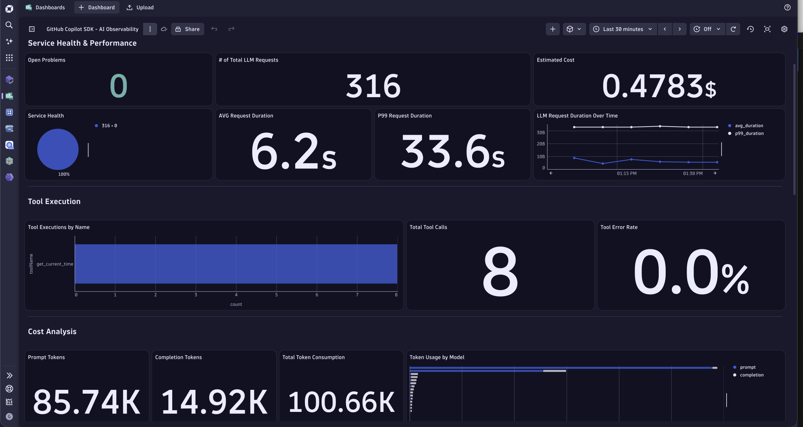

# GitHub Copilot SDK - Dynatrace AI Observability

This example shows how to get [GitHub Copilot SDK](https://www.npmjs.com/package/@github/copilot-sdk) (`@github/copilot-sdk`) agent telemetry into the **Dynatrace AI Observability** app with [OpenTelemetry](https://opentelemetry.io/).

> [!NOTE]
> **Scope: SDK application instrumentation.** This example covers an application you build with the Copilot SDK. Enterprise-managed Copilot CLI and VS Code deployments are configured separately, through the managed `telemetry` property in [enterprise managed settings](https://docs.github.com/en/copilot/reference/enterprise-administrators/enterprise-managed-settings), and are out of scope here.

## Two supported approaches

| Approach | What it covers | When to use |
|---|---|---|
| **Native runtime OTel** | Traces, metrics, and OTel events emitted by the Copilot runtime itself, using GenAI semantic conventions (`gen_ai.*`) plus Copilot-specific `github.copilot.*` attributes | You want the runtime's own view of agent, model, tool, session, token, and duration data |
| **Manual augmentation** | Spans this example builds from the SDK session event stream | You need application-specific spans, custom tools, or business attributes the runtime does not emit |

Manual spans are **optional augmentation**, not a requirement. Earlier versions of this example said manual session-event spans were the only way to observe a Copilot SDK agent; that is no longer true, since the SDK/runtime supports native OTel through `TelemetryConfig`.

> [!WARNING]
> **Do not enable both without deduplication.** Native runtime telemetry and this example's synthesized per-inference spans can represent the same LLM calls. Running them together double-counts calls and tokens. Pick one primary source for LLM calls, or deduplicate deliberately. This example uses a `COPILOT_TELEMETRY_MODE` variable to keep the two apart.

### Native configuration

```ts
const client = new CopilotClient({
  telemetry: {
    otlpEndpoint: "https://otel-gateway.example.com",
    otlpProtocol: "http/protobuf",
    captureContent: false,
  },
});
```

Constraints worth knowing:

- `TelemetryConfig` documents endpoint, protocol, exporter type, source name, file path, and content capture.
- It does **not** document a per-client headers field. Don't invent `otlpHeaders`, and don't assume authenticated direct-to-Dynatrace export can be configured through an SDK property.
- For SDK workloads, send to an authenticated OTLP gateway or Collector that forwards to Dynatrace, unless you have explicitly verified the installed runtime's supported environment-based authentication configuration.
- For enterprise-managed CLI and VS Code deployments, direct Dynatrace authentication can be passed with managed `telemetry.headers`.

See [GitHub: Copilot SDK OpenTelemetry instrumentation](https://docs.github.com/en/copilot/how-tos/copilot-sdk/observability/opentelemetry) and [GitHub: OpenTelemetry for agent monitoring](https://docs.github.com/en/copilot/concepts/enterprise/opentelemetry).

### Content capture

Prompt, response, tool-argument, and tool-result content is **not exported by default**, in either approach. Capture is an explicit, privacy-sensitive opt-in (`captureContent` natively, `OTEL_INSTRUMENTATION_GENAI_CAPTURE_MESSAGE_CONTENT` for the manual path). Leave it off unless you need it: this content can include source code, credentials, and customer data.

When you document or model captured content, prefer the current `gen_ai.input.messages` / `gen_ai.output.messages` attributes over the legacy indexed `gen_ai.prompt.0.*` / `gen_ai.completion.0.*` names.

## Manual augmentation: how it works

The Copilot SDK emits events via `session.on(event => ...)`. The example subscribes to these and creates spans following the [GenAI semantic conventions](https://opentelemetry.io/docs/specs/semconv/gen-ai/):

```
invoke_agent (root span, SpanKind.SERVER)
  ├── chat claude-sonnet-4-5-20250929 (SpanKind.CLIENT)  <- per-LLM-call
  ├── chat claude-sonnet-4-5-20250929 (SpanKind.CLIENT)  <- per-LLM-call
  ├── execute_tool run_bash (SpanKind.CLIENT)
  └── execute_tool get_current_time (SpanKind.CLIENT)
```

### Key SDK events

| Event | When | What we create |
|---|---|---|
| `user.message` | User sends a message | Buffer prompt for opt-in capture on next LLM span |
| `assistant.message` | Assistant responds | Buffer content for opt-in capture on next LLM span |
| `assistant.usage` | After each LLM inference | `chat {model}` span with token counts + `llmTokensTotal` / `llmLatency` metrics |
| `tool.execution_start` / `tool.execution_complete` | Tool execution lifecycle | `execute_tool {name}` child span |
| `session.shutdown` | Session ends | End root span, clean up orphaned tool spans |
| `session.error` | Error occurs | Set error status on root span |

### Span attributes

Each `chat {model}` span carries:

| Attribute | Value |
|---|---|
| `gen_ai.provider.name` | `"github.copilot"` (or `PROVIDER_TYPE`) |
| `gen_ai.operation.name` | `"chat"` |
| `gen_ai.request.model` | Model ID from the event |
| `gen_ai.response.model` | Model ID from the event |
| `gen_ai.usage.input_tokens` | From `assistant.usage` |
| `gen_ai.usage.output_tokens` | From `assistant.usage` |
| `gen_ai.response.finish_reasons` | `["stop"]` |

Tool spans carry `gen_ai.provider.name`, `gen_ai.operation.name`, `gen_ai.tool.name`, and `gen_ai.tool.call.id` where the SDK event supplies them.

## Dynatrace instrumentation

> [!TIP]
> For setup instructions, configuration options, and advanced use cases, see the [Get Started Docs](https://docs.dynatrace.com/docs/shortlink/ai-ml-get-started) and [Dynatrace: OpenTelemetry and AI Observability](https://docs.dynatrace.com/docs/observe/dynatrace-for-ai-observability/get-started/opentelemetry).

### `src/telemetry.ts` - OTel SDK bootstrap (manual mode)

Initializes the OpenTelemetry NodeSDK with OTLP/HTTP protobuf exporters pointed at Dynatrace. These exporters serve the manual-augmentation path only; native mode does not use them.

```typescript
import { NodeSDK } from "@opentelemetry/sdk-node";
import { OTLPTraceExporter } from "@opentelemetry/exporter-trace-otlp-proto";
import { OTLPMetricExporter } from "@opentelemetry/exporter-metrics-otlp-proto";
import { AggregationTemporality } from "@opentelemetry/sdk-metrics";

// DYNATRACE_OTLP_URL = https://abc123.live.dynatrace.com/api/v2/otlp
const traceExporter = new OTLPTraceExporter({
  url: `${otlpUrl}/v1/traces`,
  headers: { Authorization: `Api-Token ${otlpToken}` },
});

const metricExporter = new OTLPMetricExporter({
  url: `${otlpUrl}/v1/metrics`,
  headers: { Authorization: `Api-Token ${otlpToken}` },
  temporalityPreference: AggregationTemporality.DELTA, // Required for Dynatrace
});
```

### `src/instrumentation.ts` - GenAI span augmentation

```typescript
import { subscribeSessionTelemetry } from "./instrumentation.js";

const session = await client.createSession({ model, tools, ... });
const cleanup = subscribeSessionTelemetry(session, session.sessionId, model);
// ... use the session ...
cleanup(); // End spans on session close
```

The per-inference span is created in the `assistant.usage` handler:

```typescript
case "assistant.usage": {
  const rootCtx = trace.setSpan(context.active(), rootSpan);
  const llmSpan = tracer.startSpan(`chat ${event.data.model}`, {
    kind: SpanKind.CLIENT,
    attributes: {
      "gen_ai.provider.name": providerName,
      "gen_ai.operation.name": "chat",
      "gen_ai.request.model": event.data.model,
      "gen_ai.response.model": event.data.model,
      "gen_ai.usage.input_tokens": event.data.inputTokens,
      "gen_ai.usage.output_tokens": event.data.outputTokens,
      "gen_ai.response.finish_reasons": ["stop"],
    },
  }, rootCtx);
  llmSpan.end();
  break;
}
```

## How to use

### Prerequisites

- Node.js 20+
- A [GitHub fine-grained personal access token](https://github.com/settings/personal-access-tokens/new) with `Copilot Requests` access (`GH_TOKEN`)
- Manual mode: a Dynatrace environment with an API token that has **`openTelemetryTrace.ingest`** and **`metrics.ingest`** scopes
- Native mode: an authenticated OTLP gateway or Collector that forwards to Dynatrace

### Dynatrace API token (manual mode)

1. Press `Ctrl+K` in Dynatrace and search for **Access Tokens**
2. Generate a token with scopes `openTelemetryTrace.ingest` and `metrics.ingest`
3. Note the token (starts with `dt0c01.`)

> [!IMPORTANT]
> Use a **classic access token** (`dt0c01.*`), not a platform token (`dt0s16.*`). Platform tokens cannot be used for OTLP ingestion.

Build the OTLP endpoint URL from your **classic domain** (no `.apps.`) with the `/api/v2/otlp` base path:

```
https://<env-id>.live.dynatrace.com/api/v2/otlp
```

### Configure credentials

```bash
cp .env.example .env
```

Edit `.env` with your `GH_TOKEN` and, for manual mode, `DYNATRACE_OTLP_URL` and `DYNATRACE_OTLP_TOKEN`. For native mode set `COPILOT_TELEMETRY_MODE=native` and `COPILOT_OTLP_ENDPOINT`.

### Install and run

```bash
npm install
```

```bash
npm run build
```

```bash
npm start
```

Run with a custom prompt:

```bash
npm start -- "What is the current date and time?"
```

The example defaults to manual mode, so existing setups keep working unchanged.

### Upload the Dynatrace dashboard

1. Download [GitHub Copilot SDK - AI Observability.json](GitHub%20Copilot%20SDK%20-%20AI%20Observability.json)
2. Open the Dynatrace **Dashboards** app and select **Upload**
3. Upload the JSON file

The dashboard covers LLM request counts, token usage, cost analysis by model, tool execution monitoring, latency tracking, top expensive and slowest prompts, and a session overview.



### Verify in Dynatrace

1. **AI Observability app** - the agent appears with models, token usage, and call traces
2. **Dashboard** - open the uploaded dashboard
3. **Distributed Traces** - search for `service.name = copilot-sdk-agent`
4. **Metrics browser** - search for `copilot_sdk` (manual mode metrics)

A practical verification query (this is not the exact internal query used by every AI Observability app version):

```dql
fetch spans
| filter isNotNull(gen_ai.provider.name)
| filter gen_ai.operation.name == "chat"
| fields span.name, gen_ai.request.model,
         gen_ai.usage.input_tokens, gen_ai.usage.output_tokens
| limit 10
```

To see the whole agent hierarchy:

```dql
fetch spans
| filter isNotNull(gen_ai.provider.name)
| filter in(gen_ai.operation.name, {"invoke_agent", "chat", "execute_tool"})
| fields timestamp, span.name, gen_ai.operation.name,
         gen_ai.request.model, gen_ai.usage.input_tokens,
         gen_ai.usage.output_tokens
| limit 50
```

In native mode, check that only one logical LLM call appears per inference, and that no message content is present while `captureContent` is `false`.

## Optional configuration

| Variable | Default | Description |
|---|---|---|
| `COPILOT_TELEMETRY_MODE` | `manual` | `manual` or `native`. Never enable both paths at once |
| `COPILOT_OTLP_ENDPOINT` | (unset) | Native mode: OTLP gateway or Collector endpoint for the Copilot runtime |
| `OTEL_SERVICE_NAME` | `copilot-sdk-agent` | Service name in traces and metrics (manual mode) |
| `PROVIDER_TYPE` | `github.copilot` | Value for `gen_ai.provider.name` (manual mode) |
| `PROVIDER_MODEL` | `claude-sonnet-4-5-20250929` | Default model |
| `OTEL_INSTRUMENTATION_GENAI_CAPTURE_MESSAGE_CONTENT` | `false` | Manual mode: capture message content in spans |

## Key lessons

1. **Native telemetry exists; manual spans are optional.** The Copilot runtime emits `gen_ai.*` and `github.copilot.*` telemetry via `TelemetryConfig`. Add manual spans only for what the runtime does not cover.

2. **Pick one source for LLM calls.** Native runtime spans and synthesized per-inference spans overlap. Running both without deduplication double-counts calls and tokens.

3. **Use `gen_ai.provider.name` on all span types**, not just LLM spans. Tool and HTTP spans should carry it too. The older `gen_ai.system` attribute is deprecated.

4. **Use dot-notation event names.** The SDK uses `user.message`, `assistant.message`, `assistant.usage`, `tool.execution_start`, `tool.execution_complete`, `session.shutdown`, `session.error`.

5. **One span per LLM inference, not per session.** Create a span for each `assistant.usage` event, not one for the whole conversation.

6. **Dynatrace requires delta temporality.** Set `AggregationTemporality.DELTA` on the metric exporter; cumulative (the OTel default) is not supported.

7. **Use the OTLP base path.** `DYNATRACE_OTLP_URL` should include `/api/v2/otlp`, then append `/v1/traces` and `/v1/metrics`.

8. **Use classic tokens for OTLP.** Platform tokens (`dt0s16.*`) work for DQL and platform APIs, but OTLP ingestion needs classic tokens (`dt0c01.*`) with the `Api-Token` auth header.

9. **Content capture is opt-in in both modes**, and can carry source code and other sensitive data.

10. **This is client-side export, not a server-side usage API.** GitHub documents OTel traces, metrics, and events; there is no OTLP Logs-signal export and no central admin usage-export API behind this.

## Files

| File | Purpose |
|---|---|
| `src/telemetry.ts` | OTel SDK bootstrap with Dynatrace OTLP exporters (manual mode) |
| `src/instrumentation.ts` | GenAI span augmentation from Copilot SDK session events |
| `src/index.ts` | Minimal example agent, with `COPILOT_TELEMETRY_MODE` switch |
| `GitHub Copilot SDK - AI Observability.json` | Prebuilt Dynatrace dashboard |
| `.env.example` | Environment variable template |
