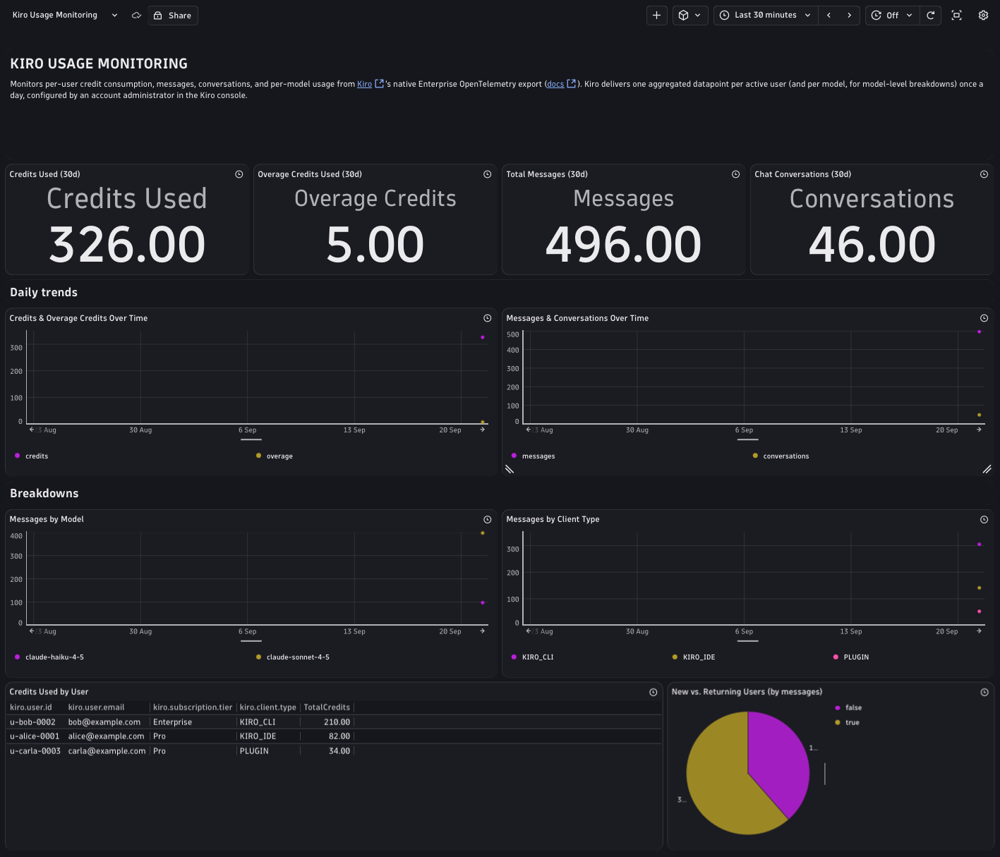

## Kiro

This example shows how to enable Kiro's native [OpenTelemetry export](https://kiro.dev/docs/enterprise/monitor-and-track/user-activity/opentelemetry/) (Enterprise, shipped 2026-09-01) and route it to Dynatrace for visibility into per-user credit consumption, message volume, conversations, and per-model usage.

### How Kiro exports telemetry

The export is configured by an account administrator in the Kiro console, not by individual developers. An administrator stores the destination endpoint and authentication header in an AWS Secrets Manager secret, then enables the OpenTelemetry export format for the Kiro profile. There is no local CLI flag or environment variable for an individual user to set — the configuration lives entirely on the admin side.

Once enabled, Kiro pushes one day's aggregated activity at 02:00 UTC for the previous day, using OTLP/gRPC (default) or OTLP/HTTP with protobuf encoding. Each datapoint represents one user's activity for one day, not an individual request or session.

### Metrics

All exported metrics are monotonic OTLP `Sum` counters in the `kiro.daily.*` namespace, with one datapoint per active user (and, for `kiro.daily.model_messages`, per model) per day:

| Metric | Description |
|---|---|
| `kiro.daily.credits` | Credits used |
| `kiro.daily.overage_credits` | Overage credits used |
| `kiro.daily.messages` | Total messages |
| `kiro.daily.conversations` | Chat conversations |
| `kiro.daily.model_messages` | Messages per model |

### Attributes

Each datapoint carries:

| Attribute | Presence | Description |
|---|---|---|
| `kiro.user.id` | Always | The user's IAM Identity Center user ID |
| `kiro.client.type` | Always | `KIRO_IDE`, `KIRO_CLI`, or `PLUGIN` |
| `kiro.user.new` | Always | Whether the user activated their subscription on the activity date |
| `date` | When set | Activity date in UTC |
| `kiro.user.email` | When resolvable | The user's email address |
| `kiro.subscription.tier` | When set | Subscription tier |
| `kiro.usage.limit` | When set | The user's usage limit |
| `kiro.overage.enabled` | When set | Whether overage is enabled for the user |
| `kiro.overage.cap` | When set | The user's overage cap |
| `kiro.model.name` | Only on `kiro.daily.model_messages` | Model name |

Every export also carries these resource attributes: `service.name = kiro-enterprise`, `kiro.profile.arn`, `kiro.profile.id`, `kiro.account.id`.

### Dynatrace Instrumentation

Dynatrace is a documented destination in the Kiro console. Point the export at your Dynatrace environment's OTLP metrics endpoint:

- **Protocol:** `HTTP/protobuf`
- **Endpoint:** `https://<environment>.live.dynatrace.com/api/v2/otlp`
- **Authentication header:** `Authorization=Api-Token <access-token>`, using a token with the **`openpipeline:metrics:ingest`** scope

Store these in an AWS Secrets Manager secret as described in the [Kiro enterprise docs](https://kiro.dev/docs/enterprise/monitor-and-track/user-activity/opentelemetry/), then select the secret ARN and `HTTP/protobuf` protocol when enabling the export in the Kiro console.



### What's in this directory

- [`kiro-monitoring-dashboard.json`](./kiro-monitoring-dashboard.json) — a Dynatrace dashboard built from the `kiro.daily.*` metrics: credits and overage trends, messages and conversations over time, per-model and per-client-type breakdowns, credits by user, and new-vs-returning users.
- [`test_connection.py`](./test_connection.py) — sends OTLP metrics that replicate Kiro's documented schema (same metric names, attributes, and resource attributes), useful for validating your Dynatrace connectivity and populating the dashboard before a live Kiro Enterprise export is wired up.

### How to use

```bash
python3 -m venv .venv && source .venv/bin/activate
pip install -r requirements.txt
cp .env.example .env   # fill in DT_API_TOKEN (metrics.ingest scope) and DT_OTEL_ENDPOINT
python3 test_connection.py
```

Then import [`kiro-monitoring-dashboard.json`](./kiro-monitoring-dashboard.json) into your Dynatrace tenant, or apply it with `dtctl apply -f kiro-monitoring-dashboard.json`.

### Verifying data landed

```dql
timeseries mm = sum(kiro.daily.model_messages), by:{kiro.model.name}, from: -2h
```

This is the Kiro docs' own suggested verification query — run it after `test_connection.py`, or after Kiro's first scheduled export, to confirm datapoints are arriving.
