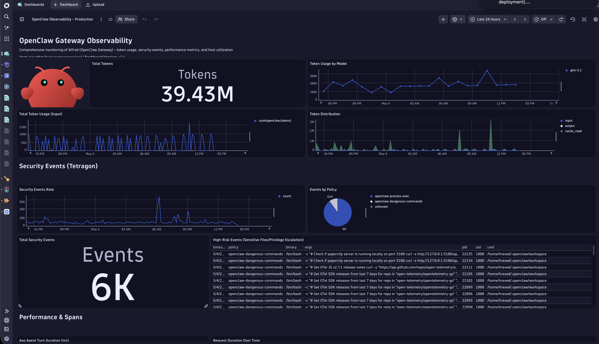

## OpenClaw + openclaw-observability-plugin

This example shows how to add **deep request- and tool-level tracing** to [OpenClaw](https://openclaw.ai/) using the community [openclaw-observability-plugin](https://github.com/henrikrexed/openclaw-observability-plugin), and how to layer **kernel-level security telemetry** on top with [Tetragon](https://tetragon.io). Both layers feed a single Dynatrace dashboard alongside the built-in `diagnostics-otel` signals.

If you only need cost, token, and gateway-health metrics, the simpler built-in path in [`../openclaw/`](../openclaw/) is enough. Use this example when you also need:

- connected traces — `openclaw.request` → `openclaw.agent.turn` → `execute_tool *`
- per-tool execution spans (`execute_tool Read`, `execute_tool Write`, `execute_tool exec`, `execute_tool web_search`, …)
- LLM-call spans (`openclaw.llm.call`) suitable for an availability SLO
- kernel-level security signal — sensitive-file access, dangerous commands, supply-chain installs, network exfiltration



## Dynatrace Instrumentation

> [!TIP]
> For the simpler built-in path, see [`../openclaw/`](../openclaw/). For tenant setup and API-token scopes, see the [AI Observability Get Started Docs](https://docs.dynatrace.com/docs/shortlink/ai-ml-get-started).

The plugin uses OpenClaw's typed plugin hooks to start a root `openclaw.request` span on every inbound message, then enriches it with per-turn, per-tool, and per-LLM-call children. It reads its OTLP wiring from the same `diagnostics.otel` block used by the built-in plugin, so a single config block covers both.

### Plugin track to install

| Plugin track | OpenClaw range | Branch | Notes |
| --- | --- | --- | --- |
| `0.1.x` | `< 2026.4.21` | `release/0.1.x` | Maintenance — security + critical regressions only, through 2026-10-21 |
| `0.2.x` | `>= 2026.4.21` | `main` | Active — uses `before_model_resolve` + `before_prompt_build` hooks (default going forward) |

This example targets **`0.2.x`** unless you are pinned to an older OpenClaw build. Latest release at the time of writing: `v0.2.0` (2026-04-25).

> [!IMPORTANT]
> The plugin **entry id** in `openclaw.json` is `otel-observability` — **not** the repo name `openclaw-observability-plugin`. Using the repo name as the entry key will silently fail to load the plugin.

### Trace spans

| Span | Description |
| --- | --- |
| `openclaw.request` | Root span per inbound message; parents the agent turn, LLM call, and tool spans |
| `openclaw.agent.turn` | Agent turn lifecycle, enriched with token counts and cost |
| `openclaw.llm.call` | One span per outbound LLM call — used as the basis for the availability SLO below |
| `execute_tool *` | One span per tool call (e.g. `execute_tool Read`, `execute_tool Write`, `execute_tool exec`, `execute_tool web_search`) |
| `openclaw.command.new`, `openclaw.command.reset`, `openclaw.command.stop` | Session command events |
| `openclaw.gateway.startup` | Gateway startup |

### Metrics (added on top of the built-in path)

The plugin reuses the built-in `openclaw.*` metric families documented in [`../openclaw/`](../openclaw/) and adds session-correlated dimensions (`openclaw.session.key`, agent id) so that token cost, run duration, and context-window usage can be sliced per session and per agent turn.

| Metric | Description |
| --- | --- |
| `openclaw.tokens` | Token usage by type (`input`, `output`, `cache`) per model, per session |
| `openclaw.cost.usd` | Estimated USD cost per model, per session |
| `openclaw.run.duration_ms` | Agent run duration in milliseconds |
| `openclaw.context.tokens` | Context window usage |
| `openclaw.session.state` | Session state transitions |

> [!NOTE]
> The plugin gives strictly *more* signals than the built-in `diagnostics-otel` path — it is an upgrade, not a replacement. The built-in plugin remains the simplest path for users who only need token cost and usage.

### Log events

Structured log records are exported over OTLP, correlated across the request, agent-turn, LLM-call, and tool spans by `openclaw.session.key`.

## Tetragon (optional, kernel-level security telemetry)

> [!NOTE]
> Tetragon is **optional**. Skip this section if you only need application-level observability.

Tetragon uses eBPF to observe kernel-level activity that application-level OTel cannot see — process execution, file access, network connections, privilege escalation, syscalls. For an AI coding agent that runs untrusted prompts, this catches sensitive-file reads, supply-chain installs, and prompt-injection-driven shell commands even when the agent process itself is compromised. Tetragon emits **kernel security events**, not classical CPU/memory/disk host metrics — those still come from a separate OneAgent or `hostmetrics` receiver.

The plugin repo ships **11 [TracingPolicies](https://github.com/henrikrexed/openclaw-observability-plugin/tree/main/tetragon-policies)** tuned for the OpenClaw threat surface:

| Policy | Threat |
| --- | --- |
| `process-exec` | All process execution (general visibility) |
| `sensitive-files` | Credential/file theft (SSH, AWS, Kube configs) |
| `privilege-escalation` | Root access attempts (`setuid`, `setgid`, `sudo`) |
| `dangerous-commands` | Destructive/exfil commands (`rm`, `curl`, `nc`, miners) |
| `kernel-modules` | Rootkit loading (`init_module`, `insmod`) |
| `prompt-injection-shell` | Injected shell commands (`curl|bash`, reverse shells) |
| `network-exfiltration` | DNS/HTTP data exfiltration |
| `supply-chain` | Malicious packages (npm, pip) |
| `persistence-tampering` | Config/memory tampering |
| `obfuscation-encoding` | Encoded payloads (base64, Unicode steganography) |
| `git-operations` | Git credential theft, force pushes |

### Data flow

```
Tetragon (eBPF kernel events, JSON logs)
        │
        ▼  filelog receiver
  OTel Collector  ──►  Dynatrace (logs + spans)
        ▲
        │  OTLP (HTTP/4318)
  OpenClaw + otel-observability plugin
```

Both layers carry `openclaw.session.key`, so a prompt-injection signal seen at the application layer can be correlated with the actual sensitive-file syscall it triggered at the kernel layer.

A reference collector config (filelog parsing for Tetragon JSON + OTLP→Dynatrace export) lives at [`collector/otel-collector-config.yaml`](https://github.com/henrikrexed/openclaw-observability-plugin/blob/main/collector/otel-collector-config.yaml) in the plugin repo.

### Install (summary)

```bash
sudo mkdir -p /etc/tetragon/tetragon.tp.d/openclaw
sudo cp ~/.openclaw/extensions/otel-observability/tetragon-policies/*.yaml /etc/tetragon/tetragon.tp.d/openclaw/
sudo systemctl restart tetragon
sudo tetra tracingpolicy list
```

Then point the OTel Collector's `filelog` receiver at `/var/log/tetragon/tetragon.log` and route the resulting log records to your Dynatrace OTLP endpoint.

## How to use

### Prerequisites
> [!NOTE]
> Both `setup.sh` and the Tetragon integration example targets **Linux only**. 

- [OpenClaw](https://openclaw.ai/) `>= 2026.4.21` (for plugin track `0.2.x`) — or `2026.2`–`2026.4.20` if you must pin to `0.1.x`
- A Dynatrace environment with an API token that has the **`openTelemetryTrace.ingest`**, **`metrics.ingest`**, **`logs.ingest`** scopes (all three — a token with only one scope will succeed for the matching signal type and silently drop the others)
- For Tetragon (optional): a Linux host with kernel `>= 5.x`, sudo access, and the [Tetragon CLI](https://tetragon.io/docs/getting-started/install-cli/) installed

### Configure the `.env` file

Copy the example env file:

```bash
cp .env.example .env
```

The `.env` file contains:

| Variable | Description |
| --- | --- |
| `OTEL_EXPORTER_OTLP_METRICS_TEMPORALITY_PREFERENCE` | **Must** be set to `delta` — Dynatrace requires delta temporality for metrics. The OTel default of `cumulative` will be silently dropped by Dynatrace ingest. |

### Install `openclaw-observability-plugin`

The plugin lives under `~/.openclaw/extensions/`. The folder name **must** match the plugin id `otel-observability`:

```bash
mkdir -p ~/.openclaw/extensions
cd ~/.openclaw/extensions
git clone https://github.com/henrikrexed/openclaw-observability-plugin.git otel-observability
cd otel-observability
npm install
```

Add to `~/.openclaw/openclaw.json`:

```json
{
  "diagnostics": {
    "enabled": true,
    "otel": {
      "enabled": true,
      "endpoint": "https://<env-id>.live.dynatrace.com/api/v2/otlp",
      "protocol": "http/protobuf",
      "serviceName": "openclaw-gateway",
      "traces": true,
      "metrics": true,
      "logs": true,
      "headers": {
        "Authorization": "Api-Token dt0c01.XXXX..."
      }
    }
  },
  "plugins": {
    "load": {
      "paths": ["~/.openclaw/extensions/otel-observability"]
    },
    "entries": {
      "otel-observability": {
        "enabled": true
      }
    }
  }
}
```

> [!IMPORTANT]
> Do **not** add a nested `config` block under `entries.otel-observability`. The plugin reads its settings from `diagnostics.otel`, not from per-entry config. OpenClaw's plugin framework rejects unknown properties and the plugin will fail to load.

Replace `<env-id>` with your Dynatrace environment ID and the `Api-Token` value with your actual token.

Clear the TS plugin loader cache and restart the gateway (the cache must be cleared after every plugin upgrade or the gateway keeps running the previously compiled output):

```bash
rm -rf /tmp/jiti
systemctl --user restart openclaw-gateway
```

### One-shot setup script

Alternatively, run [`setup.sh`](./setup.sh) with your Dynatrace endpoint and API token. It installs the plugin into `~/.openclaw/extensions/otel-observability`, writes the `openclaw.json` and `~/.openclaw/.env` entries, clears the jiti cache, and restarts the gateway:

```bash
./setup.sh https://<env-id>.live.dynatrace.com/api/v2/otlp <YOUR_DT_TOKEN>
```

> [!NOTE]
> The setup script only needs to be run once. Settings are persisted in `~/.openclaw/openclaw.json` and `~/.openclaw/.env`.

### Install Tetragon (optional)

See [Tetragon (optional, kernel-level security telemetry)](#tetragon-optional-kernel-level-security-telemetry) above.

### Verify the plugin is live

Watch the gateway log for the plugin's hook-registration markers:

```bash
journalctl --user -u openclaw-gateway -f | grep -E '\[otel\]'
```

You should see, in order:

```
[otel] Registered message_received hook (via api.on)
[otel] Registered before_model_resolve hook (via api.on)
[otel] Registered before_prompt_build hook (via api.on)
[otel] Registered tool_result_persist hook (via api.on)
[otel] Registered agent_end hook (via api.on)
[otel] Registered command event hooks (via api.registerHook)
[otel] Registered gateway:startup hook (via api.registerHook)
[otel] Starting OpenTelemetry observability...
[otel] ✅ Observability pipeline active
```

If those lines are missing, the plugin is not loaded — check `plugins.load.paths` in `openclaw.json` and re-run `rm -rf /tmp/jiti && systemctl --user restart openclaw-gateway`.

### Verify in Dynatrace

Import the dashboard:

1. Open Dynatrace → Apps → **Dashboards** → `+ Create dashboard` → ⋮ menu → **Import dashboard**.
2. Upload [`openclaw-observability-dashboard.json`](./openclaw-observability-dashboard.json).
3. Adjust the `host.name` markdown filter note in the Host Metrics section to match the host running your OpenClaw gateway.

Or via [`dtctl`](https://github.com/dynatrace-oss/dtctl):

```bash
dtctl apply -f openclaw-observability-dashboard.json
```

Activate the SLO:

```bash
dtctl apply -f openclaw-llm-availability-slo.json
```

The SLO `openclaw_llm_availability` measures the success rate of LLM calls (`span.name == "openclaw.llm.call"`, `service.name == "openclaw-gateway"`) over a rolling 1-day window — target **99%**, warning **99.5%**.

Or run this DQL in a notebook to fetch a recent agent turn with its tool children:

```dql
fetch spans, from:now()-1h
| filter service.name == "openclaw-gateway"
| filter span.name == "openclaw.request" or starts_with(span.name, "execute_tool ")
| limit 50
```

A healthy trace looks like `openclaw.request` → `openclaw.agent.turn` → one or more `execute_tool *` and/or `openclaw.llm.call` children, all sharing the same `openclaw.session.key`.

- **Distributed traces** — filter by `service.name = openclaw-gateway`
- **Metrics browser** — search for `openclaw` to see all emitted metrics
- **Log & Event Viewer** — filter by `service.name = openclaw-gateway` (and Tetragon log records once the collector pipeline is wired up)

### Optional configuration

| Setting (`openclaw.json`) | Default | Description |
| --- | --- | --- |
| `diagnostics.otel.sampleRate` | `1.0` | Trace sampling rate (0.0–1.0, root spans only) |
| `diagnostics.otel.flushIntervalMs` | `60000` | Metric/trace flush interval in ms. Use `10000` during debugging. |
| `OTEL_EXPORTER_OTLP_METRICS_TEMPORALITY_PREFERENCE` | `cumulative` | Set to `delta` for Dynatrace compatibility |

## When to choose which

| You need… | Use |
| --- | --- |
| Token cost, model usage, gateway health metrics — minimal setup | [`../openclaw/`](../openclaw/) (built-in `diagnostics-otel`) |
| Connected request → agent turn → tool span hierarchy | This example |
| Per-tool execution timing and result size | This example |
| LLM-call availability SLO | This example |
| Kernel-level security telemetry (file access, prompt-injection, supply chain) | This example + Tetragon |
