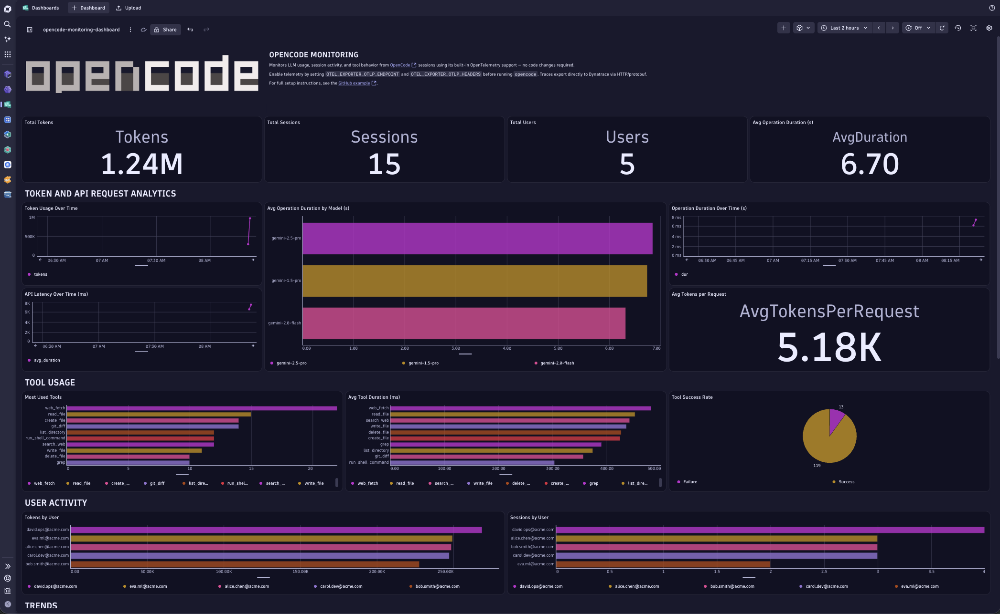

## OpenCode

This example shows how to enable built-in [OpenTelemetry](https://opentelemetry.io/) support in [OpenCode](https://github.com/anomalyco/opencode) and route the data to Dynatrace for full AI Observability — including LLM call volume, session activity, tool usage, and request latency.

Unlike SDK-based frameworks, OpenCode ships with native OTEL support. No code changes are required: you only need to set two environment variables before running `opencode`.



## Dynatrace Instrumentation

> [!TIP]
> For detailed setup instructions, configuration options, and advanced use cases, please refer to the [Get Started Docs](https://docs.dynatrace.com/docs/shortlink/ai-ml-get-started).

OpenCode reads standard OTel environment variables to export telemetry. Set the variables below (or `source setup.sh` — see [How to use](#how-to-use)):

```bash
# 1. Point to your Dynatrace OTLP ingest endpoint (base URL, no signal suffix)
#    SaaS production:  https://<env-id>.live.dynatrace.com/api/v2/otlp
export OTEL_EXPORTER_OTLP_ENDPOINT=https://<YOUR_ENV_ID>.live.dynatrace.com/api/v2/otlp

# 2. Authenticate with a Dynatrace API token
export OTEL_EXPORTER_OTLP_HEADERS="Authorization=Api-Token <YOUR_DT_TOKEN>"

# 3. Optional: add custom resource attributes (e.g. team, environment)
# export OTEL_RESOURCE_ATTRIBUTES="service.namespace=myteam,environment=production"
```

Once set, start OpenCode normally:

```bash
opencode
```

Every session will now export the following data to Dynatrace:

### Traces (direct — no collector required)

OpenCode exports traces using HTTP/protobuf, which Dynatrace ingests natively. The following spans are emitted:

| Span | Description |
|---|---|
| `LLM.run` | Each LLM request — includes `providerID`, `modelID`, `session.id`, `agent`, `mode`, `small` |
| `Tool.execute` | Each tool execution — includes `tool.name`, `session.id`, `message.id`, `tool.call_id` |
| `Session.create` / `Session.get` / `Session.fork` / … | Session lifecycle operations |
| `SessionProcessor.create` / `SessionProcessor.process` / … | Message processing pipeline spans |
| `Snapshot.*` | File snapshot and diff operations |

All spans carry resource attributes: `service.name=opencode`, `service.version`, `opencode.run_id`, `opencode.process_role`, `deployment.environment.name`.

### Logs

> [!NOTE]
> **OpenCode currently exports logs as HTTP/JSON.**
>
> Dynatrace requires binary Protobuf for direct OTLP log ingestion. Log data is fully supported today by routing through an OpenTelemetry Collector configured to receive JSON and forward as Protobuf. Direct ingestion will be available once OpenCode adds binary Protobuf log serialization.

## How to use

### Prerequisites

- [OpenCode](https://github.com/anomalyco/opencode) installed (`npm install -g opencode-ai` or the binary from the [releases page](https://github.com/anomalyco/opencode/releases))
- A Dynatrace environment with an API token that has the **`openTelemetryTrace.ingest`** scope

### Configure Dynatrace credentials

Copy the example env file and fill in your values:

```bash
cp .env.example .env
# edit .env with your DT_API_TOKEN and DT_OTEL_ENDPOINT
```

The `.env` file uses two variables:

| Variable | Description |
|---|---|
| `DT_API_TOKEN` | Dynatrace API token with `openTelemetryTrace.ingest` scope |
| `DT_OTEL_ENDPOINT` | Base OTLP endpoint — **do not** include `/v1/traces` or other signal suffixes |

Endpoint format by environment type:

| Environment | Endpoint format |
|---|---|
| SaaS production | `https://<env-id>.live.dynatrace.com/api/v2/otlp` |

### Enable telemetry and run OpenCode

Source the setup script to export environment variables into your current shell:

```bash
source setup.sh
opencode
```

> [!NOTE]
> The setup script must be **sourced** (not executed) so that the exported variables are available in your current shell session.

For persistent configuration, add the exports to your shell profile (`~/.zshrc`, `~/.bashrc`):

```bash
export OTEL_EXPORTER_OTLP_ENDPOINT=https://<YOUR_ENV_ID>.live.dynatrace.com/api/v2/otlp
export OTEL_EXPORTER_OTLP_HEADERS="Authorization=Api-Token <YOUR_DT_TOKEN>"
```

### Test the connection

Before running a full session you can verify end-to-end connectivity by running the test script. It sends representative spans to Dynatrace and reports the result:

```bash
python3 -m venv .venv
source .venv/bin/activate
pip install -r requirements.txt
python3 test_connection.py
```

A successful run looks like:

```
Sending test telemetry to: https://<env-id>.live.dynatrace.com/api/v2/otlp
────────────────────────────────────────────────────────────
Pre-flight check: POST https://<env-id>.live.dynatrace.com/api/v2/otlp/v1/traces
  ✓  HTTP 200

Recording test spans …
Flushing spans …
✓  Traces exported successfully

────────────────────────────────────────────────────────────
Done! Open your Dynatrace tenant and look for:
  Distributed Traces → filter by service.name = opencode
  Span names: Session.create, LLM.run, Tool.execute
```

### Verify in Dynatrace

After running OpenCode (or the test script), open your Dynatrace tenant and import the attached dashboard, or run this DQL query to fetch recent spans:

```dql
fetch spans, from:now()-1h
| filter service.name == "opencode"
| sort timestamp desc
| limit 50
```

- **Distributed Traces** — filter by `service.name = opencode` to browse traces
- **AI & LLM Observability** — review the pre-built AI observability dashboards

### Optional configuration

| Variable | Description |
|---|---|
| `OTEL_RESOURCE_ATTRIBUTES` | Add custom attributes, e.g. `service.namespace=myteam,environment=production` |
| `OTEL_EXPORTER_OTLP_ENDPOINT` | Base OTLP endpoint (no signal suffix) |
| `OTEL_EXPORTER_OTLP_HEADERS` | Authentication headers, comma-separated `key=value` pairs |
