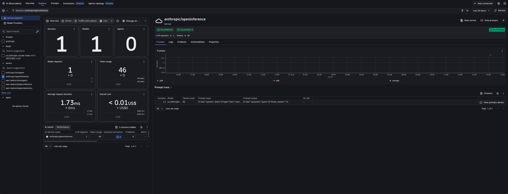
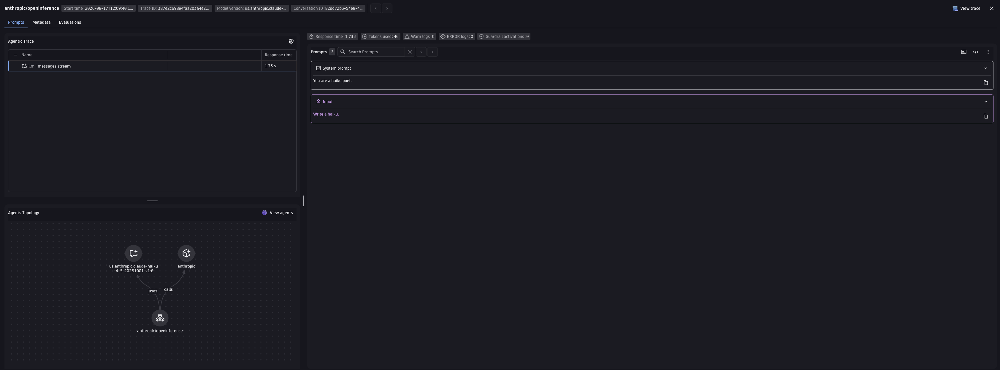

# OpenInference (Anthropic) + Dynatrace AI Observability



Generate a haiku with Claude via the Anthropic Python SDK's `AnthropicBedrock` client, send the OpenTelemetry trace to Dynatrace, and see it in the **AI Observability** app.
OpenInference uses its own semantic conventions (`llm.model_name`, `llm.token_count.*`, etc.) -- this example shows two ways to normalize them into the Dynatrace `gen_ai.*` format: the Bindplane collector's `genainormalizer` processor, or Dynatrace OpenPipeline.

This mirrors [`openai/openinference`](../../openai/openinference/), swapping the OpenAI SDK + `openinference-instrumentation-openai` for the Anthropic SDK + [`openinference-instrumentation-anthropic`](https://github.com/Arize-ai/openinference/tree/main/python/instrumentation/openinference-instrumentation-anthropic). It calls Claude through AWS Bedrock -- same as [`anthropic/oneagent`](../oneagent/) -- so it reuses the AWS credentials already configured for e2e CI instead of requiring a separate Anthropic API key.

**How this differs from `aws-bedrock/openinference`:** that example instruments at the `boto3`/`botocore` `invoke_model` level with `openinference-instrumentation-bedrock`, which is generic across every Bedrock-hosted model family. This example instruments at the Anthropic SDK level with `openinference-instrumentation-anthropic`, which understands the Messages API's request/response shape natively (message roles, content blocks, cache token breakdown) and produces richer, more precise `llm.*` attributes for Claude specifically -- at the cost of only working for Claude.

---

## Table of contents

- [What you'll build](#what-youll-build)
- [Prerequisites](#prerequisites)
- [Configuration options](#configuration-options)
- [Setup](#setup)
- [Option A -- Bindplane collector with genainormalizer](#option-a----bindplane-collector-with-genainormalizer)
- [Option B -- Dynatrace OpenPipeline](#option-b----dynatrace-openpipeline)
- [Visualize in Dynatrace AI Observability](#visualize-in-dynatrace-ai-observability)
- [Attribute mapping reference](#attribute-mapping-reference)
- [Metrics](#metrics)
- [Known gaps & limitations](#known-gaps--limitations)
- [Troubleshooting](#troubleshooting)

---

## What you'll build

- Calls Claude (via AWS Bedrock) to generate a haiku using the `anthropic` Python SDK's `AnthropicBedrock` client, instrumented with `openinference-instrumentation-anthropic`.
- Produces OpenTelemetry traces with OpenInference semantic conventions.
- Normalizes OpenInference attributes to Dynatrace `gen_ai.*` format -- either via the Bindplane collector's `genainormalizer` processor or via Dynatrace OpenPipeline.
- Shows the trace in the Dynatrace AI Observability app with model, token usage, and message content.

---

## Prerequisites

- A Dynatrace tenant -- start a free trial at https://dt-url.net/trial
- Docker installed and running (Option A only)
- Python 3.10+
- [uv](https://docs.astral.sh/uv/getting-started/installation/)
- AWS credentials (`AWS_ACCESS_KEY_ID`, `AWS_SECRET_ACCESS_KEY`) with Anthropic model access enabled in Bedrock -- same requirement as [`anthropic/oneagent`](../oneagent/#prerequisites)

---

## Configuration options

OpenInference uses its own semantic conventions that the Dynatrace AI Observability app does not natively understand. Two equivalent approaches normalize the attributes:

|  | Option A -- Bindplane collector | Option B -- OpenPipeline |
|---|---|---|
| **Where normalization runs** | In the collector process, via the `genainormalizer` processor | Server-side, in your Dynatrace tenant |
| **Requires Docker** | Yes | No |
| **Requires Dynatrace config** | No | Yes -- one-time deploy (skip if already deployed from `openai/openinference` -- see [Option B](#option-b----dynatrace-openpipeline)) |
| **Good for** | Full control over the pipeline, works anywhere you can run a collector, no need to manually add pipeline configurations on your tenant | Simpler ops -- no collector to manage |
| **Make target** | `make run` | `make run-openpipeline` (deploy once first) |

Both paths surface the request in the AI Observability app. Option A also reconstructs the full message history into `gen_ai.input.messages` / `gen_ai.output.messages`; Option B uses an interim fallback for message content (see [Known gaps & limitations](#known-gaps--limitations)).

---

## Setup

### 1. Create a Dynatrace access token

1. In Dynatrace press `Ctrl+K` and search for **Access tokens**.
2. Create a token with these permissions:
   - `openTelemetryTrace.ingest`
3. Copy the token value.

### 2. Set environment variables

The app and scripts read credentials from environment variables. The easiest way is to create a `.env` file in this directory (the Makefile sources it automatically):

```bash
# .env
DT_ENDPOINT=https://abc12345.live.dynatrace.com
DT_API_TOKEN=dt0c01.****.*****

AWS_ACCESS_KEY_ID=****************
AWS_SECRET_ACCESS_KEY=****************
AWS_DEFAULT_REGION=us-east-1                                 # optional, defaults to us-east-1
ANTHROPIC_MODEL_ID=us.anthropic.claude-haiku-4-5-20251001-v1:0   # optional, same default
```

> **Note:** `DT_ENDPOINT` is your base tenant URL -- not the `/api/v2/otlp` path. Example: `https://abc12345.live.dynatrace.com`.

If you are not using the Makefile, source the file directly in your shell:

```bash
source .env
```

### 3. Install dependencies

```bash
make install
```

---

## Option A -- Bindplane collector with genainormalizer

The [Bindplane Distro for OpenTelemetry (BDOT)](https://github.com/observIQ/bindplane-otel-collector) collector intercepts spans and normalizes OpenInference attributes to `gen_ai.*` with its built-in `genainormalizer` processor before forwarding to Dynatrace. No Dynatrace configuration needed.

```
App  ->  Bindplane collector (genainormalizer)  ->  Dynatrace Grail
```

This example pins the collector to `ghcr.io/observiq/bindplane-agent:1.105.1`, the same version pinned by `openai/openinference` -- the config is identical because `genainormalizer`'s `openinference` source is provider-agnostic. The pin means a future version bump surfaces normalization changes in the e2e test.

The collector needs your Dynatrace credentials because **it is the component that forwards spans to Dynatrace**. The app itself only knows about `http://localhost:4318` -- it sends spans to the collector, and the collector authenticates with Dynatrace using `DT_ENDPOINT` and `DT_API_TOKEN`.

The pipeline runs two processors (see [`otel-collector-config.yaml`](otel-collector-config.yaml)):

1. **`genainormalizer`** (source `openinference`, `remove_originals: true`) maps OpenInference attributes to `gen_ai.*` and reconstructs the flattened `llm.input_messages.N.*` / `llm.output_messages.N.*` attributes into `gen_ai.input.messages` and `gen_ai.output.messages` JSON. `remove_originals` drops the raw `llm.*` attributes so exported spans carry only `gen_ai.*` fields.
2. **`transform/response_model`** mirrors `gen_ai.request.model` to `gen_ai.response.model`, which the AI Observability app requires and OpenInference has no separate field for.

### Step 1 -- Start the collector and run the app

```bash
# with make (reads .env automatically, starts the collector then runs app.py once)
make run
```

Or manually with Docker:

**Linux/macOS:**
```bash
source .env
docker run -d \
  --name bindplane-otel-collector-anthropic \
  -p 4318:4318 \
  -v $(pwd)/otel-collector-config.yaml:/etc/otel/config.yaml:ro \
  -e DT_ENDPOINT=$DT_ENDPOINT \
  -e DT_API_TOKEN=$DT_API_TOKEN \
  ghcr.io/observiq/bindplane-agent:1.105.1
```

**Windows CMD:**
```cmd
set DT_ENDPOINT=https://abc12345.live.dynatrace.com
set DT_API_TOKEN=dt0c01.*****
docker run -d ^
  --name bindplane-otel-collector-anthropic ^
  -p 4318:4318 ^
  -v %cd%/otel-collector-config.yaml:/etc/otel/config.yaml:ro ^
  -e DT_ENDPOINT=%DT_ENDPOINT% ^
  -e DT_API_TOKEN=%DT_API_TOKEN% ^
  ghcr.io/observiq/bindplane-agent:1.105.1
```

The BDOT image reads its config from `/etc/otel/config.yaml` by default in standalone mode, so no `--config` argument is needed.

What happens:
- The collector listens on port `4318` for incoming OTLP/HTTP spans from the app.
- The `genainormalizer` processor maps OpenInference attributes to `gen_ai.*` and reconstructs the message history.
- The processed spans are forwarded to `$DT_ENDPOINT/api/v2/otlp` authenticated with the API token.

If you started the collector manually, run the app once against it:

```bash
source .env && OTEL_EXPORTER_OTLP_ENDPOINT=http://localhost:4318 OTEL_EXPORTER_OTLP_HEADERS="" python3 app.py
```

**Useful commands:**

```bash
make logs   # tail collector.log in real time
make stop   # stop and remove the collector container

# or manually
docker logs -f bindplane-otel-collector-anthropic
docker stop bindplane-otel-collector-anthropic && docker rm bindplane-otel-collector-anthropic
```

---

## Option B -- Dynatrace OpenPipeline

OpenPipeline is a server-side processing pipeline in Dynatrace that applies the same attribute mappings before spans are stored. The app sends spans directly to Dynatrace -- no collector needed.

```
App  ->  Dynatrace OpenPipeline (transform)  ->  Dynatrace Grail
```

[`openpipeline-openinference.yaml`](openpipeline-openinference.yaml) in this directory is byte-identical to the one in `openai/openinference/` -- the pipeline matches on the generic `openinference.span.kind` attribute, not on anything provider-specific, so it is the same pipeline in your tenant regardless of which OpenInference example produced it. **If you already deployed it while working through `openai/openinference`, skip straight to [Step 2](#step-2----run-the-app).**

### Step 1 -- Deploy the OpenPipeline configuration using the Dynatrace UI
This is a one-time setup per tenant.

1. In Dynatrace press `Ctrl+K` and search for **OpenPipeline**.
2. Select **Spans**.
3. Click **Add pipeline**, name it `openinference-ai-spans`, and add processors matching the definitions in `openpipeline-openinference.yaml`.
4. Go to the **Routing** tab and add an entry:
    - Matcher: `isNotNull(openinference.span.kind)`
    - Pipeline: `openinference-ai-spans`

> **Note:** The routing matcher uses `isNotNull(openinference.span.kind)` (a span attribute set by every OpenInference instrumentor). Using `otel.scope.name` does not work — OpenPipeline routing evaluates span attributes only, not OTLP scope-level fields.

---

### Step 2 -- Run the app

The app sends spans directly to `$DT_ENDPOINT/api/v2/otlp`, authenticated with the API token. OpenPipeline intercepts and transforms the spans server-side before they are stored.

```bash
# with make (reads .env automatically)
make run-openpipeline

# or manually
source .env && OTEL_EXPORTER_OTLP_ENDPOINT=$DT_ENDPOINT/api/v2/otlp OTEL_EXPORTER_OTLP_HEADERS="Authorization=Api-Token $DT_API_TOKEN" python3 app.py
```

---

## Visualize in Dynatrace AI Observability

1. In Dynatrace press `Ctrl+K` and search for **AI Observability**.
2. Your haiku request appears in the Explorer as the `anthropic/openinference` service, with model, token usage, and prompt trace populated -- no problems, no guardrail activations.
   
3. Open the prompt trace to inspect the reconstructed conversation (`System prompt` / `Input`), trace metadata (model version, conversation ID), and the Agents Topology graph connecting the model, provider, and service.
   

---

## Attribute mapping reference

### Option A -- genainormalizer (`openinference` source)

The `genainormalizer` processor applies these translations, then `remove_originals` drops the source `llm.*` attributes. The collector config adds the `gen_ai.response.model` mirror.

| OpenInference source | Dynatrace target |
|---|---|
| `llm.token_count.prompt` | `gen_ai.usage.input_tokens` |
| `llm.token_count.completion` | `gen_ai.usage.output_tokens` |
| `llm.token_count.prompt_details.cache_read` / `.cache_write` | `gen_ai.prompt_caching` (`"read"` / `"write"`) |
| `llm.model_name` | `gen_ai.request.model` |
| `llm.provider` / `llm.system` (both always `"anthropic"`, set by the instrumentor) | `gen_ai.provider.name` |
| `agent.name` | `gen_ai.agent.name` |
| `session.id` | `gen_ai.conversation.id` |
| `openinference.span.kind` | `gen_ai.operation.name` (`LLM`→`chat`) |
| `llm.input_messages.N.*` / `llm.output_messages.N.*` | `gen_ai.input.messages` / `gen_ai.output.messages` (full reconstruction, including the synthesized `system` message -- see [Known gaps & limitations](#known-gaps--limitations)) |
| _(added by collector config)_ | `gen_ai.response.model` (mirrored from `gen_ai.request.model`) |

Unlike a hand-written transform, `genainormalizer` reconstructs the full conversation from the indexed per-message attributes, so `gen_ai.input.messages` / `gen_ai.output.messages` contain the complete message history rather than a serialized fallback.

### Option B -- OpenPipeline

The OpenPipeline configuration in [`openpipeline-openinference.yaml`](openpipeline-openinference.yaml) applies its own DQL-based translations server-side, including `gen_ai.operation.kind`, request parameters (`temperature`, `max_tokens`, `top_p`), `finish_reasons`, and prompt-caching flags. It uses an interim fallback for message content (`input.value` / `output.value` → `gen_ai.input.messages` / `gen_ai.output.messages`) because DQL cannot iterate over the indexed per-message attributes at transform time.

`session.id` and `user.id` already match the OTel standard and pass through unchanged in both options.

---

## Metrics

OpenInference is span-only by design (its instrumentors emit no metric instruments), so the two metrics the AI Observability app charts must be derived from the spans. Both options do this, so the cost and latency tiles populate either way:

| Metric | Option A (collector) | Option B (OpenPipeline) |
|---|---|---|
| `gen_ai.client.operation.duration` (s) | `span_metrics` connector, on LLM spans | `samplingAwareHistogramMetric` extractor on `duration_seconds` |
| `gen_ai.client.token.usage` (`gen_ai.token.type` = `input`/`output`) | `signaltometrics` connector, two sum defs | two `samplingAwareValueMetric` extractors, one per direction |

Both read the normalized `gen_ai.usage.input_tokens` / `gen_ai.usage.output_tokens` (mapped from OpenInference's `llm.token_count.*`, which for Anthropic already folds in cache-write and cache-read tokens -- see [`_get_token_counts`](https://github.com/Arize-ai/openinference/blob/main/python/instrumentation/openinference-instrumentation-anthropic/src/openinference/instrumentation/anthropic/_utils.py)). **Option A** derives both metrics in the Bindplane collector — `signaltometrics` (token) is bundled there alongside `genainormalizer`; requires the token's `metrics.ingest` scope, and both metrics use delta temporality (Dynatrace rejects cumulative). **Option B** derives the same two metrics server-side via the metric-extraction processors in [`openpipeline-openinference.yaml`](openpipeline-openinference.yaml); the token metric uses the two-extractor pattern (one per direction, both writing `gen_ai.client.token.usage` with a constant `gen_ai.token.type` dimension).

---

## Known gaps & limitations

### Attributes genainormalizer does not yet map (Option A)

The `genainormalizer` `openinference` source, as bundled in the pinned collector image, does not set the following attributes (same gap list as `openai/openinference` -- see that example for the version this was last verified against). They are optional for the AI Observability app, and are candidates for upstream contribution to the processor:

- `gen_ai.request.top_p` / `gen_ai.request.max_tokens`
- `gen_ai.response.finish_reasons`
- `gen_ai.prompt_caching` and `gen_ai.cache.type`
- `gen_ai.system` (only `gen_ai.provider.name` is set)
- `gen_ai.system_instructions` -- confirmed missing against a live run (`test/e2e/reports/anthropic-openinference.md`, AR-043); the synthesized system message is still present inside the reconstructed `gen_ai.input.messages`, just not lifted to this dedicated attribute

To close any of these locally, add statements to the `transform/pre_normalize` processor in [`otel-collector-config.yaml`](otel-collector-config.yaml). Option B (OpenPipeline) already maps these server-side.

### Full conversation message history (Option B)

Option A reconstructs the full message history via `genainormalizer`. Option B (OpenPipeline) cannot: DQL cannot iterate over the indexed per-message attributes (`llm.input_messages.0.message.role`, `llm.input_messages.1.message.role`, …) at transform time, so it copies the serialized conversation from `input.value` → `gen_ai.input.messages` as a fallback.

### System prompt is synthesized as `llm.input_messages.0`

The Anthropic Messages API takes `system` as a separate top-level request parameter rather than a `{"role": "system", ...}` entry in `messages`. `openinference-instrumentation-anthropic` synthesizes a `role: "system"` message at index 0 so it still shows up in the reconstructed conversation -- this app.py's `system="You are a haiku poet."` string ends up as `llm.input_messages.0.message.content` exactly like an OpenAI system message would.

### No prompt-caching demo in this example

Anthropic prompt caching (`cache_control` blocks) requires a system/context block long enough to clear a per-model minimum cacheable token count -- 4,096 tokens for `claude-haiku-4-5` on Bedrock (see [`anthropic/oneagent`'s `style_guide.py`](../oneagent/style_guide.py) and its [prompt-caching notes](../oneagent/README.md#prompt-caching)). This example's one-line system prompt does not reach it. `anthropic/oneagent` demonstrates a cache write + read pair with a longer style-guide block if you want to see `gen_ai.prompt_caching` populated end-to-end; the mapping is present in both options here and will populate automatically if you extend `app.py` with a cacheable `system` block.

---

## Troubleshooting

**No spans in Dynatrace:**
- Confirm `DT_ENDPOINT` and `DT_API_TOKEN` are correctly set.
- Confirm the token has `openTelemetryTrace.ingest` permission.
- Option A: check collector logs with `make logs` or `docker logs bindplane-otel-collector-anthropic`.
- Option B: run `python3 app.py` directly -- any auth error from Dynatrace or AWS will appear in the console output.

**AWS auth or `AccessDeniedException` on startup:**
- Confirm `AWS_ACCESS_KEY_ID` / `AWS_SECRET_ACCESS_KEY` are set and valid, and that the account has Anthropic model access enabled in Bedrock for the target region -- see [`anthropic/oneagent`'s prerequisites](../oneagent/README.md#prerequisites).

**Collector crashes on startup (Option A):**
- Run `docker ps -a` and `docker logs bindplane-otel-collector-anthropic` to see the error.
- Confirm Docker is running and port `4318` is free: `lsof -i :4318`.

**Spans visible in Distributed Tracing but not in AI Observability:**
- AI Observability requires `gen_ai.provider.name` (or `gen_ai.system`) to be set on the span -- `genainormalizer` sets `gen_ai.provider.name` from `llm.provider`.
- Option A: confirm the `genainormalizer` processor ran -- the raw `llm.*` attributes should be gone and `gen_ai.*` attributes present in the collector debug output (`make logs`).
- Option B: confirm the OpenPipeline routing entry is active; go to **Settings -> OpenPipeline -> Spans** in Dynatrace and verify the `openinference-ai-spans` pipeline is enabled and the routing matcher is `isNotNull(openinference.span.kind)`.

**Port conflict (Option A):**
- Ensure nothing else is listening on `4318`: `lsof -i :4318`.
