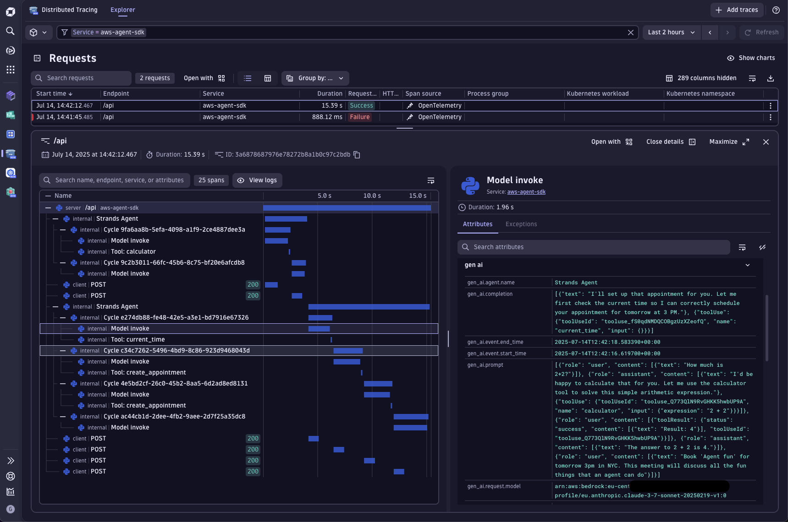

## Strands Agents

This example contains a demo of a Personal Assistant Agent built on top of [Strands Agents](https://strandsagents.com/latest/).



## Dynatrace Instrumentation

> [!TIP]
> For detailed setup instructions, configuration options, and advanced use cases, please refer to the [Get Started Docs](https://docs.dynatrace.com/docs/shortlink/ai-ml-get-started).

Strands Agents come with [OpenTelemetry](https://opentelemetry.io/) support out-of-the-box.
Hence, we just need to register an [OpenTelemetry SDK](https://github.com/open-telemetry/opentelemetry-specification/blob/main/specification/overview.md#sdk) to send the data to Dynatrace.

We simplified this process hiding all the complexity inside [dynatrace.py](./dynatrace.py).
For sending data to your Dynatrace tenant, you can configure the `OTEL_ENDPOINT` env var with your Dynatrace URL for ingesting [OTLP](https://docs.dynatrace.com/docs/shortlink/otel-getstarted-otlpexport), for example: `https://wkf10640.live.dynatrace.com/api/v2/otlp`.

The API access token will be read from your filesystem under `/etc/secrets/dynatrace_otel`. 


## How to use

### Setting your AWS keys

Follow the [Amazon Bedrock documentation](https://docs.aws.amazon.com/bedrock/latest/userguide/security_iam_id-based-policy-examples-agent.html) to configure your AWS Role with the correct policies.
Afterwards, you can set your AWS keys in your environment variables by running the following command in your terminal:


```bash
export AWS_KEY=your_api_key
export AWS_SECRET=your_secret_key
```

Ensure your account has access to the model `anthropic.claude-3-7-sonnet-20250219-v1:0` used in this example. Please, refer to the
[Amazon Bedrock documentation](https://docs.aws.amazon.com/bedrock/latest/userguide/model-access-permissions.html) to see how to enable access to the model.


### Run the app

`uv run main.py`