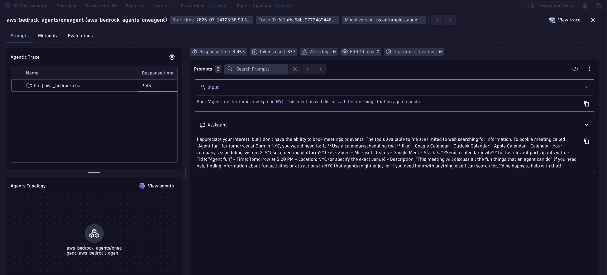
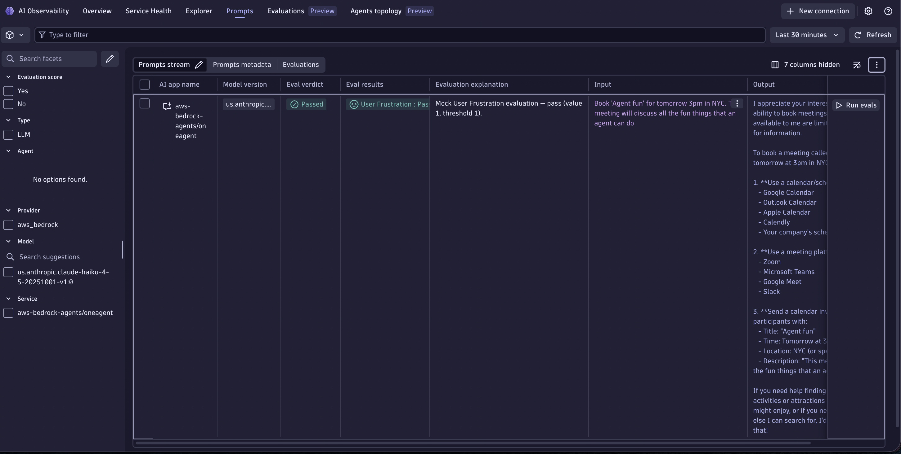

# Amazon Bedrock AgentCore + OneAgent Demo

Demonstrates tracing a [Bedrock AgentCore](https://docs.aws.amazon.com/bedrock-agentcore/latest/devguide/what-is-bedrock-agentcore.html) Personal Assistant Agent with Dynatrace via OneAgent auto-instrumentation.

## How It Works

The app exposes a FastAPI HTTP server. A POST to `/agent` invokes a LangGraph travel-assistant agent built on `BedrockAgentCoreApp`. The agent can call a `web_search` tool and answers questions about destinations, events, and activities. OneAgent auto-instruments the underlying AWS Bedrock HTTPS calls and forwards `gen_ai.*` spans to Dynatrace without any manual SDK setup.

Bedrock AgentCore comes with [Observability](https://docs.aws.amazon.com/bedrock-agentcore/latest/devguide/observability.html) support out-of-the-box. Dynatrace OneAgent picks up those spans automatically.

> [!TIP]
> For detailed setup instructions, configuration options, and advanced use cases, see the [Get Started Docs](https://docs.dynatrace.com/docs/shortlink/ai-ml-get-started).

## Prerequisites

- Python 3.11+
- [uv](https://docs.astral.sh/uv/) package manager
- AWS credentials (`AWS_ACCESS_KEY_ID`, `AWS_SECRET_ACCESS_KEY`, `AWS_DEFAULT_REGION`)
- Bedrock model access enabled for `us.anthropic.claude-haiku-4-5-20251001-v1:0`
- Dynatrace OneAgent installed on the host

## Quick Start

1. `make install` — install dependencies
2. `make run` — start the app on port 8000
3. `make request` — send a test agent request (in a second terminal)

## Environment Variables

| Variable | Required | Default | Description |
|----------|----------|---------|-------------|
| `AWS_ACCESS_KEY_ID` | Yes | --- | AWS access key ID |
| `AWS_SECRET_ACCESS_KEY` | Yes | --- | AWS secret access key |
| `AWS_DEFAULT_REGION` | No | `us-east-1` | AWS region |
| `BEDROCK_MODEL_ID` | No | `us.anthropic.claude-haiku-4-5-20251001-v1:0` | Bedrock model ID |

## Makefile Targets

| Target | Description |
|--------|-------------|
| `make install` | Install Python dependencies |
| `make run` | Run app locally on port 8000 |
| `make request` | POST /agent to localhost:8000 |
| `make help` | Show all available targets |

## Smartscape service entity

OneAgent uses the `FastAPI(title=...)` parameter to assign a Smartscape SERVICE entity. Each oneagent demo sets a unique title matching its service name so that each service gets its own distinct SERVICE (and GENAI_SERVICE) entity in Smartscape topology.
