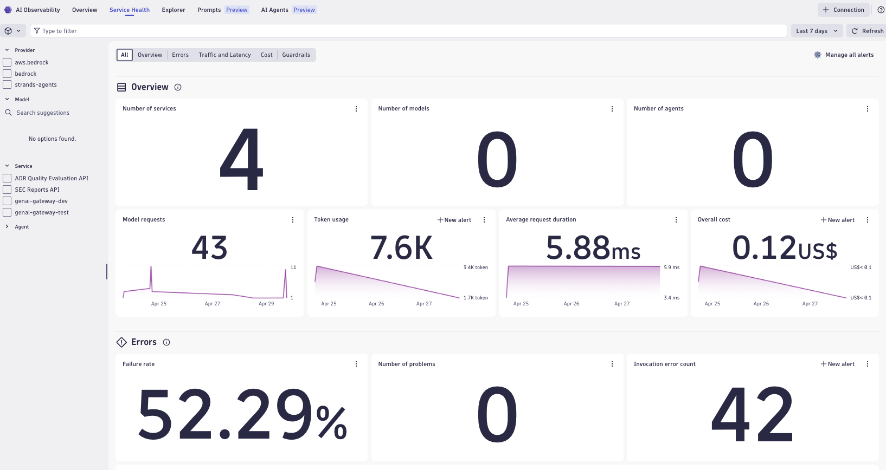

## AWS Bedrock Tracing

This example shows how to instrument [AWS Bedrock](https://aws.amazon.com/bedrock/) LLM calls with OpenTelemetry and route traces, metrics, and logs to Dynatrace.

Both the `Converse` and `Invoke` Bedrock APIs are covered, using the Boto3 client auto-instrumented via the [Traceloop SDK](https://www.traceloop.com/docs) and OpenTelemetry `BotocoreInstrumentor`. Traceloop enriches spans with `gen_ai.*` semantic conventions (model, token counts, finish reason) and the `@workflow`, `@task`, `@agent` decorators provide logical grouping in traces.



> [!TIP]
> For Dynatrace setup instructions, API token scopes, and advanced configuration, see the [AI Observability Get Started Docs](https://docs.dynatrace.com/docs/shortlink/ai-ml-get-started).

## Architecture

The example routes via a local [OpenTelemetry Collector](https://opentelemetry.io/docs/collector/), which forwards to Dynatrace. This is required because the Traceloop SDK exports over gRPC, while Dynatrace ingests OTLP over HTTP/protobuf.

```
Python app → OTel Collector (localhost:4318) → Dynatrace OTLP endpoint
```

## Signals

| Signal | How | Details |
|---|---|---|
| **Traces** | `BotocoreInstrumentor` + Traceloop | One span per Bedrock API call; includes model ID, token usage, finish reason via `gen_ai.*` attributes |
| **Metrics** | Traceloop (`should_enrich_metrics=True`) | OTel GenAI client metrics `gen_ai.client.token.usage` and `gen_ai.client.operation.duration`, used by the AI Observability app's cost and latency charts |
| **Logs** | `OTLPLogExporter` (HTTP) | Python `logging` bridged to OTel; correlated to the active trace span |

All spans are grouped into logical `@workflow` / `@task` / `@agent` spans via Traceloop decorators.

> [!IMPORTANT]
> Dynatrace OTLP metric ingest accepts **delta** temporality only and rejects cumulative metrics with HTTP 400. The app sets `OTEL_EXPORTER_OTLP_METRICS_TEMPORALITY_PREFERENCE=delta` before initializing Traceloop so the GenAI client metrics are accepted.

## Multi-agent turn: input/output correlation in the Prompts view

Agents that fan a single user turn out into several Bedrock calls (a router, one or more specialist agents, an LLM-as-judge) expose a correlation gap in the Prompts view. Traceloop stamps `gen_ai.*` on each **model-call** span, but not on the enclosing `@workflow` / `@agent` span. Because the Prompts view pairs input to output per `gen_ai` span, the intermediate calls produce half-rows (an input with no text output when the model returns a tool call, or an output with no user input when the input is a tool result), and no single span holds "user question to final answer".

`run_multiagent_turn()` in `main.py` reproduces this and demonstrates two fixes:

| Fix | Function | What it does |
|---|---|---|
| **Turn-level correlation** | `_stamp_turn_io()` | Stamps the whole turn onto the `@workflow` span so one clean `input -> output` record exists. Sets both the flat form (`gen_ai.prompt.0.*` / `gen_ai.completion.0.*`) the Prompts view reads today and the message form (`gen_ai.input.messages` / `gen_ai.output.messages`) from the Dynatrace semantic dictionary, plus `gen_ai.operation.name=chat`. |
| **Evaluation as a separate signal** | `evaluate_answer()` | Emits the judge verdict as a `gen_ai.evaluation` event through the OTLP logs pipeline instead of running it as a `converse` call. A judge run as a chat span is indistinguishable from a real reply and pollutes the Prompts/conversation view. In production, ingest this as a Dynatrace Business Event so it lands on the AI Observability Evaluations page. |

The router (`route_intent`) and specialist (`answer_agent`) calls still emit their own `gen_ai` spans, so you can see the internal steps alongside the single correct turn record on the `multiagent_turn` workflow span, and filter the internal steps out at the pipeline layer if desired.

## How to use

### Prerequisites

- Python 3.9+
- [uv](https://docs.astral.sh/uv/getting-started/installation/)
- AWS credentials configured (`aws configure` or environment variables) with Bedrock access in `us-east-1`
- A running [OpenTelemetry Collector](#opentelemetry-collector) forwarding to Dynatrace
- A Dynatrace environment with an API token that has the **`openTelemetryTrace.ingest`**, **`metrics.ingest`**, and **`logs.ingest`** scopes

### Install dependencies

```bash
make install
```

### Configure the OTel Collector

Add the following to your collector config to receive from the app and forward to Dynatrace:

```yaml
receivers:
  otlp:
    protocols:
      http:
        endpoint: 0.0.0.0:4318

exporters:
  otlphttp:
    endpoint: https://<YOUR_ENV_ID>.live.dynatrace.com/api/v2/otlp
    headers:
      Authorization: "Api-Token <YOUR_DT_TOKEN>"

service:
  pipelines:
    traces:
      receivers: [otlp]
      exporters: [otlphttp]
    logs:
      receivers: [otlp]
      exporters: [otlphttp]
```

After you saved your `config.yaml`, you can start the collector with
```bash
docker run \
  -p 127.0.0.1:4317:4317 \
  -p 127.0.0.1:4318:4318 \
  -p 127.0.0.1:55679:55679 \
  --mount type=bind,source="$(pwd)"/config.yaml,target=/config.yaml,readonly \
  -it \
  otel/opentelemetry-collector:0.151.0  \
  --config=/config.yaml
```

### Run

```bash
make run
```

The script runs continuously, calling both the Converse and Invoke APIs and the multi-agent turn every 5 seconds. Stop it with `Ctrl+C`.

To confirm the turn-level correlation, open the Prompts view and filter to service `bedrock_example_app`: the `multiagent_turn` workflow span appears as one row with the question as input and the answer as output, while `route_intent` and `answer_agent` remain separate internal rows and the evaluation stays out of the chat stream (in logs as `gen_ai.evaluation`).

### Verify in Dynatrace

```dql
fetch spans, from:now()-1h
| filter service.name == "bedrock_example_app"
| sort timestamp desc
| limit 50
```

## Files

| File | Description |
|---|---|
| `main.py` | Fully instrumented entrypoint; auto-instruments Boto3, sets up Traceloop, runs a continuous loop calling both APIs and a multi-agent turn that demonstrates turn-level input/output correlation and evaluation-as-a-separate-signal |
| `converse.py` | Minimal standalone example using the Converse API (no instrumentation) |
| `invoke.py` | Minimal standalone example using the Invoke API (no instrumentation) |
| `guard_rail_metrics.py` | Fetches Bedrock Guardrail metrics from CloudWatch (intervention count, latency, text units) |
