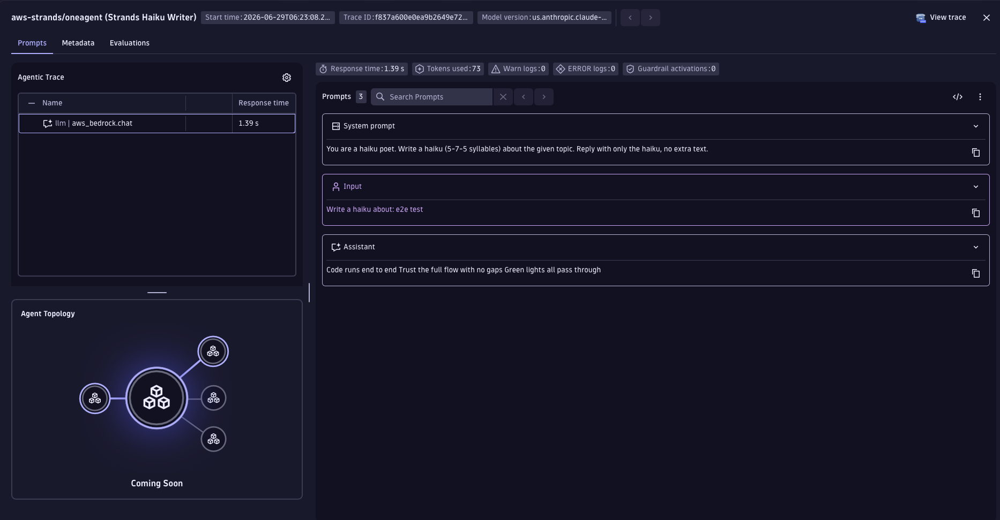

# AWS Strands Agents + OneAgent Demo

Demonstrates tracing [Strands Agents](https://strandsagents.com/) + AWS Bedrock API calls with Dynatrace via OneAgent auto-instrumentation.

## Prerequisites

- Python 3.12+
- [uv](https://docs.astral.sh/uv/) package manager
- AWS credentials (`AWS_ACCESS_KEY_ID`, `AWS_SECRET_ACCESS_KEY`, `AWS_DEFAULT_REGION`)
- Bedrock model access enabled in your AWS account
- Dynatrace OneAgent installed on the host

## Quick Start

1. Copy `.env.sample` to `.env` and fill in your credentials
2. `make install` — install dependencies
3. `make run` — start the app on port 8000
4. `make request` — send a test haiku request (in a second terminal)

## How It Works

The app exposes a FastAPI HTTP server. A POST to `/haiku` creates a Strands `Agent` backed by `BedrockModel` and asks it to write a haiku on the given topic. OneAgent auto-instruments the underlying Bedrock HTTPS calls and forwards `gen_ai.*` spans to Dynatrace without any manual SDK setup.

## Environment Variables

| Variable | Required | Default | Description |
|----------|----------|---------|-------------|
| `AWS_ACCESS_KEY_ID` | Yes | — | AWS access key ID |
| `AWS_SECRET_ACCESS_KEY` | Yes | — | AWS secret access key |
| `AWS_DEFAULT_REGION` | No | `us-east-1` | AWS region |
| `BEDROCK_MODEL_ID` | No | `us.anthropic.claude-haiku-4-5-20251001-v1:0` | Bedrock model ID |

## Makefile Targets

| Target | Description |
|--------|-------------|
| `make install` | Install Python dependencies |
| `make run` | Run app locally on port 8000 |
| `make build` | Build container image (`APP_IMAGE`, `BUILD_PLATFORM`) |
| `make push` | Build and push image to registry |
| `make request` | POST /haiku to localhost:8000 |
| `make help` | Show all available targets |
