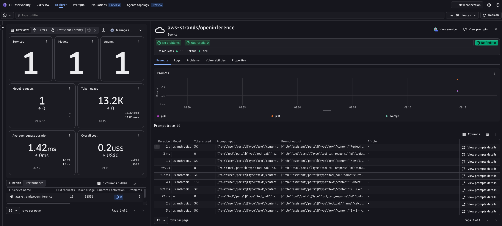
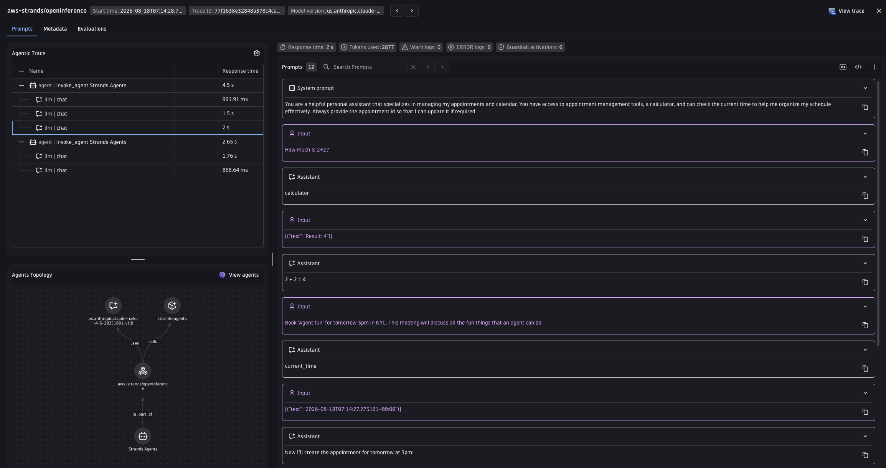

# AWS Strands Agents + OpenInference + Dynatrace AI Observability

Run a Personal Assistant Agent built on [Strands Agents](https://strandsagents.com/), add OpenInference's [`openinference-instrumentation-strands-agents`](https://pypi.org/project/openinference-instrumentation-strands-agents/) package, send the OpenTelemetry trace to Dynatrace, and see it in the **AI Observability** app.

> [!IMPORTANT]
> **This package works differently from every other `openinference/` example in this repo.** Elsewhere (`openai/openinference`, `aws-bedrock/openinference`, `langgraph/openinference`), the OpenInference instrumentor patches the SDK client so it emits **only** OpenInference's own `llm.*` attributes — a Collector transform or OpenPipeline rule is then required to translate those into `gen_ai.*` before Dynatrace can read them.
>
> Strands is different: it already has its own native OpenTelemetry integration that emits `gen_ai.*` attributes directly (see [`aws-strands/opentelemetry`](../opentelemetry)). `openinference-instrumentation-strands-agents` ships a [`SpanProcessor`](https://github.com/Arize-ai/openinference/blob/main/python/instrumentation/openinference-instrumentation-strands-agents/src/openinference/instrumentation/strands_agents/processor.py) — `StrandsAgentsToOpenInferenceProcessor` — that runs *after* Strands' own instrumentation and **mutates each span to add OpenInference `llm.*`/`tool.*`/`agent.*` attributes, without removing the `gen_ai.*` attributes Strands already set.** Both attribute sets coexist on the same span. That makes this example an interoperability demo (send one set of spans to both Dynatrace *and* an OpenInference-compliant backend like Arize Phoenix/AX) rather than a translation demo — see [Known gaps & limitations](#known-gaps--limitations).





---

## Table of contents

- [What you'll build](#what-youll-build)
- [Prerequisites](#prerequisites)
- [Setup](#setup)
- [Run the demo](#run-the-demo)
- [Visualize in Dynatrace AI Observability](#visualize-in-dynatrace-ai-observability)
- [Attribute mapping reference](#attribute-mapping-reference)
- [Metrics](#metrics)
- [Known gaps & limitations](#known-gaps--limitations)
- [Troubleshooting](#troubleshooting)

---

## What you'll build

- Runs a multi-turn Personal Assistant Agent using Strands Agents on Amazon Bedrock.
- Adds `StrandsAgentsToOpenInferenceProcessor` to the Strands tracer provider, so every span carries both Strands' native `gen_ai.*` attributes and OpenInference's `llm.*`/`tool.*`/`agent.*` attributes.
- Calls a small local **appointments service** from the `create_appointment` tool, so the tool call becomes a real downstream span and the trace spans two services. The Makefile starts and stops this service for you.
- Normalizes Strands' own `gen_ai.*` naming quirks (see [Attribute mapping reference](#attribute-mapping-reference)) via a local OTel Collector, the same transform used by [`aws-strands/opentelemetry`](../opentelemetry).
- Shows the full agentic trace in the Dynatrace AI Observability app, including tool calls, cycle spans, model invocations, token usage, and message content.

---

## Prerequisites

- A Dynatrace tenant — start a free trial at https://dt-url.net/trial
- Docker installed and running
- Python 3.12+
- [uv](https://docs.astral.sh/uv/getting-started/installation/)
- AWS credentials with Amazon Bedrock access (model `us.anthropic.claude-haiku-4-5-20251001-v1:0`)

---

## Setup

### 1. Set your AWS credentials

Follow the [Amazon Bedrock documentation](https://docs.aws.amazon.com/bedrock/latest/userguide/security_iam_id-based-policy-examples-agent.html) to configure your AWS role, then set them in `.env` (see step 3). Ensure your account has [model access](https://docs.aws.amazon.com/bedrock/latest/userguide/model-access-permissions.html) to `us.anthropic.claude-haiku-4-5-20251001-v1:0`.

### 2. Create a Dynatrace access token

1. In Dynatrace press `Ctrl+K` and search for **Access tokens**.
2. Create a token with these permissions:
   - `openTelemetryTrace.ingest`
   - `metrics.ingest`
3. Copy the token value.

### 3. Set environment variables

Create a `.env` file in this directory (the Makefile sources it automatically):

```bash
# .env
AWS_ACCESS_KEY_ID=your_access_key_id
AWS_SECRET_ACCESS_KEY=your_secret_access_key
AWS_DEFAULT_REGION=us-east-1
BEDROCK_MODEL_ID=us.anthropic.claude-haiku-4-5-20251001-v1:0   # optional, this is the default

DT_ENDPOINT=https://abc12345.live.dynatrace.com
DT_API_TOKEN=dt0c01.****.*****
```

> **Note:** `DT_ENDPOINT` is your base tenant URL — not the `/api/v2/otlp` path.

### 4. Install dependencies

```bash
make install
```

---

## Run the demo

```bash
App  ->  Strands SDK (native gen_ai.* + StrandsAgentsToOpenInferenceProcessor)  ->  OTel Collector (transform)  ->  Dynatrace Grail
```

```bash
make run
```

This starts the downstream appointments service, starts a local Bindplane OTel Collector on port `4318`, and runs the agent once. The collector's `transform/strands` processor normalizes Strands' own `gen_ai.*` naming (see [below](#attribute-mapping-reference)) and its `span_metrics`/`signaltometrics` connectors derive the GenAI client and agent-duration metrics, before forwarding everything to Dynatrace.

**Useful commands:**

```bash
make logs   # tail collector.log in real time
make stop   # stop the appointments service and the collector container
```

---

## Visualize in Dynatrace AI Observability

1. In Dynatrace press `Ctrl+K` and search for **AI Observability**.
2. Your agent run appears in the Explorer tab with model name, token usage, tool calls, and message content.
3. Open a span to inspect the full agentic trace across model invocations, tool calls, and cycle spans. The same span also carries the OpenInference `llm.*`/`tool.*`/`agent.*` attributes added by `StrandsAgentsToOpenInferenceProcessor`, viewable alongside the `gen_ai.*` ones in the span detail's attribute list.

---

## Attribute mapping reference

Everything below comes from Strands' own `gen_ai.*` naming quirks — the same normalization [`aws-strands/opentelemetry`](../opentelemetry) needs, with or without OpenInference in the mix. `StrandsAgentsToOpenInferenceProcessor` does not require any additional mapping of its own: it only *adds* the `llm.*`/`tool.*`/`agent.*` columns below, it never touches or removes the `gen_ai.*` ones.

| Strands source | Dynatrace target | Notes |
|---|---|---|
| `gen_ai.input.messages` | `gen_ai.input.messages` | Emitted directly as a span attribute via the `OTEL_SEMCONV_STABILITY_OPT_IN` opt-in in [`otel_setup.py`](./otel_setup.py); passed through |
| `gen_ai.output.messages` | `gen_ai.output.messages` | Emitted directly as a span attribute via the opt-in; passed through |
| `gen_ai.prompt` / `gen_ai.completion` | `gen_ai.input.messages` / `gen_ai.output.messages` | Legacy fallback only: mapped if a span still carries the pre-1.x names |
| `gen_ai.usage.prompt_tokens` | `gen_ai.usage.input_tokens` | Renamed to current OTel GenAI naming |
| `gen_ai.usage.completion_tokens` | `gen_ai.usage.output_tokens` | Renamed |
| _(mirrored from request model)_ | `gen_ai.response.model` | Strands does not emit a separate response model field |
| `gen_ai.provider.name` | `gen_ai.provider.name` | Emitted as `"strands-agents"` by Strands 1.x; passed through |
| `gen_ai.operation.name` | `gen_ai.operation.name` | Emitted natively: `chat` on model-invoke spans, `invoke_agent` on the agent span, `execute_tool` on tool spans; passed through |
| — | `openinference.span.kind` | Added by `StrandsAgentsToOpenInferenceProcessor`: `LLM`, `AGENT`, `TOOL`, or `CHAIN` depending on span name |
| `gen_ai.tool.name` | `llm.tool.name` (added), `gen_ai.tool.name` (unchanged) | Processor adds the OpenInference name alongside the existing one |
| `gen_ai.agent.name` | `gen_ai.agent.name` | Passed through unchanged |

---

## Metrics

Strands emits `gen_ai.*` span attributes and its own `strands.*` metrics, but not the OTel semconv metrics the AI Observability app charts. The collector re-creates four metrics from the spans, so the cost, latency, and agent tiles populate:

| Metric | Derived by |
|---|---|
| `gen_ai.client.operation.duration` (s) | `span_metrics` connector, on `chat` spans |
| `gen_ai.client.token.usage` (`gen_ai.token.type` = `input`/`output`) | `signaltometrics` connector, two sum defs |
| `gen_ai.invoke_agent.duration` (s) | `span_metrics` connector, on `invoke_agent` spans |
| `gen_ai.execute_tool.duration` (s) | `span_metrics` connector, on `execute_tool` spans |

`gen_ai.client.token.usage` needs the `signaltometrics` connector, which ships in the **Bindplane** collector (`ghcr.io/observiq/bindplane-agent`) but **not** in the Dynatrace collector distro — this is why the Makefile pins the Bindplane image. Requires the token's `metrics.ingest` scope. All metrics use delta temporality (Dynatrace rejects cumulative).

The two agent duration metrics need no application change: Strands already sets `gen_ai.operation.name` to `invoke_agent` on the agent span and `execute_tool` on the tool span, so each metric is a `span_metrics` instance fed by a `filter` processor that keeps only that span type.

**`gen_ai.invoke_workflow.duration` is deliberately not emitted** — Strands has no workflow primitive, so there is no span this demo could honestly derive a workflow duration from. See the [`microsoft-agent-framework`](../../microsoft-agent-framework/opentelemetry) demo for a framework that does have real workflow spans.

---

## Known gaps & limitations

### This is an interoperability demo, not a translation demo

Unlike every other `openinference/` folder in this repo, adding `StrandsAgentsToOpenInferenceProcessor` does not change what Dynatrace sees — Strands already emits `gen_ai.*` natively, and the processor is purely additive (it mutates spans in-place per the package's own docs, but only to *add* `llm.*`/`tool.*`/`agent.*`, never to remove `gen_ai.*`). The value of adding it here is being able to export the *same* spans to an OpenInference-compliant backend (Arize Phoenix/AX) at the same time you export to Dynatrace, not making Strands spans readable by Dynatrace — they already were.

### Processor ordering matters

`StrandsAgentsToOpenInferenceProcessor` mutates spans in `on_end()`. Per its own docs, it must be registered on the tracer provider *before* the exporter's span processor, or the exporter may see the span before the OpenInference attributes are added. [`otel_setup.py`](./otel_setup.py) adds it before calling `setup_otlp_exporter()` to guarantee this ordering.

### Message-content extraction only covers events / legacy attributes

`StrandsAgentsToOpenInferenceProcessor`'s message reconstruction (`llm.input_messages.*` / `llm.output_messages.*`) reads span *events* or the legacy `gen_ai.prompt`/`gen_ai.completion` attributes. This demo configures Strands with `OTEL_SEMCONV_STABILITY_OPT_IN=gen_ai_latest_experimental,gen_ai_span_attributes_only` (so Dynatrace gets `gen_ai.input.messages`/`gen_ai.output.messages` as span attributes — see [`aws-strands/opentelemetry`](../opentelemetry)'s README for why), which means neither path fires: the processor's own `llm.input_messages.*`/`llm.output_messages.*` attributes are not populated in this configuration. This does not affect Dynatrace, which reads `gen_ai.input.messages`/`gen_ai.output.messages` directly; it only means the OpenInference-side message reconstruction is incomplete if you also point these spans at Phoenix/AX.

### Bedrock guardrails not configured

`gen_ai.bedrock.guardrail.*` attributes are not emitted because this demo does not configure Bedrock guardrails.

---

## Troubleshooting

**No spans in Dynatrace:**
- Confirm `DT_ENDPOINT` and `DT_API_TOKEN` are correctly set.
- Confirm the token has `openTelemetryTrace.ingest` permission.
- Check collector logs with `make logs`.

**Collector crashes on startup:**
- Run `docker ps -a` and `docker logs otel-collector` to see the error.
- Confirm Docker is running and port `4318` is free: `lsof -i :4318`.

**Spans in Distributed Tracing but not in AI Observability:**
- AI Observability requires `gen_ai.provider.name` to be set; Strands sets this natively as `"strands-agents"`.
- Confirm the collector started with `otel-collector-config.yaml` and check `make logs` for the transform running.

**Port conflict:**
- Ensure nothing else is listening on `4318`: `lsof -i :4318`.

**Appointments service fails to start / tool call is refused:**
- The `create_appointment` tool calls a local appointments service on port `8081`, started automatically by `make run`.
- Ensure port `8081` is free: `lsof -i :8081`.
- Check the service log with `cat appointments.log`.
- Stop a stale instance with `make stop` (also removes the collector).
