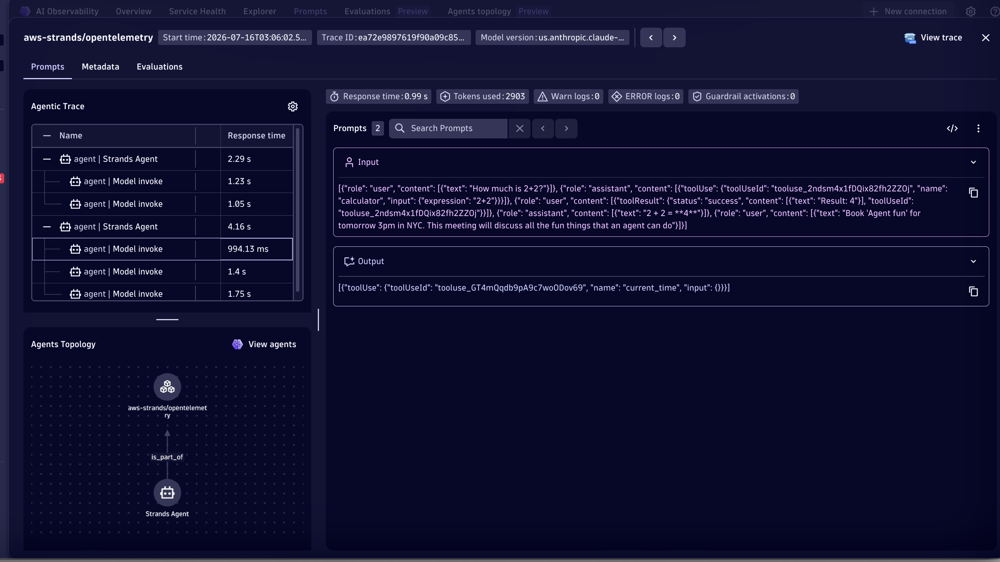
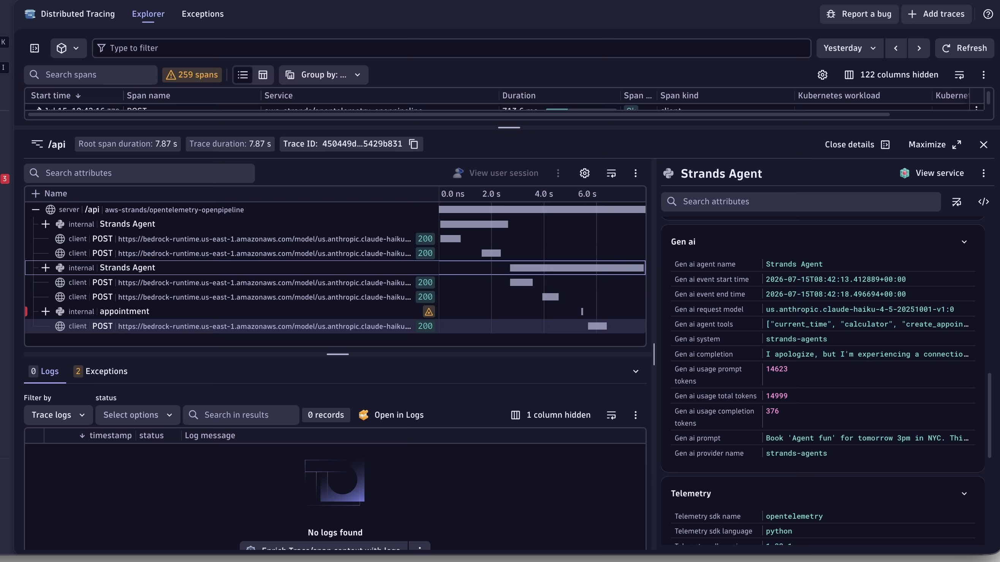
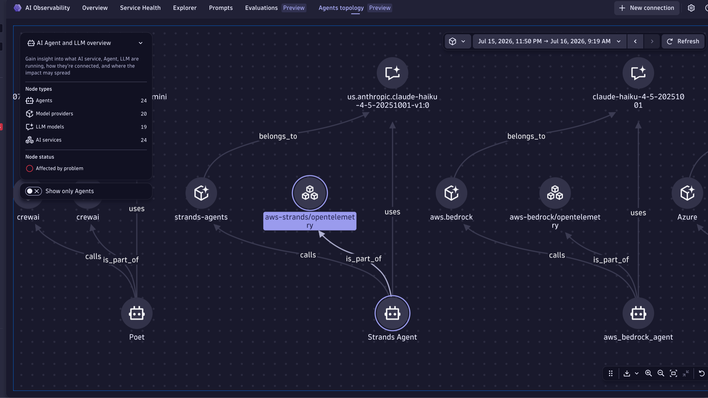

# AWS Strands Agents + Dynatrace AI Observability

Run a Personal Assistant Agent built on [Strands Agents](https://strandsagents.com/), send traces to Dynatrace, and see them in the **AI Observability** app.
Strands Agents does not follow the OpenTelemetry GenAI semantic conventions for message content: instead of emitting `gen_ai.input.messages` / `gen_ai.output.messages` as span attributes it uses non-standard names (`gen_ai.prompt`, `gen_ai.completion`). This example shows two ways to normalize them into the correct `gen_ai.*` format before they reach Dynatrace.

> ⚠️ **Do not set `OTEL_SEMCONV_STABILITY_OPT_IN=gen_ai_latest_experimental`.** When this flag is set, Strands moves message content out of span attributes entirely and into OTel log events — a format not yet supported by the normalization pipeline or the AI Observability app. Leave this variable unset.







---

## Table of contents

- [What you'll build](#what-youll-build)
- [Prerequisites](#prerequisites)
- [Configuration options](#configuration-options)
- [Setup](#setup)
- [Option A — OTel Collector with transform processor](#option-a--otel-collector-with-transform-processor)
- [Option B — Dynatrace OpenPipeline](#option-b--dynatrace-openpipeline)
- [Visualize in Dynatrace AI Observability](#visualize-in-dynatrace-ai-observability)
- [Attribute mapping reference](#attribute-mapping-reference)
- [Troubleshooting](#troubleshooting)

---

## What you'll build

- Runs a multi-turn Personal Assistant Agent using Strands Agents on Amazon Bedrock.
- Produces OpenTelemetry traces with Strands semantic conventions (`gen_ai.prompt`, `gen_ai.completion`, etc.).
- Normalizes Strands attributes to Dynatrace `gen_ai.*` format — either via a local OTel Collector or via Dynatrace OpenPipeline.
- Shows the full agentic trace in the Dynatrace AI Observability app including tool calls, cycle spans, model invocations, token usage, and message content.

---

## Prerequisites

- A Dynatrace tenant — start a free trial at https://dt-url.net/trial
- Docker installed and running (Option A only)
- Python 3.11+
- AWS credentials with Amazon Bedrock access (model `us.anthropic.claude-haiku-4-5-20251001-v1:0`)

---

## Configuration options

Strands Agents uses its own span attribute conventions that the Dynatrace AI Observability app does not natively understand. Two equivalent approaches normalize the attributes:

|  | Option A — OTel Collector | Option B — OpenPipeline |
|---|---|---|
| **Where transforms run** | In the collector process, before ingest | Server-side, in your Dynatrace tenant |
| **Requires Docker** | Yes | No |
| **Requires Dynatrace config** | No | Yes — one-time deploy |
| **Good for** | Full control over the pipeline, works anywhere you can run a collector | Simpler ops — no collector to manage |
| **Make target** | `make run` | `make run-openpipeline` (deploy once first) |

Both paths produce identical results in the AI Observability app.

---

## Setup

### 1. Set your AWS credentials

Follow the [Amazon Bedrock documentation](https://docs.aws.amazon.com/bedrock/latest/userguide/security_iam_id-based-policy-examples-agent.html) to configure your AWS role, then export:

```bash
export AWS_ACCESS_KEY_ID=your_access_key_id
export AWS_SECRET_ACCESS_KEY=your_secret_access_key
export AWS_DEFAULT_REGION=us-east-1
```

Ensure your account has access to `us.anthropic.claude-haiku-4-5-20251001-v1:0`. Refer to the
[Amazon Bedrock documentation](https://docs.aws.amazon.com/bedrock/latest/userguide/model-access-permissions.html) to enable model access.

### 2. Create a Dynatrace access token

1. In Dynatrace press `Ctrl+K` and search for **Access tokens**.
2. Create a token with these permissions:
   - `openTelemetryTrace.ingest`
   - `metrics.ingest`
3. Copy the token value.

### 3. Set environment variables

Create a `.env` file in this directory (the Makefile sources it automatically):

```bash
# .env
DT_ENDPOINT=https://abc12345.live.dynatrace.com
DT_API_TOKEN=dt0c01.****.*****
```

> **Note:** `DT_ENDPOINT` is your base tenant URL — not the `/api/v2/otlp` path.

### 4. Install dependencies

```bash
make install
```

---

## Option A — OTel Collector with transform processor

The OTel Collector intercepts spans and applies all Strands → `gen_ai.*` attribute mappings before forwarding to Dynatrace. No Dynatrace configuration needed.

```
App  →  Strands SDK (OTLP export)  →  OTel Collector (transform processor)  →  Dynatrace Grail
```

```bash
make run
```

The collector listens on port `4318`. The `transform/strands` processor remaps non-standard Strands attributes to `gen_ai.*` before forwarding to Dynatrace.

**Useful commands:**

```bash
make logs   # tail collector.log in real time
make stop   # stop and remove the collector container
```

---

## Option B — Dynatrace OpenPipeline

OpenPipeline applies the same attribute mappings server-side. The app sends spans directly to Dynatrace — no collector needed.

```
App  →  Strands SDK (OTLP export)  →  Dynatrace OpenPipeline (transform)  →  Dynatrace Grail
```

### Step 1 — Deploy the OpenPipeline configuration

This is a one-time setup per tenant.

1. In Dynatrace press `Ctrl+K` and search for **OpenPipeline**.
2. Select **Spans**.
3. Click **Add pipeline**, name it `strands-agents-ai-spans`, and add the processors from [`openpipeline-strands.yaml`](./openpipeline-strands.yaml).
4. Go to the **Routing** tab and add an entry:
   - Matcher: `isNotNull(gen_ai.prompt) AND gen_ai.system == "strands-agents"`
   - Pipeline: `strands-agents-ai-spans`

### Step 2 — Run the app

```bash
make run-openpipeline
```

---

## Visualize in Dynatrace AI Observability

1. In Dynatrace press `Ctrl+K` and search for **AI Observability**.
2. Your agent run appears in the Explorer tab with model name, token usage, tool calls, and message content.
3. Open a span to inspect the full agentic trace across model invocations, tool calls, and cycle spans.

---

## Attribute mapping reference

| Strands source | Dynatrace target | Notes |
|---|---|---|
| `gen_ai.prompt` | `gen_ai.input.messages` | Non-standard Strands attr; renamed to OTel GenAI convention |
| `gen_ai.completion` | `gen_ai.output.messages` | Non-standard Strands attr; renamed |
| `gen_ai.usage.prompt_tokens` | `gen_ai.usage.input_tokens` | Renamed to current OTel GenAI naming |
| `gen_ai.usage.completion_tokens` | `gen_ai.usage.output_tokens` | Renamed |
| _(mirrored from request model)_ | `gen_ai.response.model` | Strands does not emit a separate response model field |
| _(derived from Bedrock model ID)_ | `gen_ai.provider.name` | Inferred from model ID prefix: `anthropic`, `amazon`, `meta`, `cohere`, `mistral` |
| `span.name` | `gen_ai.operation.name` / `gen_ai.operation.kind` | `"Model invoke"` → kind `task`, name `chat`; `"Tool: <n>"` → kind `tool`; `"Cycle <n>"` → kind `task`; agent span → kind `agent` |
| `tool.name` | `gen_ai.tool.name` | OpenPipeline only |
| `tool.parameters` | `gen_ai.tool.call.arguments` | OpenPipeline only |
| `gen_ai.agent.name` | `gen_ai.agent.name` | Passed through; non-namespaced `agent.name` copy removed |
| _(hardcoded)_ | `ai.observability.source = "strands-agents"` | Set on all Strands spans (OpenPipeline only) |

---

## Troubleshooting

**No spans in Dynatrace:**
- Confirm `DT_ENDPOINT` and `DT_API_TOKEN` are correctly set.
- Confirm the token has `openTelemetryTrace.ingest` permission.
- Option A: check collector logs with `make logs`.
- Option B: run `uv run python3 main.py` with env vars set — any auth error appears in the console.

**Collector crashes on startup (Option A):**
- Run `docker ps -a` and `docker logs otel-collector` to see the error.
- Confirm Docker is running and port `4318` is free: `lsof -i :4318`.

**Spans in Distributed Tracing but not in AI Observability:**
- AI Observability requires `gen_ai.provider.name` to be set — added by the transform processor / OpenPipeline.
- Option A: confirm the collector started with `otel-collector-config.yaml`.
- Option B: confirm the OpenPipeline routing entry is active — matcher `isNotNull(gen_ai.prompt) AND gen_ai.system == "strands-agents"`, pipeline `strands-agents-ai-spans`.

**Port conflict (Option A):**
- Ensure nothing else is listening on `4318`: `lsof -i :4318`.
