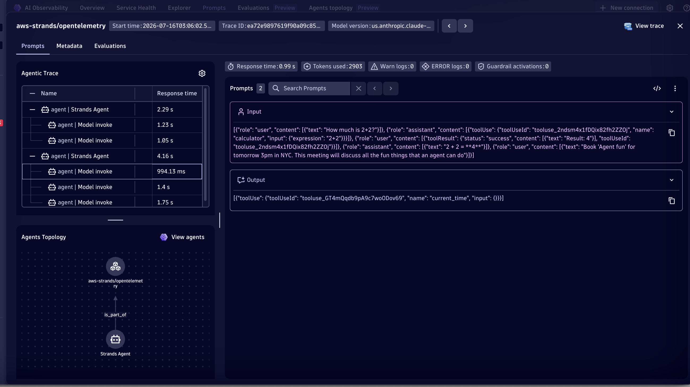
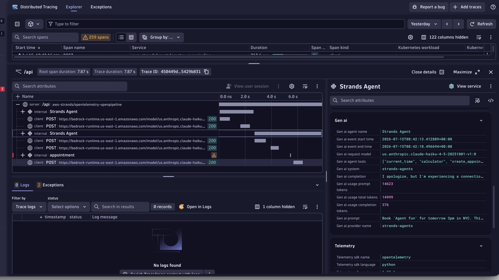
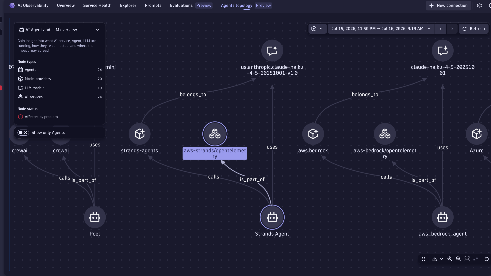

# AWS Strands Agents + Dynatrace AI Observability

Run a Personal Assistant Agent built on [Strands Agents](https://strandsagents.com/), send traces to Dynatrace, and see them in the **AI Observability** app.
With the opt-in configured in [`dynatrace.py`](./dynatrace.py) (see the note below), Strands 1.x emits message content as `gen_ai.input.messages` / `gen_ai.output.messages` span attributes. Its remaining span attributes (operation name and kind, provider, response model, tool fields) still differ from what the Dynatrace AI Observability app expects. This example shows two ways to normalize those attributes into the correct `gen_ai.*` format before they reach Dynatrace.

> ℹ️ **Message content requires `OTEL_SEMCONV_STABILITY_OPT_IN=gen_ai_latest_experimental,gen_ai_span_attributes_only`.** Strands 1.x emits message content as OTel span events by default, which the AI Observability app does not read. This example sets both tokens in [`dynatrace.py`](./dynatrace.py) so Strands records `gen_ai.input.messages` / `gen_ai.output.messages` directly as span attributes. `gen_ai_span_attributes_only` is what forces span attributes instead of events; do not set `gen_ai_latest_experimental` on its own.







---

## Table of contents

- [What you'll build](#what-youll-build)
- [Prerequisites](#prerequisites)
- [Configuration options](#configuration-options)
- [Setup](#setup)
- [Option A: Bindplane Collector with transform processor](#option-a-bindplane-collector-with-transform-processor)
- [Option B: Dynatrace OpenPipeline](#option-b-dynatrace-openpipeline)
- [Visualize in Dynatrace AI Observability](#visualize-in-dynatrace-ai-observability)
- [Attribute mapping reference](#attribute-mapping-reference)
- [Metrics](#metrics)
- [Troubleshooting](#troubleshooting)

---

## What you'll build

- Runs a multi-turn Personal Assistant Agent using Strands Agents on Amazon Bedrock.
- Produces OpenTelemetry traces with `gen_ai.*` attributes, including `gen_ai.input.messages` / `gen_ai.output.messages` message content (via the `OTEL_SEMCONV_STABILITY_OPT_IN` opt-in).
- Calls a small local **appointments service** from the `create_appointment` tool, so the tool call becomes a real downstream span and the trace spans two services. The Makefile starts and stops this service for you.
- Normalizes Strands attributes to Dynatrace `gen_ai.*` format; either via a local Bindplane Collector or via Dynatrace OpenPipeline.
- Shows the full agentic trace in the Dynatrace AI Observability app including tool calls, cycle spans, model invocations, token usage, and message content.

> [!NOTE]
> This example uses `strands-agents` 1.x, which configures OpenTelemetry via `StrandsTelemetry` (`setup_otlp_exporter()` + `setup_meter()`) and requires the `opentelemetry-exporter-otlp-proto-http` package. Strands emits its own `strands.*` metrics (for example `strands.event_loop.input.tokens`), **not** the OTel semconv `gen_ai.client.*` metrics the AI Observability app charts. Both options below re-create the two metrics the app needs — `gen_ai.client.token.usage` and `gen_ai.client.operation.duration` — from the Strands spans: Option A in the collector (`span_metrics` + `signaltometrics` connectors), Option B server-side in OpenPipeline (span-to-metric extraction). Both options additionally derive the `gen_ai.invoke_agent.duration` / `gen_ai.execute_tool.duration` agent metrics. See [Metrics](#metrics).

---

## Prerequisites

- A Dynatrace tenant; start a free trial at https://dt-url.net/trial
- Docker installed and running (Option A only)
- Python 3.11+
- AWS credentials with Amazon Bedrock access (model `us.anthropic.claude-haiku-4-5-20251001-v1:0`)

---

## Configuration options

Strands Agents uses its own span attribute conventions that the Dynatrace AI Observability app does not natively understand. Two equivalent approaches normalize the attributes:

|  | Option A: Bindplane Collector | Option B: OpenPipeline |
|---|---|---|
| **Where transforms run** | In the collector process, before ingest | Server-side, in your Dynatrace tenant |
| **Requires Docker** | Yes | No |
| **Requires Dynatrace config** | No | Yes; one-time deploy |
| **Good for** | Full control over the pipeline, works anywhere you can run a collector | Simpler ops; no collector to manage |
| **Make target** | `make run` | `make run-openpipeline` (deploy once first) |

Both paths produce identical results in the AI Observability app.

---

## Setup

### 1. Set your AWS credentials

Follow the [Amazon Bedrock documentation](https://docs.aws.amazon.com/bedrock/latest/userguide/security_iam_id-based-policy-examples-agent.html) to configure your AWS role, then export:

```bash
export AWS_ACCESS_KEY_ID=your_access_key_id
export AWS_SECRET_ACCESS_KEY=your_secret_access_key
export AWS_DEFAULT_REGION=us-east-1
```

Ensure your account has access to `us.anthropic.claude-haiku-4-5-20251001-v1:0`. Refer to the
[Amazon Bedrock documentation](https://docs.aws.amazon.com/bedrock/latest/userguide/model-access-permissions.html) to enable model access.

### 2. Create a Dynatrace access token

1. In Dynatrace press `Ctrl+K` and search for **Access tokens**.
2. Create a token with these permissions:
   - `openTelemetryTrace.ingest`
   - `metrics.ingest`
3. Copy the token value.

### 3. Set environment variables

Create a `.env` file in this directory (the Makefile sources it automatically):

```bash
# .env
DT_ENDPOINT=https://abc12345.live.dynatrace.com
DT_API_TOKEN=dt0c01.****.*****
```

> **Note:** `DT_ENDPOINT` is your base tenant URL; not the `/api/v2/otlp` path.

### 4. Install dependencies

```bash
make install
```

---

## Option A: Bindplane Collector with transform processor

The Bindplane Collector intercepts spans and applies all Strands → `gen_ai.*` attribute mappings before forwarding to Dynatrace, and derives the `gen_ai.client.*` and GenAI agent duration metrics from the spans. No Dynatrace configuration needed.

```
App  →  Strands SDK (OTLP export)  →  Bindplane Collector (transform + metric connectors)  →  Dynatrace Grail
```

```bash
make run
```

The collector listens on port `4318`. The `transform/strands` processor remaps non-standard Strands attributes to `gen_ai.*`, and the `span_metrics` / `signaltometrics` connectors derive the `gen_ai.client.*` and agent duration metrics (see [Metrics](#metrics)), before forwarding to Dynatrace. This demo runs the **Bindplane** collector image (`ghcr.io/observiq/bindplane-agent`).

**Useful commands:**

```bash
make logs   # tail collector.log in real time
make stop   # stop and remove the collector container
```

---

## Option B: Dynatrace OpenPipeline

OpenPipeline applies the same attribute mappings server-side. The app sends spans directly to Dynatrace; no collector needed.

```
App  →  Strands SDK (OTLP export)  →  Dynatrace OpenPipeline (transform)  →  Dynatrace Grail
```

### Step 1: Deploy the OpenPipeline configuration

This is a one-time setup per tenant.

1. In Dynatrace press `Ctrl+K` and search for **OpenPipeline**.
2. Select **Spans**.
3. Click **Add pipeline**, name it `strands-agents-ai-spans`, and add the processors from [`openpipeline-strands.yaml`](./openpipeline-strands.yaml).
4. Go to the **Routing** tab and add an entry:
   - Matcher: `gen_ai.provider.name == "strands-agents" AND service.name == "aws-strands/opentelemetry-openpipeline"`
   - The `service.name` half of the matcher is what keeps this pipeline off the collector run's spans; without it the metric extractors would double-derive the agent durations. See the header of [`openpipeline-strands.yaml`](./openpipeline-strands.yaml).
   - Pipeline: `strands-agents-ai-spans`

### Step 2: Run the app

```bash
make run-openpipeline
```

---

## Visualize in Dynatrace AI Observability

1. In Dynatrace press `Ctrl+K` and search for **AI Observability**.
2. Your agent run appears in the Explorer tab with model name, token usage, tool calls, and message content.
3. Open a span to inspect the full agentic trace across model invocations, tool calls, and cycle spans.

---

## Attribute mapping reference

| Strands source | Dynatrace target | Notes |
|---|---|---|
| `gen_ai.input.messages` | `gen_ai.input.messages` | Emitted directly as a span attribute via the `OTEL_SEMCONV_STABILITY_OPT_IN` opt-in; passed through |
| `gen_ai.output.messages` | `gen_ai.output.messages` | Emitted directly as a span attribute via the opt-in; passed through |
| `gen_ai.prompt` / `gen_ai.completion` | `gen_ai.input.messages` / `gen_ai.output.messages` | Legacy fallback only: mapped if a span still carries the pre-1.x names |
| `gen_ai.usage.prompt_tokens` | `gen_ai.usage.input_tokens` | Renamed to current OTel GenAI naming |
| `gen_ai.usage.completion_tokens` | `gen_ai.usage.output_tokens` | Renamed |
| _(mirrored from request model)_ | `gen_ai.response.model` | Strands does not emit a separate response model field |
| `gen_ai.provider.name` | `gen_ai.provider.name` | Emitted as `"strands-agents"` by Strands 1.x (latest conventions); passed through and used as part of the routing matcher, together with `service.name` |
| `span.name` | `gen_ai.operation.name` / `gen_ai.operation.kind` | `"Model invoke"` → kind `task`, name `chat`; `"Tool: <n>"` → kind `tool`; `"Cycle <n>"` → kind `task`; agent span → kind `agent` |
| `tool.name` | `gen_ai.tool.name` | OpenPipeline only |
| `tool.parameters` | `gen_ai.tool.call.arguments` | OpenPipeline only |
| `gen_ai.agent.name` | `gen_ai.agent.name` | Passed through; non-namespaced `agent.name` copy removed |
| _(hardcoded)_ | `ai.observability.source = "strands-agents"` | Set on all Strands spans (OpenPipeline only) |

---

## Metrics

Strands emits `gen_ai.*` span attributes and its own `strands.*` metrics, but not the OTel semconv metrics the AI Observability app charts. Both options re-create the two client metrics from the spans, so the cost and latency tiles populate either way; Option A additionally derives the GenAI agent duration metrics:

| Metric | Option A (collector) | Option B (OpenPipeline) |
|---|---|---|
| `gen_ai.client.operation.duration` (s) | `span_metrics` connector, on `chat` spans | `samplingAwareHistogramMetric` extractor on `duration_seconds` |
| `gen_ai.client.token.usage` (`gen_ai.token.type` = `input`/`output`) | `signaltometrics` connector, two sum defs | two `samplingAwareValueMetric` extractors, one per direction |
| `gen_ai.invoke_agent.duration` (s) | `span_metrics` connector, on `invoke_agent` spans | `samplingAwareHistogramMetric` extractor, on `invoke_agent ` spans |
| `gen_ai.execute_tool.duration` (s) | `span_metrics` connector, on `execute_tool` spans | `samplingAwareHistogramMetric` extractor, on `execute_tool ` spans |

**Option A** derives all four metrics in the collector. `gen_ai.client.token.usage` needs the `signaltometrics` connector, which ships in the **Bindplane** collector (`ghcr.io/observiq/bindplane-agent`) but **not** in the Dynatrace collector distro — this is why the Makefile pins the Bindplane image. Requires the token's `metrics.ingest` scope. All metrics use delta temporality (Dynatrace rejects cumulative).

The two agent duration metrics need no application change: Strands already sets `gen_ai.operation.name` to `invoke_agent` on the agent span and `execute_tool` on the tool span, so each metric is a `span_metrics` instance fed by a `filter` processor that keeps only that span type. Each instance also emits an undisableable `<namespace>.calls` counter, which a metrics `filter` drops by exact name before export.

**`gen_ai.invoke_workflow.duration` is deliberately not emitted.** Strands has no workflow primitive — its tracer only produces agent, chat, tool and event-loop-cycle spans — so there is no span this demo could honestly derive a workflow duration from. See the [`microsoft-agent-framework`](../../microsoft-agent-framework/opentelemetry) demo for a framework that does have real workflow spans. Likewise, the per-invocation call counts `gen_ai.invoke_agent.inference_calls` / `.tool_calls` are not emitted here: they are distributions over invocations, not span durations, so they cannot be derived at the collector at all.

**Option B** derives the two client metrics server-side from the ingested spans via the metric-extraction processors in [`openpipeline-strands.yaml`](openpipeline-strands.yaml) — no collector required. The token metric uses the two-extractor pattern (one extractor per direction, both writing `gen_ai.client.token.usage` with a constant `gen_ai.token.type` dimension). The agent and tool duration metrics are extracted here too, with the same dimensions the collector uses, so both options produce the same series.

---

## Troubleshooting

**No spans in Dynatrace:**
- Confirm `DT_ENDPOINT` and `DT_API_TOKEN` are correctly set.
- Confirm the token has `openTelemetryTrace.ingest` permission.
- Option A: check collector logs with `make logs`.
- Option B: run `uv run python3 main.py` with env vars set; any auth error appears in the console.

**Collector crashes on startup (Option A):**
- Run `docker ps -a` and `docker logs bindplane-collector` to see the error.
- Confirm Docker is running and port `4318` is free: `lsof -i :4318`.

**Spans in Distributed Tracing but not in AI Observability:**
- AI Observability requires `gen_ai.provider.name` to be set; added by the transform processor / OpenPipeline.
- Option A: confirm the collector started with `otel-collector-config.yaml`.
- Option B: confirm the OpenPipeline routing entry is active; matcher `gen_ai.provider.name == "strands-agents" AND service.name == "aws-strands/opentelemetry-openpipeline"`, pipeline `strands-agents-ai-spans`.

**Port conflict (Option A):**
- Ensure nothing else is listening on `4318`: `lsof -i :4318`.

**Appointments service fails to start / tool call is refused:**
- The `create_appointment` tool calls a local appointments service on port `8081`, started automatically by `make run` / `make run-openpipeline`.
- Ensure port `8081` is free: `lsof -i :8081`. Override it with `make run APPOINTMENTS_PORT=8082 APPOINTMENTS_URL=http://127.0.0.1:8082` if needed.
- Check the service log with `cat appointments.log`.
- Stop a stale instance with `make stop` (also removes the collector).
