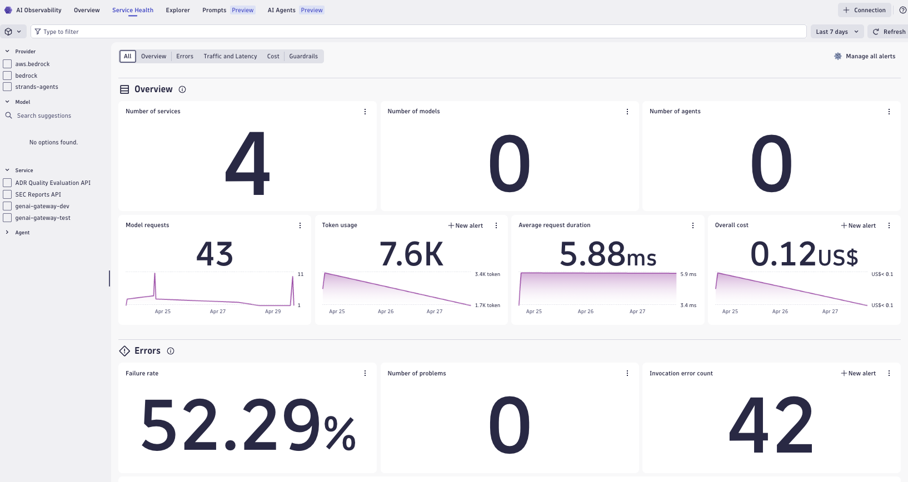

## AWS Bedrock Tracing

This example shows how to instrument [AWS Bedrock](https://aws.amazon.com/bedrock/) LLM calls with OpenTelemetry and route traces and logs to Dynatrace.

Both the `Converse` and `Invoke` Bedrock APIs are covered, using the Boto3 client auto-instrumented via the [Traceloop SDK](https://www.traceloop.com/docs) and OpenTelemetry `BotocoreInstrumentor`. Traceloop enriches spans with `gen_ai.*` semantic conventions (model, token counts, finish reason) and the `@workflow`, `@task`, `@agent` decorators provide logical grouping in traces.



> [!TIP]
> For Dynatrace setup instructions, API token scopes, and advanced configuration, see the [AI Observability Get Started Docs](https://docs.dynatrace.com/docs/shortlink/ai-ml-get-started).

## Architecture

The example routes via a local [OpenTelemetry Collector](https://opentelemetry.io/docs/collector/), which forwards to Dynatrace. This is required because the Traceloop SDK exports over gRPC, while Dynatrace ingests OTLP over HTTP/protobuf.

```
Python app → OTel Collector (localhost:4318) → Dynatrace OTLP endpoint
```

## Signals

| Signal | How | Details |
|---|---|---|
| **Traces** | `BotocoreInstrumentor` + Traceloop | One span per Bedrock API call — includes model ID, token usage, finish reason via `gen_ai.*` attributes |
| **Logs** | `OTLPLogExporter` (HTTP) | Python `logging` bridged to OTel; correlated to the active trace span |

All spans are grouped into logical `@workflow` / `@task` / `@agent` spans via Traceloop decorators.

## How to use

### Prerequisites

- Python 3.9+
- AWS credentials configured (`aws configure` or environment variables) with Bedrock access in `us-east-1`
- A running [OpenTelemetry Collector](#opentelemetry-collector) forwarding to Dynatrace
- A Dynatrace environment with an API token that has the **`openTelemetryTrace.ingest`** and **`logs.ingest`** scopes

### Install dependencies

```bash
python3 -m venv .venv
source .venv/bin/activate
pip install -r requirements.txt
```

### Configure the OTel Collector

Add the following to your collector config to receive from the app and forward to Dynatrace:

```yaml
receivers:
  otlp:
    protocols:
      http:
        endpoint: 0.0.0.0:4318

exporters:
  otlphttp:
    endpoint: https://<YOUR_ENV_ID>.live.dynatrace.com/api/v2/otlp
    headers:
      Authorization: "Api-Token <YOUR_DT_TOKEN>"

service:
  pipelines:
    traces:
      receivers: [otlp]
      exporters: [otlphttp]
    logs:
      receivers: [otlp]
      exporters: [otlphttp]
```

### Run

```bash
source .venv/bin/activate
python3 main.py
```

The script runs continuously, calling both the Converse and Invoke APIs every 5 seconds. Stop it with `Ctrl+C`.

### Verify in Dynatrace

```dql
fetch spans, from:now()-1h
| filter service.name == "bedrock_example_app"
| sort timestamp desc
| limit 50
```

## Files

| File | Description |
|---|---|
| `main.py` | Fully instrumented entrypoint — auto-instruments Boto3, sets up Traceloop, runs a continuous loop calling both APIs |
| `converse.py` | Minimal standalone example using the Converse API (no instrumentation) |
| `invoke.py` | Minimal standalone example using the Invoke API (no instrumentation) |
| `guard_rail_metrics.py` | Fetches Bedrock Guardrail metrics from CloudWatch (intervention count, latency, text units) |
