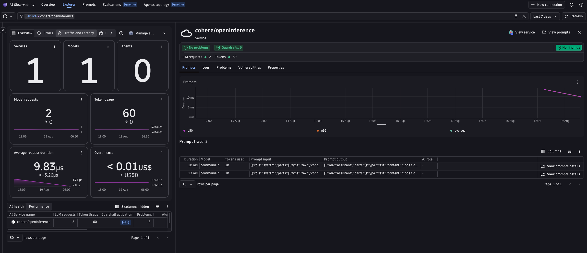
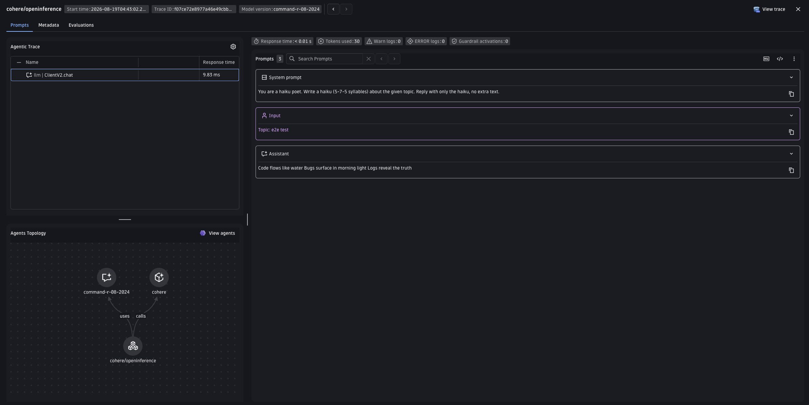

# Cohere + OpenInference Demo

Demonstrates tracing Cohere v2 chat API calls with Dynatrace via OpenInference instrumentation (`CohereInstrumentor`).
OpenInference uses its own semantic conventions (`llm.model_name`, `llm.token_count.*`, etc.) — this example shows two ways to normalize them into the Dynatrace `gen_ai.*` format: the Bindplane collector's `gen_ai_normalizer` processor, or Dynatrace OpenPipeline.

---

## Table of contents

- [Prerequisites](#prerequisites)
- [Configuration options](#configuration-options)
- [Setup](#setup)
- [Option A -- Bindplane collector with gen_ai_normalizer](#option-a----bindplane-collector-with-gen_ai_normalizer)
- [Option B -- Dynatrace OpenPipeline](#option-b----dynatrace-openpipeline)
- [Visualize in Dynatrace AI Observability](#visualize-in-dynatrace-ai-observability)
- [Attribute mapping reference](#attribute-mapping-reference)
- [Metrics](#metrics)
- [Known gaps & limitations](#known-gaps--limitations)
- [Troubleshooting](#troubleshooting)

---

## Prerequisites

- Python 3.11+
- [uv](https://docs.astral.sh/uv/getting-started/installation/)
- Docker installed and running (Option A only)
- A Cohere API key (`COHERE_API_KEY`)
- Dynatrace tenant with an API token scoped to `openTelemetryTrace.ingest`

---

## Configuration options

OpenInference uses its own semantic conventions that the Dynatrace AI Observability app does not natively understand. Two equivalent approaches normalize the attributes:

|  | Option A -- Bindplane collector | Option B -- OpenPipeline |
|---|---|---|
| **Where normalization runs** | In the collector process, via the `gen_ai_normalizer` processor | Server-side, in your Dynatrace tenant |
| **Requires Docker** | Yes | No |
| **Requires Dynatrace config** | No | Yes -- one-time deploy |
| **Make target** | `make run` | `make run-openpipeline` (deploy once first) |

> Why not the [Dynatrace Distribution of the OpenTelemetry Collector](https://docs.dynatrace.com/docs/extend-dynatrace/opentelemetry/collector) for Option A? Its manifest does include `genainormalizerprocessor`, but it does not ship a `signal_to_metrics`-equivalent connector, so the token-usage metric (`gen_ai.client.token.usage`) couldn't be derived — the same gap that led `openai/openinference`, `aws-bedrock/openinference`, and `langgraph/openinference` to pin the Bindplane collector instead. Option B has no such gap since the metric is extracted server-side.

Both paths surface the request in the AI Observability app.

---

## Setup

### 1. Create a Dynatrace access token

1. In Dynatrace press `Ctrl+K` and search for **Access tokens**.
2. Create a token with these permissions:
   - `openTelemetryTrace.ingest`
3. Copy the token value.

### 2. Set environment variables

The app and scripts read credentials from environment variables. The easiest way is to create a `.env` file in this directory (the Makefile sources it automatically):

```bash
# .env
DT_ENDPOINT=https://abc12345.live.dynatrace.com
DT_API_TOKEN=dt0c01.****.*****

COHERE_API_KEY=**********************
MODEL=command-r-08-2024                    # optional, defaults to command-r-08-2024
```

> **Note:** `DT_ENDPOINT` is your base tenant URL -- not the `/api/v2/otlp` path. Example: `https://abc12345.live.dynatrace.com`.

### 3. Install dependencies

```bash
make install
```

---

## Option A -- Bindplane collector with gen_ai_normalizer

The [Bindplane Distro for OpenTelemetry (BDOT)](https://github.com/observIQ/bindplane-otel-collector) collector intercepts spans and normalizes OpenInference attributes to `gen_ai.*` with its built-in `gen_ai_normalizer` processor before forwarding to Dynatrace. No Dynatrace configuration needed.

```
App  ->  Bindplane collector (gen_ai_normalizer + transform)  ->  Dynatrace Grail
```

This example pins the collector to `ghcr.io/observiq/bindplane-agent:1.105.1`. The pin means a future version bump surfaces normalization changes in the e2e test.

The app knows only about `http://localhost:4318` -- it sends spans to the collector, and the collector authenticates with Dynatrace using `DT_ENDPOINT` and `DT_API_TOKEN`.

The pipeline runs two processors (see [`otelcol-config.yaml`](otelcol-config.yaml)):

1. **`gen_ai_normalizer`** (source `openinference`, `remove_originals: true`) maps OpenInference attributes to `gen_ai.*` -- including `llm.provider` / `llm.system` (both set to `cohere` by `CohereInstrumentor`) to `gen_ai.provider.name`. `remove_originals` drops the raw `llm.*` attributes so exported spans carry only `gen_ai.*` fields.
2. **`transform/response_model`** mirrors `gen_ai.request.model` to `gen_ai.response.model`, which the AI Observability app requires and OpenInference has no separate field for.

### Run it

```bash
# with make (reads .env automatically, starts the collector then runs the app)
make run
```

Then, in a second terminal:

```bash
make request
```

**Useful commands:**

```bash
make logs   # tail collector.log in real time
make stop   # stop and remove the collector container
```

---

## Option B -- Dynatrace OpenPipeline

OpenPipeline is a server-side processing pipeline in Dynatrace that applies the same attribute mappings before spans are stored. The app sends spans directly to Dynatrace -- no collector needed.

```
App  ->  Dynatrace OpenPipeline (transform)  ->  Dynatrace Grail
```

### Step 1 -- Deploy the OpenPipeline configuration using the Dynatrace UI

This is a one-time setup per tenant.

1. In Dynatrace press `Ctrl+K` and search for **OpenPipeline**.
2. Select **Spans**.
3. Click **Add pipeline**, name it `cohere-openinference-ai-spans`, and add processors matching the definitions in [`openpipeline-openinference.yaml`](openpipeline-openinference.yaml).
4. Go to the **Routing** tab and add an entry:
    - Matcher: `isNotNull(openinference.span.kind) AND service.name == "cohere/openinference-openpipeline"`
    - Pipeline: `cohere-openinference-ai-spans`

> **Note:** OpenPipeline routing is first-match-wins, not fan-out. `isNotNull(openinference.span.kind)` alone (a span attribute set by every OpenInference instrumentor) would also match spans from any other OpenInference demo in this repo running on the same tenant -- e.g. `openai/openinference`'s `openinference-ai-spans` pipeline. Scoping the matcher with `service.name` (as above) keeps this demo's routing independent of whichever other OpenInference pipelines happen to be deployed -- the same pattern already used by this repo's other scoped routing entries (e.g. AWS Strands: `gen_ai.provider.name == "strands-agents" AND service.name == "aws-strands/opentelemetry-openpipeline"`).

### Step 2 -- Run the app

```bash
# with make (reads .env automatically)
make run-openpipeline

# or manually — leave OTEL_EXPORTER_OTLP_ENDPOINT unset; main.py's _otlp_exporter()
# then builds the authenticated $DT_ENDPOINT/api/v2/otlp request itself from
# DT_ENDPOINT/DT_API_TOKEN (setting it would route the app down the collector,
# no-auth branch of _otlp_exporter() instead)
source .env && uv run python3 -m uvicorn server:app --host 0.0.0.0 --port 8000
```

Then, in a second terminal:

```bash
make request
```

---

## Visualize in Dynatrace AI Observability

1. In Dynatrace press `Ctrl+K` and search for **AI Observability**.
2. Your haiku request appears in the Explorer tab, with model, token usage, and cost for the `cohere/openinference` service.
   
3. Open a prompt trace to inspect the request/response content and the agents topology graph.
   

---

## Attribute mapping reference

Both options apply the same translations; the collector's `gen_ai_normalizer` (source `openinference`) reconstructs the full conversation from indexed per-message attributes, while OpenPipeline uses an interim fallback (see [Known gaps & limitations](#known-gaps--limitations)).

| OpenInference source | Dynatrace target |
|---|---|
| `llm.token_count.prompt` | `gen_ai.usage.input_tokens` |
| `llm.token_count.completion` | `gen_ai.usage.output_tokens` |
| `llm.model_name` / `embedding.model_name` | `gen_ai.request.model` |
| `llm.provider` / `llm.system` (both `cohere`) | `gen_ai.provider.name` |
| `tool.name` / `tool.description` | `gen_ai.tool.name` / `gen_ai.tool.description` |
| `agent.name` | `gen_ai.agent.name` |
| `session.id` | `gen_ai.conversation.id` |
| `openinference.span.kind` | `gen_ai.operation.name` (`LLM`→`chat`, `EMBEDDING`→`embeddings`, `TOOL`→`execute_tool`, `AGENT`/`CHAIN`→`invoke_agent`, `RETRIEVER`→`retrieval`) |
| `llm.input_messages.N.*` / `llm.output_messages.N.*` | `gen_ai.input.messages` / `gen_ai.output.messages` |
| `llm.invocation_parameters` (JSON: `temperature`, `max_tokens`, `p`) | `gen_ai.request.temperature` / `gen_ai.request.max_tokens` / `gen_ai.request.top_p` |
| _(both options)_ | `gen_ai.response.model` (mirrored from `gen_ai.request.model`) |

`session.id` and `user.id` already match the OTel standard and pass through unchanged in both options.

> **Note on request parameters:** CohereInstrumentor never emits `llm.temperature` / `llm.max_tokens` / `llm.top_p` as discrete span attributes — it only sets a single `llm.invocation_parameters` JSON string. Option B's `openinference-request-params` processor parses that blob rather than renaming flat fields. It also reads Cohere's nucleus-sampling kwarg by its actual name, `p` — `cohere.v2.client.V2Client.chat()` has no `top_p` parameter at all — and maps it to the standard `gen_ai.request.top_p`. None of the three are passed by this demo's `main.py` today, so they won't appear on the spans behind the screenshots above; the mapping is groundwork for when a caller does pass them.

---

## Metrics

OpenInference is span-only by design (its instrumentors emit no metric instruments), so the two metrics the AI Observability app charts must be derived from the spans. Both options do this, so the cost and latency tiles populate either way:

| Metric | Option A (collector) | Option B (OpenPipeline) |
|---|---|---|
| `gen_ai.client.operation.duration` (s) | `span_metrics` connector, on LLM spans | `samplingAwareHistogramMetric` extractor on `duration_seconds` |
| `gen_ai.client.token.usage` (`gen_ai.token.type` = `input`/`output`) | `signal_to_metrics` connector, two sum defs | two `samplingAwareValueMetric` extractors, one per direction |

Both read the normalized `gen_ai.usage.input_tokens` / `gen_ai.usage.output_tokens` (mapped from OpenInference's `llm.token_count.*`). Both metrics use delta temporality -- Dynatrace rejects cumulative.

---

## Known gaps & limitations

### Attributes gen_ai_normalizer does not yet map (Option A)

The `gen_ai_normalizer` `openinference` source does not set the following attributes. They are optional for the AI Observability app, and are candidates for upstream contribution to the processor:

- `gen_ai.request.temperature` / `gen_ai.request.top_p` / `gen_ai.request.max_tokens`
- `gen_ai.response.finish_reasons`

To close these locally, add statements to the `transform` processor in [`otelcol-config.yaml`](otelcol-config.yaml). Option B (OpenPipeline) already maps these server-side by parsing them out of the `llm.invocation_parameters` JSON blob (see the note under [Attribute mapping reference](#attribute-mapping-reference)) — there's no equivalent flat attribute for the collector's `transform` processor to rename.

Prompt caching (`gen_ai.prompt_caching` / `gen_ai.cache.type`) is not applicable here — Cohere does not support prompt caching today.

### Full conversation message history (Option B)

Option A reconstructs the full message history via `gen_ai_normalizer`. Option B (OpenPipeline) cannot: DQL cannot iterate over the indexed per-message attributes (`llm.input_messages.0.message.role`, `llm.input_messages.1.message.role`, …) at transform time, so it copies the serialized conversation from `input.value` → `gen_ai.input.messages` as a fallback.

---

## Troubleshooting

**No spans in Dynatrace:**
- Confirm `DT_ENDPOINT` and `DT_API_TOKEN` are correctly set.
- Confirm the token has `openTelemetryTrace.ingest` permission.
- Option A: check collector logs with `make logs` or `docker logs bindplane-otel-collector`.
- Option B: run the app directly -- any auth error from Dynatrace will appear in the console output.

**Collector crashes on startup (Option A):**
- Run `docker ps -a` and `docker logs bindplane-otel-collector` to see the error.
- Confirm Docker is running and port `4318` is free: `lsof -i :4318`.

**Spans visible in Distributed Tracing but not in AI Observability:**
- AI Observability requires `gen_ai.provider.name` (or `gen_ai.system`) to be set on the span.
- Option A: confirm the `gen_ai_normalizer` processor ran -- the raw `llm.*` attributes should be gone and `gen_ai.*` attributes present in the collector debug output (`make logs`).
- Option B: confirm the OpenPipeline routing entry is active; go to **Settings -> OpenPipeline -> Spans** in Dynatrace and verify the `cohere-openinference-ai-spans` pipeline is enabled and the routing matcher is `isNotNull(openinference.span.kind)`.

**Port conflict (Option A):**
- Ensure nothing else is listening on `4318`: `lsof -i :4318`.
