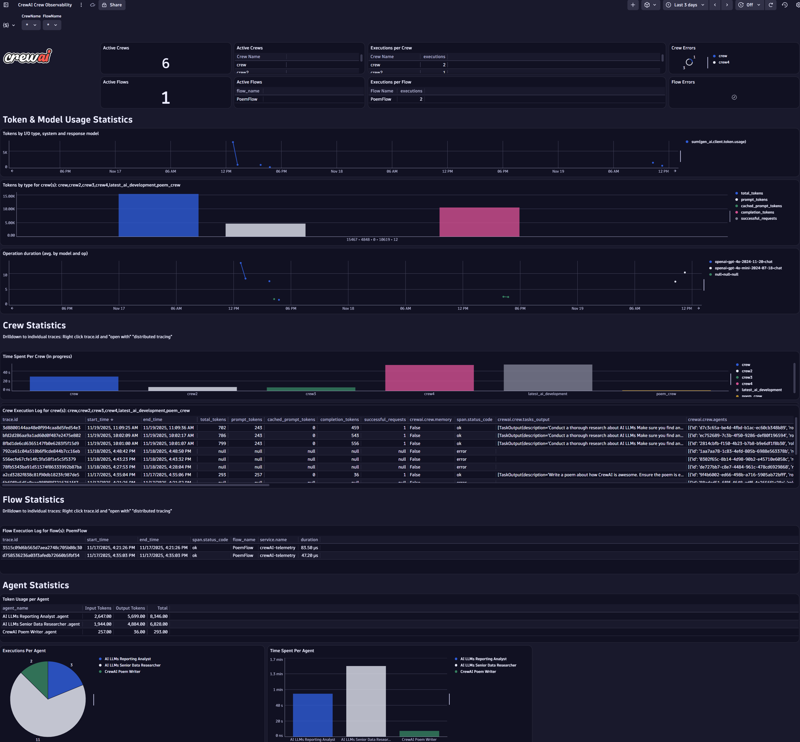
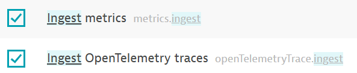
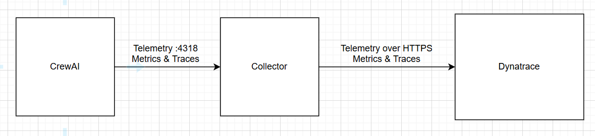

# Observe and monitor CrewAI with Dynatrace



This guide closely follows the [existing quickstart for creating a crew](https://docs.crewai.com/en/quickstart) and [this guide for creating a flow](https://docs.crewai.com/en/guides/flows/first-flow) for easier user understanding (you **do not** need a SERPer API Key).

* OpenLLMetry from Traceloop will be used to automatically instrument the GenAI calls and create the OpenTelemetry data we need
* This data will be sent to an OpenTelemetry collector (running locally) which gives us the opportunity to batch, filter, redact, enrich or otherwise process the telemetry before it hits Dynatrace
* The collector will be configured to send data to Dynatrace

### Hang on, what's a crew and what's a flow?

There are two main concepts you need to understand to get value out of this tutorial: crews and flows. Both are explained [here](https://docs.crewai.com/en/introduction) (go read this first and come back here).

With that in mind, we need to use Dynatrace to answer these questions:

* How many crews / flows do I have running?
* What are the names of the crews and flows?
* Which agents are in which crews / flows?
* Are my crews / flows failing?
* How many tokens am I consuming per crew / agent / flow / model?
* How much time is each agent taking to execute?
  
## Prerequisites
* You'll need a Dynatrace SaaS tenant
* CrewAI needs Python >=3.10 and <3.14. Run `python --version` to check

## Install CrewAI and OpenLLMetry

`pip install crewai traceloop-sdk`

or `pip install -r requirements.txt`

If you use UV instead, follow [these instructions](https://docs.crewai.com/en/installation).

## Upload Dynatrace Dashboard

* Download the [prebuilt CrewAI Dynatrace dashboard](CrewAI%20Observability.json) to your machine
* Open the Dynatrace dashboards app and go to upload. Upload the dashboard

## Dynatrace API Token



In Dynatrace:

* Press `ctrl + k` and search for `access tokens`
* Generate a new access token

Create a new API token with these permissions:

* `metrics.ingest`
* `openTelemetryTrace.ingest`

Now build your Dynatrace endpoint URL. It takes the form: `https://<EnvironmentID>.live.dynatrace.com`

For example:

```
https://abc12345.live.dynatrace.com
```

## Download and run an OpenTelemetry Collector



Any OTEL collector distribution will work. If you don't have one, consider the [Dynatrace collector](https://github.com/Dynatrace/dynatrace-otel-collector/releases).

Now run it (leave it running):
```
export DT_ENDPOINT=https://ENVIRONMENT_ID.live.dynatrace.com
export DT_API_TOKEN=dt0c01.*****.*****
./dynatrace-otel-collector --config=collector.config.yaml
```

The collector listens for incoming OTLP-formatted telemetry on 4318, transforms any `cumulative` metrics to `delta`, then exports metrics and traces to both `debug` (the collector console output - useful for debugging) and Dynatrace.

## Create a Crew and enable Telemetry

Following the quickstart, create a crew:

```
crewai create crew latest_ai_development --skip_provider
cd latest_ai_development
```

### Enable Telemetry

Open `latest_ai_development/pyproject.toml` and add `"traceloop-sdk"` to the `dependencies` array. It should look like this:

```
dependencies = [
    "crewai[tools]==1.5.0",
    "traceloop-sdk"
]
```

Create a `.env` file at the same level as `pyproject.toml` (`latest_ai_development/.env`) and populate with your LLM endpoint details like this:

```
MODEL=gpt-4o-mini
OPENAI_API_KEY=*********************
OPENAI_BASE_URL=https://api.openai.com/v1
```

Initialise Traceloop and point the telemetry to your collector. In `latest_ai_development/src/latest_ai_development/main.py` add two lines near the top of the file:

```
from traceloop.sdk import Traceloop
Traceloop.init(api_endpoint="http://localhost:4318", disable_batch=True, app_name="crewAI")
```

Note: batch exporting is disabled for this demo to force any data to be emitted immediately. In practice, you probably want to **enable** batching for efficiency.

The first few lines of `main.py` should look like this:

```
#!/usr/bin/env python
import sys
import warnings

from datetime import datetime

from latest_ai_development.crew import LatestAiDevelopment

from traceloop.sdk import Traceloop
Traceloop.init(api_endpoint="http://localhost:4318", disable_batch=True, app_name="crewAI")
```

Open `latest_ai_development/src/latest_ai_development/crew.py` and give your crew a name. It is this name that will populate the filters on the Dynatrace dashboard.

Scroll to line 58 and add a `name=""` value to the `Crew()` constructor:

```
return Crew(
            agents=self.agents, # Automatically created by the @agent decorator
            tasks=self.tasks, # Automatically created by the @task decorator
            process=Process.sequential,
            verbose=True,
            # process=Process.hierarchical, # In case you wanna use that instead https://docs.crewai.com/how-to/Hierarchical/
            name="latest_ai_development"
        )
```

## Recap

At this point, you should have:
* Created 1 new file: `.env` to hold your LLM model, API endpoints and key
* Modified 2 files: `main.py` (to import and configure Traceloop) and `crew.py` (to give your crew a name)

## Run the crew

Finally, it's time to run the crew!

Make sure you're in the topmost `latest_ai_development` directory then:

```
crewai run
```

You should see data being printed in the collector terminal.

-----------------------------

## Create and run a flow

Let's repeat the process to run a flow. Change directory back to the root and create a new flow called `poem_creator_flow`.

This is a predefined workflow to create a Poem.

```
cd ..
crewai create flow poem_creator_flow
```

This flow already comes with a crew (see `src/poem_creator_flow/crews/poem_crew`).

### Setting up the flow and env vars

Repeat the same steps as before to set the env vars and give your flow a name:

Add your details to `poem_creator_flow/.env`:

```
MODEL=gpt-4o
OPENAI_API_KEY=****************
OPENAI_BASE_URL=https://api.openai.com/v1
```

Add `traceloop-sdk` to the dependencies in `poem_creator_flow/pyproject.toml`:

```
dependencies = [
    "crewai[tools]==1.5.0",
    "traceloop-sdk"
]
```

Add Traceloop to `poem_creator_flow/src/main.py`:
```
#!/usr/bin/env python
from random import randint

from pydantic import BaseModel

from crewai.flow import Flow, listen, start

from poem_creator_flow.crews.poem_crew.poem_crew import PoemCrew
from traceloop.sdk import Traceloop
Traceloop.init(api_endpoint="http://localhost:4318", app_name="crewAI")

from poem_creator_flow.crews.poem_crew.poem_crew import PoemCrew
```

As before, give your crew a name by modifying the `Crew()` constructor in `poem_creator_flow/src/poem_creator_flow/crews/poem_crew/poem_crew.py`.

Add the `name="poem_crew"` argument to the `Crew()` constructor.

The return statement should look like this:

```
return Crew(
            agents=self.agents,  # Automatically created by the @agent decorator
            tasks=self.tasks,  # Automatically created by the @task decorator
            process=Process.sequential,
            verbose=True,
            name="poem_crew"
        )
```

## Run the flow

Navigate back to the root directory then into the topmost `poem_creator_flow` directory then run the flow:

```
crewai flow kickoff
```

## Investigate your crew / usage using the Dashboard

After a few minutes, refresh the Dynatrace dashboard and you should see it being populated.

Explore the way your crews run, which models are used, how your token usage is attributed and which agents are spending the most time active.

Leverage the dashboard filters to filter (some) tiles to show data for only selected crews or flows.

Remember that you can drilldown into the end-to-end trace whenever a `trace.id` is shown. Just right click the trace ID and "open with" `Distributed Tracing".

You can also open the Dynatrace `Distributed Tracing` view and filter for `"Service name" = crewAI-telemetry`


