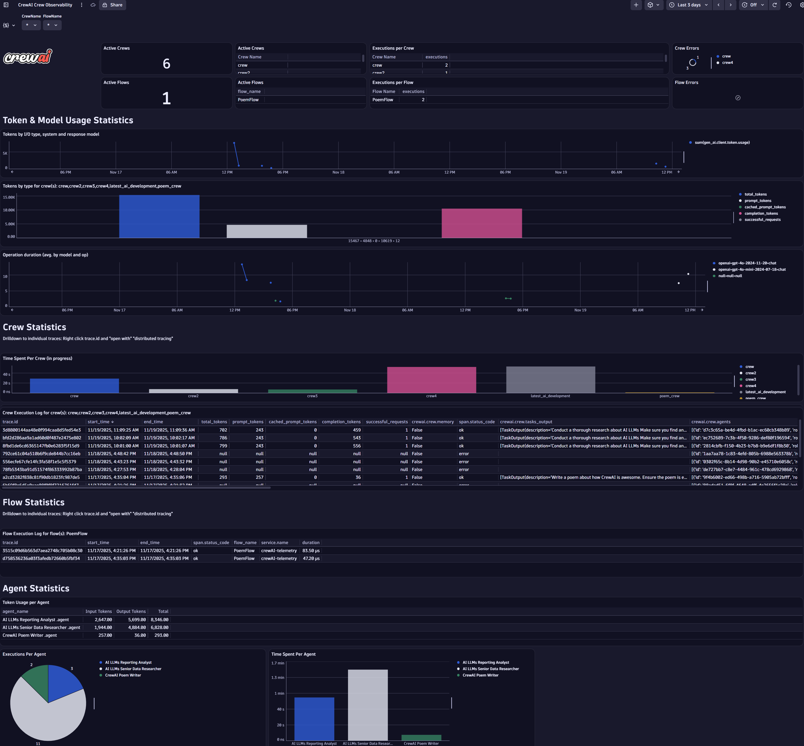
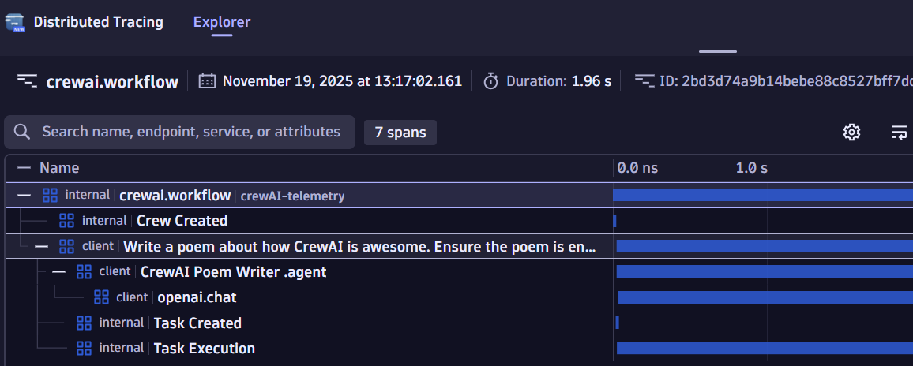
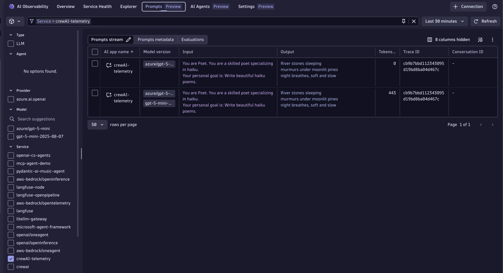
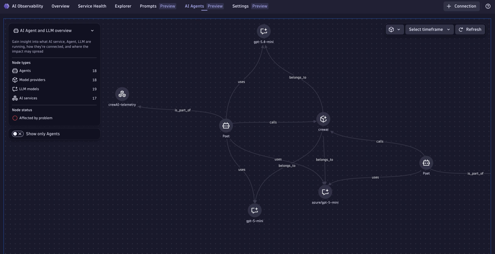

# CrewAI + Dynatrace

This sample instruments a [CrewAI](https://docs.crewai.com) agent with Dynatrace using [OpenLLMetry](https://github.com/traceloop/openllmetry) (Traceloop SDK) — no separate OpenTelemetry collector required.

## What this sample does

- Runs a FastAPI server exposing `POST /haiku`
- Each request spins up a CrewAI `Poet` agent that writes a haiku using Azure OpenAI
- Exports traces and metrics directly to Dynatrace via OTLP HTTP

## Prerequisites

- Python 3.10+
- [uv](https://docs.astral.sh/uv/getting-started/installation/) (`pip install uv`)
- A Dynatrace API token with `openTelemetryTrace.ingest` and `metrics.ingest`
- An Azure OpenAI endpoint and key

## Environment

Copy `.env.sample` to `.env` and fill in the values:

```env
DT_ENDPOINT=https://<tenant>.live.dynatrace.com
DT_API_TOKEN=dt0c01....

AZURE_OPENAI_ENDPOINT=https://<resource>.openai.azure.com
AZURE_OPENAI_API_KEY=...
OPENAI_API_VERSION=2024-07-01-preview
MODEL=azure/<deployment>
```

## Install and run

```bash
cd crewai/opentelemetry
make install
make run
```

Then in a second terminal:

```bash
make request
```

## Makefile targets

| Target | Description |
|--------|-------------|
| `make install` | Create venv and install dependencies via uv |
| `make run` | Start the FastAPI app on port 8000 |
| `make request` | POST /haiku to localhost:8000 |

## Dynatrace views

After a few minutes, refresh the Dynatrace dashboard and you should see it being populated.

Explore the way your crews run, which models are used, how your token usage is attributed and which agents are spending the most time active.

Leverage the dashboard filters to filter (some) tiles to show data for only selected crews or flows.

Remember that you can drilldown into the end-to-end trace whenever a `trace.id` is shown. Just right click the trace ID and "open with" `Distributed Tracing`.

You can also open the Dynatrace `Distributed Tracing` view and filter for `service.name = crewai`.

In the Dynatrace **AI Observability** app you can filter by service, agent name, or model to explore token usage, cost breakdown, and latency across your crew runs.









| View | What to look for |
|------|-----------------|
| **Distributed Tracing** | Filter by `service.name = crewai` |
| **AI Observability** | Token usage, latency, agent name per request |
| **Dashboard** | Upload `CrewAI Observability.json` for the prebuilt view |
