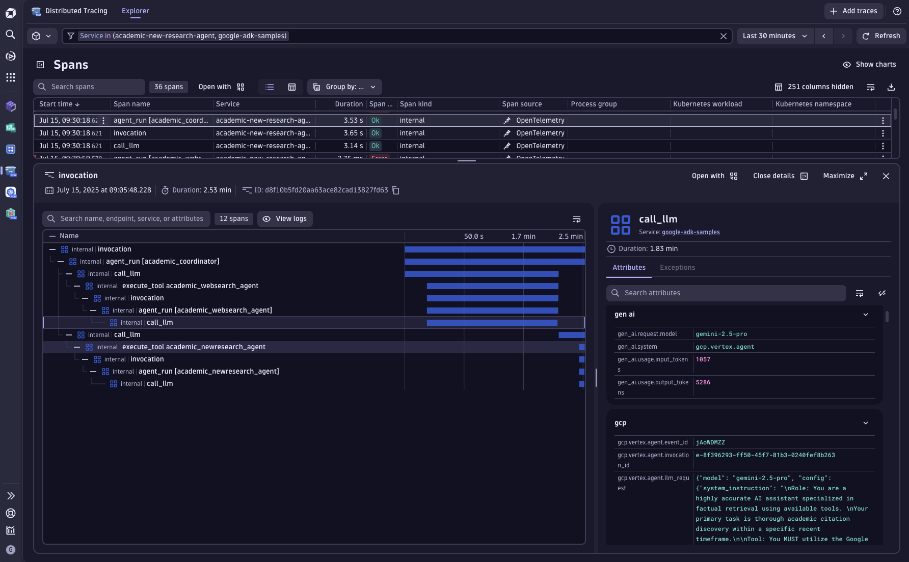
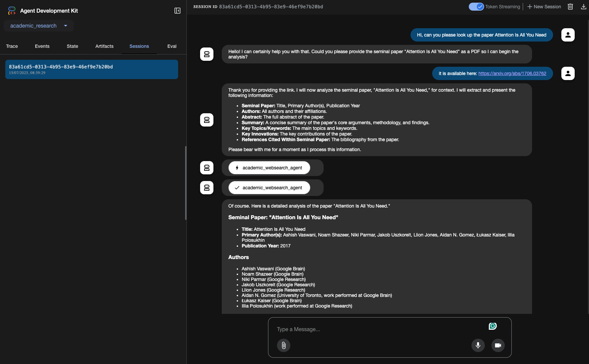

## Google Agent Development Kit (ADK)


This example contains a demo of an Academic Research Agent interface built on top of the [Google ADK](https://google.github.io/adk-docs/). The original example code can be found in the [adk-samples](https://github.com/google/adk-samples/tree/main/python/agents/academic-research) GitHub repo.



## Dynatrace Instrumentation

> [!TIP]
> For detailed setup instructions, configuration options, and advanced use cases, please refer to the [Get Started Docs](https://docs.dynatrace.com/docs/shortlink/ai-ml-get-started).


The Dynatrace full-stack observability platform combined with Traceloop's OpenLLMetry OpenTelemetry SDK can seamlessly provide comprehensive insights into Large Language Models (LLMs) in production environments. By observing AI models, businesses can make informed decisions, optimize performance, and ensure compliance with emerging AI regulations.

Enabling and configuring OpenLLMetry is as easy as to copy/paste this snippet into your [`__init__.py`](./academic_research/__init__.py) files.

```python
os.environ['TRACELOOP_TELEMETRY'] = "false"
os.environ['OTEL_EXPORTER_OTLP_METRICS_TEMPORALITY_PREFERENCE'] = "delta"

def read_secret(secret: str):
    try:
        with open(f"/etc/secrets/{secret}", "r") as f:
            return f.read().rstrip()
    except Exception as e:
        print("No token was provided")
        print(e)
        return ""

token = read_secret("dynatrace_otel") # read your DT API token from a file in /etc/secrets/dynatrace_otel
headers = {"Authorization": f"Api-Token {token}"}
from traceloop.sdk import Traceloop
Traceloop.init(
    app_name="google-adk-sample",
    api_endpoint="https://wkf10640.live.dynatrace.com/api/v2/otlp", # configure your DT tenant here
    disable_batch=True,
    headers=headers,
    should_enrich_metrics=True,
)
```


## How to use

### Setting your Google Cloud credentials

You can set your Google Cloud credentials in your environment variables by running the following command in your terminal:

```bash
export GOOGLE_GENAI_USE_VERTEXAI=TRUE
export GOOGLE_CLOUD_PROJECT=your_project
export GOOGLE_CLOUD_LOCATION=your_location
```

Alternatively, you can set the environment variables in an `.env` file inside this folder.

Make sure that your machine is authenticated by running the following command: 

```bash
gcloud auth application-default login
gcloud auth application-default set-quota-project $GOOGLE_CLOUD_PROJECT
```

### Install dependencies

Install the dependencies for the backend by running the following commands:

```bash
poetry install
```

### Run the app

ADK allows to run agents via a CLI using the following command:

```bash
adk run academic_research
```

Alternatively, ADK also offers a native web-interface that can be used to chat with your agents. You can start it by running:

```bash
adk web
```

The web-interface will be available at: [http://127.0.0.1:8000/dev-ui/?app=academic_research](http://127.0.0.1:8000/dev-ui/?app=academic_research)


