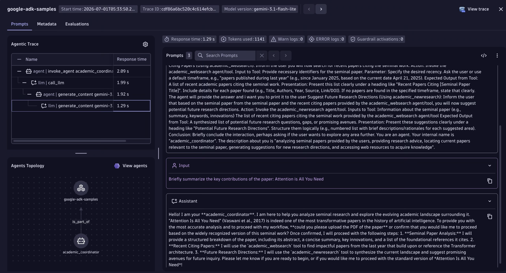

## Google Agent Development Kit (ADK) + OpenTelemetry

Demonstrates tracing and metering a multi-agent Google ADK application with Dynatrace using ADK's built-in OpenTelemetry instrumentation. The app exposes an academic research agent (`POST /research`) that coordinates two sub-agents — one for web search and one for suggesting new research directions. Spans carry `gen_ai.system = google_generativeai`, and ADK also records the OTel GenAI client metrics `gen_ai.client.token.usage` and `gen_ai.client.operation.duration`.



## Prerequisites

- Python 3.11+
- [uv](https://docs.astral.sh/uv/getting-started/installation/)
- Google AI Studio API key (`aistudio.google.com/apikey`)
- Dynatrace environment with API token

## Quick Start

1. Copy `.env.sample` to `.env` and fill in your credentials
2. `make install` — install dependencies
3. `make run` — start the app on port 8000
4. `make request` — send a test research request (in a second terminal)

## Environment Variables

| Variable | Required | Default | Description |
|----------|----------|---------|-------------|
| `GOOGLE_API_KEY` | Yes | — | Google AI Studio API key (`aistudio.google.com/apikey`) |
| `MODEL` | No | `gemini-3.1-flash-lite` | Gemini model to use |
| `DT_API_TOKEN` | Yes | — | Dynatrace API token with `openTelemetryTrace.ingest` and `metrics.ingest` scopes |
| `OTEL_ENDPOINT` | Yes | — | Dynatrace OTLP endpoint (`https://<env>.live.dynatrace.com/api/v2/otlp`) |

## Makefile Targets

| Target | Description |
|--------|-------------|
| `make install` | Install Python dependencies |
| `make run` | Run app locally on port 8000 |
| `make request` | POST /research to localhost:8000 |
| `make help` | Show all available targets |

## Dynatrace Instrumentation

Google ADK has built-in OpenTelemetry tracing **and metrics**. The app configures a standard OTLP tracer provider and a meter provider pointing to Dynatrace; ADK picks both up automatically via the global providers and records `gen_ai.client.token.usage` / `gen_ai.client.operation.duration` (with a `gen_ai.token.type` dimension). The meter provider must be set **before** `google.adk` is imported, so ADK's module-level instrument creation binds to it.

```python
from opentelemetry import metrics, trace
from opentelemetry.exporter.otlp.proto.http.metric_exporter import OTLPMetricExporter
from opentelemetry.exporter.otlp.proto.http.trace_exporter import OTLPSpanExporter
from opentelemetry.sdk.metrics import MeterProvider
from opentelemetry.sdk.metrics.export import PeriodicExportingMetricReader
from opentelemetry.sdk.resources import Resource, SERVICE_NAME
from opentelemetry.sdk.trace import TracerProvider
from opentelemetry.sdk.trace.export import SimpleSpanProcessor

resource = Resource.create({SERVICE_NAME: "google-adk-samples"})
provider = TracerProvider(resource=resource)
provider.add_span_processor(
    SimpleSpanProcessor(
        OTLPSpanExporter(
            endpoint=f"{os.environ['OTEL_ENDPOINT']}/v1/traces",
            headers={"Authorization": f"Api-Token {os.environ['DT_API_TOKEN']}"},
        )
    )
)
trace.set_tracer_provider(provider)

# Dynatrace OTLP metric ingest accepts delta temporality only (cumulative -> HTTP 400).
os.environ.setdefault("OTEL_EXPORTER_OTLP_METRICS_TEMPORALITY_PREFERENCE", "delta")
meter_provider = MeterProvider(
    resource=resource,
    metric_readers=[
        PeriodicExportingMetricReader(
            OTLPMetricExporter(
                endpoint=f"{os.environ['OTEL_ENDPOINT']}/v1/metrics",
                headers={"Authorization": f"Api-Token {os.environ['DT_API_TOKEN']}"},
            )
        )
    ],
)
metrics.set_meter_provider(meter_provider)
```

> [!TIP]
> For detailed setup instructions and token scopes, see the [AI Observability Get Started Docs](https://docs.dynatrace.com/docs/shortlink/ai-ml-get-started).
