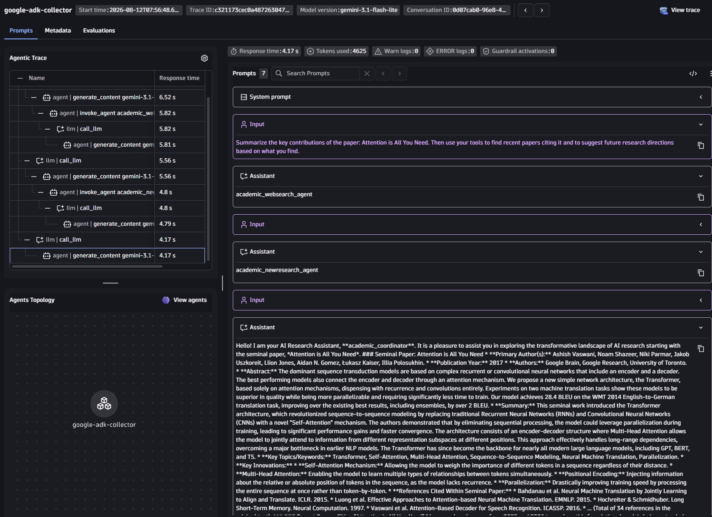

## Google Agent Development Kit (ADK) + OpenTelemetry

Demonstrates tracing and metering a multi-agent Google ADK application with Dynatrace using ADK's built-in OpenTelemetry instrumentation. The app exposes an academic research agent (`POST /research`) that coordinates two sub-agents; one for web search and one for suggesting new research directions. Spans carry `gen_ai.provider.name = gemini`, and ADK also records the OTel GenAI client metrics `gen_ai.client.token.usage` and `gen_ai.client.operation.duration`. With the opt-in configured in [`app.py`](./app.py), ADK also emits message content as `gen_ai.input.messages` / `gen_ai.output.messages` / `gen_ai.system_instructions` span attributes.

Optionally, `make run-collector` routes the app through a local OTel Collector that derives the GenAI **agent and tool duration metrics** from the spans.

> ℹ️ **Message content requires two opt-in flags set before `google.adk` is imported.** Without them, ADK writes content only into GCP-internal blobs (`gcp.vertex.agent.llm_request/response`) rather than OTel semconv attributes. `app.py` sets both via `os.environ.setdefault`: `OTEL_SEMCONV_STABILITY_OPT_IN=gen_ai_latest_experimental` activates ADK's experimental semconv path, and `OTEL_INSTRUMENTATION_GENAI_CAPTURE_MESSAGE_CONTENT=SPAN_ONLY` routes content onto span attributes instead of log-based events.



### Derived agent and tool metrics

ADK's own spans already carry the semconv operation names: `base_agent.run_async` opens an `invoke_agent <name>` span with `gen_ai.operation.name = "invoke_agent"` for the coordinator and for each sub-agent reached through `AgentTool`, and the function-call flow opens an `execute_tool <name>` span with `gen_ai.operation.name = "execute_tool"`. What ADK does not emit is the spec-named *metrics*; it records its own `gen_ai.agent.invocation.duration` and `gen_ai.tool.execution.duration` histograms, which predate the GenAI semconv. `make run-collector` adds the spec-named equivalents with two `span_metrics` connectors:

| Metric | Derived from | Unit |
|--------|--------------|------|
| `gen_ai.invoke_agent.duration` | spans with `gen_ai.operation.name == "invoke_agent"` | `s` |
| `gen_ai.execute_tool.duration` | spans with `gen_ai.operation.name == "execute_tool"` | `s` |

Both are Histogram instruments at Development stability in the [GenAI metrics semconv](https://github.com/open-telemetry/semantic-conventions-genai/blob/main/docs/gen-ai/gen-ai-metrics.md).

`gen_ai.invoke_workflow.duration` is deliberately not produced. ADK only opens an `invoke_workflow` span for a `google.adk.workflow.Workflow` node, and this demo is a plain `LlmAgent` with two `AgentTool` sub-agents; there is no such span to derive it from.

Each connector also emits a `<namespace>.calls` counter that `span_metrics` cannot be told to suppress. Neither counter is a spec metric, so a `filter/drop_derived_calls` processor drops them on the metrics pipeline before export, matching the two names exactly rather than a `*.calls` pattern.

`make run-collector` reports as `service.name = google-adk-collector` — the app pins `service.name` on its Resource, so a `resource` processor in the collector does the rename. That keeps the collector run's data separate from the direct-export run, which is what lets the e2e suite assert the derived metrics unambiguously.

The collector needs the Bindplane distro image (see `COLLECTOR_IMAGE` in the Makefile) and holds the Dynatrace token itself, so on this path the app exports to `http://localhost:4318` instead of the tenant.

## Prerequisites

- Python 3.11+
- [uv](https://docs.astral.sh/uv/getting-started/installation/)
- Google AI Studio API key (`aistudio.google.com/apikey`)
- Dynatrace environment with API token

## Quick Start

1. Copy `.env.sample` to `.env` and fill in your credentials
2. `make install`; install dependencies
3. `make run`; start the app on port 8000
4. `make request`; send a test research request (in a second terminal)

## Environment Variables

| Variable | Required | Default | Description |
|----------|----------|---------|-------------|
| `GOOGLE_API_KEY` | Yes | None | Google AI Studio API key (`aistudio.google.com/apikey`) |
| `MODEL` | No | `gemini-3.1-flash-lite` | Gemini model to use |
| `DT_API_TOKEN` | Yes | None | Dynatrace API token with `openTelemetryTrace.ingest` and `metrics.ingest` scopes |
| `OTEL_ENDPOINT` | Yes | None | Dynatrace OTLP endpoint (`https://<env>.live.dynatrace.com/api/v2/otlp`). `make run-collector` overrides it with `http://localhost:4318` |
| `DT_ENDPOINT` | Only for `run-collector` | None | Dynatrace tenant URL (`https://<env>.live.dynatrace.com`), used by the collector for egress |

## Makefile Targets

| Target | Description |
|--------|-------------|
| `make install` | Install Python dependencies |
| `make run` | Run app locally on port 8000, exporting straight to Dynatrace |
| `make run-collector` | Run app on port 8000 through a local OTel Collector, adding the derived duration metrics |
| `make stop` | Stop and remove the collector container |
| `make logs` | Tail collector logs |
| `make request` | POST /research to localhost:8000 |
| `make help` | Show all available targets |

## Dynatrace Instrumentation

Google ADK has built-in OpenTelemetry tracing **and metrics**. The app configures a standard OTLP tracer provider and a meter provider pointing to Dynatrace; ADK picks both up automatically via the global providers and records `gen_ai.client.token.usage` / `gen_ai.client.operation.duration` (with a `gen_ai.token.type` dimension). The meter provider must be set **before** `google.adk` is imported, so ADK's module-level instrument creation binds to it.

```python
from opentelemetry import metrics, trace
from opentelemetry.exporter.otlp.proto.http.metric_exporter import OTLPMetricExporter
from opentelemetry.exporter.otlp.proto.http.trace_exporter import OTLPSpanExporter
from opentelemetry.sdk.metrics import MeterProvider
from opentelemetry.sdk.metrics.export import PeriodicExportingMetricReader
from opentelemetry.sdk.resources import Resource, SERVICE_NAME
from opentelemetry.sdk.trace import TracerProvider
from opentelemetry.sdk.trace.export import SimpleSpanProcessor

resource = Resource.create({SERVICE_NAME: "google-adk-samples"})
provider = TracerProvider(resource=resource)
provider.add_span_processor(
    SimpleSpanProcessor(
        OTLPSpanExporter(
            endpoint=f"{os.environ['OTEL_ENDPOINT']}/v1/traces",
            headers={"Authorization": f"Api-Token {os.environ['DT_API_TOKEN']}"},
        )
    )
)
trace.set_tracer_provider(provider)

# Dynatrace OTLP metric ingest accepts delta temporality only (cumulative -> HTTP 400).
os.environ.setdefault("OTEL_EXPORTER_OTLP_METRICS_TEMPORALITY_PREFERENCE", "delta")
meter_provider = MeterProvider(
    resource=resource,
    metric_readers=[
        PeriodicExportingMetricReader(
            OTLPMetricExporter(
                endpoint=f"{os.environ['OTEL_ENDPOINT']}/v1/metrics",
                headers={"Authorization": f"Api-Token {os.environ['DT_API_TOKEN']}"},
            )
        )
    ],
)
metrics.set_meter_provider(meter_provider)
```

> [!TIP]
> For detailed setup instructions and token scopes, see the [AI Observability Get Started Docs](https://docs.dynatrace.com/docs/shortlink/ai-ml-get-started).
