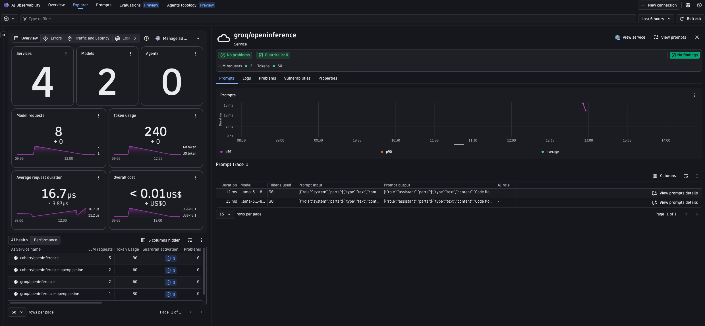
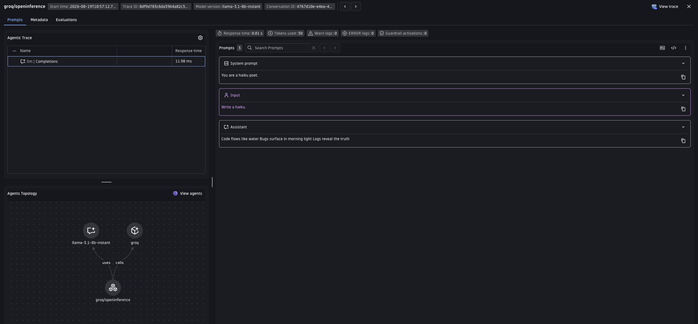

# Groq + OpenInference + Dynatrace AI Observability

Generate a haiku with Groq, send the OpenTelemetry trace to Dynatrace, and see it in the **AI Observability** app.
OpenInference normally uses its own semantic conventions (`llm.model_name`, `llm.token_count.*`, etc.), but this example sets `OPENINFERENCE_ENABLE_GENAI_SEMCONV=true` so `GroqInstrumentor` emits Dynatrace `gen_ai.*` attributes directly on the span -- no attribute normalization needed. A collector or Dynatrace OpenPipeline is still used, but only to derive the metrics OpenInference doesn't emit on its own.

---

## Table of contents

- [What you'll build](#what-youll-build)
- [Prerequisites](#prerequisites)
- [Configuration options](#configuration-options)
- [Setup](#setup)
- [Option A -- Bindplane collector for metrics](#option-a----bindplane-collector-for-metrics)
- [Option B -- Dynatrace OpenPipeline](#option-b----dynatrace-openpipeline)
- [Visualize in Dynatrace AI Observability](#visualize-in-dynatrace-ai-observability)
- [Attribute mapping reference](#attribute-mapping-reference)
- [Metrics](#metrics)
- [Known gaps & limitations](#known-gaps--limitations)
- [Troubleshooting](#troubleshooting)

---

## What you'll build

- Calls Groq to generate a haiku using the `openinference-instrumentation-groq` instrumentation library, with `OPENINFERENCE_ENABLE_GENAI_SEMCONV=true` set so it emits `gen_ai.*` attributes natively (alongside the existing OpenInference ones).
- Produces OpenTelemetry traces already carrying Dynatrace `gen_ai.*` semantic conventions -- no attribute normalization step required.
- Derives the `gen_ai.client.operation.duration` / `gen_ai.client.token.usage` metrics from those spans -- either via the Bindplane collector or via Dynatrace OpenPipeline -- since OpenInference instrumentors emit no metric instruments of their own.
- Shows the trace in the Dynatrace AI Observability app with model, token usage, and message content.

Groq is already demoed via [OneAgent](../oneagent/) auto-instrumentation; this example closes the OpenInference gap for Groq (see the coverage research in `work/spikes/AI-431-openllmetry-openinference-coverage.md` in the `ai-observability-workspace` repo).

> **Note:** this example is based on newly-discovered support for `OPENINFERENCE_ENABLE_GENAI_SEMCONV` in the OpenInference instrumentation core, which emits `gen_ai.*` attributes natively and removes the need for the collector/OpenPipeline attribute normalization used by other `<sdk>/openinference/` examples in this repo (e.g. [`openai/openinference`](../../openai/openinference/), [`anthropic/openinference`](../../anthropic/openinference/)). It has not yet been folded into those examples or into the `dt-setup-genai` internal skill that documents this pattern -- treat this example as exploratory until that's done.

---

## Prerequisites

- A Dynatrace tenant -- start a free trial at https://dt-url.net/trial
- Docker installed and running (Option A only)
- Python 3.10+
- [uv](https://docs.astral.sh/uv/getting-started/installation/)
- A [Groq API key](https://console.groq.com/keys)

---

## Configuration options

`GroqInstrumentor` already emits `gen_ai.*` attributes on the span (via `OPENINFERENCE_ENABLE_GENAI_SEMCONV=true`, set in `app.py`), including the full input/output message history -- so both options below surface the request in the AI Observability app identically. The only thing they still do is derive the `gen_ai.client.operation.duration` / `gen_ai.client.token.usage` metrics, since OpenInference instrumentors emit no metric instruments of their own regardless of this flag:

|  | Option A -- Bindplane collector | Option B -- OpenPipeline |
|---|---|---|
| **Where metrics are derived** | In the collector process, via `span_metrics`/`signal_to_metrics` connectors | Server-side, in your Dynatrace tenant |
| **Requires Docker** | Yes | No |
| **Requires Dynatrace config** | No | Yes -- one-time deploy |
| **Good for** | Full control over the pipeline, works anywhere you can run a collector, no need to manually add pipeline configurations on your tenant | Simpler ops -- no collector to manage |
| **Make target** | `make run` | `make run-openpipeline` (deploy once first) |

Both paths surface the request in the AI Observability app with model, token usage, and full message content -- since the SDK already emits `gen_ai.input.messages` / `gen_ai.output.messages` natively, neither option needs to reconstruct message history from indexed attributes.

---

## Setup

### 1. Create a Dynatrace access token

1. In Dynatrace press `Ctrl+K` and search for **Access tokens**.
2. Create a token with these permissions:
   - `openTelemetryTrace.ingest`
3. Copy the token value.

### 2. Set environment variables

The app and scripts read credentials from environment variables. The easiest way is to create a `.env` file in this directory (the Makefile sources it automatically):

```bash
# .env
DT_ENDPOINT=https://abc12345.live.dynatrace.com
DT_API_TOKEN=dt0c01.****.*****

GROQ_API_KEY=**********************
MODEL=llama-3.1-8b-instant   # optional, defaults to llama-3.1-8b-instant
```

> **Note:** `DT_ENDPOINT` is your base tenant URL -- not the `/api/v2/otlp` path. Example: `https://abc12345.live.dynatrace.com`.

If you are not using the Makefile, source the file directly in your shell:

```bash
source .env
```

### 3. Install dependencies

```bash
make install
```

---

## Option A -- Bindplane collector for metrics

The app already emits `gen_ai.*`-native spans, so the [Bindplane Distro for OpenTelemetry (BDOT)](https://github.com/observIQ/bindplane-otel-collector) collector here does no attribute normalization -- it just derives the operation-duration and token-usage metrics from those spans before forwarding everything to Dynatrace.

```
App (gen_ai.* natively)  ->  Bindplane collector (metrics only)  ->  Dynatrace Grail
```

This example pins the collector to `ghcr.io/observiq/bindplane-agent:1.106.0`, matching the version pinned by the [`openai/openinference`](../../openai/openinference/) example.

The collector needs your Dynatrace credentials because **it is the component that forwards spans to Dynatrace**. The app itself only knows about `http://localhost:4318` -- it sends spans to the collector, and the collector authenticates with Dynatrace using `DT_ENDPOINT` and `DT_API_TOKEN`.

The pipeline (see [`otel-collector-config.yaml`](otel-collector-config.yaml)) filters to LLM spans (`filter/genai_only`) and feeds them to two connectors:

1. **`span_metrics`** derives `gen_ai.client.operation.duration` from LLM span durations.
2. **`signal_to_metrics`** derives `gen_ai.client.token.usage` from the natively-emitted `gen_ai.usage.input_tokens` / `gen_ai.usage.output_tokens` span attributes.

Spans themselves pass straight through to Dynatrace unmodified -- no transform processors run on the trace export pipeline.

### Step 1 -- Start the collector and run the app

```bash
# with make (reads .env automatically, starts the collector then runs app.py once)
make run
```

Or manually with Docker:

**Linux/macOS:**
```bash
source .env
docker run -d \
  --name bindplane-otel-collector \
  -p 4318:4318 \
  -v $(pwd)/otel-collector-config.yaml:/etc/otel/config.yaml:ro \
  -e DT_ENDPOINT=$DT_ENDPOINT \
  -e DT_API_TOKEN=$DT_API_TOKEN \
  ghcr.io/observiq/bindplane-agent:1.106.0
```

**Windows CMD:**
```cmd
set DT_ENDPOINT=https://abc12345.live.dynatrace.com
set DT_API_TOKEN=dt0c01.*****
docker run -d ^
  --name bindplane-otel-collector ^
  -p 4318:4318 ^
  -v %cd%/otel-collector-config.yaml:/etc/otel/config.yaml:ro ^
  -e DT_ENDPOINT=%DT_ENDPOINT% ^
  -e DT_API_TOKEN=%DT_API_TOKEN% ^
  ghcr.io/observiq/bindplane-agent:1.106.0
```

The BDOT image reads its config from `/etc/otel/config.yaml` by default in standalone mode, so no `--config` argument is needed.

What happens:
- The collector listens on port `4318` for incoming OTLP/HTTP spans from the app.
- Spans are forwarded to `$DT_ENDPOINT/api/v2/otlp` unmodified, authenticated with the API token.
- A separate branch of the same spans feeds `span_metrics`/`signal_to_metrics`, which derive the operation-duration and token-usage metrics and export those too.

If you started the collector manually, run the app once against it:

```bash
source .env && OTEL_EXPORTER_OTLP_ENDPOINT=http://localhost:4318 OTEL_EXPORTER_OTLP_HEADERS="" python3 app.py
```

**Useful commands:**

```bash
make logs   # tail collector.log in real time
make stop   # stop and remove the collector container

# or manually
docker logs -f bindplane-otel-collector
docker stop bindplane-otel-collector && docker rm bindplane-otel-collector
```

---

## Option B -- Dynatrace OpenPipeline

OpenPipeline is a server-side processing pipeline in Dynatrace. Since the app already emits `gen_ai.*`-native spans, this pipeline does no attribute mapping -- it only materializes a seconds-denominated duration field and extracts the operation-duration / token-usage metrics from it. The app sends spans directly to Dynatrace -- no collector needed.

```
App (gen_ai.* natively)  ->  Dynatrace OpenPipeline (metrics only)  ->  Dynatrace Grail
```

### Step 1 -- Deploy the OpenPipeline configuration using the Dynatrace UI

This is a one-time setup per tenant.

1. In Dynatrace press `Ctrl+K` and search for **OpenPipeline**.
2. Select **Spans**.
3. Click **Add pipeline**, name it `groq-openinference-ai-spans`, and add processors matching the definitions in [`openpipeline-openinference.yaml`](openpipeline-openinference.yaml).
4. Go to the **Routing** tab and add an entry:
    - Matcher: `isNotNull(openinference.span.kind) AND service.name == "groq/openinference-openpipeline"`
    - Pipeline: `groq-openinference-ai-spans`

> **Note:** OpenPipeline routing is first-match-wins, not fan-out. `isNotNull(openinference.span.kind)` alone (a span attribute set by every OpenInference instrumentor) would also match spans from any other OpenInference demo in this repo running on the same tenant -- e.g. `openai/openinference`'s `openinference-ai-spans` pipeline. Scoping the matcher with `service.name` (as above) keeps this demo's routing independent of whichever other OpenInference pipelines happen to be deployed.

### Step 2 -- Run the app

The app sends spans directly to `$DT_ENDPOINT/api/v2/otlp`, authenticated with the API token. OpenPipeline intercepts and transforms the spans server-side before they are stored.

```bash
# with make (reads .env automatically)
make run-openpipeline

# or manually
source .env && OTEL_EXPORTER_OTLP_ENDPOINT=$DT_ENDPOINT/api/v2/otlp OTEL_EXPORTER_OTLP_HEADERS="Authorization=Api-Token $DT_API_TOKEN" python3 app.py
```

---

## Visualize in Dynatrace AI Observability

1. In Dynatrace press `Ctrl+K` and search for **AI Observability**.
2. Your haiku request appears in the Explorer tab, with model, token usage, and cost for the `groq/openinference` service.
   
3. Open a prompt trace to inspect the request/response content and the agents topology graph.
   

---

## Attribute mapping reference

There's no mapping table here anymore -- `OPENINFERENCE_ENABLE_GENAI_SEMCONV=true` makes `GroqInstrumentor` set the `gen_ai.*` attributes on the span itself (alongside the existing `llm.*`/`openinference.*` ones), including `gen_ai.request.model`, `gen_ai.provider.name` (`groq`), `gen_ai.usage.input_tokens`/`.output_tokens`, `gen_ai.request.temperature`/`.max_tokens`/`.top_p`, `gen_ai.response.model`, `gen_ai.response.finish_reasons`, `gen_ai.agent.name`, `gen_ai.tool.*`, and the full `gen_ai.input.messages`/`gen_ai.output.messages` history. Both options in this example pass those attributes straight through unmodified.

`session.id` and `user.id` already match the OTel standard and pass through unchanged, same as before.

> **Note on request parameters:** `GroqInstrumentor` never emits discrete `llm.temperature` / `llm.max_tokens` / `llm.top_p` span attributes -- only a single `llm.invocation_parameters` JSON string, where every named parameter of `chat.completions.create()` is present, with unset ones serialized as the literal Python repr of the SDK's `Omit` sentinel (e.g. `"top_p": "<groq.Omit object at 0x...>"`) rather than an absent key. The OpenInference core's native `gen_ai.*` conversion coerces each parameter with a typed coercer (e.g. `float()` for temperature) that returns `None` -- and is therefore skipped -- when it hits that sentinel string, so `gen_ai.request.temperature`/`.max_tokens`/`.top_p` come out clean without either pipeline needing sentinel-specific handling.

---

## Metrics

OpenInference is span-only by design (its instrumentors emit no metric instruments) -- this is unaffected by `OPENINFERENCE_ENABLE_GENAI_SEMCONV`, which only changes attribute naming, not whether metric instruments are emitted. So the two metrics the AI Observability app charts must still be derived from the spans. Both options do this, so the cost and latency tiles populate either way:

| Metric | Option A (collector) | Option B (OpenPipeline) |
|---|---|---|
| `gen_ai.client.operation.duration` (s) | `span_metrics` connector, on LLM spans | `samplingAwareHistogramMetric` extractor on `duration_seconds` |
| `gen_ai.client.token.usage` (`gen_ai.token.type` = `input`/`output`) | `signal_to_metrics` connector, two sum defs | two `samplingAwareValueMetric` extractors, one per direction |

Both read `gen_ai.usage.input_tokens` / `gen_ai.usage.output_tokens` directly off the span -- no normalization step maps them anymore, since `GroqInstrumentor` sets them natively. Both metrics use delta temporality -- Dynatrace rejects cumulative.

---

## Known gaps & limitations

### No embeddings coverage

`GroqInstrumentor` only wraps Groq's `chat.completions` endpoint (Groq has no embeddings API), so neither option's pipeline needs to handle `embedding.*` OpenInference attributes -- unlike [`openai/openinference`](../../openai/openinference/), whose `OpenAIInstrumentor` also covers the embeddings endpoint.

Prompt caching (`gen_ai.prompt_caching` / `gen_ai.cache.type`) is not applicable here -- Groq does not support prompt caching today.

### `OPENINFERENCE_ENABLE_GENAI_SEMCONV` support is package-version-dependent

This example pins `openinference-instrumentation-groq>=0.1.20` in [`pyproject.toml`](pyproject.toml). The env var is read by the shared `openinference-instrumentation` core (`TraceConfig`/`OITracer`), which `GroqInstrumentor` uses -- but it has not been verified against every historical version of the groq package. If spans come out without `gen_ai.*` attributes, confirm the installed `openinference-instrumentation`/`openinference-instrumentation-groq` versions actually support this flag (check the installed package's `config.py` for `OPENINFERENCE_ENABLE_GENAI_SEMCONV`) before assuming the pipeline is broken.

---

## Troubleshooting

**No spans in Dynatrace:**
- Confirm `DT_ENDPOINT` and `DT_API_TOKEN` are correctly set.
- Confirm the token has `openTelemetryTrace.ingest` permission.
- Option A: check collector logs with `make logs` or `docker logs bindplane-otel-collector`.
- Option B: run `python3 app.py` directly -- any auth error from Dynatrace will appear in the console output.

**Collector crashes on startup (Option A):**
- Run `docker ps -a` and `docker logs bindplane-otel-collector` to see the error.
- Confirm Docker is running and port `4318` is free: `lsof -i :4318`.

**Spans visible in Distributed Tracing but not in AI Observability:**
- AI Observability requires `gen_ai.provider.name` (or `gen_ai.system`) to be set on the span -- `GroqInstrumentor` sets `gen_ai.provider.name` to `groq` natively when `OPENINFERENCE_ENABLE_GENAI_SEMCONV=true`.
- Confirm the env var actually reached the instrumentor: check the `debug` exporter output (Option A: `make logs`) or `ConsoleSpanExporter` output from `app.py` for `gen_ai.*` attributes alongside the `llm.*`/`openinference.*` ones.
- Option B: confirm the OpenPipeline routing entry is active; go to **Settings -> OpenPipeline -> Spans** in Dynatrace and verify the `groq-openinference-ai-spans` pipeline is enabled and the routing matcher is `isNotNull(openinference.span.kind) AND service.name == "groq/openinference-openpipeline"`.

**Port conflict (Option A):**
- Ensure nothing else is listening on `4318`: `lsof -i :4318`.
