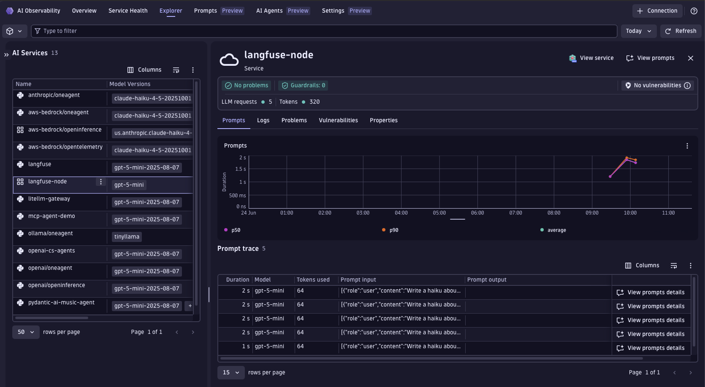
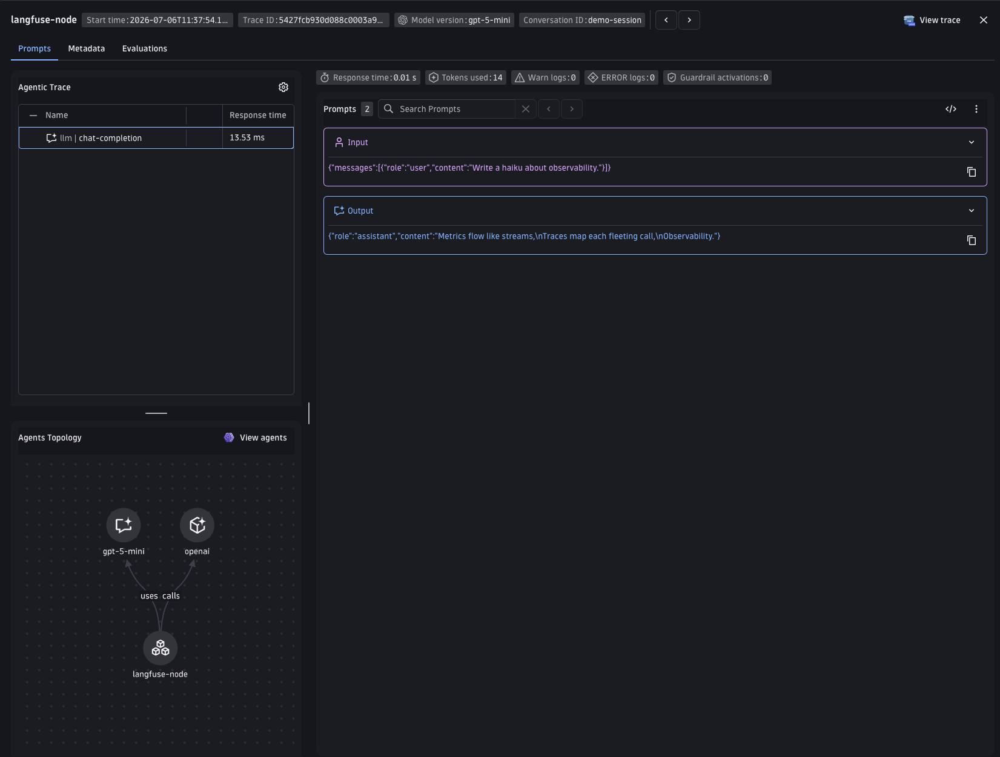

# Langfuse OpenTelemetry — Node.js

Node.js/TypeScript demo: makes an OpenAI haiku call using the **`@langfuse/otel` SDK**,
which emits spans with the Langfuse 4.x OTel attribute schema (`langfuse.observation.*`).
The OTel Collector (or Dynatrace OpenPipeline) transforms those attributes to `gen_ai.*`,
producing the same result in Dynatrace AI Observability as the Python sibling demo.

This demo mirrors [`../opentelemetry/`](../opentelemetry/) (Python) and shares the same
collector config (`../opentelemetry/otel-collector-config.yaml`).

## Prerequisites

- Node.js 20+
- Docker (for the collector path)
- OpenAI or Azure OpenAI API credentials
- Dynatrace tenant with an API token (`openTelemetryTrace.ingest` scope)

## Quick start

```bash
cp .env.sample .env
# Edit .env with your credentials

make install
make run           # collector path — transforms langfuse.* → gen_ai.* locally
# OR
make run-openpipeline   # direct to Dynatrace — OpenPipeline transforms on ingestion
```

## How it works

1. `initTelemetry()` sets up `NodeSDK` with `LangfuseSpanProcessor` (from `@langfuse/otel`) backed by a custom `OTLPTraceExporter` pointing at the configured endpoint. Reads `OTEL_EXPORTER_OTLP_ENDPOINT` and `OTEL_EXPORTER_OTLP_HEADERS` from env.
2. `propagateAttributes({ sessionId })` sets `session.id` in OTel baggage so all child spans inherit it.
3. `observeOpenAI` (from `@langfuse/openai`) wraps the OpenAI client and automatically emits a generation span with `langfuse.observation.*` attributes: model, temperature, input messages, output messages, and token usage.
4. The OTel Collector (or Dynatrace OpenPipeline) transforms `langfuse.*` → `gen_ai.*`.
5. Spans appear in Dynatrace AI Observability with model name, token usage, and latency.

### Collector path (`make run`)

```
Node.js app → OTLP → OTel Collector → (transform) → Dynatrace
```

Collector config: `../opentelemetry/otel-collector-config.yaml`

### OpenPipeline path (`make run-openpipeline`)

```
Node.js app → OTLP → Dynatrace → (OpenPipeline: langfuse.* → gen_ai.*)
```

Requires the processors from `../opentelemetry/openpipeline-langfuse.yaml` to be deployed.

## Visualize in Dynatrace AI Observability

1. In Dynatrace press `Ctrl+K` and search for **AI Observability**.
2. Your haiku request appears in the Explorer tab with model name, token usage, and message content.
   
3. Open a span to inspect the full `gen_ai.*` attributes and the Agents Topology showing the model and provider connected to the `langfuse-node` service.
   

---

## Environment variables

| Variable | Required | Description |
|---|---|---|
| `DT_ENDPOINT` | yes | Dynatrace tenant URL |
| `DT_API_TOKEN` | yes | API token with ingest scopes |
| `OPENAI_API_KEY` | yes | OpenAI or Azure OpenAI key |
| `OPENAI_API_BASE` | no | Override OpenAI base URL (or Azure endpoint) |
| `OPENAI_API_VERSION` | no | Azure OpenAI API version (activates Azure client) |
| `MODEL` | no | Model/deployment name (default: `gpt-5.4-mini`) |
| `TOPIC` | no | Haiku topic (default: `observability`) |
| `LANGFUSE_SESSION_ID` | no | Session ID mapped to `gen_ai.conversation.id` (default: `demo-session`) |
| `TEMPERATURE` | no | Sampling temperature (default: 1) |
