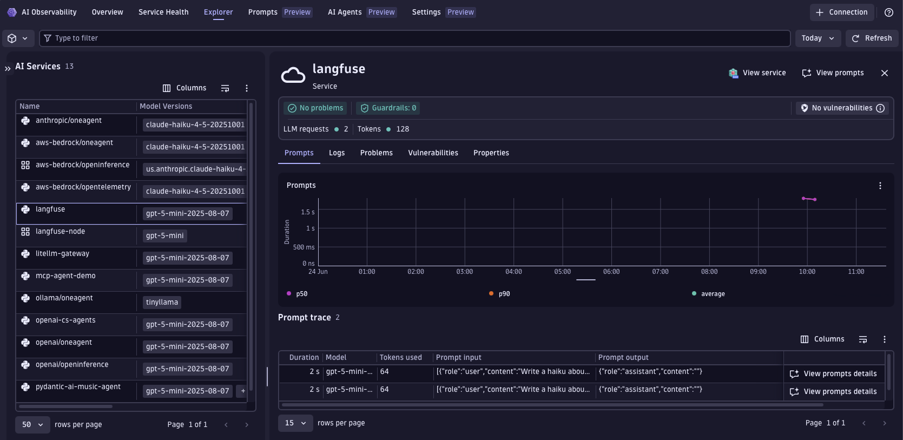

# Langfuse + Dynatrace AI Observability

Generate a haiku with an LLM, send the Langfuse trace to Dynatrace, and see it in the **AI Observability** app.
Langfuse uses its own semantic conventions (`langfuse.observation.type`, `langfuse.observation.model.name`, `langfuse.observation.usage_details`, etc.) — this example shows two ways to normalize them into the Dynatrace `gen_ai.*` format.

---

## Table of contents

- [What you'll build](#what-youll-build)
- [Prerequisites](#prerequisites)
- [Configuration options](#configuration-options)
- [Setup](#setup)
- [Option A -- OTel Collector with transform processor](#option-a----otel-collector-with-transform-processor)
- [Option B -- Dynatrace OpenPipeline](#option-b----dynatrace-openpipeline)
- [Visualize in Dynatrace AI Observability](#visualize-in-dynatrace-ai-observability)
- [Attribute mapping reference](#attribute-mapping-reference)
- [Troubleshooting](#troubleshooting)

---

## What you'll build

- Calls an LLM to generate a haiku using the Langfuse instrumentation library.
- Produces OpenTelemetry traces with Langfuse semantic conventions (`langfuse.*` attributes).
- Normalizes Langfuse attributes to Dynatrace `gen_ai.*` format -- either via a local OTel Collector or via Dynatrace OpenPipeline.
- Shows the trace in the Dynatrace AI Observability app with model, token usage, conversation grouping, and message content.

---

## Prerequisites

- A Dynatrace tenant -- start a free trial at https://dt-url.net/trial
- Docker installed and running (Option A only)
- Python 3.8+
- An OpenAI-compatible API key and endpoint

---

## Configuration options

Langfuse uses its own semantic conventions that the Dynatrace AI Observability app does not natively understand. Two equivalent approaches normalize the attributes:

|  | Option A -- OTel Collector | Option B -- OpenPipeline |
|---|---|---|
| **Where transforms run** | In the collector process | Server-side, in your Dynatrace tenant |
| **Requires Docker** | Yes | No |
| **Requires Dynatrace config** | No | Yes -- one-time deploy |
| **Good for** | Full control over the pipeline, works anywhere you can run a collector | Simpler ops -- no collector to manage |
| **Make target** | `make run` | `make run-openpipeline` (deploy once first) |

Both paths produce identical results in the AI Observability app.

---

## Setup

### 1. Create a Dynatrace access token

1. In Dynatrace press `Ctrl+K` and search for **Access tokens**.
2. Create a token with these permissions:
   - `openTelemetryTrace.ingest`
3. Copy the token value.

### 2. Set environment variables

Create a `.env` file in this directory (the Makefile sources it automatically):

```bash
# .env
DT_ENDPOINT=https://abc12345.live.dynatrace.com
DT_API_TOKEN=dt0c01.****.*****

OPENAI_API_KEY=**********************
MODEL=gpt-4o-mini                        # optional, defaults to gpt-4o-mini
TOPIC=observability                      # optional, haiku topic

# Azure OpenAI (optional)
OPENAI_API_BASE=https://your-endpoint.openai.azure.com/
OPENAI_API_VERSION=2024-07-01-preview
```

> **Note:** `DT_ENDPOINT` is your base tenant URL -- not the `/api/v2/otlp` path.

### 3. Install dependencies

```bash
make install
```

---

## Option A -- OTel Collector with transform processor

The OTel Collector intercepts spans and applies all Langfuse → `gen_ai.*` attribute mappings before forwarding to Dynatrace. No Dynatrace configuration needed.

```
App  →  Langfuse SDK (OTLP export)  →  OTel Collector (transform processor)  →  Dynatrace Grail
```

```bash
make run
```

The collector listens on port `4318`. The `transform/langfuse` processor renames `langfuse.*` attributes to `gen_ai.*` before forwarding to Dynatrace.

**Useful commands:**

```bash
make logs   # tail collector.log in real time
make stop   # stop and remove the collector container
make request  # send another haiku request through the running collector
```

---

## Option B -- Dynatrace OpenPipeline

OpenPipeline applies the same attribute mappings server-side. The app sends spans directly to Dynatrace -- no collector needed.

```
App  →  Langfuse SDK (OTLP export)  →  Dynatrace OpenPipeline (transform)  →  Dynatrace Grail
```

### Step 1 -- Deploy the OpenPipeline configuration

This is a one-time setup per tenant.

1. In Dynatrace press `Ctrl+K` and search for **OpenPipeline**.
2. Select **Spans**.
3. Click **Add pipeline**, name it `langfuse-ai-spans`, and add the processors from `openpipeline-langfuse.yaml`.
4. Go to the **Routing** tab and add an entry:
   - Matcher: `isNotNull(langfuse.observation.type)`
   - Pipeline: `langfuse-ai-spans`

### Step 2 -- Run the app

```bash
make run-openpipeline
```

---

## Visualize in Dynatrace AI Observability

1. In Dynatrace press `Ctrl+K` and search for **AI Observability**.
2. Your haiku request appears in the Explorer tab with model name, token usage, and message content.
   
3. Open a span to inspect the full conversation and `gen_ai.*` attributes.
4. Spans with the same `session_id` are grouped under the same conversation thread.

---

## Attribute mapping reference

| Langfuse source | Dynatrace target | Notes |
|---|---|---|
| `langfuse.observation.type` | `gen_ai.operation.name` | `"generation"` → `"chat"`, `"embedding"` → `"embeddings"`, others pass through |
| `langfuse.observation.model.name` | `gen_ai.request.model` | generation and embedding spans only |
| _(derived from model name)_ | `gen_ai.provider.name` | inferred from model prefix (openai, anthropic, google, meta, mistral, cohere) |
| _(mirrored)_ | `gen_ai.response.model` | copied from `gen_ai.request.model` on generation spans |
| _(hardcoded)_ | `llm.request.type = "chat"` | set on generation spans for Prompts view filter |
| `langfuse.observation.usage_details` | `gen_ai.usage.input_tokens` | JSON field `prompt_tokens` |
| `langfuse.observation.usage_details` | `gen_ai.usage.output_tokens` | JSON field `completion_tokens` |
| `langfuse.observation.input` | `gen_ai.input.messages` | generation spans only; prompt content |
| `langfuse.observation.output` | `gen_ai.output.messages` | generation spans only; completion content |
| `langfuse.session_id` / `langfuse.sessionId` | `gen_ai.conversation.id` + `session.id` | enables conversation thread grouping |
| `langfuse.user_id` / `langfuse.userId` | `user.id` | |
| `langfuse.observation.model.parameters` | `gen_ai.request.temperature` | JSON field `temperature` |
| _(hardcoded)_ | `ai.observability.source = "langfuse"` | set on all Langfuse spans |

---

## Troubleshooting

**No spans in Dynatrace:**
- Confirm `DT_ENDPOINT` and `DT_API_TOKEN` are correctly set.
- Confirm the token has `openTelemetryTrace.ingest` permission.
- Option A: check collector logs with `make logs`.
- Option B: run `python3 app.py` with env vars set -- any auth error appears in the console.

**Collector crashes on startup (Option A):**
- Run `docker ps -a` and `docker logs otel-collector` to see the error.
- Confirm Docker is running and port `4318` is free: `lsof -i :4318`.

**Spans in Distributed Tracing but not in AI Observability:**
- AI Observability requires `gen_ai.provider.name` to be set -- added by the transform processor / OpenPipeline.
- Option A: confirm the collector started with `otel-collector-config.yaml`.
- Option B: confirm the OpenPipeline routing entry is active -- matcher `isNotNull(langfuse.observation.type)`, pipeline `langfuse-ai-spans`.

**Port conflict (Option A):**
- Ensure nothing else is listening on `4318`: `lsof -i :4318`.
