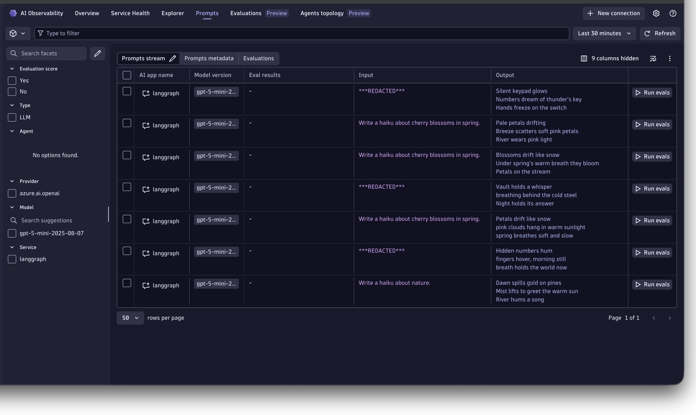
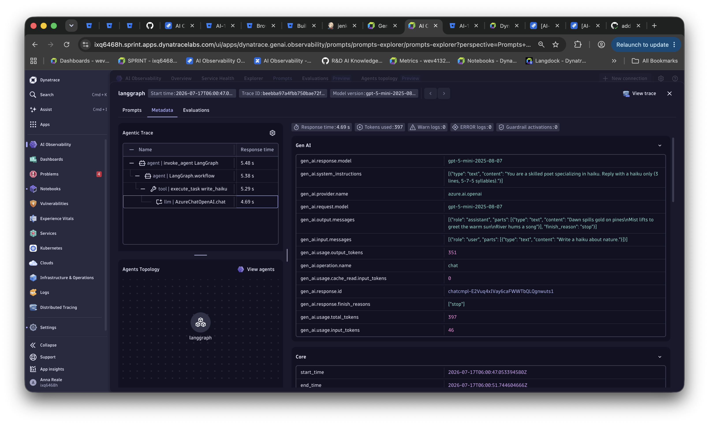
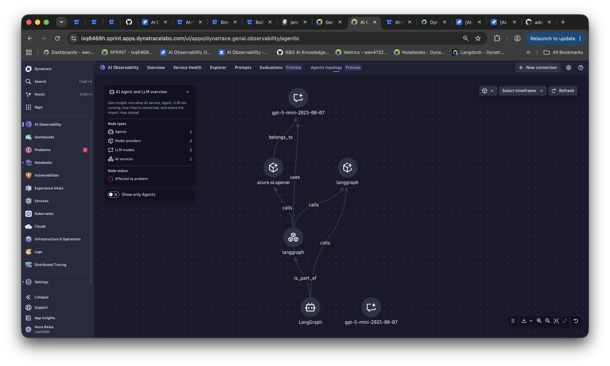

# LangGraph + Dynatrace

This sample instruments a [LangGraph](https://langchain-ai.github.io/langgraph/) agent with Dynatrace using [OpenLLMetry](https://github.com/traceloop/openllmetry) (Traceloop SDK), routed through a [Dynatrace OpenTelemetry Collector](https://github.com/Dynatrace/dynatrace-otel-collector) that anonymizes sensitive input messages.

## What this sample does

- Runs a FastAPI server exposing `POST /haiku` (accepts a `{"topic": "..."}` body)
- Builds a minimal LangGraph state graph with a single `write_haiku` node that calls Azure OpenAI
- Exports traces and metrics via OTLP HTTP to a local Dynatrace Collector, which forwards them to Dynatrace
- Uses a Dynatrace OpenTelemetry Collector `transform` processor to redact input messages that contain secrets before they reach Dynatrace

The Traceloop SDK auto-instruments LangChain and LangGraph, so each request produces a distributed trace covering the graph run and the underlying LLM call, with token usage and cost captured as metrics.

## Use case: observe an agent while keeping sensitive prompts out of the backend

A common concern when shipping LLM apps is that prompt and completion content can carry sensitive data (credentials, customer information, internal project names). You still want full observability -- the agent's execution graph, model, latency, and token usage -- but you must not let the sensitive text reach your observability backend.

This sample shows that split responsibility:

- The **app** is instrumented normally and captures message content (`gen_ai.input.messages`, `gen_ai.output.messages`, `gen_ai.system_instructions`).
- A **Dynatrace OpenTelemetry Collector sits in the middle** and scrubs any message that mentions `secret` before forwarding to Dynatrace.

In Dynatrace you get the complete picture: the agentic trace `invoke_agent LangGraph` -> `LangGraph.workflow` -> `write_haiku` (tool) -> `AzureChatOpenAI.chat`, the resolved model (for example `gpt-5-mini`), the provider (`azure.ai.openai`), token counts, and the agents topology -- while the sensitive prompt shows only `***REDACTED***`.

### Secret anonymization in the collector

The collector runs a `transform` processor (see `otel-collector-config.yaml`). Message content is captured per the GenAI semantic conventions as the `gen_ai.input.messages` / `gen_ai.output.messages` / `gen_ai.system_instructions` span attributes (this is opt-in — the app sets `OTEL_INSTRUMENTATION_GENAI_CAPTURE_MESSAGE_CONTENT=true`). Any of these that mentions `secret` (case-insensitive) has its value replaced with `***REDACTED***` before the span leaves the collector, so the sensitive text never reaches Dynatrace. Values that do not match pass through unchanged.

For example, `POST /haiku {"topic": "the secret launch codes"}` is redacted, while `POST /haiku {"topic": "cherry blossoms in spring"}` is stored as-is. In the AI Observability **Prompts** stream, the secret inputs show `***REDACTED***` while the benign ones keep their content:



Metrics are exported with delta temporality (Dynatrace ingests delta only), set at the SDK via `OTEL_EXPORTER_OTLP_METRICS_TEMPORALITY_PREFERENCE=delta`; the collector forwards them unchanged.

## Prerequisites

- Python 3.10+
- [uv](https://docs.astral.sh/uv/getting-started/installation/) (`pip install uv`)
- Docker (to run the Dynatrace Collector)
- A Dynatrace API token with `openTelemetryTrace.ingest` and `metrics.ingest`
- An Azure OpenAI endpoint and key

## Environment

Copy `.env.sample` to `.env` and fill in the values:

```env
DT_ENDPOINT=https://<tenant>.live.dynatrace.com
DT_API_TOKEN=dt0c01....

AZURE_OPENAI_ENDPOINT=https://<resource>.openai.azure.com
AZURE_OPENAI_API_KEY=...
OPENAI_API_VERSION=2024-07-01-preview
MODEL=<deployment>
```

## Install and run

```bash
cd langgraph/opentelemetry
make install
make run
```

Then in a second terminal:

```bash
make request
```

## Makefile targets

| Target | Description |
|--------|-------------|
| `make install` | Create venv and install dependencies via uv |
| `make run` | Start the collector and the FastAPI app on port 8000 |
| `make request` | POST /haiku with a non-secret topic (passes through unredacted) |
| `make request-secret` | POST /haiku with a secret topic (redacted by the collector) |
| `make request-all` | Exercise both the redacted and non-redacted paths |
| `make stop` | Stop and remove the collector container |
| `make logs` | Tail collector logs |

## Dynatrace views

After a few minutes, refresh the Dynatrace views and you should see data being populated.

Explore how your graph runs, which models are used, and how token usage is attributed across nodes and LLM calls.

Remember that you can drill down into the end-to-end trace whenever a `trace.id` is shown. Just right-click the trace ID and "open with" `Distributed Tracing`.

You can also open the Dynatrace `Distributed Tracing` view and filter for `service.name = langgraph`.

In the Dynatrace **AI Observability** app you can filter by service or model to explore token usage, cost breakdown, and latency across your graph runs.

| View | What to look for |
|------|-----------------|
| **Distributed Tracing** | Filter by `service.name = langgraph` |
| **AI Observability** | Token usage, latency, and model per request |

The **Prompts** view shows the captured `gen_ai.*` attributes for a request, including the agentic trace and the (redacted or intact) message content:



The **Agents topology** view shows how the `langgraph` agent, the `azure.ai.openai` provider, and the LLM model connect:


