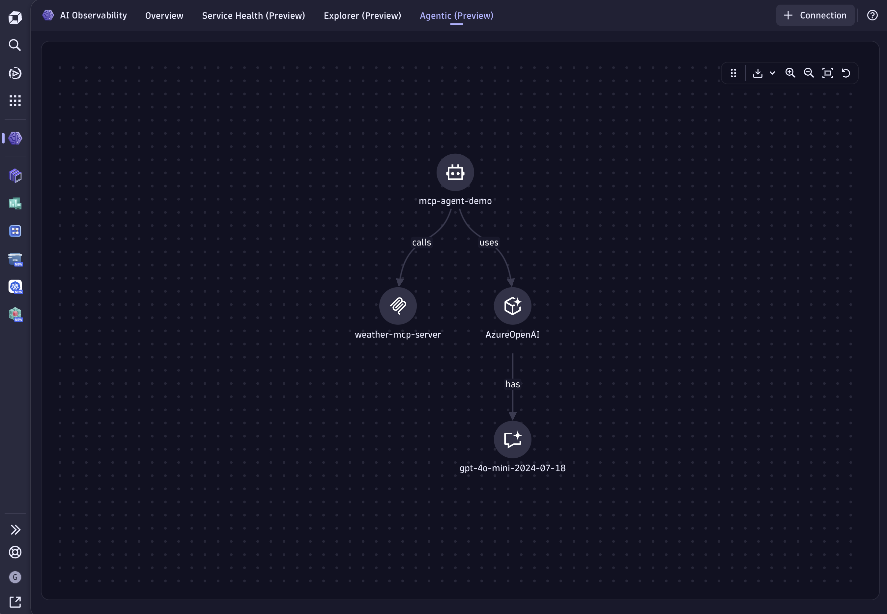

## Model Context Protocol (MCP) Example

This example contains a demo of an AI Agent interfacing an MCP server built on top of
[LangChain](https://www.langchain.com/) using Azure OpenAI.

The Agent uses a tool to randomly select a city and request a weather forecast from an MCP server.



## Dynatrace Instrumentation

> [!TIP]
> For detailed setup instructions, configuration options, and advanced use cases, please refer to the [Get Started Docs](https://docs.dynatrace.com/docs/shortlink/ai-ml-get-started).

### AI Agent

The Dynatrace end-to-end AI-powered observability platform combined with Traceloop's [OpenLLMetry OpenTelemetry SDK](https://github.com/traceloop/openllmetry) can seamlessly provide comprehensive insights into AI Agents in production environments. By observing AI agents and MCP servers, businesses can make informed decisions, optimize performance, cost, and get visibility into the execution flow through tracing. 

We simplified this process, hiding all the complexity inside [dynatrace.py](./ai-agent/dynatrace.py).
For sending data to your Dynatrace tenant, you can configure the `OTEL_ENDPOINT` env var with your Dynatrace URL for ingesting [OTLP](https://docs.dynatrace.com/docs/shortlink/otel-getstarted-otlpexport), for example: `https://wkf10640.live.dynatrace.com/api/v2/otlp`.

The Dynatrace API access token will be read from your filesystem under `/etc/secrets/dynatrace_otel`. 

### MCP Server

The Model Context Protocol (MCP) server in this example demonstrates how to create reusable, standardized interfaces that AI agents can interact with to access external data and functionality.

This example MCP server exposes a weather forecast tool that returns mock weather data for various cities. The AI agent connects to this server using LangChain's [LangGraph MCP adapter](https://docs.langchain.com/oss/python/langchain/mcp), demonstrating how agents can dynamically discover and use external capabilities. The server includes comprehensive OpenTelemetry tracing to provide full observability into tool invocations.

The MCP server also reads the Dynatrace API access token from your filesystem under `/etc/secrets/dynatrace_otel`. 

## How to use

### Setting your AzureOpenAI API key

You can set your AzureOpenAI API key in your environment variables by running the following command in your terminal:

```bash
export AZURE_OPENAI_API_KEY=your_api_key
export AZURE_OPENAI_API_VERSION='2024-12-01-preview'
export AZURE_OPENAI_ENDPOINT=your_endpoint
export AZURE_OPENAI_DEPLOYMENT=your_deployment
```

### Run the MCP server 

Install the dependencies for the MCP server by running

```bash
cd mpc-server
npm install
```

Then start the MCP server with

```bash
npm run start
```

The MCP runs locally on port `3000` by default, you can configure a different port by setting the `PORT` environment variable.

### Run the AI Agent

Make sure [uv](https://docs.astral.sh/uv/getting-started/installation/) is installed on your machine.

After the MCP server is running, you can start the AI Agent by running

```bash
cd ai-agent
uv run main.py
```


