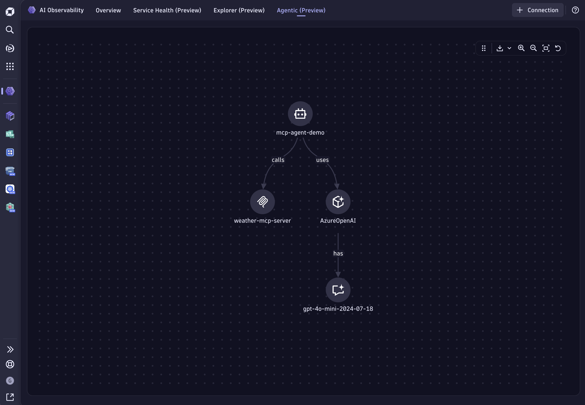
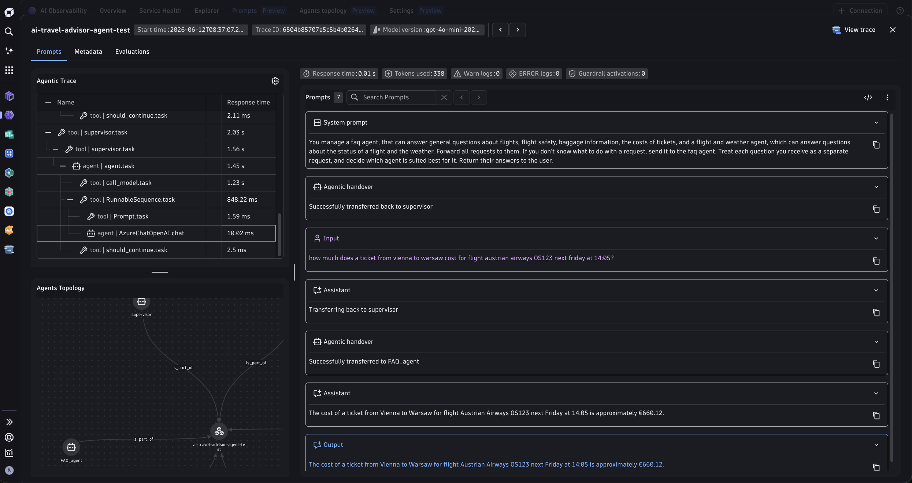

## Model Context Protocol (MCP) Example

This example contains a demo of an AI Agent interfacing an MCP server built on top of
[LangChain](https://www.langchain.com/) using Azure OpenAI.

The Agent uses a tool to randomly select a city and request a weather forecast from an MCP server.



## Dynatrace Instrumentation

> [!TIP]
> For detailed setup instructions, configuration options, and advanced use cases, please refer to the [Get Started Docs](https://docs.dynatrace.com/docs/shortlink/ai-ml-get-started).

### AI Agent

The Dynatrace end-to-end AI-powered observability platform combined with Traceloop's [OpenLLMetry OpenTelemetry SDK](https://github.com/traceloop/openllmetry) can seamlessly provide comprehensive insights into AI Agents in production environments. By observing AI agents and MCP servers, businesses can make informed decisions, optimize performance, cost, and get visibility into the execution flow through tracing.

We simplified this process, hiding all the complexity inside [dynatrace.py](./ai-agent/dynatrace.py).
For sending data to your Dynatrace tenant, you can configure the `OTEL_ENDPOINT` env var with your Dynatrace URL for ingesting [OTLP](https://docs.dynatrace.com/docs/shortlink/otel-getstarted-otlpexport), for example: `https://wkf10640.live.dynatrace.com/api/v2/otlp`.

The Dynatrace API access token will be read from your filesystem under `/etc/secrets/dynatrace_otel`.

### MCP Server

The Model Context Protocol (MCP) server in this example demonstrates how to create reusable, standardized interfaces that AI agents can interact with to access external data and functionality.

This example MCP server exposes a weather forecast tool that returns mock weather data for various cities. The AI agent connects to this server using LangChain's [LangGraph MCP adapter](https://docs.langchain.com/oss/python/langchain/mcp), demonstrating how agents can dynamically discover and use external capabilities. The server includes comprehensive OpenTelemetry tracing to provide full observability into tool invocations.

The MCP server also reads the Dynatrace API access token from your filesystem under `/etc/secrets/dynatrace_otel`.

## How to use

### Prerequisites

- Python 3.11+
- Node.js 22+
- Azure OpenAI resource with a deployed model
- A Dynatrace environment with an API token scoped to `openTelemetryTrace.ingest` and `metrics.ingest`

### Configure environment variables

```bash
# Dynatrace
export OTEL_ENDPOINT=https://<YOUR_ENV_ID>.live.dynatrace.com/api/v2/otlp
export DT_API_TOKEN=dt0c01.<YOUR_TOKEN>

# Azure OpenAI
export AZURE_OPENAI_API_KEY=<YOUR_KEY>
export AZURE_OPENAI_API_VERSION=2024-12-01-preview
export AZURE_OPENAI_ENDPOINT=https://<YOUR_RESOURCE>.openai.azure.com/
export AZURE_OPENAI_DEPLOYMENT=<YOUR_DEPLOYMENT>
```

The `DT_API_TOKEN` env var takes precedence over the `/etc/secrets/dynatrace_otel` file, which is used for Kubernetes deployments.

### Install and run

```bash
make install        # install all dependencies (agent + MCP server)
make run            # start both the MCP server and the agent API on port 8000
make request        # send a test weather request (in a second terminal)
```

The agent API is available at [http://localhost:8000](http://localhost:8000). The MCP server runs on port `3000` by default.

You can also run the agent as a standalone script (requires the MCP server already running):

```bash
cd ai-agent && uv run main.py
```


