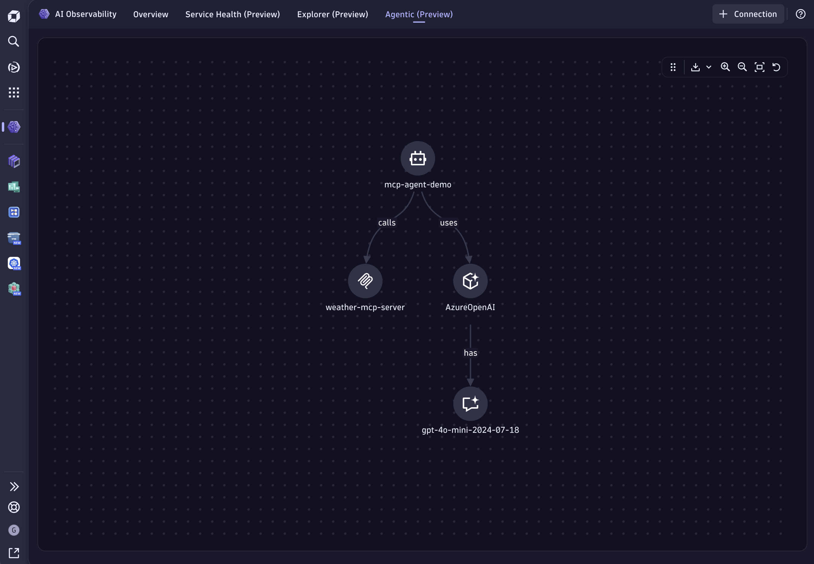

## Model Context Protocol (MCP) Example

This example contains a demo of an AI Agent interfacing an MCP server built on top of
[LangChain](https://www.langchain.com/) using Azure OpenAI.

The Agent uses a tool to randomly select a city and request a weather forecast from an MCP server.



## Dynatrace Instrumentation

> [!TIP]
> For detailed setup instructions, configuration options, and advanced use cases, please refer to the [Get Started Docs](https://docs.dynatrace.com/docs/shortlink/ai-ml-get-started).

### AI Agent

The Dynatrace end-to-end AI-powered observability platform combined with Traceloop's [OpenLLMetry OpenTelemetry SDK](https://github.com/traceloop/openllmetry) can seamlessly provide comprehensive insights into AI Agents in production environments. By observing AI agents and MCP servers, businesses can make informed decisions, optimize performance, cost, and get visibility into the execution flow through tracing.

We simplified this process, hiding all the complexity inside [dynatrace.py](./ai-agent/dynatrace.py).
For sending data to your Dynatrace tenant, configure the `OTEL_ENDPOINT` env var with your Dynatrace [OTLP](https://docs.dynatrace.com/docs/shortlink/otel-getstarted-otlpexport) ingest URL, for example: `https://<YOUR_ENV_ID>.live.dynatrace.com/api/v2/otlp`.

The Dynatrace API access token is read from the `DT_API_TOKEN` environment variable, with a fallback to `/etc/secrets/dynatrace_otel` for Kubernetes deployments.

### MCP Server

The Model Context Protocol (MCP) server in this example demonstrates how to create reusable, standardized interfaces that AI agents can interact with to access external data and functionality.

This example MCP server exposes a weather forecast tool that returns mock weather data for various cities. The AI agent connects to this server using LangChain's [LangGraph MCP adapter](https://docs.langchain.com/oss/python/langchain/mcp), demonstrating how agents can dynamically discover and use external capabilities. The server includes comprehensive OpenTelemetry tracing to provide full observability into tool invocations.

The MCP server reads the same `DT_API_TOKEN` and `OTEL_ENDPOINT` environment variables as the AI agent.

### Derived agent and tool metrics

`make run-collector` runs both processes behind a local OpenTelemetry Collector (`otel-collector-config.yaml`) that derives two GenAI semconv metrics from the spans, with no change to either service:

| Metric | Derived from |
|---|---|
| `gen_ai.invoke_agent.duration` | the graph run (`gen_ai.operation.name = invoke_agent`) |
| `gen_ai.execute_tool.duration` | each tool span (`gen_ai.operation.name = execute_tool`) |

This demo pins `traceloop-sdk` 0.47.3, and at that version `opentelemetry-instrumentation-langchain` sets **no** `gen_ai.*` attributes on chain or tool spans --- only `traceloop.span.kind` and `traceloop.entity.name`. The collector's `transform/traceloop_operation_name` therefore derives the operation name from the span kind (`workflow` to `invoke_agent`, since this root is a `create_react_agent` run; `tool` to `execute_tool`) and mirrors `traceloop.entity.name` onto `gen_ai.tool.name`. Both the locally defined `get_city` tool and the weather tool reached over MCP are LangChain tools by the time the agent calls them, so that name separates the local lookup from the MCP round trip on the same metric.

> [!NOTE]
> Newer versions of the instrumentation (around 0.62.x, which the `langgraph` demos pin) set the spec enum and `gen_ai.tool.name` themselves, so their collector configs filter on those attributes directly and need no transform. Every statement here is guarded on the attribute being absent, so bumping this demo would degrade the transform to a no-op rather than break it.

Both are Histograms in seconds, exported with delta temporality because Dynatrace OTLP metric ingest rejects cumulative metrics. Neither process needs a code change --- both already read `OTEL_ENDPOINT`, so `make run-collector` only points them at the collector instead of at Dynatrace.

The collector renames the agent's `service.name` to `mcp-agent-demo-collector` so a collector run stays distinguishable from a direct-export run. The MCP server keeps `weather-mcp-server`: the cross-service trace between the two is the point of the demo, and a blanket rename would collapse them into one service.

## How to use

### Prerequisites

- Python 3.11+
- Node.js 22+
- Azure OpenAI resource with a deployed model
- A Dynatrace environment with an API token scoped to `openTelemetryTrace.ingest` and `metrics.ingest`

### Configure environment variables

```bash
# Dynatrace
export OTEL_ENDPOINT=https://<YOUR_ENV_ID>.live.dynatrace.com/api/v2/otlp
export DT_API_TOKEN=dt0c01.<YOUR_TOKEN>

# Azure OpenAI
export AZURE_OPENAI_API_KEY=<YOUR_KEY>
export AZURE_OPENAI_API_VERSION=2024-12-01-preview
export AZURE_OPENAI_ENDPOINT=https://<YOUR_RESOURCE>.openai.azure.com/
export AZURE_OPENAI_DEPLOYMENT=<YOUR_DEPLOYMENT>
```

### Install and run

```bash
make install        # install all dependencies (agent + MCP server)
make run            # start both the MCP server and the agent API on port 8000
make run-collector  # or: start both behind a collector that derives the agent metrics
make request        # send a test weather request (in a second terminal)
```

The agent API is available at [http://localhost:8000](http://localhost:8000). The MCP server runs on port `3000` by default.

You can also run the agent as a standalone script (requires the MCP server already running):

```bash
cd ai-agent && uv run main.py
```


