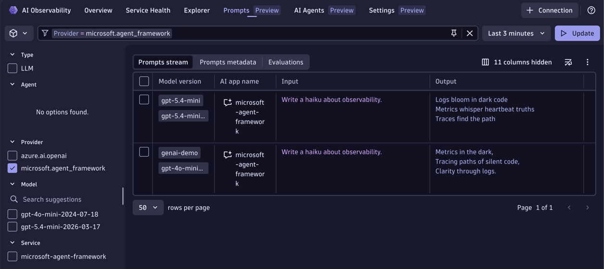

# Microsoft Agent Framework + Dynatrace (OTLP only)

This sample runs a Microsoft Agent Framework app and sends telemetry directly to Dynatrace via OTLP HTTP.

## What this sample does

- Uses `agent-framework` with `OpenAIChatClient`
- Calls one local tool (`get_weather`) during an agent run
- Exports OpenTelemetry traces directly to Dynatrace OTLP ingest
- Prints a trace ID so you can find the run in Dynatrace

## Prerequisites

- Python 3.10+
- A Dynatrace API token with `openTelemetryTrace.ingest`
- Azure OpenAI compatible endpoint and key (some code changes would be needed to use a different model)

## Environment

This folder expects a `.env` file with at least:

```env
OPENAI_API_KEY=...
OPENAI_API_BASE=https://<resource>.openai.azure.com/openai/deployments/<deployment>
OPENAI_API_VERSION=2024-07-01-preview
MODEL=<deployment>

DT_ENDPOINT=https://<tenant>.live.dynatrace.com
DT_API_TOKEN=dt0c01....
```

Notes:
- `OPENAI_API_BASE` can include the deployment path as in this repo.
- The app derives the Azure endpoint from `OPENAI_API_BASE` and uses `MODEL` as the deployment name.

## Install

```bash
cd microsoft-agent-framework
python3 -m venv .venv
source .venv/bin/activate
pip install -r requirements.txt
```

## Run

```bash
cd microsoft-agent-framework
source .venv/bin/activate
python app.py
```

## Dynatrace verification

1. Open Distributed Tracing or AI Observability in Dynatrace.
2. Filter by service name `microsoft-agent-framework`.
   This is fr instance what you would see in the Prompts view.
   

## OTLP setup used by this sample

At runtime, the app sets:

- `OTEL_EXPORTER_OTLP_PROTOCOL=http/protobuf`
- `OTEL_EXPORTER_OTLP_TRACES_ENDPOINT=${DT_ENDPOINT}/api/v2/otlp/v1/traces`
- `OTEL_EXPORTER_OTLP_TRACES_HEADERS=Authorization=Api-Token ${DT_API_TOKEN}`
- `OTEL_SERVICE_NAME=microsoft-agent-framework`

Only traces are exported in this example.
