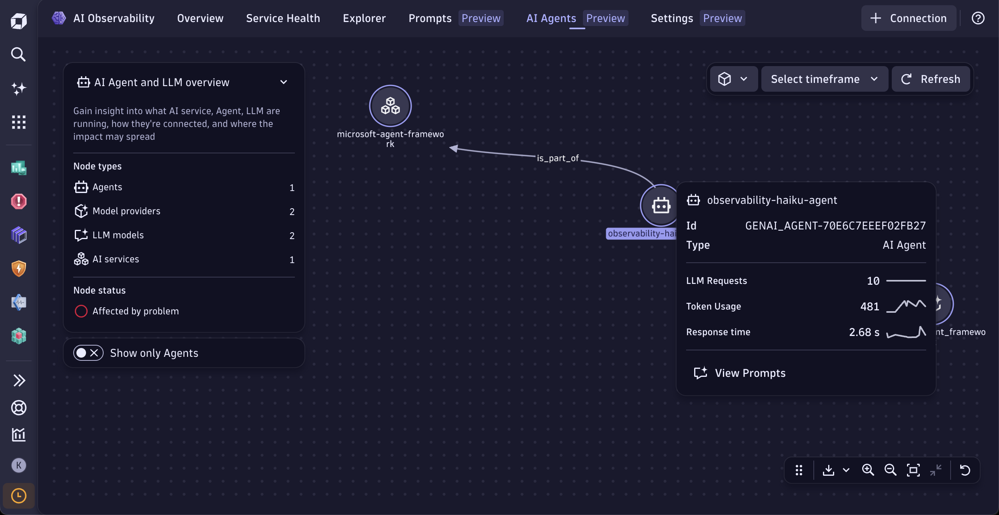

# Microsoft Agent Framework + Dynatrace

This sample instruments a [Microsoft Agent Framework](https://github.com/microsoft/agent-framework) agent with Dynatrace using the framework's native OpenTelemetry support — no additional instrumentation SDK required.

## What this sample does

- Runs an `Agent` that calls Azure OpenAI to write a haiku about observability
- Exports **traces** and **metrics** directly to Dynatrace via OTLP HTTP
- Emits `gen_ai.agent.name`, `gen_ai.conversation.id`, `gen_ai.request.temperature`, prompt and completion content, token usage, and latency out of the box

## How it works

The framework self-instruments via OTel natively. Calling `Agent.run()` produces two nested spans:

- **`invoke_agent`** span — from `AgentTelemetryLayer`, carries `gen_ai.agent.name`, `gen_ai.conversation.id`
- **`chat`** span — from `ChatTelemetryLayer`, carries token counts, model, prompt/completion content

Prompt and completion content (`gen_ai.input.messages` / `gen_ai.output.messages`) are set as span attributes when `enable_sensitive_data=True`, so they travel with traces and require no separate logs endpoint.

Latency (`gen_ai.client.operation.duration`) and token type (`gen_ai.token.type`) are emitted as OTel **metrics** and require a separate metrics endpoint to populate the latency and cost dashboard views in Dynatrace.

## Prerequisites

- Python 3.10+
- [uv](https://docs.astral.sh/uv/getting-started/installation/)
- A Dynatrace API token with:
  - `openTelemetryTrace.ingest` — for traces and prompts
  - `metrics.ingest` — for latency charts and cost dashboard
- An Azure OpenAI endpoint and key

## Environment

Copy `.env.sample` to `.env` and fill in the values:

```env
OPENAI_API_KEY=...
OPENAI_API_BASE=https://<resource>.openai.azure.com/openai/deployments/<deployment>
OPENAI_API_VERSION=2025-04-01-preview
MODEL=<deployment>
TEMPERATURE=1  # model-dependent: some models only accept the default (1)

DT_ENDPOINT=https://<tenant>.live.dynatrace.com
DT_API_TOKEN=dt0c01....
```

`OPENAI_API_BASE` can include the full deployment path — the app derives the Azure endpoint from it automatically.

## Install and run

```bash
cd microsoft-agent-framework/opentelemetry
make install
make run
```

## Dynatrace AI Observability views

| View | What to look for |
|------|-----------------|
| **Overview** → Response time per model | p99 / mean latency per model (requires metrics endpoint) |
| **Cost dashboard** | Input and output token cost split by lane (requires metrics endpoint) |
| **Prompts** | Prompt and completion text, conversation grouping by `gen_ai.conversation.id` |
| **Agent filter** | `observability-haiku-agent` appears under the agent quick filter |




## OTLP signals exported

| Signal | Endpoint | Key attributes |
|--------|----------|----------------|
| Traces | `/api/v2/otlp/v1/traces` | `gen_ai.agent.name`, `gen_ai.input/output.messages`, token counts |
| Metrics | `/api/v2/otlp/v1/metrics` | `gen_ai.client.operation.duration`, `gen_ai.client.token.usage` |

Metrics are exported with `OTEL_EXPORTER_OTLP_METRICS_TEMPORALITY_PREFERENCE=delta`, which Dynatrace requires.
