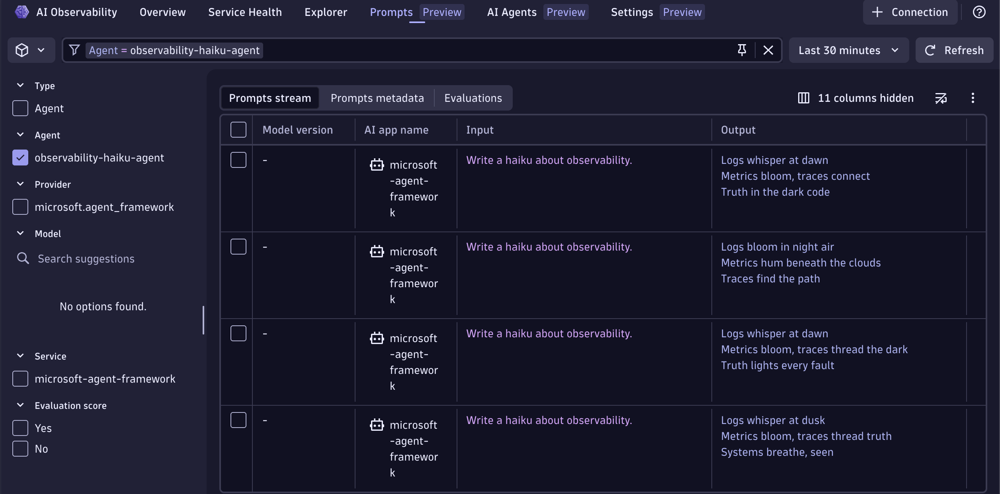
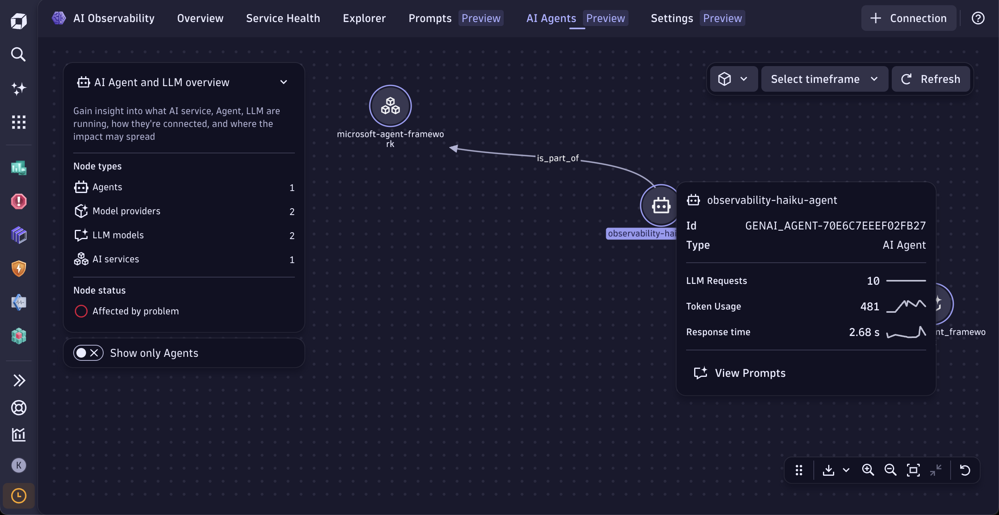

# Microsoft Agent Framework + Dynatrace

This sample instruments a [Microsoft Agent Framework](https://github.com/microsoft/agent-framework) agent with Dynatrace using the framework's native OpenTelemetry support — no additional instrumentation SDK required.

## What this sample does

- Runs a two-agent workflow against Azure OpenAI: an analyst agent calls a tool to read a service's golden signals, then a poet agent turns the diagnosis into a haiku
- Exports **traces**, **metrics** and **logs** directly to Dynatrace via OTLP HTTP
- Emits `gen_ai.agent.name`, `gen_ai.conversation.id`, `gen_ai.request.temperature`, prompt and completion content, token usage, and latency out of the box
- Optionally routes through a local OTel Collector that derives the GenAI **agent, tool and workflow duration metrics** from the spans

## How it works

The framework self-instruments via OTel natively. Running the workflow produces a nested span tree:

- **`workflow.run`** span — from the framework's workflow tracer; note it carries no `gen_ai.operation.name`
- **`invoke_agent`** span per agent — from `AgentTelemetryLayer`, carries `gen_ai.agent.name`, `gen_ai.conversation.id`
- **`execute_tool`** span — from the function-invocation layer, carries `gen_ai.tool.name`
- **`chat`** span — from `ChatTelemetryLayer`, carries token counts, model, prompt/completion content

Prompt and completion content (`gen_ai.input.messages` / `gen_ai.output.messages`) are set as span attributes when `enable_sensitive_data=True`, so they travel with traces and do not depend on the logs endpoint.

Logs are exported too, and are trace-correlated so they appear on the span they were emitted inside. Dynatrace does not synthesize `log.source` for OTLP log ingest, so records arrive with that field empty; `make run-collector` fills it in with a `transform` processor, using the emitting scope name. On a plain `make run` the field stays empty. Note `log.source` is permission-relevant in Dynatrace. One caveat worth knowing: `configure_otel_providers()` attaches its OTel logging handler to the **`agent_framework` logger only**, so anything logged outside that namespace never becomes a log record. The demo logs under `agent_framework.demo` for that reason — copy that pattern if you add logging of your own.

Latency (`gen_ai.client.operation.duration`) and token type (`gen_ai.token.type`) are emitted as OTel **metrics** and require a separate metrics endpoint to populate the latency and cost dashboard views in Dynatrace.

### Derived agent, tool and workflow metrics

The framework emits the two `gen_ai.client.*` metrics natively but none of the GenAI agent/tool/workflow duration metrics. `make run-collector` starts a local collector that derives them from the spans above with three `spanmetrics` connectors:

| Metric | Derived from | Unit |
|--------|--------------|------|
| `gen_ai.invoke_agent.duration` | spans with `gen_ai.operation.name == "invoke_agent"` | `s` |
| `gen_ai.execute_tool.duration` | spans with `gen_ai.operation.name == "execute_tool"` | `s` |
| `gen_ai.invoke_workflow.duration` | spans named `workflow.run` | `s` |

All three are Histogram instruments at Development stability in the [GenAI metrics semconv](https://github.com/open-telemetry/semantic-conventions-genai/blob/main/docs/gen-ai/gen-ai-metrics.md).

Each connector also emits a `<namespace>.calls` counter, and `spanmetrics` has no config key to disable it. Those three counters are not spec metrics and nothing queries them, so a `filter/drop_derived_calls` processor drops them on the metrics pipeline before export. It matches the three names exactly rather than a `*.calls` pattern, so it cannot swallow the `inference_calls` / `tool_calls` metrics below.

`make run-collector` reports as `service.name = microsoft-agent-framework-collector`, so its data stays separate from the direct-export run and the e2e suite can assert the derived metrics unambiguously.

### Agent call-count metrics

`gen_ai.invoke_agent.inference_calls` and `gen_ai.invoke_agent.tool_calls` are Histograms of the calls made *during a single agent invocation*, so they cannot be derived at the collector: counting `chat` / `execute_tool` spans gives a running total, not a distribution over invocations. They are recorded in-process instead, by the framework middleware in `agent_metrics.py`, and are exported on both the direct and collector paths.

| Metric | Recorded by | Unit |
|--------|-------------|------|
| `gen_ai.invoke_agent.inference_calls` | `chat_middleware`, closed out per invocation | `{inference_call}` |
| `gen_ai.invoke_agent.tool_calls` | `function_middleware`, closed out per invocation | `{tool_call}` |

Microsoft Agent Framework does not emit these itself as of 1.13.0. A chat or tool call made outside an agent invocation is not counted, matching the metrics' per-invocation definition.

The collector needs the Bindplane distro image (see `COLLECTOR_IMAGE` in the Makefile) and holds the Dynatrace token itself, so the app sends no `Authorization` header when routed through it.

> [!NOTE]
> This example is not supported on Windows. `agent-framework`'s dependency tree includes `azure-search-documents==11.7.0b2` which is unavailable on PyPI for Python 3.14+ on Windows.

## Prerequisites

- Python 3.10+
- [uv](https://docs.astral.sh/uv/getting-started/installation/)
- A Dynatrace API token with:
  - `openTelemetryTrace.ingest` — for traces and prompts
  - `metrics.ingest` — for latency charts and cost dashboard
  - `logs.ingest` — for the application log records
- An Azure OpenAI endpoint and key

## Environment

Copy `.env.sample` to `.env` and fill in the values:

```env
OPENAI_API_KEY=...
OPENAI_API_BASE=https://<resource>.openai.azure.com/openai/deployments/<deployment>
OPENAI_API_VERSION=2025-04-01-preview
MODEL=<deployment>
TEMPERATURE=1  # model-dependent: some models only accept the default (1)

DT_ENDPOINT=https://<tenant>.live.dynatrace.com
DT_API_TOKEN=dt0c01....
```

`OPENAI_API_BASE` can include the full deployment path — the app derives the Azure endpoint from it automatically.

## Install and run

```bash
cd microsoft-agent-framework/opentelemetry
make install

# export straight to Dynatrace
make run

# or route through the local collector to also get the derived duration metrics
make run-collector
make stop   # tears the collector down again
```

## Dynatrace AI Observability views

| View | What to look for |
|------|-----------------|
| **Overview** → Response time per model | p99 / mean latency per model (requires metrics endpoint) |
| **Cost dashboard** | Input and output token cost split by lane (requires metrics endpoint) |
| **Prompts** | Prompt and completion text, conversation grouping by `gen_ai.conversation.id` |
| **Agent filter** | `observability-analyst-agent` and `observability-haiku-agent` appear under the agent quick filter |
| **Tool calls** | `get_service_health` appears as an `execute_tool` span under the analyst agent |





## OTLP signals exported

| Signal | Endpoint | Key attributes |
|--------|----------|----------------|
| Traces | `/api/v2/otlp/v1/traces` | `gen_ai.agent.name`, `gen_ai.input/output.messages`, token counts |
| Logs | `/api/v2/otlp/v1/logs` | application log records under the `agent_framework` logger, correlated to spans by trace ID; `log.source` set by the collector |
| Metrics | `/api/v2/otlp/v1/metrics` | `gen_ai.client.operation.duration`, `gen_ai.client.token.usage`, `gen_ai.invoke_agent.inference_calls`, `gen_ai.invoke_agent.tool_calls`; with `make run-collector` also `gen_ai.invoke_agent.duration`, `gen_ai.execute_tool.duration`, `gen_ai.invoke_workflow.duration` |

Metrics are exported with `OTEL_EXPORTER_OTLP_METRICS_TEMPORALITY_PREFERENCE=delta`, which Dynatrace requires.
