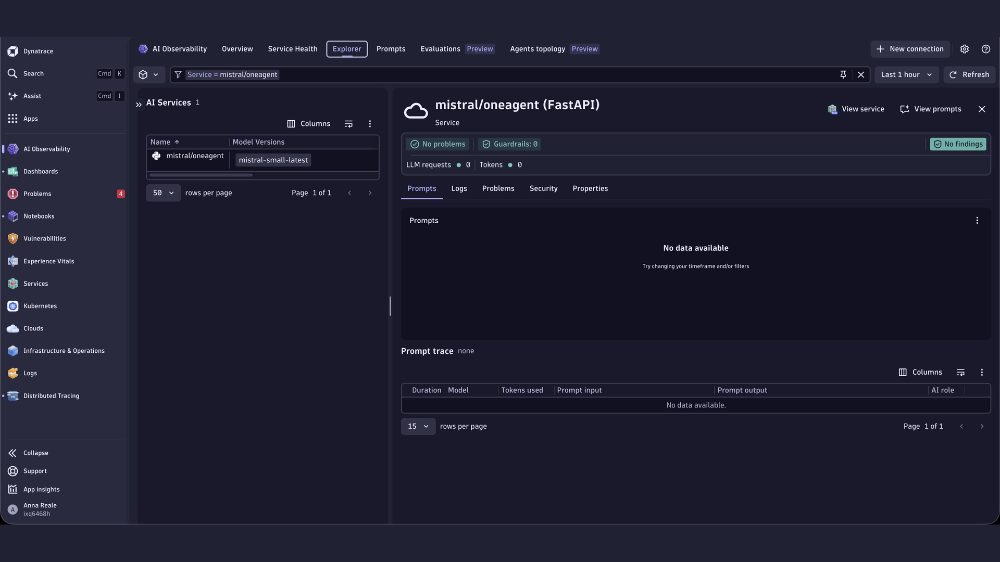
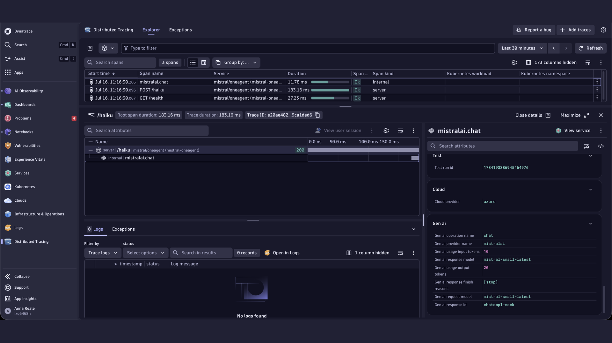

# Mistral + OneAgent Demo

Demonstrates tracing Mistral AI SDK API calls with Dynatrace via OneAgent auto-instrumentation.

> **Preview sensor** — The Mistral AI sensor is experimental. Request and response content (prompt input and completion text) are not captured; only metadata attributes (`gen_ai.provider.name`, `gen_ai.request.model`, token counts, duration) are emitted. The Prompts tab in AI Observability therefore shows no data for this service.

## Prerequisites

- Python 3.11+
- [uv](https://docs.astral.sh/uv/getting-started/installation/)
- Mistral API key (`MISTRAL_API_KEY`)
- Dynatrace OneAgent installed on the host

## Quick Start

1. Copy `.env.sample` to `.env` and fill in your credentials
2. `make install` — install dependencies
3. `make run` — start the app on port 8000
4. `make request` — send a test haiku request (in a second terminal)

## Environment Variables

| Variable | Required | Default | Description |
|----------|----------|---------|-------------|
| `MISTRAL_API_KEY` | Yes | — | Mistral API key |
| `MODEL` | No | `mistral-small-latest` | Model to use |

## Makefile Targets

| Target | Description |
|--------|-------------|
| `make install` | Install Python dependencies |
| `make run` | Run app locally on port 8000 |
| `make build` | Build container image (`APP_IMAGE`, `BUILD_PLATFORM`) |
| `make push` | Build and push image to registry |
| `make request` | POST /haiku to localhost:8000 |
| `make help` | Show all available targets |

## Screenshots

## Smartscape service entity

OneAgent uses the `FastAPI(title=...)` parameter to assign a Smartscape SERVICE entity. Apps with the same title on the same host are merged into one entity, which pollutes the topology. Each oneagent demo sets a unique title matching its service name so that each service gets its own distinct SERVICE (and GENAI_SERVICE) entity in Smartscape.
