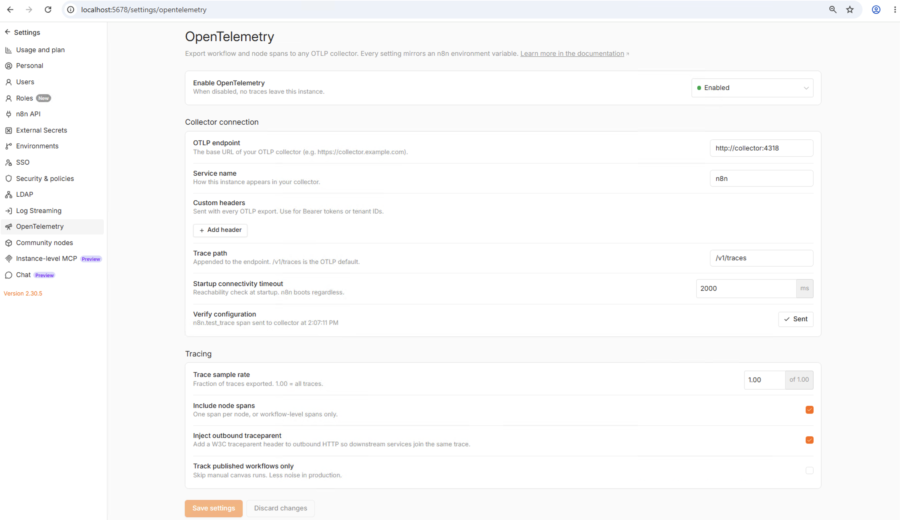
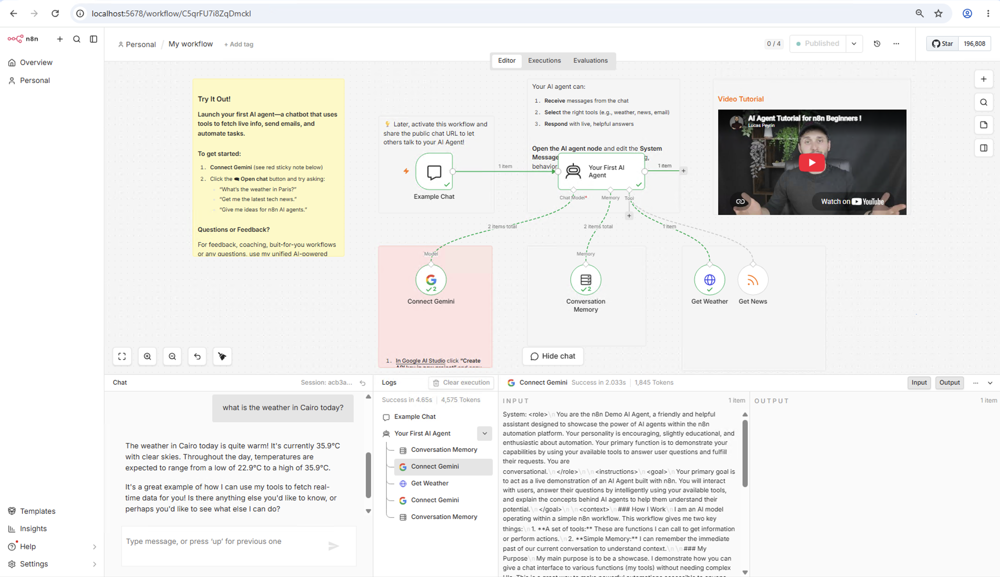
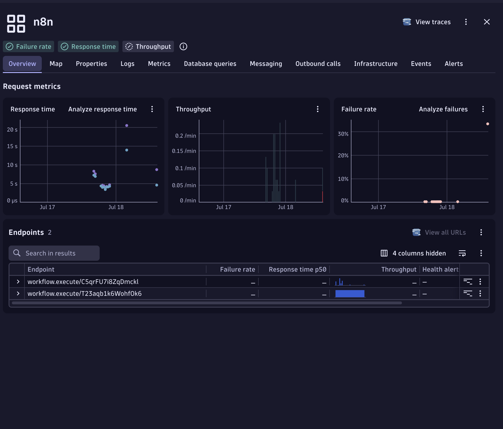
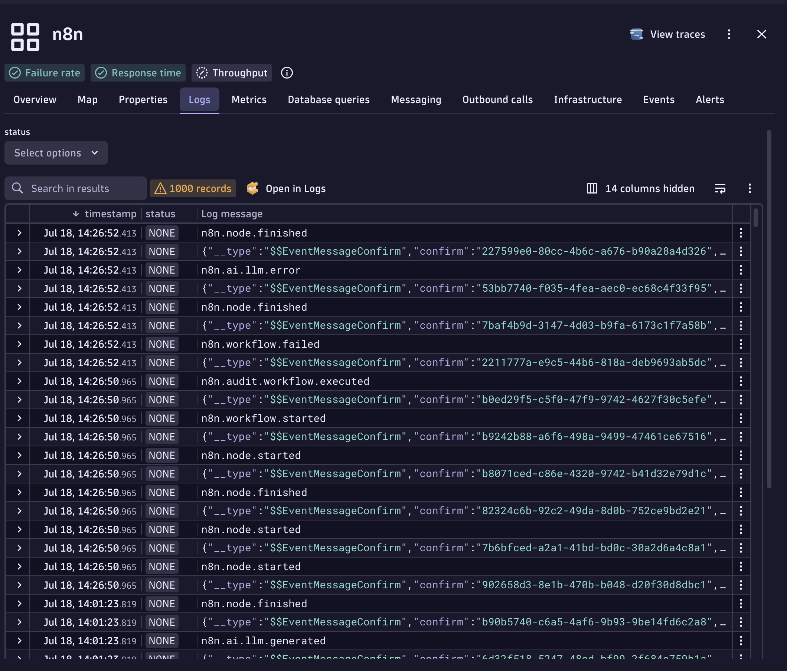
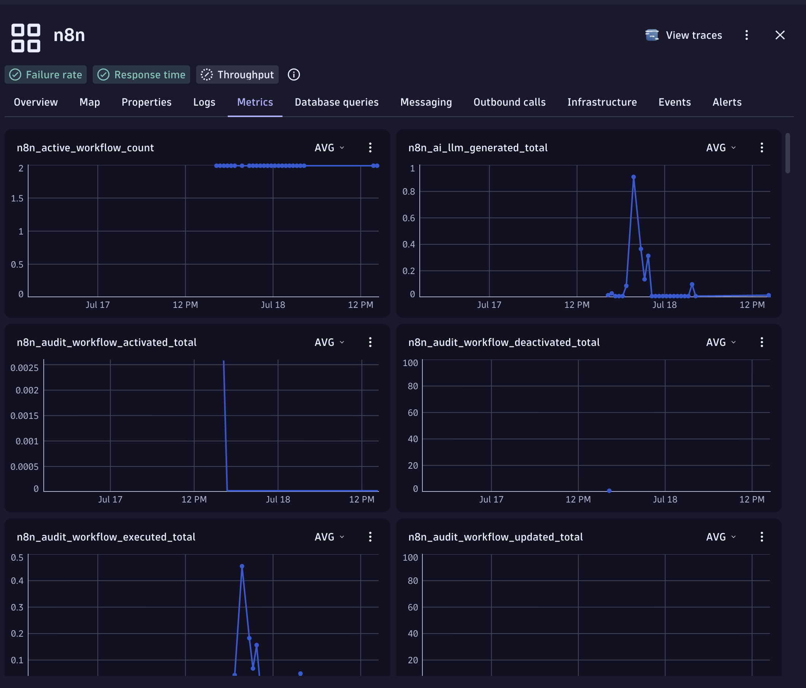
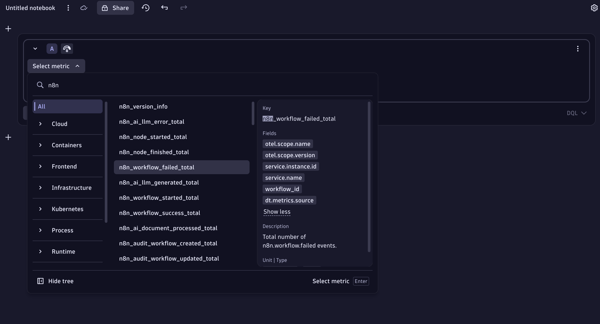
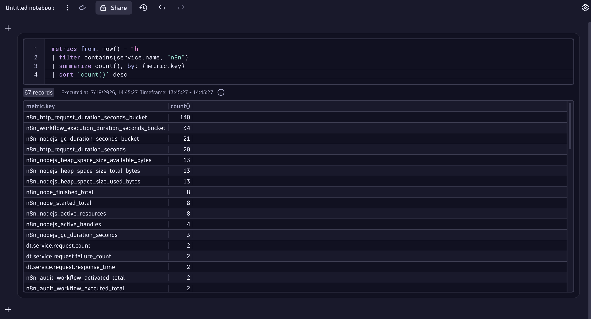

# n8n + Dynatrace
This sample instruments n8n workflows with Dynatrace using OpenTelemetry, routed through an OpenTelemetry Collector that captures Metrics, Traces and Logs and do the required tagging on Metrics and Logs, and transformation on Traces for full discovery and granularity in Dynatrace, with Ready made Dashboards for instant value.

## What this sample does

- Installs a [Self-Hosted n8n](https://docs.n8n.io/deploy/host-n8n) - (Free Community Edition is fully compatabile) on Docker 
- Enables OpenTelemetry on n8n
- Runs an [OpenTelemetry Collector](#opentelemetry-collector) on Docker that captures n8n self-hosted instance telemetry
- Emits `Workflow Traces`, `LLM Usage`, `Instance and Execution Metrics` from OTEL Collector to Dynatrace via OTLP HTTP
- Dashboards to visualize Workflows Health and Performance, LLM Usage and Audit Logs
  
## How it works

- The n8n self-instruments via OTel natively.
- Telemetry will be routed through a OTEL Collector, that is configured to emit, enrich, associate and retransform the traces, metrics, and logs to be properly ingested by Dynatrace
- Everything will work out of the box at this point, the guide will provide the necessary logs parsing queries and Dashbaords to get you instant value

## How to use

### Prerequisites
- **Docker** and **Docker Compose** installed on your host
- A **Dynatrace environment** with an **API token** that has the **`openpipeline:traces:ingest`** and **`openpipeline:metrics:ingest`** and **`openpipeline:logs:ingest`** scopes

### Environment
Copy `.env.sample` to `.env` and fill in **DT_ENVIRONMENT_URL** and **DT_API_TOKEN** environment variables:

```env
# WARNING
# This is a sample file only. Rename to .env
# DO NOT STORE your .env file in Git!
#
# git clone https://github.com/n8n-io/n8n-hosting
# cd n8n-hosting/n8n-hosting/docker-compose/withPostgres
# docker compose up -d
#
POSTGRES_USER=admin
POSTGRES_PASSWORD=dynatrace
POSTGRES_DB=n8n

POSTGRES_NON_ROOT_USER=admin
POSTGRES_NON_ROOT_PASSWORD=dynatrace
# Enable metrics AG
# https://docs.n8n.io/hosting/configuration/environment-variables/endpoints/
N8N_METRICS=true
#N8N_METRICS_INCLUDE_CACHE_METRICS=true
N8N_METRICS_INCLUDE_MESSAGE_EVENT_BUS_METRICS=true
N8N_METRICS_INCLUDE_WORKFLOW_ID_LABEL=true
N8N_METRICS_INCLUDE_NODE_TYPE_LABEL=true
N8N_METRICS_INCLUDE_CREDENTIAL_TYPE_LABEL=true
N8N_METRICS_INCLUDE_API_ENDPOINTS=true
N8N_METRICS_INCLUDE_API_PATH_LABEL=true
N8N_METRICS_INCLUDE_API_METHOD_LABEL=true
N8N_METRICS_INCLUDE_API_STATUS_CODE_LABEL=true
#N8N_METRICS_INCLUDE_QUEUE_METRICS=true
#N8N_METRICS_QUEUE_METRICS_INTERVAL=true

# Scrape logs and metrics to Dynatrace

#The Service Name that will appear in Dynatrace Services (has to be the same service name set in n8n Opentelemtry settings)
DT_SERVICE_NAME=n8n

# Replace abc12345 below with your environment ID
DT_ENVIRONMENT_URL=https://abc12345.live.dynatrace.com

# API Token requires these permissions:
# "ingest metrics" and "ingest logs" and "ingest traces"
DT_API_TOKEN=dt0c01.******.******
```

### Observe the OTEL Collector Processor Configuration

Notable observations that make the instrumentation work correctly in Dynatrace:
- **resource/n8n_logs**
  - Sets the `service.name` attribute to associate logs with the corresponding discovered service in Dynatrace.
- **resource/n8n_metrics**
  - Sets the `service.name` attribute to associate metrics with the corresponding discovered service in Dynatrace.
- **transform/n8n**
  - Sets the `workflow.execute` parent span as the root span and assigns it the `server` span kind, making the n8n service discoverable in Dynatrace.
  - Renames the default `workflow.execute` parent spans to `workflow.execute/[workflow.id]`, providing granular service endpoints for each workflow.
  - Renames the default `node.execute` child spans to `node.execute/[node.type]`, creating meaningful inner span names that clearly represent the individual node types executed within a workflow.

```yaml
processors:
  batch:
    send_batch_size: 500
    timeout: 2s
  cumulativetodelta:
  # --- To associate the logs with the n8n discovered Service in Dyantrace ---
  resource/n8n_logs:
    attributes:
      - action: insert
        key: service.name
        value: ${env:DT_SERVICE_NAME}
  # --- To associate the Metrics with the n8n discovered Service in Dyantrace ---
  resource/n8n_metrics:
    attributes:
      - action: upsert
        key: service.name
        value: ${env:DT_SERVICE_NAME}
  transform/n8n:
    trace_statements:
      - context: span
        statements:
          # --- set workflow.execute parent span as root and type server to make the n8n service discoverable in dynatrace ---
          - set(kind, 2)
            where IsMatch(name, "^workflow\\.execute")
            and resource.attributes["service.name"] == "${env:DT_SERVICE_NAME}"
          - set(attributes["request.is_root_span"], true)
            where IsMatch(name, "^workflow\\.execute")
            and resource.attributes["service.name"] == "${env:DT_SERVICE_NAME}"
          # ---default workflow.execute parent spans rename to workflow.execute/[workflow.id] ---
          - set(name, Concat(["workflow.execute/", attributes["n8n.workflow.id"]], ""))
            where IsMatch(name, "^workflow\\.execute")
            and resource.attributes["service.name"] == "${env:DT_SERVICE_NAME}"
            and attributes["n8n.workflow.id"] != nil
          # --- default node.execute inner spans rename to node.execute/[node.type] ---
          - set(name, Concat(["node.execute/", attributes["n8n.node.type"]], ""))
            where IsMatch(name, "^node\\.execute$")
            and resource.attributes["service.name"] == "${env:DT_SERVICE_NAME}"
            and attributes["n8n.node.type"] != nil
```


### Install and run
 ```bash
docker compose up
```

### n8n Configuration
- After Installation go to http://localhost:5678/settings/opentelemetry
- Set `Enable OpenTelemetry` to **Enabled**
- Set `OTLP endpoint` to `http://collector:4318`
- Set `Service Name` to `n8n`
  - Note: If you use a different Service Name, you'll have to update the "DT_SERVICE_NAME" in the .env file and re-run "docker compose up", and modify the Dashboard $n8nServiceName variable value)
- Enable `Include node spans`
- Disable `Track published workflows only`
- Click on `Verify configuration` to confirm the connectivity to the OTEL Collector
- Click on `Save settings`
  

### import sample workflow in n8n
- Import this [n8n Workflow Template](https://n8n.io/workflows/6270-build-your-first-ai-agent/) that has an AI Node to test the LLM Usage, or you can copy it from the n8n_workflow_sample folder.
- Once Imported, the template itself has instructions to get a Free Gemini API Key, and Test the Chat.
- The default model set in the "Connect Gemini" Node will fail as it is not supported anymore, but this is actually a good thing where you can test failed workflows, so give it a couple of failed runs.
- Change the model to `models/gemini-3.1-flash-lite` in the "Connect Gemini" Node for the Workflow to complete succesfully.
  
- Publish the Model from the Top right, and open the "Example Chat" node to get the production url of the published workflow to test it from there
- Execute the Workflow multiple times, one with the correct Gemini Model and one with the old Gemini Model to have proper Data ingested to Dynatrace.

### Verify in Dynatrace

- Verify Traces Ingestion
```dql
fetch spans, from:now()-1h
| filter service.name == "n8n" //replace with the service name you configured in the n8n settings
| sort timestamp desc
| limit 50
```
- Verify Logs Ingestion
```dql
fetch logs, from:now()-1h
| filter service.name == "n8n" //replace with the service name you configured in the n8n settings
| sort timestamp desc
| limit 50
```
- Verify Metrics Ingestion
```dql
metrics from: now() - 1h
| filter contains(service.name, "n8n")
| summarize count(), by: {metric.key}
| sort `count()` desc
```

### Import the Dashboard
Finally Import `n8n Details Dashboard.json` from the dashboards folder

## Dynatrace AI Observability views

### Dashboard
  TBC
  - Associated
  - 
### Service Discovery
- The N8N Service will be discovered showing an Endpoint for each WorkflowId, with associated Logs and Metrics
  
  
  
  

### Traces
TBC
- workflow id, node type
  
### Metrics
- Approximatly 65 Metrics captured variying workflow, nodes, instance, node.js process statistics that can be captured in Dashboards, Notebooks or Anomaly detection.
  
  
  
  
### Logs
  TBC
  - Get AI Nodes Log Entry (Contains Prompts, Model, Tokens Usage, Workflow Details)
    ```dql
    fetch logs
    | search("EventMessageAiNode")
    ```
  - Get Token Usage (Total, Prompt, Completion) for each AI Node along with the workflow details
    ```dql
    fetch logs, from: now() - 7d
    | filter contains(content, "n8n.ai.llm.generated")
    | fieldsAdd
        ai_response       = jsonPath(content, "$.payload.msg.response.response.generations[0][0].text"),
        completion_tokens = toLong(jsonPath(content, "$.payload.msg.response.tokenUsage.completionTokens")),
        prompt_tokens     = toLong(jsonPath(content, "$.payload.msg.response.tokenUsage.promptTokens")),
        total_tokens      = toLong(jsonPath(content, "$.payload.msg.response.tokenUsage.totalTokens")),
        messages_raw      = jsonPath(content, "$.payload.msg.messages[0]"),
        workflow_name     = jsonPath(content, "$.payload.workflowName"),
        execution_id      = jsonPath(content, "$.payload.executionId"),
        node_name         = jsonPath(content, "$.payload.nodeName"),
        model_name        = jsonPath(content, "$.payload.msg.options.model")
    | filter isNotNull(total_tokens)
    | fieldsAdd last_human_prompt = arrayLast(splitString(messages_raw, "\nHuman: "))
    | fieldsAdd last_human_prompt = arrayFirst(splitString(last_human_prompt, "\nAI:"))
    | filter isNotNull(ai_response) AND stringLength(ai_response) > 0
    | fields timestamp, execution_id, workflow_name, node_name, model_name,
             last_human_prompt, ai_response, completion_tokens, content
    | sort completion_tokens desc
    ```
  - Associate Workflow Traces with n8n Logs
    ```dql
    fetch logs, from: now() - 24h
    | filter service.name == "n8n"
    | parse content, "JSON:json_content"
    | fieldsAdd executionId = json_content[payload][executionId]
    | fieldsAdd workflowId  = json_content[payload][workflowId]
    | fieldsAdd joinKey = concat(toString(executionId), "|", toString(workflowId))
    | join [
        fetch spans, from: now() - 24h
        | filter service.name == "n8n" and isNotNull(n8n.execution.id)
        | summarize traceId = takeAny(trace.id), workflowName = takeAny(n8n.workflow.name),
            by: { joinKey = concat(toString(n8n.execution.id), "|", toString(n8n.workflow.id)) }
      ], on: { joinKey },
         fields: { traceId, workflowName }
    | fields timestamp, executionId, workflowId, workflowName, traceId, content
    ```
  - Workflow Errors from Logs
    ```dql
    fetch logs, from: now() - 7d
    | filter contains(content, "n8n.workflow.failed")
    | fieldsAdd
        errorMessage      = jsonPath(content, "$.payload.errorMessage"),
        workflowName      = jsonPath(content, "$.payload.workflowName"),
        workflowId        = jsonPath(content, "$.payload.workflowId"),
        executionId       = jsonPath(content, "$.payload.executionId"),
        errorNodeType     = jsonPath(content, "$.payload.errorNodeType"),
        lastNodeExecuted  = jsonPath(content, "$.payload.lastNodeExecuted")
    | filter isNotNull(errorMessage) AND errorMessage != ""
    | fieldsAdd errorNodeType = coalesce(errorNodeType, concat("node: ", lastNodeExecuted))
    | fields timestamp, executionId, workflowName, workflowId, errorNodeType, errorMessage
    | sort timestamp desc
    ```
  - Get Prompt Conversation history by Wokrflow Execution Id (Replace "161" with your execution ID)
    ```dql
    fetch logs, from: now() - 7d
    | filter contains(content, "EventMessageAiNode")
    | fieldsAdd executionId = jsonPath(content, "$.payload.executionId")
    | filter executionId == "161"
    | fieldsAdd
        messages_raw  = jsonPath(content, "$.payload.msg.messages[0]"),
        last_ai_reply = jsonPath(content, "$.payload.msg.response.response.generations[0][0].text"),
        totalTokens   = toLong(jsonPath(content, "$.payload.msg.response.tokenUsage.totalTokens"))
    | filter isNotNull(totalTokens)
    | sort totalTokens desc
    | limit 1
    
    // Append the final AI reply as the last turn
    | fieldsAdd messages_raw = if(
        isNotNull(last_ai_reply) AND stringLength(last_ai_reply) > 0,
        concat(messages_raw, "\nAI: ", last_ai_reply),
        else: messages_raw
      )
    
    // Split into turns
    | fieldsAdd messages_raw  = replaceString(messages_raw, "\nHuman:", "|||Human:")
    | fieldsAdd messages_raw  = replaceString(messages_raw, "\nAI:",    "|||AI:")
    | fieldsAdd turns         = arrayRemoveNulls(splitString(messages_raw, "|||"))
    | fieldsAdd ones          = iCollectArray(if(isNotNull(turns[]), 1, else: 1))
    | fieldsAdd indices       = arrayCumulativeSum(ones)
    | fieldsAdd indexed_turns = iCollectArray(concat(toString(toLong(indices[])), "§", turns[]))
    | expand indexed_turn = indexed_turns
    | filter trim(indexed_turn) != ""
    | parse indexed_turn, "LONG:seq '§' LD:role ':' DATA:message"
    | fieldsAdd role    = trim(role)
    | fieldsAdd message = trim(message)
    | sort seq asc
    | fields seq, role, message
    ```


## OTLP signals exported
TBC

## AI Observability Smartscape (Optional) (Experimentatl)

