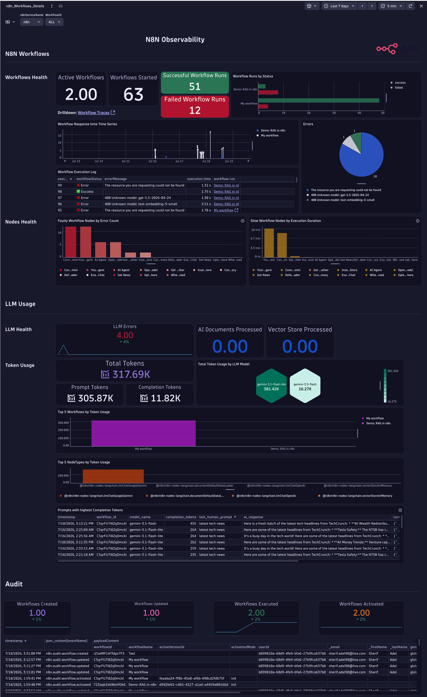
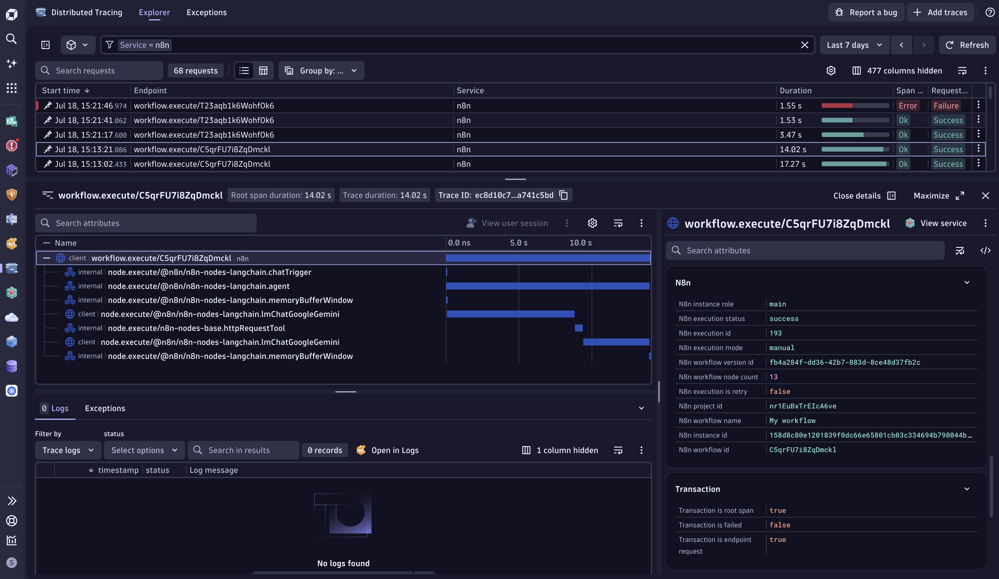
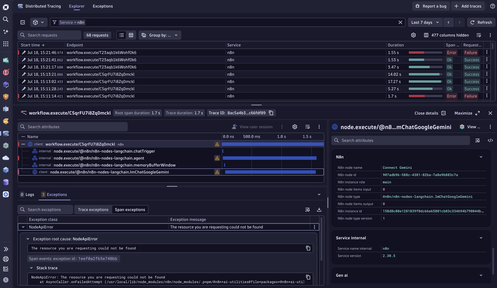
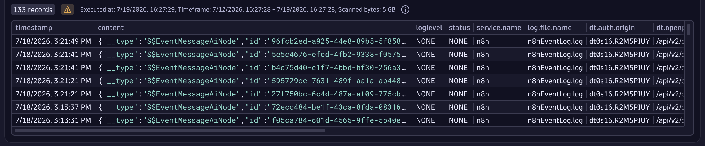
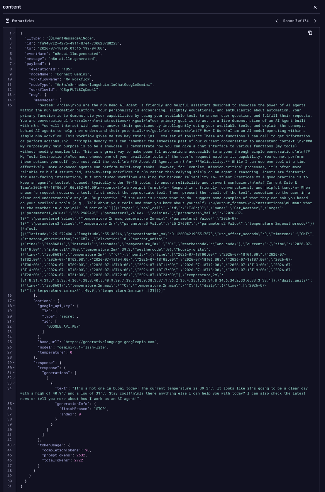
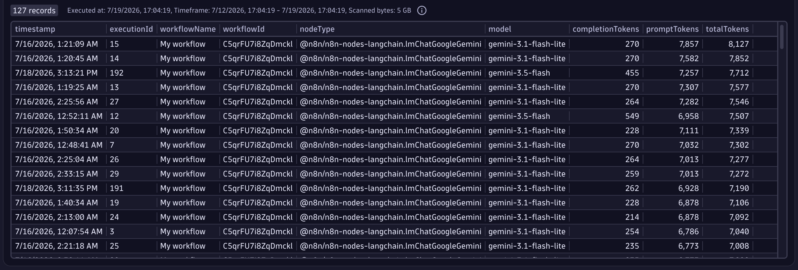
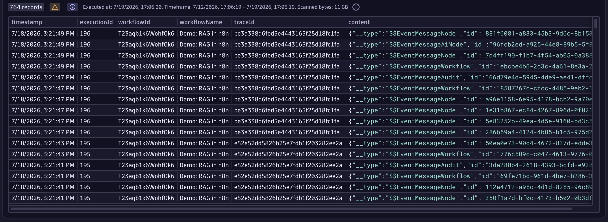
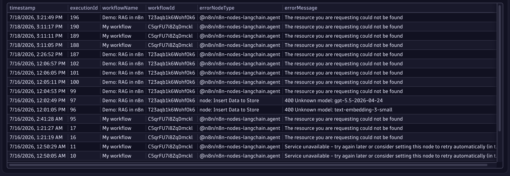
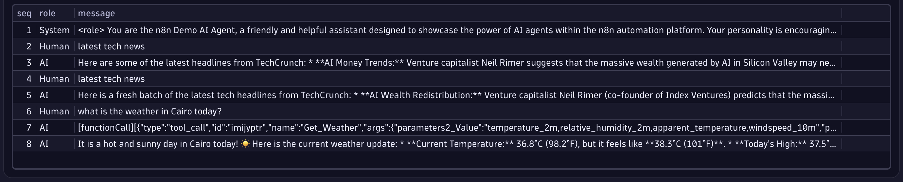

# n8n + Dynatrace

This sample demonstrates how to instrument n8n workflows with Dynatrace using OpenTelemetry. Telemetry is routed through an OpenTelemetry Collector that captures metrics, traces, and logs, enriches them with the required metadata, and performs trace transformations to enable full workflow by Id discovery and granular node traces and LLM Usage observability in Dynatrace. The sample also includes ready-made dashboards for immediate visibility and value.

## What this sample does

- Deploys a [Self-Hosted n8n](https://docs.n8n.io/deploy/host-n8n) instance (the free Community Edition is fully supported) using Docker.
- Enables native OpenTelemetry instrumentation in n8n.
- Deploys an [OpenTelemetry Collector](#opentelemetry-collector) using Docker to collect telemetry from the self-hosted n8n instance.
- Exports `Workflow Traces`, `LLM Usage`, and `Instance & Execution Metrics` to Dynatrace using OTLP.
- Provides dashboards to visualize workflow health, performance, LLM consumption, and audit logs.

## How it works

- n8n generates telemetry through its native OpenTelemetry instrumentation.
- Telemetry is routed through an OpenTelemetry Collector that enriches metrics and logs, associates related telemetry, and transforms traces to optimize ingestion and analysis in Dynatrace.
- Once deployed, the solution works out of the box with the configuration made in the OTEL Collector. This guide provides the required log parsing rules, dashboards, and configuration to help you gain immediate observability value.

## How to use

### Prerequisites

- **Docker** and **Docker Compose** installed on the host.
- A **Dynatrace environment** with an **API token** that includes the following scopes:
  - `openpipeline:traces:ingest`
  - `openpipeline:metrics:ingest`
  - `openpipeline:logs:ingest`

### Environment

Copy `.env.sample` to `.env` and populate the following environment variables:

- **DT_ENVIRONMENT_URL**
- **DT_API_TOKEN**

```env
# WARNING
# This is a sample file only. Rename to .env
# DO NOT STORE your .env file in Git!
#
# git clone https://github.com/n8n-io/n8n-hosting
# cd n8n-hosting/n8n-hosting/docker-compose/withPostgres
# docker compose up -d
#
POSTGRES_USER=admin
POSTGRES_PASSWORD=dynatrace
POSTGRES_DB=n8n

POSTGRES_NON_ROOT_USER=admin
POSTGRES_NON_ROOT_PASSWORD=dynatrace
# Enable metrics AG
# https://docs.n8n.io/hosting/configuration/environment-variables/endpoints/
N8N_METRICS=true
#N8N_METRICS_INCLUDE_CACHE_METRICS=true
N8N_METRICS_INCLUDE_MESSAGE_EVENT_BUS_METRICS=true
N8N_METRICS_INCLUDE_WORKFLOW_ID_LABEL=true
N8N_METRICS_INCLUDE_NODE_TYPE_LABEL=true
N8N_METRICS_INCLUDE_CREDENTIAL_TYPE_LABEL=true
N8N_METRICS_INCLUDE_API_ENDPOINTS=true
N8N_METRICS_INCLUDE_API_PATH_LABEL=true
N8N_METRICS_INCLUDE_API_METHOD_LABEL=true
N8N_METRICS_INCLUDE_API_STATUS_CODE_LABEL=true
#N8N_METRICS_INCLUDE_QUEUE_METRICS=true
#N8N_METRICS_QUEUE_METRICS_INTERVAL=true

# Scrape logs and metrics to Dynatrace

#The Service Name that will appear in Dynatrace Services (has to be the same service name set in n8n Opentelemtry settings)
DT_SERVICE_NAME=n8n

# Replace abc12345 below with your environment ID
DT_ENVIRONMENT_URL=https://abc12345.live.dynatrace.com

# API Token requires these permissions:
# "ingest metrics" and "ingest logs" and "ingest traces"
DT_API_TOKEN=dt0c01.******.******
```
### Observe the OTEL Collector Processor Configuration

The following processor configurations are key to ensuring telemetry is correctly discovered, correlated, and visualized in Dynatrace:

- **resource/n8n_logs**
  - Sets the `service.name` attribute on log records, enabling automatic association of logs with the corresponding discovered service in Dynatrace.

- **resource/n8n_metrics**
  - Sets the `service.name` attribute on metrics, enabling automatic association of metrics with the corresponding discovered service in Dynatrace.

- **transform/n8n**
  - Promotes the `workflow.execute` parent span to the root span and assigns it the `server` span kind, allowing the n8n service to be properly discovered and represented within Dynatrace service topology.
  - Renames default `workflow.execute` parent spans to `workflow.execute/[workflow.id]`, providing workflow-level endpoint visibility and granularity.
  - Renames default `node.execute` child spans to `node.execute/[node.type]`, creating meaningful child span names that clearly identify the individual node types executed within each workflow.

```yaml
processors:
  batch:
    send_batch_size: 500
    timeout: 2s
  cumulativetodelta:
  # --- To associate the logs with the n8n discovered Service in Dyantrace ---
  resource/n8n_logs:
    attributes:
      - action: insert
        key: service.name
        value: ${env:DT_SERVICE_NAME}
  # --- To associate the Metrics with the n8n discovered Service in Dyantrace ---
  resource/n8n_metrics:
    attributes:
      - action: upsert
        key: service.name
        value: ${env:DT_SERVICE_NAME}
  transform/n8n:
    trace_statements:
      - context: span
        statements:
          # --- set workflow.execute parent span as root and type server to make the n8n service discoverable in dynatrace ---
          - set(kind, 2)
            where IsMatch(name, "^workflow\\.execute")
            and resource.attributes["service.name"] == "${env:DT_SERVICE_NAME}"
          - set(attributes["request.is_root_span"], true)
            where IsMatch(name, "^workflow\\.execute")
            and resource.attributes["service.name"] == "${env:DT_SERVICE_NAME}"
          # ---default workflow.execute parent spans rename to workflow.execute/[workflow.id] ---
          - set(name, Concat(["workflow.execute/", attributes["n8n.workflow.id"]], ""))
            where IsMatch(name, "^workflow\\.execute")
            and resource.attributes["service.name"] == "${env:DT_SERVICE_NAME}"
            and attributes["n8n.workflow.id"] != nil
          # --- default node.execute inner spans rename to node.execute/[node.type] ---
          - set(name, Concat(["node.execute/", attributes["n8n.node.type"]], ""))
            where IsMatch(name, "^node\\.execute$")
            and resource.attributes["service.name"] == "${env:DT_SERVICE_NAME}"
            and attributes["n8n.node.type"] != nil
```

### Install and Run

```bash
docker compose up
```

### n8n Configuration

After the installation is complete:

- Navigate to `http://localhost:5678/settings/opentelemetry`
- Set **Enable OpenTelemetry** to **Enabled**
- Set **OTLP Endpoint** to `http://collector:4318`
- Set **Service Name** to `n8n`
  - **Note:** If you choose a different service name, update the `DT_SERVICE_NAME` value in the `.env` file, re-run `docker compose up`, and update the dashboard `$n8nServiceName` variable accordingly.
- Enable **Include node spans**
- Disable **Track published workflows only**
- Click **Verify Configuration** to confirm connectivity to the OTEL Collector
- Click **Save Settings**


### Import a Sample Workflow in n8n

- Import this [n8n Workflow Template](https://n8n.io/workflows/6270-build-your-first-ai-agent/) which contains AI nodes that generate both workflow execution telemetry and LLM usage data. Alternatively, you can import it from the `n8n_workflow_sample` folder in this repository.
- The template includes built-in instructions to obtain a Free Gemini API Key, and Test the Chat.
- The default model configured in the **Connect Gemini** node is no longer supported. Execute the workflow a few times using the default configuration to intentionally generate failed executions, which can be useful for validating error monitoring and troubleshooting workflows in Dynatrace.
- Update the model in the **Connect Gemini** node to:
- Change the model to `models/gemini-3.1-flash-lite` in the **Connect Gemini** Node for the Workflow to run succesfully.
- Execute the workflow again to verify successful end-to-end execution.
  
- Publish the workflow using the **Publish** button in the top-right corner.
- Open the **Example Chat** node to retrieve the production URL of the published workflow.
- Generate several workflow executions using both:
  - The unsupported Gemini model (failed executions)
  - The updated Gemini model (successful executions)

This ensures that Dynatrace receives a representative dataset containing successful and failed workflow executions, traces, metrics, logs, and LLM usage telemetry.

### Verify in Dynatrace

- Verify Traces Ingestion
```dql
fetch spans, from:now()-1h
| filter service.name == "n8n" //replace with the service name you configured in the n8n settings
| sort timestamp desc
| limit 50
```
- Verify Logs Ingestion
```dql
fetch logs, from:now()-1h
| filter service.name == "n8n" //replace with the service name you configured in the n8n settings
| sort timestamp desc
| limit 50
```
- Verify Metrics Ingestion
```dql
metrics from: now() - 1h
| filter contains(service.name, "n8n")
| summarize count(), by: {metric.key}
| sort `count()` desc
```
### Import the Dashboard

Import the `n8n Details Dashboard.json` dashboard from the `dashboards` folder.

## Dynatrace AI Observability Views

### Dashboard

The dashboard provides end-to-end visibility into workflow execution, AI consumption, and operational activity through three dedicated sections:

- **n8n Workflows**: Workflow execution status, Workflow execution logs, Error distribution and trends, Node performance analysis, Workflow health and reliability metrics
- **LLM Usage**: LLM error monitoring, Token consumption trends, Token usage by model, Token usage by workflow, Token usage by node type, Prompts generating the highest completion token consumption
- **Audit**: Workflows created, Workflows updated, Workflows executed, Workflows activated, Complete audit activity log



### Service Discovery

- The `n8n` service is automatically discovered in Dynatrace.
- Each workflow is exposed as a dedicated service endpoint using its `workflow.id`, providing workflow-level visibility and analytics.

  
  
  

### Traces

- **Workflows**
  - The OpenTelemetry Collector transforms workflow parent spans from the default `/workflow.execute` naming convention to `/workflow.execute/[workflow.id]`.
  - This enables Dynatrace to discover and analyze each workflow as an individual service endpoint.
  - Workflow metadata is captured at the parent span level, providing execution context and workflow-specific details for troubleshooting and analysis.
  
  

- **Nodes**
  - The OpenTelemetry Collector transforms node spans from the default `/node.execute` naming convention to `/node.execute/[node.type]`.
  - This creates meaningful child span names that clearly identify the type of node executed within a workflow.
  
  

### Metrics

- Approximately **65 metrics** are collected out of the box, covering workflow executions, node performance, instance health, and Node.js runtime statistics.
- These metrics can be leveraged in **Dynatrace Dashboards**, **Notebooks**, **Alerts**, and **Anomaly Detection** use cases.
- The telemetry includes workflow-level, node-level, and instance-level metrics, providing comprehensive visibility into the health and performance of your n8n environment.

  
  

### Logs

Below are some useful DQL examples enriches and structures n8n logs to enable advanced analysis, troubleshooting, and AI observability use cases in Dynatrace.
  - AI Node Log Entries: Retrieve AI node execution logs containing prompts, model details, token usage, and workflow context.
    ```dql
    fetch logs
    | search("EventMessageAiNode")
    ```
    
    

  - AI Token Usage Analysis: Retrieve token consumption details (Total, Prompt, and Completion tokens) for each AI node execution, along with the associated workflow context.   
    ```dql
    fetch logs
    | filter contains(content, "EventMessageAiNode")
    | parse content, "JSON:json_content"
    | fieldsAdd executionId = json_content[payload][executionId]
    | fieldsAdd workflowName = json_content[payload][workflowName]
    | fieldsAdd workflowId = json_content[payload][workflowId]
    | fieldsAdd nodeType = json_content[payload][nodeType]
    | fieldsAdd model = json_content[payload][msg][options][model]
    | fieldsAdd totalTokens = json_content[payload][msg][response][tokenUsage][totalTokens]
    | fieldsAdd completionTokens = json_content[payload][msg][response][tokenUsage][completionTokens]
    | fieldsAdd promptTokens = json_content[payload][msg][response][tokenUsage][promptTokens]
    | filter isNotNull(totalTokens)
    | fields timestamp,executionId, workflowName, workflowId, nodeType, model,completionTokens, promptTokens, totalTokens
    | sort totalTokens desc
    ```
    
    
  - Associate Workflow Traces with n8n Logs: Correlates n8n logs with workflow traces using the `executionId` and `workflowId`, allowing you to navigate from log entries to the corresponding trace context in Dynatrace.
    ```dql
    fetch logs
    | filter service.name == "n8n"
    | parse content, "JSON:json_content"
    | fieldsAdd executionId = json_content[payload][executionId]
    | fieldsAdd workflowId  = json_content[payload][workflowId]
    | fieldsAdd joinKey = concat(toString(executionId), "|", toString(workflowId))
    | join [
        fetch spans
        | filter service.name == "n8n" and isNotNull(n8n.execution.id)
        | summarize traceId = takeAny(trace.id), workflowName = takeAny(n8n.workflow.name),
            by: { joinKey = concat(toString(n8n.execution.id), "|", toString(n8n.workflow.id)) }
      ], on: { joinKey },
         fields: { traceId, workflowName }
    | fields timestamp, executionId, workflowId, workflowName, traceId, content
    | sort timestamp desc
    ```
    
    
  - Workflow Errors from Logs: Extracts failed workflow executions from n8n logs and surfaces the related workflow, execution, node, and error details.
    ```dql
    fetch logs, from: now() - 7d
    | filter contains(content, "n8n.workflow.failed")
    | fieldsAdd
        errorMessage      = jsonPath(content, "$.payload.errorMessage"),
        workflowName      = jsonPath(content, "$.payload.workflowName"),
        workflowId        = jsonPath(content, "$.payload.workflowId"),
        executionId       = jsonPath(content, "$.payload.executionId"),
        errorNodeType     = jsonPath(content, "$.payload.errorNodeType"),
        lastNodeExecuted  = jsonPath(content, "$.payload.lastNodeExecuted")
    | filter isNotNull(errorMessage) AND errorMessage != ""
    | fieldsAdd errorNodeType = coalesce(errorNodeType, concat("node: ", lastNodeExecuted))
    | fields timestamp, executionId, workflowName, workflowId, errorNodeType, errorMessage
    | sort timestamp desc
    ```
    
    
  - Prompt Conversation History by Workflow Execution ID: Retrieves the prompt conversation history for a specific workflow execution, including the final AI response and token usage details.
    ```dql
    fetch logs, from: now() - 7d
    | filter contains(content, "EventMessageAiNode")
    | fieldsAdd executionId = jsonPath(content, "$.payload.executionId")
    | filter executionId == "161" //Replace
    | fieldsAdd
        messages_raw  = jsonPath(content, "$.payload.msg.messages[0]"),
        last_ai_reply = jsonPath(content, "$.payload.msg.response.response.generations[0][0].text"),
        totalTokens   = toLong(jsonPath(content, "$.payload.msg.response.tokenUsage.totalTokens"))
    | filter isNotNull(totalTokens)
    | sort totalTokens desc
    | limit 1
    
    // Append the final AI reply as the last turn
    | fieldsAdd messages_raw = if(
        isNotNull(last_ai_reply) AND stringLength(last_ai_reply) > 0,
        concat(messages_raw, "\nAI: ", last_ai_reply),
        else: messages_raw
      )
    
    // Split into turns
    | fieldsAdd messages_raw  = replaceString(messages_raw, "\nHuman:", "|||Human:")
    | fieldsAdd messages_raw  = replaceString(messages_raw, "\nAI:",    "|||AI:")
    | fieldsAdd turns         = arrayRemoveNulls(splitString(messages_raw, "|||"))
    | fieldsAdd ones          = iCollectArray(if(isNotNull(turns[]), 1, else: 1))
    | fieldsAdd indices       = arrayCumulativeSum(ones)
    | fieldsAdd indexed_turns = iCollectArray(concat(toString(toLong(indices[])), "§", turns[]))
    | expand indexed_turn = indexed_turns
    | filter trim(indexed_turn) != ""
    | parse indexed_turn, "LONG:seq '§' LD:role ':' DATA:message"
    | fieldsAdd role    = trim(role)
    | fieldsAdd message = trim(message)
    | sort seq asc
    | fields seq, role, message
    ```
    


## OTLP signals exported
TBC

## AI Observability Smartscape (Optional) (Experimentatl)

