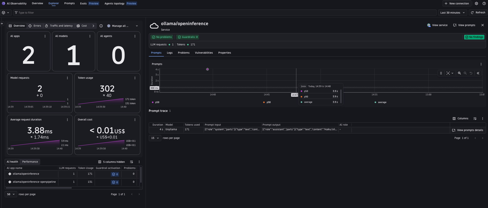
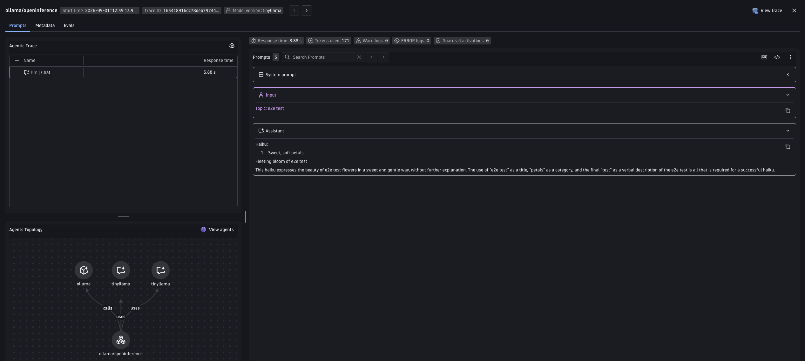

# Ollama + OpenInference Demo

Demonstrates tracing local Ollama chat calls with Dynatrace via OpenInference instrumentation (`OllamaInstrumentor`).
OpenInference normally uses its own semantic conventions (`llm.model_name`, `llm.token_count.*`, etc.), but this example sets `OPENINFERENCE_ENABLE_GENAI_SEMCONV=true` so `OllamaInstrumentor` emits Dynatrace `gen_ai.*` attributes directly on the span -- no attribute normalization needed. A collector or Dynatrace OpenPipeline is still used, but only to derive the metrics OpenInference does not emit on its own.

Ollama itself runs locally (or on any host you point `OLLAMA_HOST` at) -- there is no cloud API key involved, unlike the other provider examples in this repo. See [`ollama/oneagent`](../oneagent/) for the OneAgent-instrumented equivalent of this same app.

---

## Table of contents

- [Prerequisites](#prerequisites)
- [Configuration options](#configuration-options)
- [Setup](#setup)
- [Option A -- Bindplane collector for metrics](#option-a----bindplane-collector-for-metrics)
- [Option B -- Dynatrace OpenPipeline](#option-b----dynatrace-openpipeline)
- [Visualize in Dynatrace AI Observability](#visualize-in-dynatrace-ai-observability)
- [Attribute mapping reference](#attribute-mapping-reference)
- [Metrics](#metrics)
- [Known gaps & limitations](#known-gaps--limitations)
- [Troubleshooting](#troubleshooting)

---

## Prerequisites

- Python 3.11+
- [uv](https://docs.astral.sh/uv/getting-started/installation/)
- Docker installed and running (Option A only)
- [Ollama](https://ollama.com/download) installed and running locally, with a model pulled:
  ```bash
  ollama pull llama3.2
  ```
- Dynatrace tenant with an API token scoped to `openTelemetryTrace.ingest`

---

## Configuration options

`OllamaInstrumentor` already emits `gen_ai.*` attributes on the span (via `OPENINFERENCE_ENABLE_GENAI_SEMCONV=true`, set in `main.py`), including the message content and request/response model fields needed by AI Observability. So both options below surface the request in AI Observability identically. The only thing they still do is derive `gen_ai.client.operation.duration` / `gen_ai.client.token.usage`, since OpenInference instrumentors emit no metric instruments of their own:

|  | Option A -- Bindplane collector | Option B -- OpenPipeline |
|---|---|---|
| **Where metrics are derived** | In the collector process, via `span_metrics`/`signal_to_metrics` connectors | Server-side, in your Dynatrace tenant |
| **Requires Docker** | Yes | No |
| **Requires Dynatrace config** | No | Yes -- one-time deploy |
| **Make target** | `make run` | `make run-openpipeline` (deploy once first) |

> Why not the [Dynatrace Distribution of the OpenTelemetry Collector](https://docs.dynatrace.com/docs/extend-dynatrace/opentelemetry/collector) for Option A? Its manifest does include `genainormalizerprocessor`, but it does not ship a `signal_to_metrics`-equivalent connector, so the token-usage metric (`gen_ai.client.token.usage`) couldn't be derived. Option B has no such gap since the metrics are extracted server-side.

---

## Setup

### 1. Create a Dynatrace access token

1. In Dynatrace press `Ctrl+K` and search for **Access tokens**.
2. Create a token with these permissions:
   - `openTelemetryTrace.ingest`
3. Copy the token value.

### 2. Start Ollama and pull a model

```bash
ollama serve &
ollama pull llama3.2
```

The Ollama server listens on `http://localhost:11434` by default -- set `OLLAMA_HOST` if yours runs elsewhere.

### 3. Set environment variables

The app and scripts read credentials from environment variables. The easiest way is to create a `.env` file in this directory (the Makefile sources it automatically):

```bash
# .env
DT_ENDPOINT=https://abc12345.live.dynatrace.com
DT_API_TOKEN=dt0c01.****.*****

OLLAMA_HOST=http://localhost:11434          # optional, this is the default
MODEL=llama3.2                              # optional, defaults to llama3.2
```

> **Note:** `DT_ENDPOINT` is your base tenant URL -- not the `/api/v2/otlp` path. Example: `https://abc12345.live.dynatrace.com`.

### 4. Install dependencies

```bash
make install
```

---

## Option A -- Bindplane collector for metrics

The app already emits `gen_ai.*`-native spans, so the [Bindplane Distro for OpenTelemetry (BDOT)](https://github.com/observIQ/bindplane-otel-collector) collector here does no attribute normalization -- it just derives operation-duration and token-usage metrics from those spans before forwarding everything to Dynatrace.

```
App (gen_ai.* natively)  ->  Bindplane collector (metrics only)  ->  Dynatrace Grail
```

This example pins the collector to `ghcr.io/observiq/bindplane-agent:1.108.0`.

The app knows only about `http://localhost:4318` -- it sends spans to the collector, and the collector authenticates with Dynatrace using `DT_ENDPOINT` and `DT_API_TOKEN`.

The pipeline (see [`otel-collector-config.yaml`](otel-collector-config.yaml)) filters to LLM spans (`filter/genai_only`) and feeds them to two connectors:

1. **`span_metrics`** derives `gen_ai.client.operation.duration` from LLM span durations.
2. **`signal_to_metrics`** derives `gen_ai.client.token.usage` from `gen_ai.usage.input_tokens` / `gen_ai.usage.output_tokens` span attributes.

### Run it

```bash
# with make (reads .env automatically, starts the collector then runs the app)
make run
```

Then, in a second terminal:

```bash
make request
```

**Useful commands:**

```bash
make logs   # tail collector.log in real time
make stop   # stop and remove the collector container
```

---

## Option B -- Dynatrace OpenPipeline

OpenPipeline is a server-side processing pipeline in Dynatrace. Since the app already emits `gen_ai.*`-native spans, this pipeline no longer maps/renames OpenInference attributes -- it only materializes duration in seconds and extracts operation-duration / token-usage metrics. The app sends spans directly to Dynatrace -- no collector needed.

```
App (gen_ai.* natively)  ->  Dynatrace OpenPipeline (metrics only)  ->  Dynatrace Grail
```

### Step 1 -- Deploy the OpenPipeline configuration using the Dynatrace UI

This is a one-time setup per tenant.

1. In Dynatrace press `Ctrl+K` and search for **OpenPipeline**.
2. Select **Spans**.
3. Click **Add pipeline**, name it `ollama-openinference-ai-spans`, and add processors matching the definitions in [`openpipeline-openinference.yaml`](openpipeline-openinference.yaml).
4. Go to the **Routing** tab and add an entry:
    - Matcher: `isNotNull(openinference.span.kind) AND service.name == "ollama/openinference-openpipeline"`
    - Pipeline: `ollama-openinference-ai-spans`

> **Note:** OpenPipeline routing is first-match-wins, not fan-out. `isNotNull(openinference.span.kind)` alone would also match spans from other OpenInference demos in this repo running on the same tenant. Scoping the matcher with `service.name` keeps this demo's routing independent.

### Step 2 -- Run the app

```bash
# with make (reads .env automatically)
make run-openpipeline

# or manually — leave OTEL_EXPORTER_OTLP_ENDPOINT unset; main.py's _otlp_exporter()
# then builds the authenticated $DT_ENDPOINT/api/v2/otlp request itself from
# DT_ENDPOINT/DT_API_TOKEN (setting it would route the app down the collector,
# no-auth branch of _otlp_exporter() instead)
source .env && uv run python3 -m uvicorn server:app --host 0.0.0.0 --port 8000
```

Then, in a second terminal:

```bash
make request
```

---

## Visualize in Dynatrace AI Observability

1. In Dynatrace press `Ctrl+K` and search for **AI Observability**.
2. Your haiku request appears in the Explorer tab, with model, token usage, and duration for the `ollama/openinference` service.
   
3. Open a prompt trace to inspect the request/response content and the agents topology graph.
   

---

## Attribute mapping reference

There is no collector/OpenPipeline mapping table anymore -- `OPENINFERENCE_ENABLE_GENAI_SEMCONV=true` makes `OllamaInstrumentor` set `gen_ai.*` attributes directly on spans (alongside existing `llm.*` / `openinference.*` fields), including provider/model, token usage, response model, message content, operation metadata, and request parameters (when present).

`session.id` and `user.id` already match the OTel standard and pass through unchanged.

---

## Metrics

OpenInference is span-only by design (its instrumentors emit no metric instruments), so the two metrics the AI Observability app charts must still be derived from spans. Both options do this:

| Metric | Option A (collector) | Option B (OpenPipeline) |
|---|---|---|
| `gen_ai.client.operation.duration` (s) | `span_metrics` connector, on LLM spans | `samplingAwareHistogramMetric` extractor on `duration_seconds` |
| `gen_ai.client.token.usage` (`gen_ai.token.type` = `input`/`output`) | `signal_to_metrics` connector, two sum defs | two `samplingAwareValueMetric` extractors, one per direction |

Both metrics use delta temporality -- Dynatrace rejects cumulative.

---

## Known gaps & limitations

### Not instrumented

`OllamaInstrumentor` wraps only `ollama.chat` / `Client.chat` / `AsyncClient.chat`. Calls to `generate`, `embed`, or `embeddings` produce no spans.

Prompt caching (`gen_ai.prompt_caching` / `gen_ai.cache.type`) is not applicable here -- Ollama's chat API has no prompt-caching concept.

### `OPENINFERENCE_ENABLE_GENAI_SEMCONV` support is package-version-dependent

This example pins `openinference-instrumentation-ollama>=0.1.6` in [`pyproject.toml`](pyproject.toml). The env var is read by the shared `openinference-instrumentation` core used by `OllamaInstrumentor`; if spans come out without `gen_ai.*` attributes, confirm the installed OpenInference package versions support this flag.

---

## Troubleshooting

**No spans in Dynatrace:**
- Confirm `DT_ENDPOINT` and `DT_API_TOKEN` are correctly set.
- Confirm the token has `openTelemetryTrace.ingest` permission.
- Confirm Ollama is reachable at `OLLAMA_HOST` and the model in `MODEL` has been pulled (`ollama list`).
- Option A: check collector logs with `make logs` or `docker logs bindplane-otel-collector-ollama`.
- Option B: run the app directly -- any auth error from Dynatrace will appear in the console output.

**Collector crashes on startup (Option A):**
- Run `docker ps -a` and `docker logs bindplane-otel-collector-ollama` to see the error.
- Confirm Docker is running and port `4318` is free: `lsof -i :4318`.

**Spans visible in Distributed Tracing but not in AI Observability:**
- AI Observability requires `gen_ai.provider.name` (or `gen_ai.system`) to be set on the span.
- Confirm `OPENINFERENCE_ENABLE_GENAI_SEMCONV=true` reached the instrumentor (the app sets this by default in `main.py`).
- Option B: confirm the OpenPipeline routing entry is active and the matcher is scoped to `service.name == "ollama/openinference-openpipeline"`.

**Port conflict (Option A):**
- Ensure nothing else is listening on `4318`: `lsof -i :4318`.

**`ollama.ResponseError: model not found` or connection refused:**
- Run `ollama pull $MODEL` (default `llama3.2`) and confirm `ollama serve` is running and reachable at `OLLAMA_HOST`.
