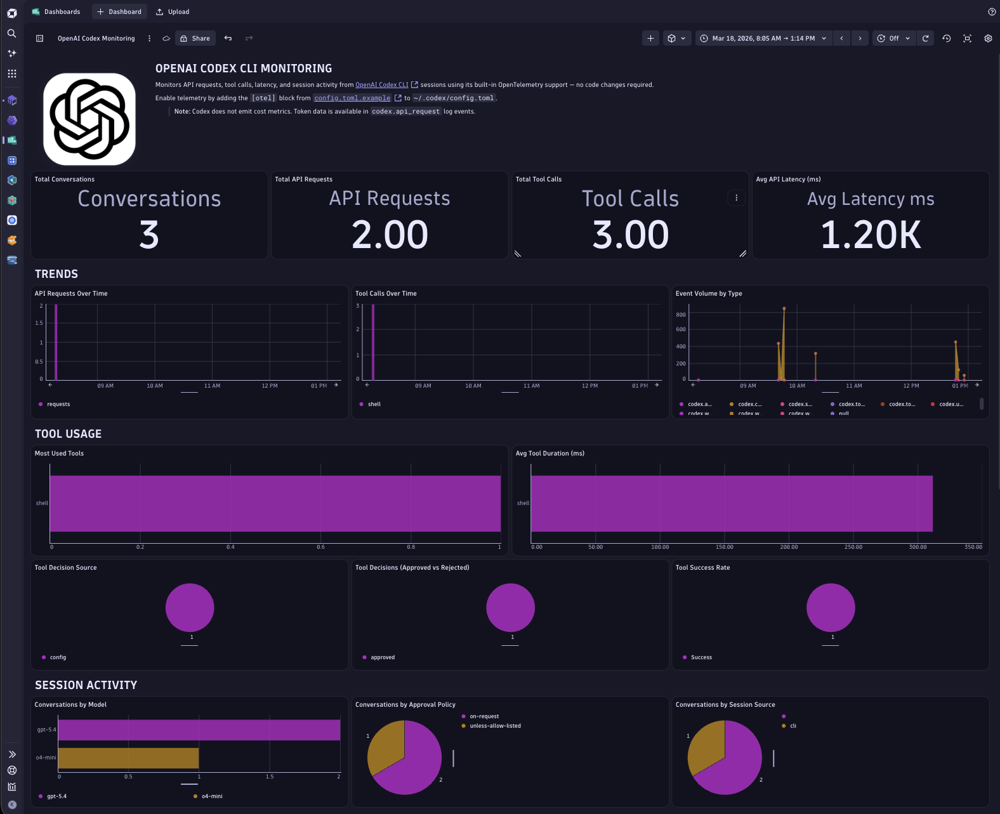

# OpenAI Codex CLI

This example shows how to enable OpenTelemetry telemetry in OpenAI Codex CLI and send it to Dynatrace for observability of Codex sessions, tool usage, and request performance.



## Quick start

Add the following block to `~/.codex/config.toml` (or run `source setup.sh` — see [How to use](#how-to-use)):

```toml
[otel]
environment = "prod"
log_user_prompt = false

[otel.exporter.otlp-http]
endpoint = "https://<YOUR_ENV_ID>.live.dynatrace.com/api/v2/otlp/v1/logs"
protocol = "binary"

[otel.exporter.otlp-http.headers]
Authorization = "Api-Token <YOUR_DT_TOKEN>"

[otel.trace_exporter.otlp-http]
endpoint = "https://<YOUR_ENV_ID>.live.dynatrace.com/api/v2/otlp/v1/traces"
protocol = "binary"

[otel.trace_exporter.otlp-http.headers]
Authorization = "Api-Token <YOUR_DT_TOKEN>"
```

Replace `<YOUR_ENV_ID>` and `<YOUR_DT_TOKEN>` with your Dynatrace environment ID and API token (`openTelemetryTrace.ingest` scope). Then run `codex` as normal — telemetry flows automatically.

A copy-pastable version is also available in [`config.toml.example`](./config.toml.example).

## Dynatrace Instrumentation

Codex reads telemetry settings from `~/.codex/config.toml`. The included [`setup.sh`](./setup.sh) script updates that file with an `[otel]` configuration that exports to your Dynatrace OTLP endpoint.

The script configures:

- OTLP endpoint for traces, metrics, and logs
- API token authentication header
- `protocol = "binary"` for OTLP HTTP export
- `log_user_prompt = false`

## How to use

### Prerequisites

- OpenAI Codex CLI installed (`codex` command available)
- `python3` installed
- Dynatrace API token with `openTelemetryTrace.ingest`, `logs.ingest`, and `metrics.ingest` scopes

### Configure Dynatrace credentials

Copy the example env file and fill in your values:

```bash
cp .env.example .env
```

Variables:

- `DT_API_TOKEN`: Dynatrace API token with `openTelemetryTrace.ingest`, `logs.ingest`, and `metrics.ingest`
- `DT_OTEL_ENDPOINT`: Dynatrace OTLP base URL (do not include `/v1/traces`, `/v1/metrics`, or `/v1/logs`)

SaaS production format:

```text
https://<env-id>.live.dynatrace.com/api/v2/otlp
```

### Apply Codex telemetry config

Source the setup script:

```bash
source setup.sh
```

Then start Codex normally:

```bash
codex
```

> [!NOTE]
> Use `source setup.sh` (not `./setup.sh`) so environment values from `.env` are loaded in the current shell session.

> [!WARNING]
> The script updates `~/.codex/config.toml` and rewrites existing `[otel]` sections. Back up the file first if you already maintain custom OTEL settings.

### Test the connection

Run the included connectivity test before a real Codex session:

```bash
python3 -m venv .venv
source .venv/bin/activate
pip install -r requirements.txt
python3 test_connection.py
```

Expected successful output includes:

- pre-flight check accepted (typically HTTP `400` on empty protobuf payload)
- `Metrics exported successfully`
- `Log events exported successfully`

After success, verify in Dynatrace:

- Metrics browser: search for `codex`
- Log & Event Viewer: filter `service.name = codex_cli_rs`

To validate in a [Dynatrace Notebook](https://docs.dynatrace.com/docs/analyze-explore-automate/notebooks), use this DQL query:

```dql
fetch logs
| filter service.name == "codex_cli_rs"
```

## Troubleshooting

- `401` during pre-flight: invalid `DT_API_TOKEN`
- `403` during pre-flight: token missing `openTelemetryTrace.ingest` scope
- `404` during pre-flight: wrong/deactivated tenant URL
- connection error: DNS/network/proxy issue to Dynatrace endpoint

## Rollback

If needed, restore your previous Codex config from backup:

```bash
cp ~/.codex/config.toml.bak ~/.codex/config.toml
```

If you did not create a backup, remove the `[otel]` block manually from `~/.codex/config.toml`.
