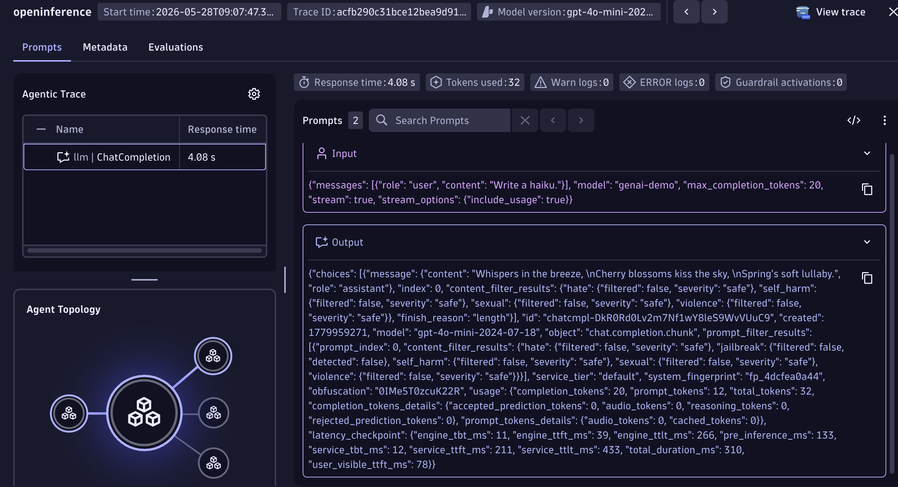
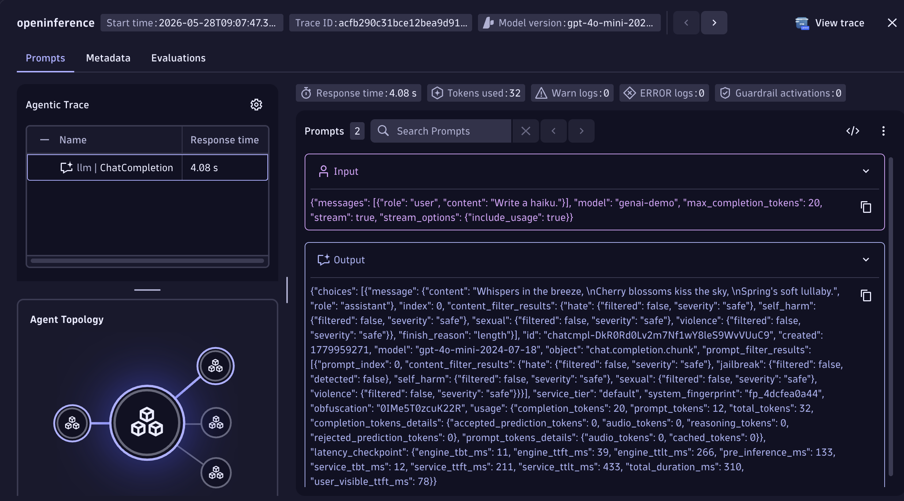

# OpenInference + Dynatrace AI Observability



Generate a haiku with an LLM, send the OpenTelemetry trace to Dynatrace, and see it in the **AI Observability** app.
OpenInference uses its own semantic conventions (`llm.model_name`, `llm.token_count.*`, etc.) -- this example shows two ways to normalize them into the Dynatrace `gen_ai.*` format: the Bindplane collector's `genainormalizer` processor, or Dynatrace OpenPipeline.

---

## Table of contents

- [What you'll build](#what-youll-build)
- [Prerequisites](#prerequisites)
- [Configuration options](#configuration-options)
- [Setup](#setup)
- [Option A -- Bindplane collector with genainormalizer](#option-a----bindplane-collector-with-genainormalizer)
- [Option B -- Dynatrace OpenPipeline](#option-b----dynatrace-openpipeline)
- [Visualize in Dynatrace AI Observability](#visualize-in-dynatrace-ai-observability)
- [Attribute mapping reference](#attribute-mapping-reference)
- [Known gaps & limitations](#known-gaps--limitations)
- [Troubleshooting](#troubleshooting)

---

## What you'll build

- Calls an LLM to generate a haiku using the OpenInference instrumentation library.
- Produces OpenTelemetry traces with OpenInference semantic conventions.
- Normalizes OpenInference attributes to Dynatrace `gen_ai.*` format -- either via the Bindplane collector's `genainormalizer` processor or via Dynatrace OpenPipeline.
- Shows the trace in the Dynatrace AI Observability app with model, token usage, and message content.

---

## Prerequisites

- A Dynatrace tenant -- start a free trial at https://dt-url.net/trial
- Docker installed and running (Option A only)
- Python 3.8+
- [uv](https://docs.astral.sh/uv/getting-started/installation/)
- An OpenAI-compatible API key and endpoint

---

## Configuration options

OpenInference uses its own semantic conventions that the Dynatrace AI Observability app does not natively understand. Two equivalent approaches normalize the attributes:

|  | Option A -- Bindplane collector | Option B -- OpenPipeline |
|---|---|---|
| **Where normalization runs** | In the collector process, via the `genainormalizer` processor | Server-side, in your Dynatrace tenant |
| **Requires Docker** | Yes | No |
| **Requires Dynatrace config** | No | Yes -- one-time deploy |
| **Good for** | Full control over the pipeline, works anywhere you can run a collector, no need to manually add pipeline configurations on your tenant | Simpler ops -- no collector to manage |
| **Make target** | `make run` | `make run-openpipeline` (deploy once first) |

Both paths surface the request in the AI Observability app. Option A also reconstructs the full message history into `gen_ai.input.messages` / `gen_ai.output.messages`; Option B uses an interim fallback for message content (see [Known gaps & limitations](#known-gaps--limitations)).

---

## Setup

### 1. Create a Dynatrace access token

1. In Dynatrace press `Ctrl+K` and search for **Access tokens**.
2. Create a token with these permissions:
   - `openTelemetryTrace.ingest`
3. Copy the token value.

### 2. Set environment variables

The app and scripts read credentials from environment variables. The easiest way is to create a `.env` file in this directory (the Makefile sources it automatically):

```bash
# .env
DT_ENDPOINT=https://abc12345.live.dynatrace.com
DT_API_TOKEN=dt0c01.****.*****

OPENAI_API_KEY=**********************
OPENAI_API_BASE=https://your-endpoint.openai.azure.com/   
MODEL=gpt-4o-mini                                         # optional, defaults to gpt-4o
OPENAI_API_VERSION=2024-07-01-preview               # optional, required for Azure OpenAI endpoints
```

> **Note:** `DT_ENDPOINT` is your base tenant URL -- not the `/api/v2/otlp` path. Example: `https://abc12345.live.dynatrace.com`.

If you are not using the Makefile, source the file directly in your shell:

```bash
source .env
```

### 3. Install dependencies

```bash
make install
```

---

## Option A -- Bindplane collector with genainormalizer

The [Bindplane Distro for OpenTelemetry (BDOT)](https://github.com/observIQ/bindplane-otel-collector) collector intercepts spans and normalizes OpenInference attributes to `gen_ai.*` with its built-in `genainormalizer` processor before forwarding to Dynatrace. No Dynatrace configuration needed.

```
App  ->  Bindplane collector (genainormalizer + transform)  ->  Dynatrace Grail
```

This example pins the collector to `ghcr.io/observiq/bindplane-agent:1.104.0`, which tracks OTel Collector contrib v0.156.0 and bundles the `genainormalizer` processor. The pin means a future version bump surfaces normalization changes in the e2e test.

The collector needs your Dynatrace credentials because **it is the component that forwards spans to Dynatrace**. The app itself only knows about `http://localhost:4318` -- it sends spans to the collector, and the collector authenticates with Dynatrace using `DT_ENDPOINT` and `DT_API_TOKEN`.

The pipeline runs two processors (see [`otel-collector-config.yaml`](otel-collector-config.yaml)):

1. **`genainormalizer`** (source `openinference`, `remove_originals: true`) maps OpenInference attributes to `gen_ai.*` and reconstructs the flattened `llm.input_messages.N.*` / `llm.output_messages.N.*` attributes into `gen_ai.input.messages` and `gen_ai.output.messages` JSON. `remove_originals` drops the raw `llm.*` attributes so exported spans carry only `gen_ai.*` fields.
2. **`transform/response_model`** mirrors `gen_ai.request.model` to `gen_ai.response.model`, which the AI Observability app requires and OpenInference has no separate field for.

### Step 1 -- Start the collector and run the app

```bash
# with make (reads .env automatically, starts the collector then runs app.py once)
make run
```

Or manually with Docker:

**Linux/macOS:**
```bash
source .env
docker run -d \
  --name bindplane-otel-collector \
  -p 4318:4318 \
  -v $(pwd)/otel-collector-config.yaml:/etc/otel/config.yaml:ro \
  -e DT_ENDPOINT=$DT_ENDPOINT \
  -e DT_API_TOKEN=$DT_API_TOKEN \
  ghcr.io/observiq/bindplane-agent:1.104.0
```

**Windows CMD:**
```cmd
set DT_ENDPOINT=https://abc12345.live.dynatrace.com
set DT_API_TOKEN=dt0c01.*****
docker run -d ^
  --name bindplane-otel-collector ^
  -p 4318:4318 ^
  -v %cd%/otel-collector-config.yaml:/etc/otel/config.yaml:ro ^
  -e DT_ENDPOINT=%DT_ENDPOINT% ^
  -e DT_API_TOKEN=%DT_API_TOKEN% ^
  ghcr.io/observiq/bindplane-agent:1.104.0
```

The BDOT image reads its config from `/etc/otel/config.yaml` by default in standalone mode, so no `--config` argument is needed.

What happens:
- The collector listens on port `4318` for incoming OTLP/HTTP spans from the app.
- The `genainormalizer` processor maps OpenInference attributes to `gen_ai.*` and reconstructs the message history.
- The processed spans are forwarded to `$DT_ENDPOINT/api/v2/otlp` authenticated with the API token.

If you started the collector manually, run the app once against it:

```bash
source .env && OTEL_EXPORTER_OTLP_ENDPOINT=http://localhost:4318 OTEL_EXPORTER_OTLP_HEADERS="" python3 app.py
```

**Useful commands:**

```bash
make logs   # tail collector.log in real time
make stop   # stop and remove the collector container

# or manually
docker logs -f bindplane-otel-collector
docker stop bindplane-otel-collector && docker rm bindplane-otel-collector
```

---

## Option B -- Dynatrace OpenPipeline

OpenPipeline is a server-side processing pipeline in Dynatrace that applies the same attribute mappings before spans are stored. The app sends spans directly to Dynatrace -- no collector needed.

```
App  ->  Dynatrace OpenPipeline (transform)  ->  Dynatrace Grail
```

### Step 1 -- Deploy the OpenPipeline configuration using the Dynatrace UI
This is a one-time setup per tenant.

1. In Dynatrace press `Ctrl+K` and search for **OpenPipeline**.
   
2. Select **Spans**.
   
3. Click **Add pipeline**, name it `openinference-ai-spans`, and add processors matching the definitions in `openpipeline-openinference.yaml`.
   
4. Go to the **Routing** tab and add an entry:
    - Matcher: `isNotNull(openinference.span.kind)`
    - Pipeline: `openinference-ai-spans`

> **Note:** The routing matcher uses `isNotNull(openinference.span.kind)` (a span attribute set by every OpenInference instrumentor). Using `otel.scope.name` does not work — OpenPipeline routing evaluates span attributes only, not OTLP scope-level fields.

---

### Step 2 -- Run the app

The app sends spans directly to `$DT_ENDPOINT/api/v2/otlp`, authenticated with the API token. OpenPipeline intercepts and transforms the spans server-side before they are stored.

```bash
# with make (reads .env automatically)
make run-openpipeline

# or manually
source .env && OTEL_EXPORTER_OTLP_ENDPOINT=$DT_ENDPOINT/api/v2/otlp OTEL_EXPORTER_OTLP_HEADERS="Authorization=Api-Token $DT_API_TOKEN" python3 app.py
```

---

## Visualize in Dynatrace AI Observability

1. In Dynatrace press `Ctrl+K` and search for **AI Observability**.
2. Your haiku request appears in the Explorer tab as a span with model name, token usage, and message content.
  
3. Open a span to inspect the full conversation and `gen_ai.*` attributes.
  
4. You can also visualize span from the **Distributed Tracing** App
  

---

## Attribute mapping reference

### Option A -- genainormalizer (`openinference` source)

The `genainormalizer` processor applies these translations, then `remove_originals` drops the source `llm.*` attributes. The collector config adds the `gen_ai.response.model` mirror.

| OpenInference source | Dynatrace target |
|---|---|
| `llm.token_count.prompt` | `gen_ai.usage.input_tokens` |
| `llm.token_count.completion` | `gen_ai.usage.output_tokens` |
| `llm.model_name` / `embedding.model_name` / `reranker.model_name` | `gen_ai.request.model` |
| `llm.provider` | `gen_ai.provider.name` |
| `tool.name` / `tool.description` | `gen_ai.tool.name` / `gen_ai.tool.description` |
| tool-call id and function arguments | `gen_ai.tool.call.id` / `gen_ai.tool.call.arguments` |
| `agent.name` | `gen_ai.agent.name` |
| `session.id` | `gen_ai.conversation.id` |
| `openinference.span.kind` | `gen_ai.operation.name` (`LLM`→`chat`, `TOOL`→`execute_tool`, `AGENT`/`CHAIN`→`invoke_agent`, `RETRIEVER`/`RERANKER`→`retrieval`, `EMBEDDING`→`embeddings`, `PROMPT`→`text_completion`) |
| `llm.input_messages.N.*` / `llm.output_messages.N.*` | `gen_ai.input.messages` / `gen_ai.output.messages` (full reconstruction, including roles, text parts, and tool calls) |
| _(added by collector config)_ | `gen_ai.response.model` (mirrored from `gen_ai.request.model`) |

Unlike a hand-written transform, `genainormalizer` reconstructs the full conversation from the indexed per-message attributes, so `gen_ai.input.messages` / `gen_ai.output.messages` contain the complete message history rather than a serialized fallback.

### Option B -- OpenPipeline

The OpenPipeline configuration in [`openpipeline-openinference.yaml`](openpipeline-openinference.yaml) applies its own DQL-based translations server-side, including `gen_ai.operation.kind`, request parameters (`temperature`, `max_tokens`, `top_p`), `finish_reasons`, and prompt-caching flags. It uses an interim fallback for message content (`input.value` / `output.value` → `gen_ai.input.messages` / `gen_ai.output.messages`) because DQL cannot iterate over the indexed per-message attributes at transform time.

`session.id` and `user.id` already match the OTel standard and pass through unchanged in both options.

---

## Known gaps & limitations

### Attributes genainormalizer does not yet map (Option A)

The `genainormalizer` `openinference` source (v0.156.0) does not set the following attributes. They are optional for the AI Observability app, and are candidates for upstream contribution to the processor:

- `gen_ai.request.temperature` / `gen_ai.request.top_p` / `gen_ai.request.max_tokens`
- `gen_ai.response.finish_reasons`
- `gen_ai.prompt_caching` and `gen_ai.cache.type`
- `gen_ai.system` (only `gen_ai.provider.name` is set, from `llm.provider`)

To close any of these locally, add statements to the `transform` processor in [`otel-collector-config.yaml`](otel-collector-config.yaml). Option B (OpenPipeline) already maps these server-side.

### Full conversation message history (Option B)

Option A reconstructs the full message history via `genainormalizer`. Option B (OpenPipeline) cannot: DQL cannot iterate over the indexed per-message attributes (`llm.input_messages.0.message.role`, `llm.input_messages.1.message.role`, …) at transform time, so it copies the serialized conversation from `input.value` → `gen_ai.input.messages` as a fallback.

---

## Troubleshooting

**No spans in Dynatrace:**
- Confirm `DT_ENDPOINT` and `DT_API_TOKEN` are correctly set.
- Confirm the token has `openTelemetryTrace.ingest` permission.
- Option A: check collector logs with `make logs` or `docker logs bindplane-otel-collector`.
- Option B: run `python3 app.py` directly -- any auth error from Dynatrace will appear in the console output.

**Collector crashes on startup (Option A):**
- Run `docker ps -a` and `docker logs bindplane-otel-collector` to see the error.
- Confirm Docker is running and port `4318` is free: `lsof -i :4318`.

**Spans visible in Distributed Tracing but not in AI Observability:**
- AI Observability requires `gen_ai.provider.name` (or `gen_ai.system`) to be set on the span -- `genainormalizer` sets `gen_ai.provider.name` from `llm.provider`.
- Option A: confirm the `genainormalizer` processor ran -- the raw `llm.*` attributes should be gone and `gen_ai.*` attributes present in the collector debug output (`make logs`).
- Option B: confirm the OpenPipeline routing entry is active; go to **Settings -> OpenPipeline -> Spans** in Dynatrace and verify the `openinference-ai-spans` pipeline is enabled and the routing matcher is `isNotNull(openinference.span.kind)`.

**Port conflict (Option A):**
- Ensure nothing else is listening on `4318`: `lsof -i :4318`.
