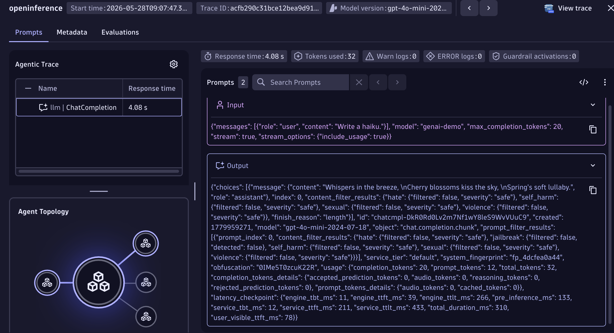

# OpenInference + Dynatrace AI Observability



Generate a haiku with an LLM, send the OpenTelemetry trace to Dynatrace, and see it in the **AI Observability** app.

This example enables `OPENINFERENCE_ENABLE_GENAI_SEMCONV=true`, so OpenInference emits `gen_ai.*` attributes natively. That removes the need for downstream OpenInference→`gen_ai.*` normalization. A collector or OpenPipeline is still used to derive metrics, because OpenInference instrumentors are span-only.

---

## Table of contents

- [What you'll build](#what-youll-build)
- [Prerequisites](#prerequisites)
- [Configuration options](#configuration-options)
- [Setup](#setup)
- [Option A -- Bindplane collector for metrics](#option-a----bindplane-collector-for-metrics)
- [Option B -- Dynatrace OpenPipeline for metrics](#option-b----dynatrace-openpipeline-for-metrics)
- [Visualize in Dynatrace AI Observability](#visualize-in-dynatrace-ai-observability)
- [Attribute reference](#attribute-reference)
- [Metrics](#metrics)
- [Troubleshooting](#troubleshooting)

---

## What you'll build

- Calls an LLM to generate a haiku using OpenInference instrumentation for OpenAI.
- Emits OpenTelemetry spans with native `gen_ai.*` attributes from the SDK.
- Derives `gen_ai.client.operation.duration` and `gen_ai.client.token.usage` from spans, either in a local collector or in Dynatrace OpenPipeline.
- Visualizes the trace and metrics in Dynatrace AI Observability.

---

## Prerequisites

- A Dynatrace tenant -- start a free trial at https://dt-url.net/trial
- Docker installed and running (Option A only)
- Python 3.8+
- [uv](https://docs.astral.sh/uv/getting-started/installation/)
- An OpenAI-compatible API key and endpoint

---

## Configuration options

With `OPENINFERENCE_ENABLE_GENAI_SEMCONV=true` (set in `app.py`), OpenInference emits `gen_ai.*` directly. Both options below keep span attributes intact and only derive metrics:

|  | Option A -- Bindplane collector | Option B -- OpenPipeline |
|---|---|---|
| **Where metrics are derived** | In the collector (`span_metrics` + `signal_to_metrics`) | In Dynatrace OpenPipeline metric extraction |
| **Requires Docker** | Yes | No |
| **Requires Dynatrace config** | No | Yes -- one-time deploy |
| **Good for** | Local/portable pipeline control | Simpler ops, no local collector |
| **Make target** | `make run` | `make run-openpipeline` |

---

## Setup

### 1. Create a Dynatrace access token

1. In Dynatrace press `Ctrl+K` and search for **Access tokens**.
2. Create a token with this permission:
   - `openTelemetryTrace.ingest`
3. Copy the token value.

### 2. Set environment variables

Create a `.env` file in this directory (the Makefile sources it automatically):

```bash
# .env
DT_ENDPOINT=https://abc12345.live.dynatrace.com
DT_API_TOKEN=dt0c01.****.*****

OPENAI_API_KEY=**********************
OPENAI_API_BASE=https://your-endpoint.openai.azure.com/
MODEL=gpt-4o-mini                      # optional, defaults to gpt-4o
OPENAI_API_VERSION=2024-07-01-preview  # optional, required for Azure OpenAI endpoints
```

> **Note:** `DT_ENDPOINT` is the base tenant URL (for example `https://abc12345.live.dynatrace.com`), not `/api/v2/otlp`.

### 3. Install dependencies

```bash
make install
```

---

## Option A -- Bindplane collector for metrics

The app emits `gen_ai.*` spans natively. The collector does not normalize attributes; it forwards spans and derives the two required AI Observability metrics.

```text
App (native gen_ai.* spans) -> Bindplane collector (metrics) -> Dynatrace
```

Run:

```bash
make run
```

Useful commands:

```bash
make logs
make stop
```

---

## Option B -- Dynatrace OpenPipeline for metrics

The app sends spans directly to Dynatrace. OpenPipeline keeps attributes and derives the same metrics server-side.

```text
App (native gen_ai.* spans) -> Dynatrace OpenPipeline (metrics) -> Dynatrace
```

### Step 1 -- Deploy OpenPipeline configuration

1. In Dynatrace press `Ctrl+K` and search for **OpenPipeline**.
2. Select **Spans**.
3. Add a pipeline and copy processor definitions from [`openpipeline-openinference.yaml`](openpipeline-openinference.yaml).
4. In **Routing**, add matcher:
   - `isNotNull(gen_ai.request.model)`

### Step 2 -- Run the app

```bash
make run-openpipeline
```

---

## Visualize in Dynatrace AI Observability

1. In Dynatrace press `Ctrl+K` and search for **AI Observability**.
2. Find the request in Explorer.
3. Open the span to inspect `gen_ai.*` attributes and messages.

---

## Attribute reference

`OPENINFERENCE_ENABLE_GENAI_SEMCONV=true` enables native OpenInference emission of `gen_ai.*` attributes used by AI Observability, including:

- `gen_ai.request.model`
- `gen_ai.response.model`
- `gen_ai.provider.name`
- `gen_ai.operation.name`
- `gen_ai.usage.input_tokens` / `gen_ai.usage.output_tokens`
- `gen_ai.input.messages` / `gen_ai.output.messages`

The original OpenInference attributes remain available on the span as emitted by the SDK.

---

## Metrics

OpenInference instrumentors do not emit metric instruments. This example derives the two required metrics from spans:

- `gen_ai.client.operation.duration`
- `gen_ai.client.token.usage` (dimension `gen_ai.token.type` = `input` / `output`)

Both Option A and Option B derive the same metrics.

---

## Troubleshooting

**No spans in Dynatrace:**
- Check `DT_ENDPOINT` and `DT_API_TOKEN`.
- Verify token has `openTelemetryTrace.ingest`.
- Option A: inspect collector logs (`make logs`).

**Spans in tracing but not in AI Observability:**
- Verify `gen_ai.request.model` and `gen_ai.provider.name` are present on spans.
- Option B: confirm OpenPipeline routing matcher is `isNotNull(gen_ai.request.model)`.

**Port conflict (Option A):**
- Ensure nothing else is listening on `4318`.
