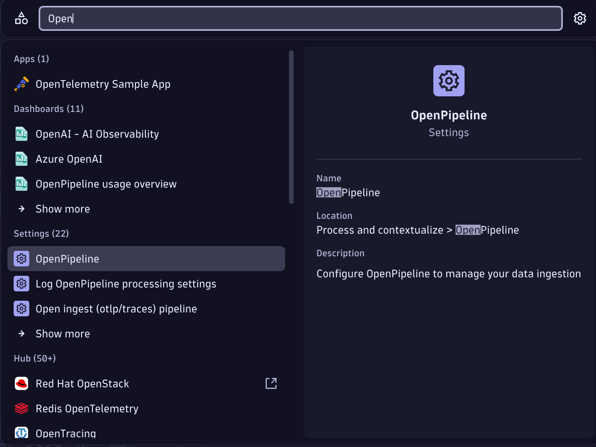
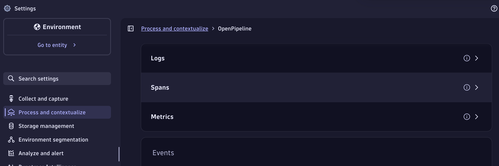
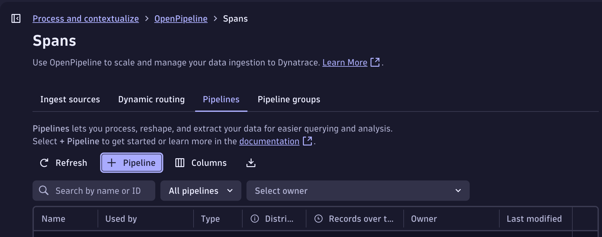
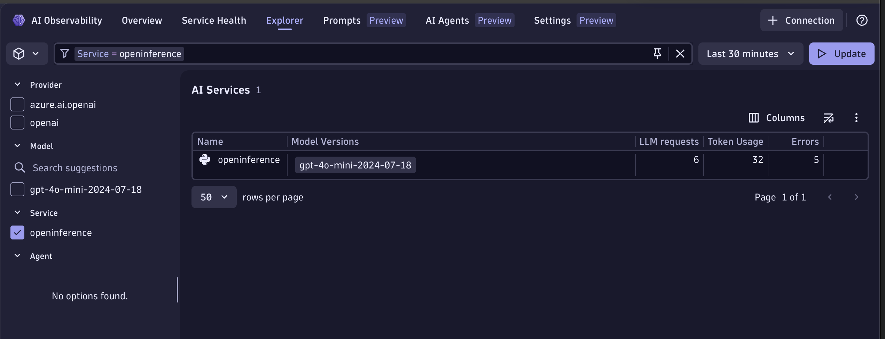

# OpenInference + Dynatrace AI Observability


Generate a haiku with an LLM, send the OpenTelemetry trace to Dynatrace, and see it in the **AI Observability** app.
OpenInference uses its own semantic conventions (`llm.model_name`, `llm.token_count.*`, etc.) — this example shows two ways to normalize them into the Dynatrace `gen_ai.*` format.

---

## Table of contents

- [What you'll build](#what-youll-build)
- [Prerequisites](#prerequisites)
- [Configuration options](#configuration-options)
- [Setup](#setup)
  - [1. Create a Dynatrace access token](#1-create-a-dynatrace-access-token)
  - [2. Set environment variables](#2-set-environment-variables)
  - [3. Install dependencies](#3-install-dependencies)
- [Option A -- OTel Collector with transform processor](#option-a----otel-collector-with-transform-processor)
- [Option B -- Dynatrace OpenPipeline](#option-b----dynatrace-openpipeline)
- [Visualize in Dynatrace AI Observability](#visualize-in-dynatrace-ai-observability)
- [Troubleshooting](#troubleshooting)

---

## What you'll build

- Calls an LLM to generate a haiku using the OpenInference instrumentation library.
- Produces OpenTelemetry traces with OpenInference semantic conventions.
- Normalizes OpenInference attributes to Dynatrace `gen_ai.*` format -- either via a local OTel Collector or via Dynatrace OpenPipeline.
- Shows the trace in the Dynatrace AI Observability app with model, token usage, and message content.

---

## Prerequisites

- A Dynatrace tenant -- start a free trial at https://dt-url.net/trial
- Docker installed and running (Option A only)
- Python 3.8+
- An OpenAI-compatible API key and endpoint
- [dtctl](https://github.com/dynatrace/dtctl) (Option B.1 only)

---

## Configuration options

OpenInference uses its own semantic conventions that the Dynatrace AI Observability app does not natively understand. Two equivalent approaches normalize the attributes:

|  | Option A -- OTel Collector | Option B -- OpenPipeline |
|---|---|---|
| **Where transforms run** | In the collector process | Server-side, in your Dynatrace tenant |
| **Requires Docker** | Yes | No |
| **Requires Dynatrace config** | No | Yes -- one-time deploy |
| **Good for** | Full control over the pipeline, works anywhere you can run a collector | Simpler ops -- no collector to manage |
| **Make target** | `make run` | `make run-openpipeline` (deploy once first) |

Both paths produce identical results in the AI Observability app.

### Attribute mapping reference

The table below shows which `gen_ai.*` attributes are produced after normalization:

| Attribute | Collector | OpenPipeline | Source |
|---|---|---|---|
| `gen_ai.operation.name` | ✅ | ✅ | hardcoded `chat` for LLM spans |
| `gen_ai.operation.kind` | ✅ | ✅ | mapped from `openinference.span.kind` |
| `gen_ai.request.model` | ✅ | ✅ | renamed from `llm.model_name` |
| `gen_ai.response.model` | ✅ | ✅ | mirrored from `gen_ai.request.model` |
| `gen_ai.provider.name` | ✅ | ✅ | renamed from `llm.provider` (fallback: `llm.system`) |
| `gen_ai.system` | ✅ | ✅ | set to `azure.ai.openai` when provider is `azure` |
| `gen_ai.usage.input_tokens` | ✅ | ✅ | renamed from `llm.token_count.prompt` |
| `gen_ai.usage.output_tokens` | ✅ | ✅ | renamed from `llm.token_count.completion` |
| `gen_ai.usage.prompt_caching.read_tokens` | ✅ | ✅ | renamed from `llm.token_count.prompt_details.cache_read` |
| `gen_ai.response.finish_reasons` | ✅ | ✅ | converted from `llm.finish_reason` string → array |
| `gen_ai.input.messages` | ✅ | ✅ | copied from `input.value` (interim fallback) |
| `gen_ai.output.messages` | ✅ | ✅ | copied from `output.value` (interim fallback) |
| `ai.observability.source` | ✅ | ✅ | hardcoded `openinference` |

---

## Setup

### 1. Create a Dynatrace access token

1. In Dynatrace press `Ctrl+K` and search for **Access tokens**.
2. Create a token with these permissions:
   - `openTelemetryTrace.ingest`
   - `settings.read` and `settings.write` *(Option B only)*
3. Copy the token value.

### 2. Set environment variables

The app and scripts read credentials from environment variables. The easiest way is to create a `.env` file in this directory (the Makefile sources it automatically):

```bash
# .env
DT_ENDPOINT=https://abc12345.live.dynatrace.com
DT_API_TOKEN=dt0c01.****.*****

OPENAI_API_KEY=**********************
OPENAI_API_BASE=https://your-endpoint.openai.azure.com/   
MODEL=gpt-4o-mini                                         # optional, defaults to gpt-4o
OPENAI_API_VERSION=2024-07-01-preview               # optional, required for Azure OpenAI endpoints
```

> **Note:** `DT_ENDPOINT` is your base tenant URL -- not the `/api/v2/otlp` path. Example: `https://abc12345.live.dynatrace.com`.

If you are not using the Makefile, source the file directly in your shell:

```bash
source .env
```

### 3. Install dependencies

```bash
# with make
make install

# or manually
pip install -r requirements.txt
```

---

## Option A -- OTel Collector with transform processor

The OTel Collector intercepts spans and applies all OpenInference -> `gen_ai.*` attribute mappings before forwarding to Dynatrace. No Dynatrace configuration needed.

```
App  ->  OTel Collector (transform processor)  ->  Dynatrace Grail
```

The collector needs your Dynatrace credentials because **it is the component that forwards spans to Dynatrace**. The app itself only knows about `http://localhost:4318` -- it sends spans to the collector, and the collector authenticates with Dynatrace using `DT_ENDPOINT` and `DT_API_TOKEN`.

### Step 1 -- Start the collector

```bash
# with make (reads .env automatically)
make run
```

Or manually with Docker:

**Linux/macOS:**
```bash
source .env
docker run -d \
  --name otel-collector \
  -p 4318:4318 \
  -v $(pwd)/otel-collector-config.yaml:/etc/otelcol/otel-collector-config.yaml:ro \
  -e DT_ENDPOINT=$DT_ENDPOINT \
  -e DT_API_TOKEN=$DT_API_TOKEN \
  ghcr.io/dynatrace/dynatrace-otel-collector/dynatrace-otel-collector:0.48.0 \
  --config=/etc/otelcol/otel-collector-config.yaml
```

**Windows CMD:**
```cmd
set DT_ENDPOINT=https://abc12345.live.dynatrace.com
set DT_API_TOKEN=dt0c01.*****
docker run -d ^
  --name otel-collector ^
  -p 4318:4318 ^
  -v %cd%/otel-collector-config.yaml:/etc/otelcol/otel-collector-config.yaml:ro ^
  -e DT_ENDPOINT=%DT_ENDPOINT% ^
  -e DT_API_TOKEN=%DT_API_TOKEN% ^
  ghcr.io/dynatrace/dynatrace-otel-collector/dynatrace-otel-collector:0.48.0 ^
  --config=/etc/otelcol/otel-collector-config.yaml
```

What happens:
- The collector listens on port `4318` for incoming OTLP/HTTP spans from the app.
- The `transform/openinference` processor renames `llm.model_name` -> `gen_ai.request.model`, maps token counts, operation kinds, and more.
- The processed spans are forwarded to `$DT_ENDPOINT/api/v2/otlp` authenticated with the API token.

### Step 2 -- Run the app

```bash
# with make (starts collector and app together)
make run

# or manually, once the collector is already running
source .env && OTEL_EXPORTER_OTLP_ENDPOINT=http://localhost:4318 OTEL_EXPORTER_OTLP_HEADERS="" python3 app.py
```

**Useful commands:**

```bash
make logs   # tail collector.log in real time
make stop   # stop and remove the collector container

# or manually
docker logs -f otel-collector
docker stop otel-collector && docker rm otel-collector
```

---

## Option B -- Dynatrace OpenPipeline

OpenPipeline is a server-side processing pipeline in Dynatrace that applies the same attribute mappings before spans are stored. The app sends spans directly to Dynatrace -- no collector needed.

```
App  ->  Dynatrace OpenPipeline (transform)  ->  Dynatrace Grail
```

### Step 1 -- Deploy the OpenPipeline configuration

This is a one-time setup per tenant.

---

#### Option B.1 -- Using dtctl

[dtctl](https://github.com/dynatrace/dtctl) uses the Dynatrace Platform API and requires a **platform token** (not a classic API token).

**Create a platform token (one-time):**

1. Go to [myaccount.dynatrace.com/platformTokens](https://myaccount.dynatrace.com/platformTokens)
2. Click **Generate new token**, give it a name, and add scopes:
   - `app-settings:objects:read` — read app settings objects (required by dtctl Platform API)
   - `app-settings:objects:write` — write app settings objects (required by dtctl Platform API)
3. Copy the generated token value

**Configure dtctl and deploy:**

```bash
source .env
DTCTL_ENV=$(echo $DT_ENDPOINT | sed 's|\.dynatracelabs\.com|.apps.dynatracelabs.com|')
dtctl config set-credentials my-token --token <PLATFORM_TOKEN>
dtctl ctx set my-tenant --environment $DTCTL_ENV --token-ref my-token
dtctl apply -f openpipeline-openinference-dtctl.yaml
```

Then add the routing entry safely (GET current table → merge → PUT):

```bash
bash setup-routing.sh
```

---

#### Option B.2 -- Using an AI assistant

Paste the prompt below into any AI assistant (ChatGPT, Copilot, Claude, etc.) along with the contents of `openpipeline-openinference.yaml`, and ask it to generate a complete setup script.

```
I need to automate the full setup of a Dynatrace OpenPipeline configuration for Spans
using the Dynatrace Settings API v2 and a classic API token (dt0c01.*).

The pipeline name is "openinference-ai-spans". The full processor definitions are in
the attached file openpipeline-openinference.yaml.

Please write a single bash script that:
1. POSTs the pipeline to the Dynatrace Settings API v2
   (POST {DT_ENDPOINT}/api/v2/settings/objects, schemaId: builtin:openpipeline.spans.pipelines)
2. GETs the current routing table
   (GET {DT_ENDPOINT}/api/v2/settings/objects?schemaIds=builtin:openpipeline.spans.routing)
3. Merges a new routing entry without replacing existing ones:
   matcher: matchesPhrase(otel.scope.name, "openinference") → openinference-ai-spans
4. PUTs the updated routing table back

The script should read DT_ENDPOINT and DT_API_TOKEN from environment variables,
use only Python stdlib (urllib, json, ssl) — no extra dependencies,
and handle errors clearly.
```

---

#### Option B.3 -- Using the Dynatrace UI

1. In Dynatrace press `Ctrl+K` and search for **OpenPipeline**.
   
2. Select **Spans**.
   
3. Click **Add pipeline**, name it `openinference-ai-spans`, and add processors matching the definitions in `openpipeline-openinference.yaml`.
   
4. Go to the **Routing** tab and add an entry:
   - Matcher: `matchesPhrase(otel.scope.name, "openinference")`
   - Pipeline: `openinference-ai-spans`

---

### Step 2 -- Run the app

The app sends spans directly to `$DT_ENDPOINT/api/v2/otlp`, authenticated with the API token. OpenPipeline intercepts and transforms the spans server-side before they are stored.

```bash
# with make (reads .env automatically)
make run-openpipeline

# or manually
source .env && OTEL_EXPORTER_OTLP_ENDPOINT=$DT_ENDPOINT/api/v2/otlp OTEL_EXPORTER_OTLP_HEADERS="Authorization=Api-Token $DT_API_TOKEN" python3 app.py
```

---

## Visualize in Dynatrace AI Observability

1. In Dynatrace press `Ctrl+K` and search for **AI Observability**.
2. Your haiku request appears in the Explorer tab as a span with model name, token usage, and message content.
  
3. Open a span to inspect the full conversation and `gen_ai.*` attributes.
  
4. You can also visualize span from the **Distributed Tracing** App
  


---

## Troubleshooting

**No spans in Dynatrace:**
- Confirm `DT_ENDPOINT` and `DT_API_TOKEN` are correctly set.
- Confirm the token has `openTelemetryTrace.ingest` permission.
- Option A: check collector logs with `make logs` or `docker logs otel-collector`.
- Option B: run `python3 app.py` directly -- any auth error from Dynatrace will appear in the console output.

**Collector crashes on startup (Option A):**
- Run `docker ps -a` and `docker logs otel-collector` to see the error.
- Confirm Docker is running and port `4318` is free: `lsof -i :4318`.

**OpenPipeline not transforming spans (Option B):**
- Confirm the token has `settings.read` and `settings.write` permissions.
- Re-run `bash deploy-openpipeline.sh` and `bash setup-routing.sh` to ensure the pipeline and routing are applied.

**Spans visible in Distributed Tracing but not in AI Observability:**
- AI Observability requires `gen_ai.system` or `gen_ai.provider.name` to be set on the span -- these are added by the transform processor / OpenPipeline.
- Option A: confirm the collector started with `otel-collector-config.yaml` -- check `docker logs otel-collector` for the config path it loaded.
- Option B: confirm the OpenPipeline routing entry is active -- go to **Settings -> OpenPipeline -> Spans** in Dynatrace and verify the `openinference-ai-spans` pipeline is enabled.

**Port conflict (Option A):**
- Ensure nothing else is listening on `4318`: `lsof -i :4318`.
