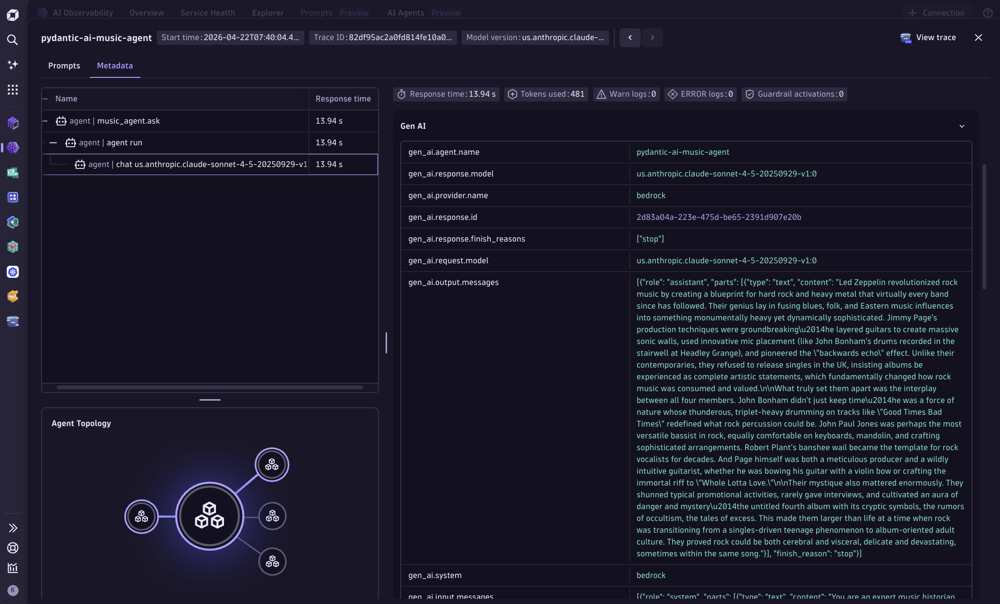
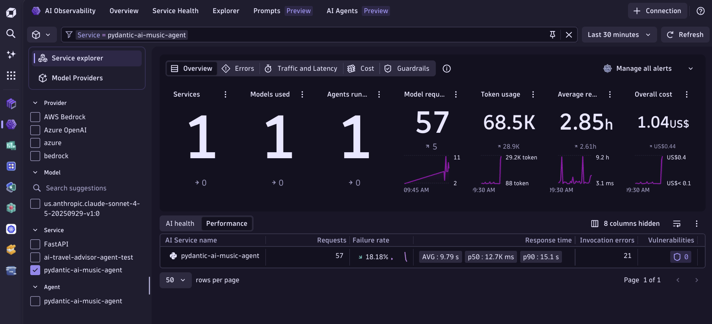

## Pydantic AI — Music History Agent

This example shows how to instrument a [pydantic-ai](https://github.com/pydantic/pydantic-ai) multi-provider agent application with OpenTelemetry and route the data to Dynatrace for full AI Observability — including token usage, latency, prompt/completion content, and per-provider attribution.

The app is a **Music History Explorer**: ask questions about jazz, classic rock, and classical music. Each question is routed randomly to either **AWS Bedrock** (Claude Sonnet / Haiku) or **Azure OpenAI** (GPT-4), demonstrating multi-provider observability in a single trace.





## Dynatrace Instrumentation

> [!TIP]
> For detailed setup instructions, configuration options, and advanced use cases, please refer to the [Get Started Docs](https://docs.dynatrace.com/docs/shortlink/ai-ml-get-started).

pydantic-ai ships with **native OpenTelemetry support** via `InstrumentationSettings`. Passing it to an `Agent` automatically emits spans following the [GenAI semantic conventions](https://opentelemetry.io/docs/specs/semconv/gen-ai/) — no monkey-patching or third-party SDKs required.

`otel_setup.py` initialises a `TracerProvider` and `MeterProvider` that export to Dynatrace over OTLP/HTTP:

```python
from opentelemetry.exporter.otlp.proto.http.trace_exporter import OTLPSpanExporter
from opentelemetry.exporter.otlp.proto.http.metric_exporter import OTLPMetricExporter
from opentelemetry.sdk.trace import TracerProvider
from opentelemetry.sdk.trace.export import BatchSpanProcessor
from opentelemetry.sdk.metrics import MeterProvider
from opentelemetry.sdk.metrics.export import PeriodicExportingMetricReader
from opentelemetry.sdk.resources import Resource

# Dynatrace requires delta temporality for metrics
os.environ["OTEL_EXPORTER_OTLP_METRICS_TEMPORALITY_PREFERENCE"] = "delta"

otlp_base = f"{dt_endpoint}/api/v2/otlp"
headers   = {"Authorization": f"Api-Token {dt_api_token}"}

resource = Resource.create({"service.name": "pydantic-ai-music-agent"})

tracer_provider = TracerProvider(resource=resource)
tracer_provider.add_span_processor(
    BatchSpanProcessor(OTLPSpanExporter(endpoint=f"{otlp_base}/v1/traces", headers=headers))
)

meter_provider = MeterProvider(
    metric_readers=[PeriodicExportingMetricReader(
        OTLPMetricExporter(endpoint=f"{otlp_base}/v1/metrics", headers=headers)
    )],
    resource=resource,
)
```

The providers are then wired into pydantic-ai's native instrumentation:

```python
from pydantic_ai import Agent, InstrumentationSettings

instrumentation = InstrumentationSettings(
    tracer_provider=tracer_provider,
    meter_provider=meter_provider,
    include_content=True,   # capture prompts & completions as span events
)

agent = Agent(model=model, system_prompt=SYSTEM_PROMPT, instrument=instrumentation)
result = await agent.run(question)
```

Each `agent.run()` automatically produces nested GenAI spans with:

| Attribute | Description |
|---|---|
| `gen_ai.system` | Provider name (`aws_bedrock`, `openai`) |
| `gen_ai.request.model` | Model identifier |
| `gen_ai.usage.input_tokens` | Prompt token count |
| `gen_ai.usage.output_tokens` | Completion token count |
| `gen_ai.prompt` / `gen_ai.completion` | Full prompt and response content |

An outer `music_agent.ask` span (kind `SERVER`) adds API-level context including the selected provider and the user's question.

## How to use

### Prerequisites

- Python 3.11+
- AWS credentials with access to Bedrock (Claude models in `us-east-1`)
- Azure OpenAI endpoint and deployment (optional — falls back to Bedrock if unreachable)
- A Dynatrace environment with an API token that has the following scopes:
  - `openTelemetryTrace.ingest`
  - `metrics.ingest`

### Configure environment variables

Create or update the `.env` file at the **repo root** (one level above this folder):

```bash
# Dynatrace
DT-ENDPOINT=https://<YOUR_ENV_ID>.live.dynatrace.com
DT-TOKEN=dt0c01.<YOUR_TOKEN>

# AWS Bedrock
Bedrock_username=<AWS_ACCESS_KEY_ID>
bedrock_key=<AWS_SECRET_ACCESS_KEY>

# Azure OpenAI (optional)
Azure_openai_endpoint=https://<YOUR_RESOURCE>.openai.azure.com/
Azure_openai_key=<YOUR_AZURE_KEY>
Azure_openai_deployment=<YOUR_DEPLOYMENT_NAME>
```

### Install dependencies

```bash
cd pydantic/backend
python3 -m venv .venv
source .venv/bin/activate
pip install -r requirements.txt
```

### Run the app

```bash
python main.py
```

The app is available at [http://localhost:8000](http://localhost:8000).

### What you get in Dynatrace

- **Distributed traces** for every question — outer HTTP span wrapping nested pydantic-ai GenAI spans
- **Per-provider attribution** — each trace is tagged with the model and provider that answered
- **Token-level visibility** — input and output token counts on every span
- **Prompt & completion content** — captured as span events (`include_content=True`)
- **Metrics** — token usage and request latency exported as OTLP metrics for dashboarding
