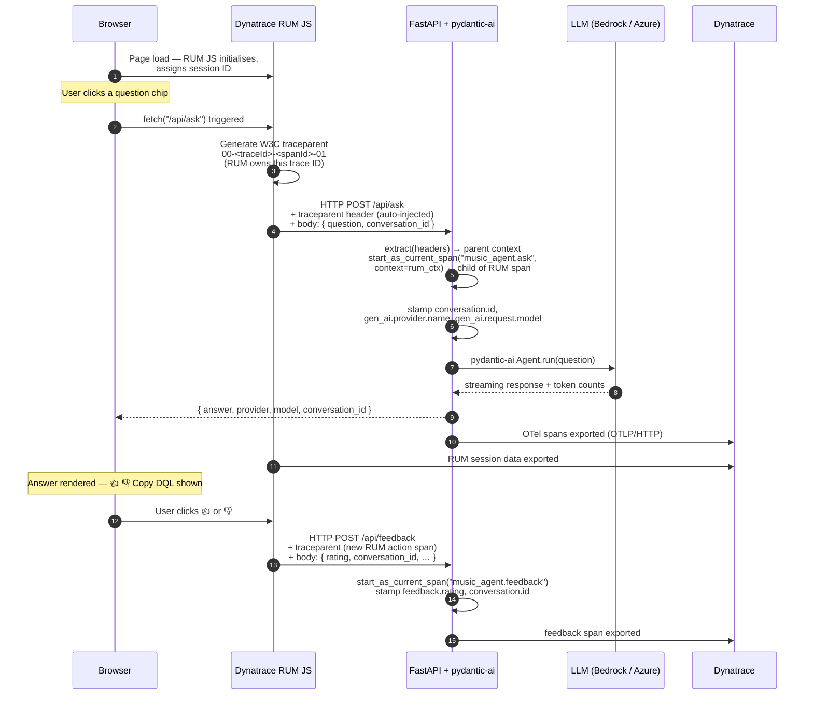

# Real User Monitoring + AI Agent — End-to-End Tracing

This example shows how to connect **Dynatrace Real User Monitoring (RUM)** with **backend AI agent spans** so that a single DQL query can follow a user's click all the way through the LLM response — and capture their thumbs-up/down rating on the way out.

The app is a music history chatbot that randomly routes requests across AWS Bedrock (Claude Sonnet / Haiku) and Azure OpenAI, instrumented with pydantic-ai's native OpenTelemetry support.

---

## How the data flows



---

## Why does the frontend already know the trace ID?

This is the part that surprises most people.

**The frontend doesn't receive the trace ID from the backend — it generates it.**

The Dynatrace RUM JavaScript tag instruments every `fetch()` call in the browser. The moment your code calls `fetch("/api/ask", ...)`, the RUM agent:

1. Creates a **user action span** in the browser (e.g. "click on question chip")
2. Generates a fresh **W3C `traceparent` header**: `00-<traceId>-<spanId>-01`
3. Injects that header into the outgoing HTTP request *before* it leaves the browser

The backend receives the header and calls:

```python
incoming_ctx = extract(dict(http_request.headers))   # reads traceparent

with tracer.start_as_current_span("music_agent.ask", context=incoming_ctx):
    ...
```

This makes the backend span a **child** of the browser user-action span. Both share the same `traceId`, so Dynatrace stitches the browser session and the server-side LLM call into a single end-to-end trace automatically.

---

## Conversation ID — a separate concept

The `conversation.id` is **not** a trace ID. It is a UUID generated once per browser session by the frontend:

```js
const CONV_ID = sessionStorage.getItem('conversationId') || crypto.randomUUID();
```

It is sent in every request body and stamped as a span attribute on every backend span:

```python
span.set_attribute("conversation.id", body.conversation_id)
```

This lets you filter **all exchanges in a session** with a single DQL query — even across multiple traces:

```
fetch spans
| filter conversation.id == "8f3a…"
| fields timestamp, span.name, feedback.rating, gen_ai.usage.input_tokens
```

The "Copy for DQL" buttons in the UI write this query directly to your clipboard so you can paste it into a Dynatrace Notebook.

---

## What gets captured

| Signal | Source | DQL attribute |
|---|---|---|
| Browser user actions | DT RUM JS | `useraction.name`, `useraction.duration` |
| End-to-end trace link | W3C traceparent (RUM → backend) | shared `traceId` |
| Session grouping | `conversation.id` in request body | `conversation.id` |
| LLM provider + model | pydantic-ai span attributes | `gen_ai.provider.name`, `gen_ai.request.model` |
| Token usage | pydantic-ai + backend span | `gen_ai.usage.input_tokens`, `gen_ai.usage.output_tokens` |
| User feedback | `/api/feedback` OTel span | `feedback.rating`, `feedback.question` |

---

## Setup

### Prerequisites

- Python 3.11+
- A Dynatrace environment with RUM enabled
- AWS Bedrock access (or Azure OpenAI)

### Environment variables

Create a `.env` file at the repo root:

```bash
DT-ENDPOINT=https://<your-env-id>.live.dynatrace.com
DT-TOKEN=dt0c01.<your-token>          # scopes: openTelemetryTrace.ingest, metrics.ingest

Bedrock_username=<aws-access-key-id>
bedrock_key=<aws-secret-access-key>

Azure_openai_endpoint=https://<your-resource>.openai.azure.com/
Azure_openai_key=<your-key>
Azure_openai_deployment=<deployment-name>
```

### Option A — Vanilla HTML frontend (simplest)

```bash
cd real-user-monitoring-frontends/backend
pip install -r requirements.txt
python main.py
```

Open **http://localhost:8000** — the FastAPI server serves the HTML file directly.

### Option B — Next.js frontend

Run the FastAPI backend first (it handles all AI calls):

```bash
cd real-user-monitoring-frontends/backend
pip install -r requirements.txt
python main.py          # stays on :8000
```

In a second terminal, start the Next.js dev server:

```bash
cd real-user-monitoring-frontends/nextjs-frontend
npm install
npm run dev             # starts on :3000
```

Open **http://localhost:3000** — Next.js proxies all `/api/*` requests to the FastAPI backend via the rewrite in `next.config.ts`.

To build for production:

```bash
npm run build
npm start               # serves the optimised build on :3000
```

### Add your RUM JavaScript tag

Replace the `<Script src="...">` in `nextjs-frontend/app/layout.tsx` (or the `<script>` tag in `frontend/index.html`) with the tag from:

**Dynatrace → Applications & Microservices → Frontend → \<your app\> → Setup → JavaScript tag**
