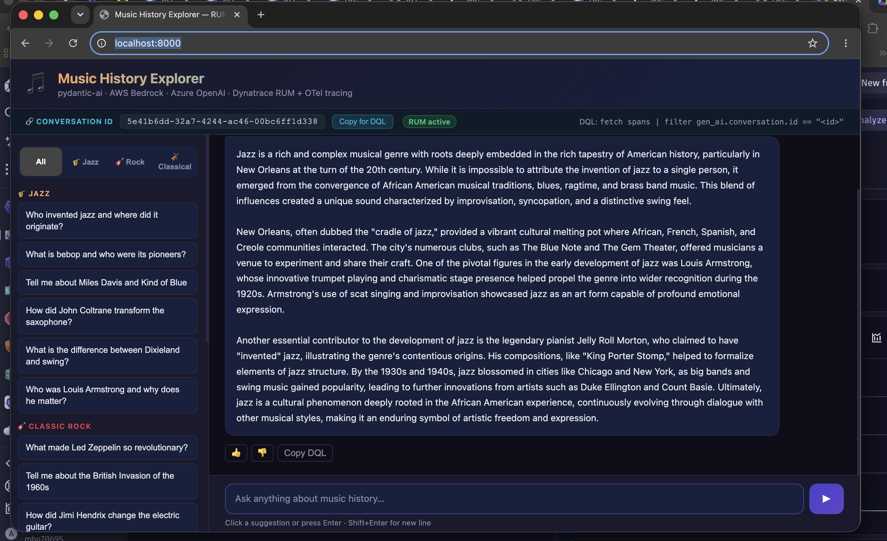
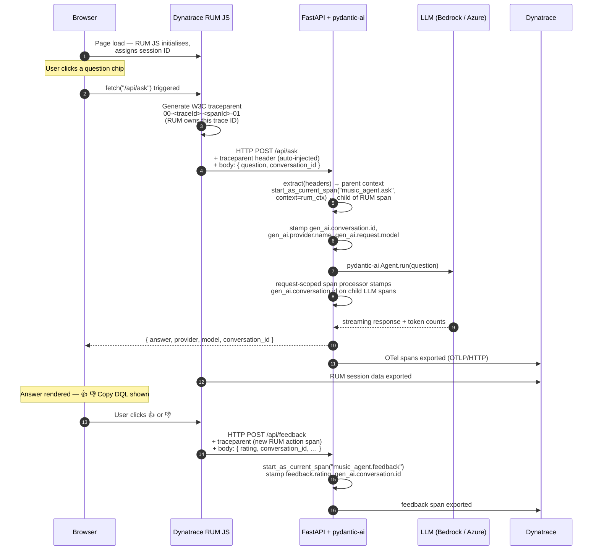
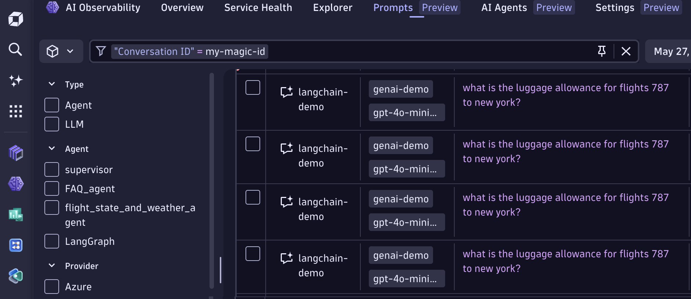
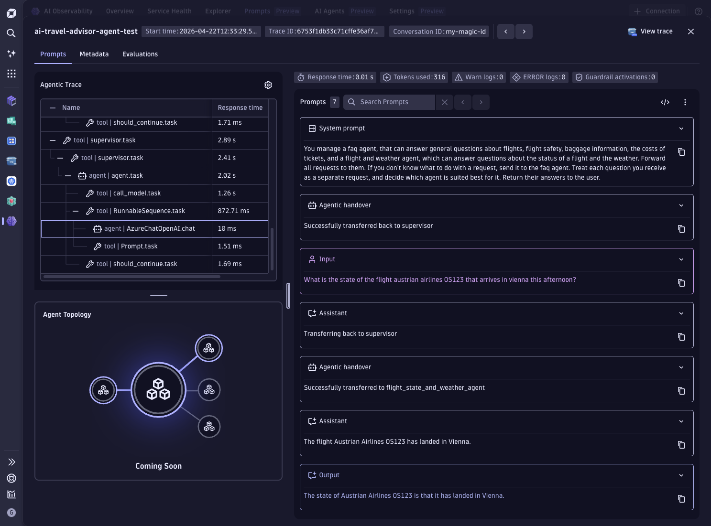
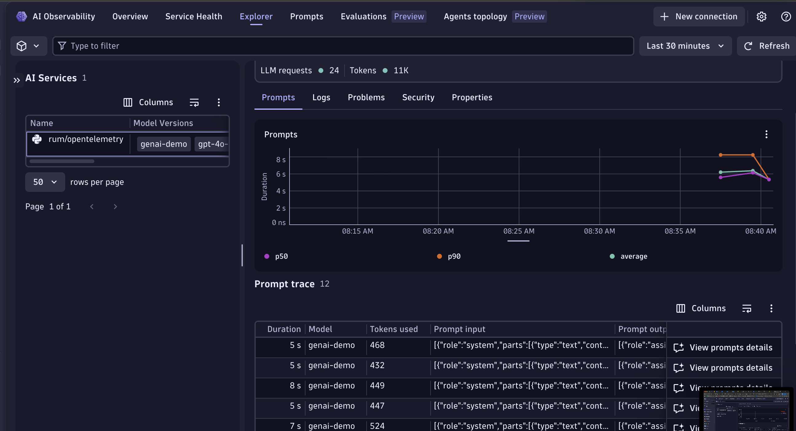
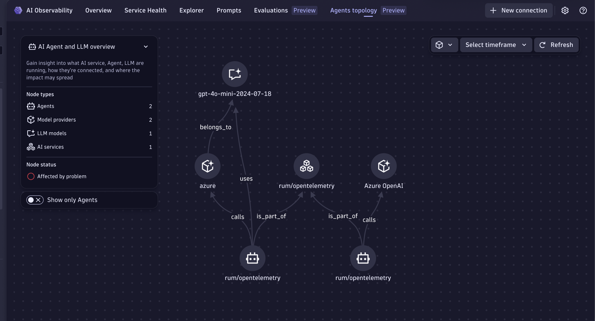
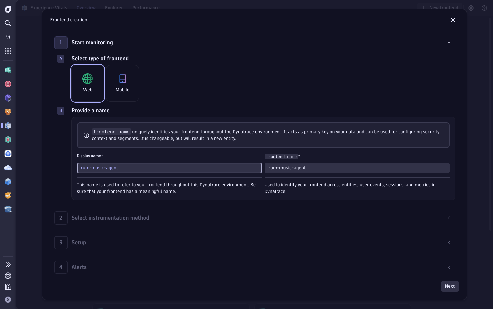
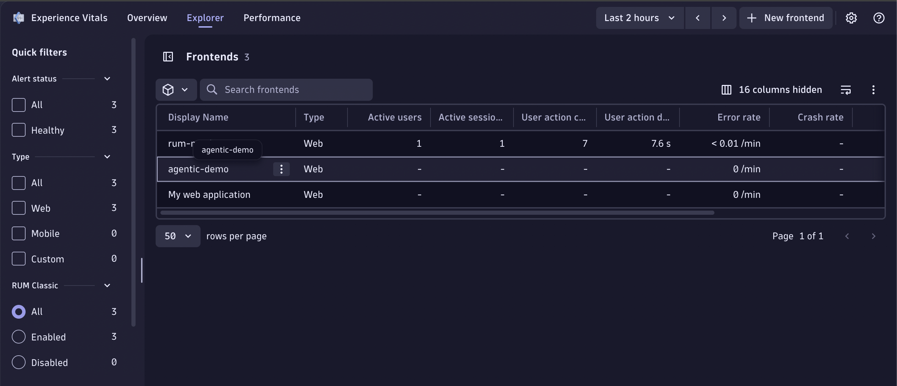
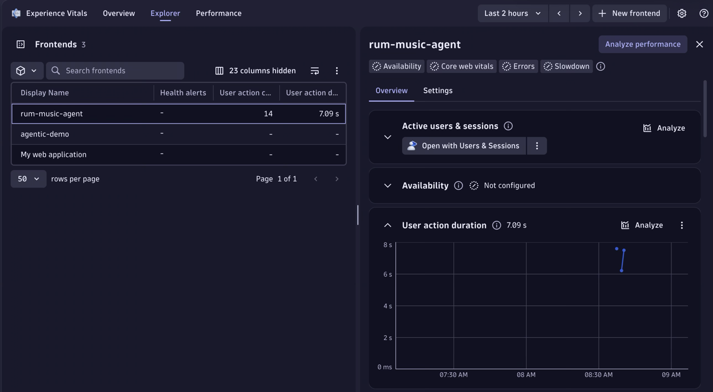

# Real User Monitoring + AI Agent — End-to-End Tracing

This example shows how to connect **Dynatrace Real User Monitoring (RUM)** with **backend AI agent spans** so that a single DQL query can follow a user's click all the way through the LLM response — and capture their thumbs-up/down rating on the way out.

The app is a music history chatbot that randomly routes requests across AWS Bedrock (Claude Sonnet / Haiku) and Azure OpenAI, instrumented with pydantic-ai's native OpenTelemetry support.



<!-- Re-generate TOC with `markdown-toc --no-first-h1 -i` -->

<!-- toc -->

- [How the data flows](#how-the-data-flows)
- [Why does the frontend already know the trace ID?](#why-does-the-frontend-already-know-the-trace-id)
- [Conversation ID and agentic session stitching](#conversation-id-and-agentic-session-stitching)
- [What gets captured](#what-gets-captured)
- [Setup](#setup)
  * [Prerequisites](#prerequisites)
  * [Configure RUM in your Dynatrace environment](#configure-rum-in-your-dynatrace-environment)
  * [Environment variables](#environment-variables)
  * [Option A — Vanilla HTML frontend (simplest)](#option-a--vanilla-html-frontend-simplest)
  * [Option B — Next.js frontend](#option-b--nextjs-frontend)

<!-- tocstop -->

---

## How the data flows



---

## Why does the frontend already know the trace ID?

This is the part that surprises most people.

**The frontend doesn't receive the trace ID from the backend — it generates it.**

The Dynatrace RUM JavaScript tag instruments every `fetch()` call in the browser. The moment your code calls `fetch("/api/ask", ...)`, the RUM agent:

1. Creates a **user action span** in the browser (e.g. "click on question chip")
2. Generates a fresh **W3C `traceparent` header**: `00-<traceId>-<spanId>-01`
3. Injects that header into the outgoing HTTP request *before* it leaves the browser

The backend receives the header and calls:

```python
incoming_ctx = extract(dict(http_request.headers))   # reads traceparent

with tracer.start_as_current_span("music_agent.ask", context=incoming_ctx):
    ...
```

This makes the backend span a **child** of the browser user-action span. Both share the same `traceId`, so Dynatrace stitches the browser session and the server-side LLM call into a single end-to-end trace automatically.

---

## Conversation ID and agentic session stitching

In a typical agentic flow the user sends several follow-up questions within one browser session. Each question creates a **new traceID** (the RUM JS generates a fresh `traceparent` for every fetch), so the spans cannot be linked by `traceId` alone.

`gen_ai.conversation.id` (equivalent to `session.id` in Dynatrace AI Observability) solves this. It is **not** a trace ID — it is a UUID generated once per browser session by the frontend, stored in `sessionStorage`, and sent in every request body:

```js
const CONV_ID = sessionStorage.getItem('conversationId') || crypto.randomUUID();
sessionStorage.setItem('conversationId', CONV_ID);
```

The backend stamps the session UUID on every span — including all child LLM spans — using a two-stage approach. A `ConversationIdSpanProcessor` stages the value under a private attribute on every span as it starts, and a `SessionIdExporter` wrapper copies it to `gen_ai.conversation.id` just before the span leaves the process:

```python
_STAGING_ATTR = "_rum_session_id"  # pydantic-ai doesn't know this name so it won't overwrite it

class ConversationIdSpanProcessor(SpanProcessor):
    def on_start(self, span, parent_context=None):
        if conversation_id := _current_conversation_id.get():
            span.set_attribute(_STAGING_ATTR, conversation_id)  # stage, don't set final attr yet

class SessionIdExporter(SpanExporter):
    def export(self, spans):
        for span in spans:
            attrs = getattr(span, "_attributes", None)
            if attrs and (session_id := attrs.get(_STAGING_ATTR)):
                attrs["gen_ai.conversation.id"] = session_id   # override pydantic-ai's per-run value
                del attrs[_STAGING_ATTR]
        return self._inner.export(spans)
```

The two-stage design is necessary because pydantic-ai sets `gen_ai.conversation.id` on its own spans *after* `on_start` runs, which would overwrite a value set directly there. Staging in a private attribute and overriding at export time wins the race.

With this in place you can reconstruct the full agent trajectory across any number of separate traces with a single DQL query:

```
fetch spans
| filter gen_ai.conversation.id == "<paste-from-UI>"
| fields timestamp, span.name, gen_ai.request.model, gen_ai.usage.input_tokens, gen_ai.usage.output_tokens, feedback.rating
| sort timestamp asc
```

The **Copy for DQL** button in the UI writes this query directly to the clipboard.

Alternatively you can filter by conversation.id in the AI Observability App, like shown here:



Clicking into any prompt shows the full agentic trace — system prompt, input, model output, token usage, and the agent topology:



### session.id vs gen_ai.conversation.id

Dynatrace AI Observability exposes both names — they refer to the same value in this pattern:

| Attribute | Set by | Meaning |
|---|---|---|
| `gen_ai.conversation.id` | Backend span processor | Propagated from request body; present on every LLM span |
| `session.id` | Dynatrace RUM | Browser session identifier; correlated automatically when RUM JS is active |

Use either attribute as the filter key in DQL — they resolve to the same session.

---

## What gets captured

| Signal | Source | DQL attribute |
|---|---|---|
| Browser user actions | DT RUM JS | `useraction.name`, `useraction.duration` |
| End-to-end trace link | W3C traceparent (RUM → backend) | shared `traceId` |
| Session grouping | `conversation_id` in request body | `gen_ai.conversation.id` |
| LLM provider + model | pydantic-ai span attributes | `gen_ai.provider.name`, `gen_ai.request.model` |
| Token usage | pydantic-ai + backend span | `gen_ai.usage.input_tokens`, `gen_ai.usage.output_tokens` |
| User feedback | `/api/feedback` OTel span | `feedback.rating`, `feedback.question` |

Here is the AI Observability Explorer tab showing rum/opentelemetry service with 24 LLM requests and prompt trace list.


And the AI Observability Agents Topology:


---

## Setup

### Prerequisites

- Python 3.11+
- [uv](https://docs.astral.sh/uv/getting-started/installation/)
- Node.js 18+
- A Dynatrace environment with RUM enabled
- AWS credentials (`AWS_ACCESS_KEY_ID`, `AWS_SECRET_ACCESS_KEY`) with Bedrock model access enabled, or an Azure OpenAI resource (`AZURE_OPENAI_ENDPOINT`, `AZURE_OPENAI_API_KEY`, `AZURE_OPENAI_DEPLOYMENT`)
- Dynatrace RUM JS tag URL (`DT_RUM_SCRIPT`) — obtained from Experience Vitals setup (see below)


### Configure RUM in your Dynatrace environment

Go to **Digital Experience → Experience Vitals** and click **+ New frontend**, select **Web** and provide a frontend name.



In the **Select instrumentation method** step, select **Agentless** and press **Create**.
In the **Setup** step, check under **Select capability and settings** if RUM is enabled.
If it isn't enabled, select **Override** and turn it on.
Press **Next** to copy the JavaScript tag URL and set it as `DT_RUM_SCRIPT` in your `.env` file — the backend injects it automatically at runtime.

Once sessions start arriving you will see active users and user actions in the Experience Vitals explorer:



Clicking on your frontend reveals the full RUM overview — user action duration, active sessions, and availability at a glance:



### Environment variables

Create a `.env` file in `rum/opentelemetry/`:

```bash
DT_ENDPOINT=https://<your-env-id>.live.dynatrace.com
DT_API_TOKEN=dt0c01.<your-token>          # scopes: openTelemetryTrace.ingest, metrics.ingest
DT_RUM_SCRIPT=https://js-cdn.dynatrace.com/jstag/<your-tag>.js

AWS_ACCESS_KEY_ID=<aws-access-key-id>
AWS_SECRET_ACCESS_KEY=<aws-secret-access-key>

AZURE_OPENAI_ENDPOINT=https://<your-resource>.openai.azure.com/
AZURE_OPENAI_API_KEY=<your-key>
AZURE_OPENAI_DEPLOYMENT=<deployment-name>
```

You can find your Dynatrace OTLP endpoint following [this guide](https://docs.dynatrace.com/docs/ingest-from/opentelemetry/otlp-api#base-url) and generate a token with the required scopes in the Dynatrace UI under Access Tokens > Generate new token.

### Option A — Vanilla HTML frontend (simplest)

```bash
cd rum/opentelemetry
make install
make run
```

Open **http://localhost:8000** — the FastAPI server serves the HTML file directly.

### Option B — Next.js frontend

Run the FastAPI backend first (it handles all AI calls):

```bash
cd rum/opentelemetry
make install
make run   # stays on :8000
```

In a second terminal, start the Next.js dev server:

```bash
cd rum/opentelemetry/nextjs-frontend
npm install
npm run dev             # starts on :3000
```

Open **http://localhost:3000** — Next.js proxies all `/api/*` requests to the FastAPI backend via the rewrite in `next.config.ts`.

To build for production:

```bash
npm run build
npm start               # serves the optimised build on :3000
```
